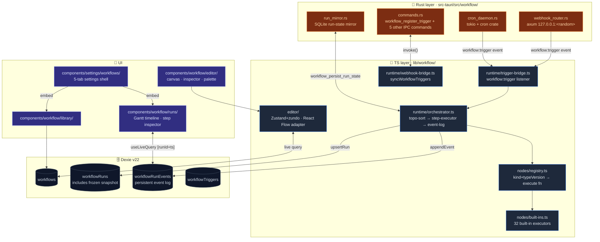
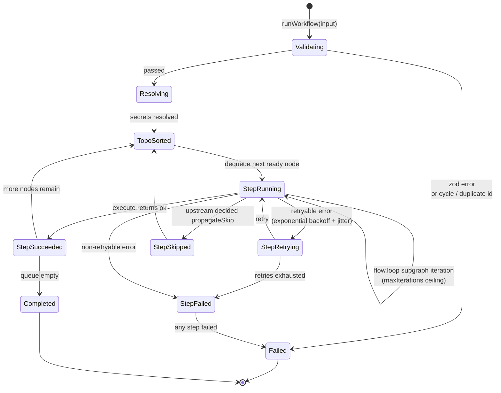

# Visual Workflows

<Status variant="stable" />

<TLDR>
  React Flow v12 editor + Zustand+zundo store + elkjs auto-layout, with 38 node
  kinds across 7 categories. Runtime is split between Rust (cron daemon, webhook
  receiver, SQLite mirror) and TS (orchestrator, node execution) for hybrid
  execution; event logs enable crash recovery. Schema v22 introduces 4 Dexie
  tables and 10 built-in templates.
</TLDR>

<StatGrid>
  <Stat
    label="Node kinds"
    value="38"
    hint="7 categories · trigger / action / ai / flow / data / io / annotation"
  />
  <Stat label="Built-in executors" value="32" hint="action / ai / flow / data / io" />
  <Stat label="Built-in templates" value="10" hint="Phase 1 (4) + Phase 5 (6)" />
  <Stat
    label="Dexie tables"
    value="4"
    hint="workflows · workflowRuns · workflowRunEvents · workflowTriggers"
  />
</StatGrid>

cognia-next uses this layer to compose its mature runtime entities — [characters](../chat/chat-and-skills), [agent teams](../chat/agent-teams), [skills](../chat/skills-system), [employee twins](./employee-twin), [platform connectors](./platform-connectors), MCP servers, and [plugins](./plugin-system) — into executable graphs. Design goals align with ADR 0011 and ADR 0017:

- Visual graph editor: drag from left sidebar → drop on canvas → connect handles → configure in right inspector → Ctrl+S save → zundo undo/redo → elkjs auto-layout.
- Execution engine: end-to-end graph execution, persistent event log per step, retry / timeout / idempotency support, recovery from webview crashes via log replay.
- Trigger taxonomy: manual / cron / connector inbound / chat message / webhook — all wired into existing infrastructure without a separate scheduler.
- Hybrid runtime: **Rust owns "when does the workflow start" and "did this run survive the crash"; TS owns "given a run, how do we walk through the steps one by one"**.

## Use Cases

| Scenario | Recommended approach |
| -------- | -------------------- |
| Scheduled data sync | `trigger.cron` → `io.http` → `data.transform` → `flow.set` |
| Inbound auto-reply | `trigger.connector.inbound` → `ai.classify` → `flow.branch` → `action.connector.send` |
| RAG-backed FAQ reply | `trigger.chat.message` → `action.twin.rag` → `ai.prompt` → chat reply |
| Webhook bridge | `trigger.webhook` → `ai.extract` → `io.webhook.respond` |
| Complex aggregation | `flow.loop` + `flow.subworkflow` + `data.template` + `flow.join` |
| Multi-character task orchestration | `action.team.run` drives the agent-team lifecycle |

## Architecture



Cross-boundary communication occurs only through Tauri events (`workflow:trigger` / `workflow:resume`) and IPC commands (`lib/workflow/runtime/tauri-bridge.ts`). In web mode the Rust layer gracefully no-ops, and the TS orchestrator runs standalone.

## Key Modules and File Paths

### Types and Definitions

| File | Purpose |
| ---- | ------- |
| `types/workflow/visual.ts` | `VisualWorkflow` / `WorkflowNode` / 38 `WorkflowNodeKind` variants |
| `lib/workflow/definition/validate.ts` | Zod envelope + graph integrity (cycle detection, duplicate id checks) |
| `lib/workflow/definition/seed.ts` | 10 built-in templates (hello world / classify-branch / RAG FAQ / etc.) |

### Editor

| File | Purpose |
| ---- | ------- |
| `lib/workflow/editor/store.ts` | Zustand + zundo store (100-step history limit) |
| `lib/workflow/editor/auto-layout.ts` | elkjs `layered` algorithm (lazy-loaded) |
| `lib/workflow/editor/react-flow-converter.ts` | `VisualWorkflow` ↔ React Flow `nodes` / `edges` bidirectional conversion |
| `lib/workflow/editor/connection-validator.ts` | `isValidConnection` guard (rejects trigger as target, annotation edges, self-loops, duplicate edges) |
| `lib/workflow/editor/expression-language.ts` | CodeMirror 6 syntax highlighting (`{{ $node['x'].out.field }}`) |
| `lib/workflow/editor/expression-suggestions.ts` | Context-aware autocomplete |
| `components/workflow/editor/canvas.tsx` | React Flow shell + toolbar + empty state |
| `components/workflow/editor/inspector-panel.tsx` | Right inspector panel; dispatches to one of 38 forms by kind |
| `components/workflow/editor/node-search-sidebar.tsx` | Left drag source (custom MIME `application/x-workflow-kind`) |
| `components/workflow/editor/command-palette.tsx` | Ctrl+K cmdk panel — all nodes + editor actions + 5 most recent workflows |

### Runtime

| File | Purpose |
| ---- | ------- |
| `lib/workflow/runtime/orchestrator.ts` | Top-level entry; validate → resolve secrets → topo-sort → step loop → persist |
| `lib/workflow/runtime/topo-sort.ts` | Kahn's algorithm + `flow.loop` / `flow.wait` back-edge detection |
| `lib/workflow/runtime/step-executor.ts` | Retry (exponential / fixed backoff) + timeout (`AbortController`) + idempotency |
| `lib/workflow/runtime/event-log.ts` | Append-only writer; `createRunLogger(runId)` scope capture |
| `lib/workflow/runtime/idempotency.ts` | Inngest-style memoization; hydrates from event log on crash recovery |
| `lib/workflow/runtime/expression.ts` | Safe expression parsing (**no** `eval`); `$node` / `$trigger` / `$static` / `$params` |
| `lib/workflow/runtime/secret-resolver.ts` | `NoopSecretResolver` + in-memory impl; production bridged via keyring |
| `lib/workflow/runtime/tauri-bridge.ts` | 6 Tauri commands + `workflow:trigger` listener; no-op in web mode |
| `lib/workflow/runtime/webhook-bridge.ts` | Pushes trigger nodes to Rust on workflow save (idempotent) |
| `lib/workflow/runtime/trigger-bridge.ts` | `workflow:trigger` event → parse workflowId → `runWorkflow()` |
| `lib/workflow/runtime/resume-controller.ts` | Replays in-progress runs on startup |
| `lib/workflow/runtime/run-status-bridge.ts` | Subscribes to `workflowRunEvents` and pushes per-step state to the editor store |

### Node Executors

| File | Purpose |
| ---- | ------- |
| `lib/workflow/nodes/registry.ts` | `registerNodeExecutor(kind, typeVersion, fn)` — plugins call this too |
| `lib/workflow/nodes/built-ins.ts` | 32 built-in executors; registered on import |
| `lib/workflow/nodes/catalog.ts` | Per-kind metadata (label / description / icon / keywords) — shared by left sidebar, command palette, and inspector header |
| `lib/workflow/nodes/params-schemas.ts` | Per-kind JSON Schema — validation + auto-generated forms |
| `lib/workflow/nodes/validate-params.ts` | Pre-run schema validation per node params |

### Rust Layer

| File | Purpose |
| ---- | ------- |
| `src-tauri/src/workflow/mod.rs` | Module entry + `WorkflowState` |
| `src-tauri/src/workflow/commands.rs` | 6 Tauri commands (register/unregister/get_webhook_url/persist/reload/ack) |
| `src-tauri/src/workflow/run_mirror.rs` | SQLite run mirror (for crash recovery) |
| `src-tauri/src/workflow/state.rs` | `WorkflowState` — holds cron / webhook / mirror handles |
| `src-tauri/src/workflow/triggers/cron_daemon.rs` | tokio task + `cron` crate; min-heap sorted by next trigger time |
| `src-tauri/src/workflow/triggers/webhook_router.rs` | axum receiver, HMAC-SHA256 verification (`x-signature-256`); 1 MiB body cap |

### UI and Settings

| File | Purpose |
| ---- | ------- |
| `app/workflows/page.tsx` | Library list |
| `app/workflows/[id]/page.tsx` | Full-screen canvas editor |
| `app/workflows/[id]/runs/page.tsx` | Run history list |
| `app/workflows/[id]/runs/[runId]/page.tsx` | Gantt timeline + step inspector |
| `components/workflow/runs/run-timeline.tsx` | Horizontal Gantt rendered from event log via `buildSpans` |
| `components/workflow/runs/run-detail.tsx` | Single-run view + "re-run from this step" |
| `components/settings/workflows/workflows-section.tsx` | 5-tab settings shell: Library / Runs / Templates / Defaults / Audit |

## Node Categories (38 kinds)

```text
trigger.*    manual · cron · connector.inbound · chat.message · webhook
action.*     character.{send,create,update} · team.{run,create,update}
             skill.{invoke,upsert} · twin.{rag,ingest}
             connector.{send,draft} · mcp.invokeTool · plugin.invoke
ai.*         prompt · classify · extract · embed
flow.*       branch · switch · split · join · loop · wait · set · subworkflow
data.*       transform · code · template
io.*         http · webhook.respond
annotation.* note · group
```

Every `kind` has a metadata entry in `catalog.ts`; plugin-contributed kinds are tagged with a `pluginId` field and rendered under a "Plugin nodes" group (see ADR 0017).

## Control Flow: Node Execution / State Machine



Every state transition appends a row to `workflowRunEvents` via `event-log.ts:RunLogger`; the UI refreshes immediately via `useLiveQuery`.

## Database Tables (Dexie v22)

| Table | Primary key | Key indexes | Purpose |
| ----- | ----------- | ----------- | ------- |
| `workflows` | `id` | — | Workflow definition (graph + settings + viewport) |
| `workflowRuns` | `id` | `[workflowId+startedAt]` | One row per execution; includes frozen workflow snapshot — historical re-runs use the snapshot, not the live workflow |
| `workflowRunEvents` | `id` | `[runId+ts]` | Per-step event log; replayed in chronological order |
| `workflowTriggers` | `id` | `[workflowId+enabled]` | Registered triggers (cron / webhook / inbound / chat-msg) |

Full schema in the [storage](../data/storage) v22 section.

## Configuration and Extension Points

### Workflow-level settings

Defined in `types/workflow/visual.ts:WorkflowSettings`, edited via the editor toolbar → settings drawer:

- `timeoutMs > 0` — wall-clock timeout for the entire run (`AbortController` armed)
- `retry: { mode: "exponential" | "fixed", maxAttempts, baseDelayMs }`
- `maxIterations` (default 10 000, global hard ceiling 100 000)

### Expression syntax

Any field marked "supports ``{{ }}`` expressions" accepts:

```text
{{ $node['stepId'].out.fieldName }}     upstream node output
{{ $trigger.payload.foo }}              trigger raw payload
{{ $static.key }}                       workflow-level constant
{{ $params.foo }}                       current node params
```

Supports `.field` / `['key']` / `[index]` access; `expression.test.ts` covers the full pipeline: token / eval / resolveExpression / resolveDeep.

### Plugin extension points (ADR 0017)

Three `runtime`-class extension points:

| Extension point | Purpose |
| --------------- | ------- |
| `workflow.node` | Plugins contribute node executors; `PluginNodeDef.execute` registers into the registry |
| `workflow.trigger` | Plugins contribute long-running trigger sources; `PluginTriggerDef.start` returns a handle with `stop` |
| `workflow.task` | Existing — target of `action.plugin.invoke` |

Permission gate: `extension:workflow`. Auditing via `auditPluginPointContracts`. Details in [plugin system](./plugin-system).

### Trigger hybrid distribution

| Trigger | TS | Rust |
| ------- | -- | ---- |
| `trigger.manual` | Editor Run button | — |
| `trigger.cron` | TS fallback (webview alive) | `cron_daemon.rs` (fires even when minimized to tray) |
| `trigger.connector.inbound` | `ConnectorBus.dispatchInbound` hook | — |
| `trigger.chat.message` | `lib/claude/build-options.ts:resolveSendOptions` hook | — |
| `trigger.webhook` | — | `webhook_router.rs` (desktop only, HMAC-SHA256 verification) |

## Related Subsystems

<Cards>
  <Card
    title="Platform Connectors"
    href="./platform-connectors"
    description="Source of trigger.connector.inbound + action.connector.send"
  />
  <Card title="Scheduler" href="./scheduler" description="Cron triggers reuse the Rust scheduling abstraction" />
  <Card
    title="Skills System"
    href="./skills-system"
    description="Target of action.skill.invoke / action.skill.upsert"
  />
  <Card
    title="Agent Teams"
    href="./agent-teams"
    description="action.team.run drives runTeamLifecycle"
  />
  <Card
    title="Employee Twin"
    href="./employee-twin"
    description="Entry point for action.twin.rag / action.twin.ingest"
  />
  <Card
    title="Plugin System"
    href="./plugin-system"
    description="workflow.node / workflow.trigger / workflow.task extension points"
  />
</Cards>

## Related ADRs

- [ADR 0011 — Visual Workflows Subsystem](../adr/0011-workflows-subsystem)
- [ADR 0017 — Workflow Plugin Extension Points](../adr/0017-workflow-plugin-extension-points)
- [ADR 0009 — Platform Connectors](../adr/0009-platform-connectors) (reference for hybrid Rust / TS split)
- [ADR 0004 — Native Vector Store](../adr/0004-vector-native-backend) (reference for SQLite mirror persistence)

## Known Limitations

- **Subworkflow recursion** hard-capped at depth 10; exceeding throws. Hardened in Phase 5.
- **`flow.loop` ceiling**: per-instance `maxIterations` (default 10000) + global hard ceiling of 100000 (covers `forEach` / `times` / `while`).
- **Web mode degradation**: cron triggers only fire while the webview is alive; webhook shows "desktop only" banner; the other four triggers work unchanged.
- **`io.webhook.respond`**: Phase 5a stores responses asynchronously; Phase 5b plans a "hold the response open until io.webhook.respond runs" reverse channel.
- **`action.character.send`** does not force a chat UI refresh — it writes a message directly into the session; the UI must refresh independently.
- **`workflow_persist_run_state`** mirror is Tauri-only; web mode relies on Dexie + startup replay, so crash recovery is weaker.
- **Run snapshots are immutable**: re-running from history uses the snapshot; subsequent workflow edits do not retroactively affect historical runs — this is intentional, but users should be aware.
