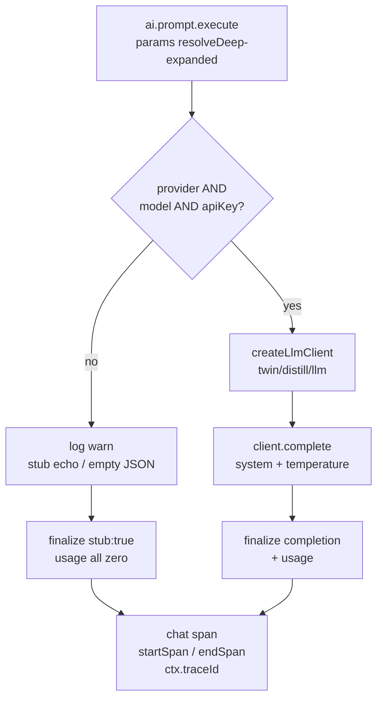
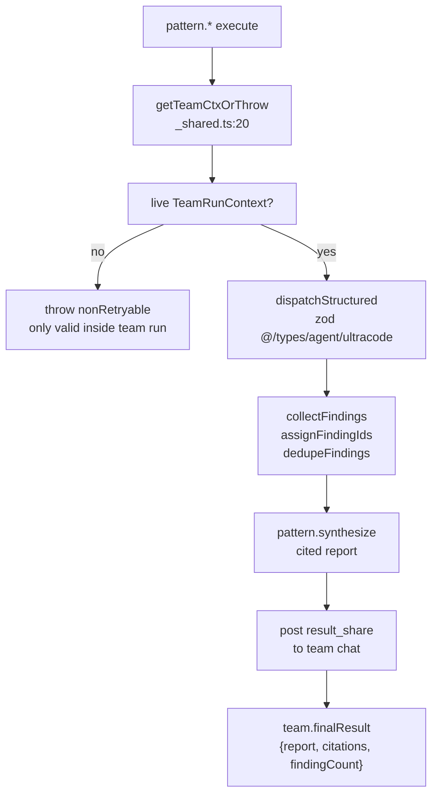

# AI & pattern nodes

<Status variant="stable" />

<TLDR>
This page deep-dives two node families that bring intelligence into Visual Workflows. The four **AI primitives** live in `lib/workflow/nodes/built-ins.ts` (`ai.prompt` reg at `built-ins.ts:228`, `ai.classify` at `built-ins.ts:984`, `ai.extract` at `built-ins.ts:1049`, `ai.embed` at `built-ins.ts:1134`) and follow a strict **fall-open philosophy** — when credentials are missing they degrade to a stub or a deterministic hash rather than throwing (`built-ins.ts:280`). The six **Ultracode `pattern.*` nodes** live elsewhere, in `lib/ai/agent/team/patterns/` (ADR-0022 addendum), register themselves as a load-time side effect, are synthesizer-emitted only, and require a live `TeamRunContext` resolved via `getTeamCtxOrThrow` (`_shared.ts:20`). The registry, catalog and schema mechanics they share are documented on the sibling [node system](./node-system) page; this page covers behavior, not plumbing.
</TLDR>

<StatGrid>
  <Stat label="AI primitives" value="4" />
  <Stat label="pattern.* nodes" value="6" />
  <Stat label="Direct LLM callers" value="2 (ai.prompt, ai.embed)" />
  <Stat label="Fall-open default" value="never throws" />
</StatGrid>

## AI primitives

All four AI executors are registered in `lib/workflow/nodes/built-ins.ts`. Two of them touch external libraries directly; the other two **delegate** to `ai.prompt` so they inherit its provider routing, stub fallback, and trace span for free.

| Kind | Reg line | Touches | Output shape |
| --- | --- | --- | --- |
| `ai.prompt` | `built-ins.ts:228` | `@/lib/twin/distill/llm` client | `{ provider, model, completion, usage, stub? }` |
| `ai.classify` | `built-ins.ts:984` | delegates to `ai.prompt` | `{ label, completion, confident }` + `decision:matched` |
| `ai.extract` | `built-ins.ts:1049` | delegates to `ai.prompt` | `{ extracted, missing, valid, parseError }` |
| `ai.embed` | `built-ins.ts:1134` | `@/lib/vector/embedding` | embedding vector (real or hashed) |

### ai.prompt — the LLM chokepoint

`ai.prompt` is the only AI node that drives the chat LLM client. Its params schema is `AiPromptParams` at `params-schemas.ts:213`: `provider`, `model`, `apiKey`, `baseURL`, `systemPrompt`, `userPrompt` (required), `temperature` (0-2), `responseFormat` enum `text` / `json`, and an optional `jsonSchema`. By the time `execute` runs, every param has already been `resolveDeep`-expanded (templating/upstream refs resolved), so the executor treats them as plain values.

When credentials are absent, the node falls open to a **stub echo** instead of failing — a half-configured workflow still runs end to end:

```ts
// built-ins.ts:280
if (!params.provider || !params.model || !apiKey) {
  ctx.log("warn", "ai.prompt: provider / model / apiKey missing — using stub echo. ...")
  return finalize({ provider, model, completion: jsonMode ? "{}" : `[ai.prompt stub] ${userPrompt}`, usage: { inputTokens:0, outputTokens:0, totalTokens:0 }, stub: true })
}
```

When credentials are present it constructs the shared client and completes:

```ts
// built-ins.ts (creds-present path)
const { createLlmClient } = await import("@/lib/twin/distill/llm")
const client = createLlmClient({ provider, model, apiKey, baseURL, defaultTemperature: params.temperature })
completion = await client.complete(userPrompt, { system: systemPrompt, temperature })
```

`ai.prompt` also emits a **`chat` span** via `@/lib/agent-trace/emitter` (`startSpan` / `endSpan`), threading `ctx.traceId` so the eval / observability layer can reassemble the run. Because `ai.classify` and `ai.extract` route through `ai.prompt`, their LLM calls show up in the same trace.

Structured-output helpers (`built-ins.ts:51-82`) back the JSON path: `parseStructured` (built on `extractJson`), `buildJsonInstruction`, and `coerceToType`.



### ai.classify — Question-Classifier routing

`ai.classify` (`built-ins.ts:984`) builds a strict-classifier `systemPrompt` and **delegates** to `ai.prompt` via `getExecutor("ai.prompt", 1).execute({ ...ctx, params })` at `temperature: 0`. It returns `{ label, completion, confident }` plus a `decision: matched` signal so it can drive `flow.switch` / branch routing (the Question-Classifier pattern). It never calls the LLM client itself — all provider routing and stub fallback are inherited from `ai.prompt`.

### ai.extract — typed extraction with required check

`ai.extract` (`built-ins.ts:1049`) builds a JSON-shape prompt, also delegates to `ai.prompt`, then runs `parseStructured` + `coerceToType` and a required-field check, returning `{ extracted, missing, valid, parseError }`. A failed parse populates `parseError` rather than throwing.

### ai.embed — real or hashed vectors

`ai.embed` (`built-ins.ts:1134`) calls the real `@/lib/vector/embedding` when `provider` + `model` are set, and falls open to the deterministic-hash `generateTextEmbedding` on any failure. This keeps downstream similarity nodes deterministic and runnable even without an embedding provider.

> **Key insight:** only `ai.prompt` and `ai.embed` touch the client / vector libraries. `ai.classify` and `ai.extract` reuse the `ai.prompt` executor, so the LLM is reached through exactly one code path — one place for provider routing, one stub fallback, one trace span.

## Twin injection

AI prompt paths can be enriched with employee-twin context through `injectTwinContext(input)` at `lib/workflow/nodes/shared/twin-injector.ts:40` (file is 118 lines). The helper is shared by the AI prompt paths and connector outbound sends, and is engineered to **never throw** — it degrades silently:

| Step | Behavior |
| --- | --- |
| resolve character | if no `twinId`, return base `systemPrompt` unchanged |
| `tryBuildTwinDeps` | if twin unconfigured, return base unchanged |
| embed + RAG | retrieve twin memory, then `applyTwinContext` builds a 4-segment system prompt |
| record | append to the M6 inject-log ring buffer |
| return | `{ systemPrompt, applied, degradedReason? }` |

Any failure path sets `degradedReason` and returns the base prompt — the node still runs. See [employee twin](../employee-twin) for how twin deps and the inject-log are assembled.

## Ultracode pattern.* nodes

The six higher-order **Agent-Team** nodes are defined under `lib/ai/agent/team/patterns/` (NOT `lib/workflow/nodes/`) per the ADR-0022 addendum. They register via `registerNodeExecutor` as a **load-time side effect**; `index.ts` re-exports all six, and `runTeamLifecycle` imports that barrel before any Ultracode run so the orchestrator can resolve them. They carry no catalog entry (synthesizer-emitted only), use the permissive params schema at `params-schemas.ts:473-478`, are all `typeVersion: 1`, and are `retryable: false`.

| Kind | File | Executor / reg line |
| --- | --- | --- |
| `pattern.multi-modal-sweep` | `multi-modal-sweep.ts` | `execute` L29; `multiModalSweepNode` L71; `registerNodeExecutor` L78 |
| `pattern.loop-until-dry` | `loop-until-dry.ts` | reg L113 |
| `pattern.adversarial-verify` | `adversarial-verify.ts` | reg L144 |
| `pattern.judge-panel` | `judge-panel.ts` | reg L131 |
| `pattern.completeness-critic` | `completeness-critic.ts` | reg L66 |
| `pattern.synthesize` | `synthesize.ts` | `execute` L32; `synthesizeNode` L95; `registerNodeExecutor` L102 |

Registration is a flat module-level statement — importing the file is enough:

```ts
// multi-modal-sweep.ts:71
export const multiModalSweepNode: NodeExecutorRegistration = { kind: MULTI_MODAL_SWEEP_KIND, typeVersion: 1, retryable: false, execute }
registerNodeExecutor(multiModalSweepNode)
```

### Shared helpers and dispatch

All six patterns lean on `_shared.ts`: `nonRetryable` (L13), `getTeamCtxOrThrow` (L20, reads the per-run `TeamRunContext`), `fanoutLimit` (L31), `mapSettled` (L40), and the finding utilities `collectUpstreamArray` / `firstUpstream` / `collectFindings` / `assignFindingIds` / `dedupeFindings` / `renderFinding` (L67-109). Every pattern calls `dispatchStructured` (from `../structured-dispatch`) against zod schemas from `@/types/agent/ultracode`, pulling team context off `ctx`. `pattern.synthesize` posts a `result_share` message to team chat and returns `{ report, citations, findingCount }`, which is written to `team.finalResult`.

### What each pattern does

| Kind | Semantics (ADR-0022 addendum) |
| --- | --- |
| `pattern.multi-modal-sweep` | N parallel finders, each blind to the others |
| `pattern.loop-until-dry` | keep spawning finders until K consecutive empty rounds |
| `pattern.adversarial-verify` | N skeptics try to refute each finding; kill on majority |
| `pattern.judge-panel` | independent judges score; synthesize from the winner |
| `pattern.completeness-critic` | asks "what is missing" |
| `pattern.synthesize` | collect + dedupe findings into a cited report |



## Gotchas

- **`typeVersion` is exact-match** — the runtime resolves an executor only when the requested version matches; all AI and pattern nodes are version `1`.
- **AI params arrive pre-resolved** — `resolveDeep` has already expanded templates / upstream refs before `execute`; the executor sees plain values.
- **Fall-open is intentional** — AI nodes degrade (stub completion, hashed embedding) rather than throw, so a partially configured workflow still completes end to end (`built-ins.ts:280`).
- **`pattern.*` require a live `TeamRunContext`** — `getTeamCtxOrThrow` (`_shared.ts:20`) means these only work inside an agent-team run, never as standalone user-placed nodes. They are absent from the palette by design (no catalog entry).

## See also

- [Node system](./node-system) — registry, catalog, params-schema, `resolveDeep`
- [Runtime execution](./runtime-execution) — the executor invocation loop and span threading
- [Data model](./data-model) — node / edge persistence
- [Visual Workflows index](./index)
- [Employee twin](../employee-twin) — twin deps, RAG, inject-log
- [Agent teams](../../chat/agent-teams) — `runTeamLifecycle`, `TeamRunContext`
- [ADR-0022 Agent Team](../../adr/0022-agent-team)
