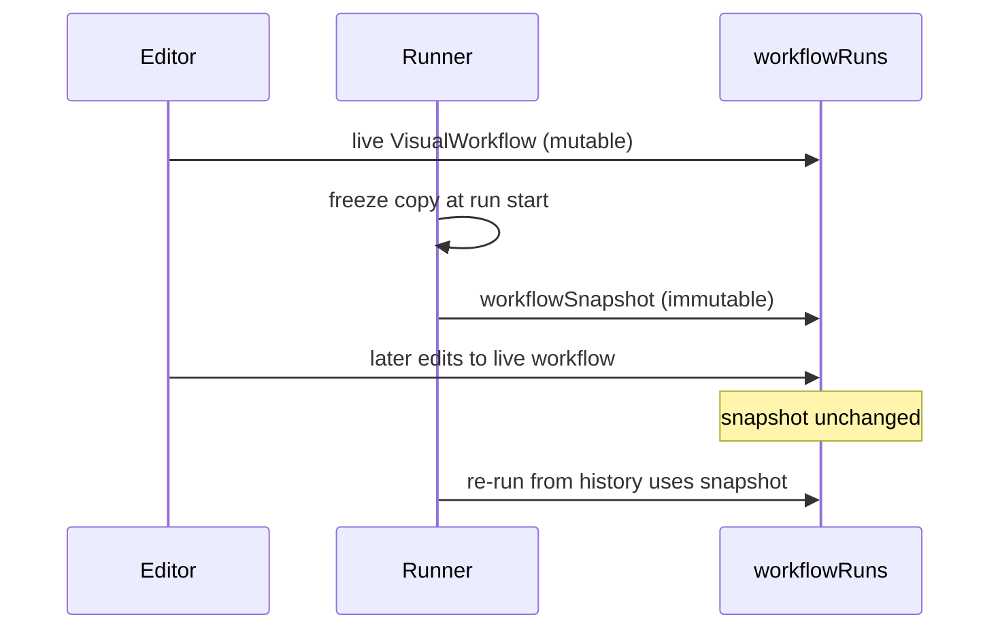
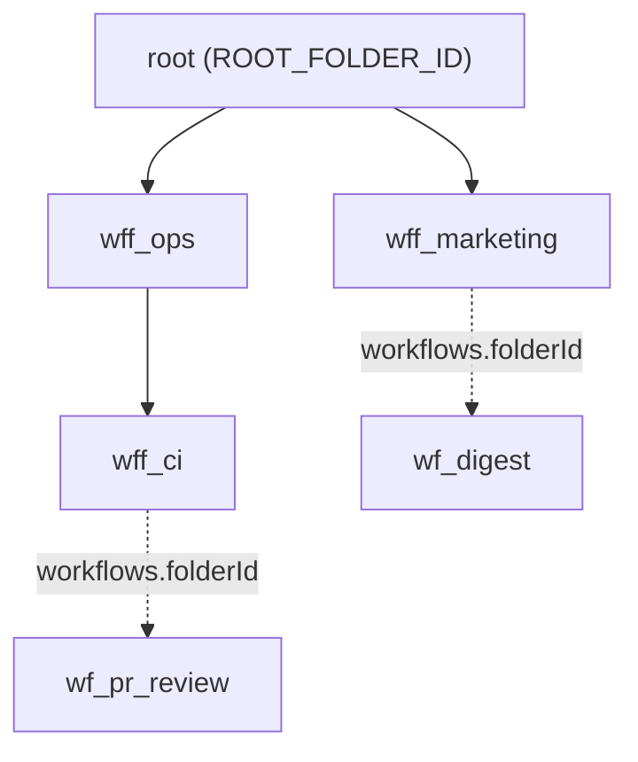
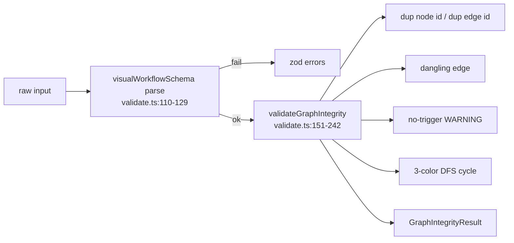

# Data model & definitions

<Status variant="stable" />

<TLDR>
A workflow is a `VisualWorkflow` graph made of `WorkflowNode` plus `WorkflowEdge` records. Every node `type` is one of 153 `WorkflowNodeKind` literals in 7 categories. Persistence touches 13 workflow Dexie tables through schema v156, including immutable versions/deployments/invocations and durable waitpoints/events. Validation runs Zod and graph-integrity checks before execution.
</TLDR>

<StatGrid>
  <Stat label="Node kinds" value="153" hint="across 7 categories" />
  <Stat label="Schema version" value="1" hint="VisualWorkflowSchemaVersion" />
  <Stat label="Dexie tables" value="13" hint="v22 to v156" />
  <Stat label="Built-in templates" value="22" hint="10 + 4 + 8" />
  <Stat label="Default timeout" value="600000ms" hint="10 minute run cap" />
  <Stat label="Default retries" value="3" hint="exponential backoff" />
</StatGrid>

## The graph type

`VisualWorkflow` (`types/workflow/visual.ts:242-285`) is the single persisted authority for a workflow definition. It carries identity, the node and edge arrays, run-time settings, declarative credential references, variables, pin data, static data, the editor viewport, and folder placement.

| Field | Source | Purpose |
| --- | --- | --- |
| `id` | visual.ts:242-285 | `wf_` prefixed primary key |
| `schemaVersion` | visual.ts:235 | literal `1` for every persisted graph |
| `name` | visual.ts:242-285 | display name, max 120 chars at the Zod layer |
| `nodes` | visual.ts:242-285 | `WorkflowNode[]` |
| `edges` | visual.ts:242-285 | `WorkflowEdge[]` |
| `settings` | visual.ts:338-354 | error policy, timeout, concurrency, retries, timezone |
| `credentials` | visual.ts:364-369 | `WorkflowCredentialRef[]` — refs only, never values |
| `variables` | visual.ts:242-285 | workflow-scoped variables |
| `pinData` | visual.ts:242-285 | editor-only pinned step outputs |
| `staticData` | visual.ts:242-285 | persisted cross-run scratch state |
| `viewport` | visual.ts:371-375 | `{ x, y, zoom }` editor camera |
| `folderId` | visual.ts:259-265 | `ROOT_FOLDER_ID` sentinel, never null |
| `complexity` | visual.ts:242-285 | starter / intermediate / advanced tag |
| `isTemplate` / `isBuiltIn` | visual.ts:242-285 | template and built-in flags |

```ts
// types/workflow/visual.ts:287-323 — node and node data
export interface WorkflowNode<TParams = Record<string, unknown>> {
  // id (n_ prefix), type: WorkflowNodeKind, position, data: WorkflowNodeData<TParams>
}
export interface WorkflowNodeData<TParams> {
  label?: string
  params?: TParams
  notes?: string
  credentialRefs?: string[]
  disabled?: boolean
  authoredBy?: "ai" | "user"
  // [key: string]: unknown  — index signature required by React Flow v12
}
```

`WorkflowNodeData` (`types/workflow/visual.ts:305-323`) declares an open `[key: string]: unknown` index signature precisely so React Flow v12 can attach its own data without TypeScript friction. Edges are `WorkflowEdge` (`types/workflow/visual.ts:325-334`) whose `WorkflowEdgeKind` (`types/workflow/visual.ts:336`) is one of `default | conditional | parallel | loop | error`.

## The 153-kind taxonomy

`WorkflowNodeKind` is a union of 153 string literals, mirrored by the `WORKFLOW_NODE_KINDS` runtime array. `workflowNodeCategory()` buckets each kind into one of 7 categories and maps `pattern.*` onto `action`.

```ts
// types/workflow/visual.ts:130-141
export function workflowNodeCategory(kind: WorkflowNodeKind): WorkflowNodeCategory {
  const head = kind.split(".")[0]
  if (head === "trigger") return "trigger"
  if (head === "action") return "action"
  if (head === "ai") return "ai"
  if (head === "flow") return "flow"
  if (head === "data") return "data"
  if (head === "io") return "io"
  if (head === "pattern") return "action"
  return "annotation"
}
```

| Category | Count | Kinds |
| --- | --- | --- |
| trigger | 9 | `trigger.manual`, `trigger.cron`, `trigger.connector.inbound`, `trigger.chat.message`, `trigger.webhook`, `trigger.github.webhook`, `trigger.team`, `trigger.goal.completed`, `trigger.desktop.event` |
| action | 40 | `character.send/create/update`; `team.run/create/update/task.dispatch`; `skill.invoke/upsert`; `twin.rag/ingest`; `connector.send/draft`; `mcp.invokeTool`; `plugin.invoke`; `github.openPr/closePr/mergePr/reviewPr/reviewPrInline/commentPr/commentIssue/labelIssue/closeIssue/createRelease/generateChangelog/pushTag/runIssueLoop`; `desktop.screenshot/findElement/readTree/click/type/keys/invokePattern/windowFocus/windowClose/windowResize/wait`; `system.terminal` |
| ai | 4 | `ai.prompt`, `ai.classify`, `ai.extract`, `ai.embed` |
| flow | 8 | `flow.branch`, `flow.switch`, `flow.split`, `flow.join`, `flow.loop`, `flow.wait`, `flow.set`, `flow.subworkflow` |
| data | 3 | `data.transform`, `data.code`, `data.template` |
| io | 2 | `io.http`, `io.webhook.respond` |
| annotation | 2 | `annotation.note`, `annotation.group` |
| pattern | 6 | `pattern.multi-modal-sweep`, `pattern.loop-until-dry`, `pattern.adversarial-verify`, `pattern.judge-panel`, `pattern.completeness-critic`, `pattern.synthesize` |

The 6 `pattern.*` kinds are synthesizer-only — they are emitted by the AI planner and expanded before execution; `workflowNodeCategory()` reports them as `action` so they share action styling and routing. See [./ai-pattern-nodes](./ai-pattern-nodes) for their semantics and [./node-system](./node-system) for the per-kind config registry.

## Settings, retries, and defaults

`WorkflowSettings` (`types/workflow/visual.ts:338-354`) holds `errorPolicy`, `timeoutMs`, `concurrency`, an optional `maxConcurrency`, `retryDefaults` (`WorkflowRetryPolicy`, `types/workflow/visual.ts:356-362`), and an optional `timezone`. There are two distinct concurrency knobs: `concurrency` caps concurrent **runs** of the workflow, while `maxConcurrency` caps concurrent **nodes** inside a single run.

```ts
// types/workflow/visual.ts:633-638
export const DEFAULT_WORKFLOW_SETTINGS = {
  errorPolicy: "stop",
  timeoutMs: 600_000,
  concurrency: 1,
  retryDefaults: { attempts: 3, backoff: "exponential", baseMs: 1000, maxMs: 30_000 },
}
```

`DEFAULT_RETRY_POLICY` (`types/workflow/visual.ts:640-645`) supplies the same retry shape standalone. `WorkflowCredentialRef` (`types/workflow/visual.ts:364-369`) stores reference identifiers only — secret values never enter a `VisualWorkflow`.

The NDV editor-only shapes `NodeIoSource`, `NodeIoOutput`, `NodeIoData`, and `SchemaRow` (`types/workflow/visual.ts:647-706`) describe the inspector's input and output panels and are **not** persisted to any table. See [./ui-runs](./ui-runs) for how they are populated.

## Run rows and the immutable snapshot

`WorkflowRunRow` (`types/workflow/visual.ts:443-470`) records a single execution: `status` (`RunStatus`, `types/workflow/visual.ts:381-388`), `triggerKind`, `lastCompletedStepId`, `triggeredBy` (`WorkflowTriggeredFrom`, `types/workflow/visual.ts:426-431`, source `im | ui | api`), and a frozen `workflowSnapshot`.

```ts
// types/workflow/visual.ts:456-460
workflowSnapshot: VisualWorkflow
// Frozen workflow definition at run start. Editing the live workflow doesn't
// retroactively change this run; re-runs from history use the snapshot.
```



`RunEventType` (`types/workflow/visual.ts:487-499`) enumerates 12 event types including `step.long_running.checkpoint` and `step.long_running.progress`, stored as `WorkflowRunEventRow` (`types/workflow/visual.ts:503-512`). Step plumbing types `StepExecutionContext` (`types/workflow/visual.ts:538-563`) and `StepExecutionResult` (`types/workflow/visual.ts:569-575`) feed [./runtime-execution](./runtime-execution). Trigger registration uses `RegisterTriggerInput` (`types/workflow/visual.ts:602-627`) with `signatureMode` `cognia | github` and an HMAC secret; see [./triggers-rust](./triggers-rust).

## Folders and the barrel

`WorkflowFolder` (`types/workflow/folder.ts:16-28`) gives every workflow a tree home: `id` (`wff_` prefix), `name`, `parentFolderId`, timestamps, optional `color` and `icon`. `ROOT_FOLDER_ID` is the literal `"root"` (`types/workflow/folder.ts:14`), and `folderId` is stored as a non-null string (`types/workflow/visual.ts:259-265`) because IndexedDB cannot index or match `null` keys.



`types/workflow/index.ts` is a barrel (`types/workflow/index.ts:18-19`) that re-exports both the legacy PPT `./workflow` family and the `./visual` graph types; the two namespaces are designed for zero name collision.

## Validation pipeline

`validateWorkflow(raw)` (`lib/workflow/definition/validate.ts:248-265`) runs Zod parsing first, then graph-integrity analysis, returning a discriminated result.



The Zod layer: `workflowNodeKindSchema` (`lib/workflow/definition/validate.ts:20-29`) accepts any known kind **or** a plugin-style pattern matching `/^[a-z][a-z0-9-]*(\.[a-z][a-z0-9-]*)+$/`; `nodeSchema` (`lib/workflow/definition/validate.ts:44-52`) requires `typeVersion` as an int >= 1; `settingsSchema` (`lib/workflow/definition/validate.ts:75-90`) bounds `timeoutMs` to 1..24h and `concurrency` to 1-100; `visualWorkflowSchema` (`lib/workflow/definition/validate.ts:110-129`) pins `schemaVersion` to `z.literal(1)` and caps `name` at 120.

A known drift: `edgeSchema` (`lib/workflow/definition/validate.ts:54-66`) accepts only `["default","conditional","parallel","loop"]` and **omits** the `"error"` kind that `WorkflowEdgeKind` (`types/workflow/visual.ts:336`) permits at the TS level.

Graph integrity (`lib/workflow/definition/validate.ts:151-242`) flags duplicate node ids (L156-162), duplicate edge ids and dangling edges (L165-177), emits a no-trigger **warning** only (L180-183), and runs a three-color DFS cycle check (L194-228). A cycle is allowed **only** if a node on it is `flow.loop` or `flow.wait`:

```ts
// lib/workflow/definition/validate.ts:229-239
if (cycleNodes.size > 0) {
  const allowed = wf.nodes.some(
    (n) => cycleNodes.has(n.id) && (n.type === "flow.loop" || n.type === "flow.wait")
  )
  if (!allowed) {
    errors.push(`Cycle detected through nodes: ${[...cycleNodes].join(", ")}. Add a flow.loop or flow.wait node to make the back-edge explicit.`)
  }
}
```

## Dexie tables

Thirteen workflow tables span the original v22 graph/run storage through the v148 immutable deployment control plane and v156 durable waitpoint store. `lib/db/schema.ts` is authoritative for the merged index definitions and compatibility upgrades.

| Table | Version | Index string |
| --- | --- | --- |
| `workflows` | v22 (re-declared v52) | `&id, name, updatedAt, createdAt, isBuiltIn, isTemplate, *tags, schemaVersion[, folderId @v52]` |
| `workflowRuns` | v22 | `&id, workflowId, status, startedAt, completedAt, [workflowId+startedAt], [workflowId+status]` |
| `workflowRunEvents` | v22 | `&id, runId, [runId+ts], stepId, [runId+stepId], type` |
| `workflowTriggers` | v22 | `&id, workflowId, kind, enabled, [workflowId+enabled], cron, nextFireAt` |
| `workflowViewportBookmarks` | v35 | `&id, workflowId, [workflowId+createdAt]` |
| `workflowProposalHistory` | v42 | `&id, workflowId, createdAt, [workflowId+createdAt]` |
| `workflowFolders` | v52 | `&id, name, parentFolderId, [parentFolderId+name], updatedAt, createdAt` |
| `workflowFanoutSubscriptions` | v56 | `&id, workflowId, [workflowId+enabled], enabled, adapterId, conversationKey, createdAt` |
| `workflowVersions` | v148 | `&id, workflowId, [workflowId+sequence], digest, createdAt` |
| `workflowDeployments` | v148 | `&id, &[accountId+workflowId+environment], workflowId, environment, versionId, status, updatedAt` |
| `workflowInvocations` | v148 | `&id, &[accountId+entrypoint+deploymentId+caller+idempotencyKey], deploymentId, versionId, runId, status, createdAt` |
| `workflowWaitpoints` | v156 | `&id, status, kind, runId, workflowId, stepId, key, expiresAt, [kind+status], [key+status], [runId+status]` |
| `workflowWaitEvents` | v156 | `&id, key, correlationId, emittedAt, expiresAt, consumedByWaitpointId, [key+emittedAt]` |

```ts
// Original v22 bootstrap; later versions extend this through v156.
this.version(22).stores({
  workflows: "&id, name, updatedAt, createdAt, isBuiltIn, isTemplate, *tags, schemaVersion",
  workflowRuns: "&id, workflowId, status, startedAt, completedAt, [workflowId+startedAt], [workflowId+status]",
  workflowRunEvents: "&id, runId, [runId+ts], stepId, [runId+stepId], type",
  workflowTriggers: "&id, workflowId, kind, enabled, [workflowId+enabled], cron, nextFireAt",
})
```

IndexedDB caveats shape these indexes: booleans are not reliably indexable, so `isTemplate` filtering is done in memory, and `folderId` uses the `"root"` sentinel rather than `null`.

## CRUD layer

`lib/db/workflows.ts` is the only sanctioned mutation surface. `newWorkflowId()` (`lib/db/workflows.ts:22-24`) mints `wf_` + base36(now) + random. Reads: `listWorkflows()` (L30-32, ordered by name), `listWorkflowsByUpdated()` (L34-36), `getWorkflow(id)` (L46-48), `listWorkflowRuns(query)` (L132-142). Writes: `createWorkflow(draft)` (L67-89, defaults `folderId` to `ROOT_FOLDER_ID`, forces `isBuiltIn:false`), `updateWorkflow(id,patch)` (L100-102, auto-bumps `updatedAt` so callers must never pass it), `replaceWorkflow(wf)` (L109-115, full put, throws if id absent).

```ts
// lib/db/workflows.ts:144-149
export async function deleteWorkflow(id: string): Promise<void> {
  const existing = await getDb().workflows.get(id)
  if (existing?.isBuiltIn) { throw new Error("Built-in workflows cannot be deleted. Duplicate first.") }
  await getDb().workflows.delete(id)
  await recordTombstones("workflows", [id])
}
```

`deleteWorkflow(id)` (`lib/db/workflows.ts:144-165`) refuses built-ins, records a v61 sync tombstone, and cascade-drops fan-out subscriptions. `duplicateWorkflow(id)` (L172-187) clones with a new id and a "(copy)" suffix, always sets `isBuiltIn:false` and `isTemplate:false`, and preserves node ids. `seedBuiltInWorkflows()` (L207-216) bulk-puts and stamps `isBuiltIn:true`. Helpers: `regenerateNodeIds(w)` (L238-252), `moveWorkflowToFolder` / `moveWorkflowsToFolder` (L263-279), `addTagToWorkflows` (L283-297), `getRunCounts(ids)` (L306-321, memoized 30s), `getRecentlyFailedWorkflowIds(sinceMs)` (L333-341). See [./editor-store](./editor-store) for how the editor wraps these.

## The 22 built-in templates

Templates split 10 + 4 + 8. The `seed.ts` factory uses a stable `NOW = 1_730_000_000_000` (`lib/workflow/definition/seed.ts:21`) so re-seeds are hash-stable.

```ts
// lib/workflow/definition/seed.ts:23-42
function template(partial): VisualWorkflow {
  return { id: partial.id, schemaVersion: 1, name: partial.name, description: partial.description,
    icon: partial.icon, tags: partial.tags ?? [], isTemplate: true, isBuiltIn: true,
    createdAt: NOW, updatedAt: NOW, nodes: partial.nodes, edges: partial.edges,
    settings: DEFAULT_WORKFLOW_SETTINGS, viewport: { x: 0, y: 0, zoom: 1 } }
}
```

`buildBuiltInWorkflowTemplates()` (`lib/workflow/definition/seed.ts:719-748`) tags complexity (first 4 starter, next 5 intermediate, `subworkflowOrchestrator` advanced), then appends the 4 B-pack templates and `buildGithubDeliveryTemplates()` (8). `seedBuiltInWorkflowTemplates()` (L755-760) is idempotent.

| Pack | Source | Templates |
| --- | --- | --- |
| Core (10) | seed.ts | `helloWorld` (L44-93), `httpDataPipeline` (L95-160), `conditionalReply` (L162-235), `skillBundle` (L237-288), `inboundTriage` (L292-376), `dailyDigest` (L378-442, cron `0 9 * * 1-5`), `ragFaq` (L444-511), `webhookEcho` (L513-565), `loopOverItems` (L567-631, `flow.loop` forEach maxIterations 100), `subworkflowOrchestrator` (L633-712) |
| B-pack (4) | templates/*.ts | `githubIssueToPrTemplate`, `httpRetryFallbackTemplate`, `inboxTriageTwinTemplate`, `parallelAnalystsTemplate` |
| GitHub (8) | seed-github.ts | `prAutoReview` (L38-93), `issueTriage` (L96-147), `issuePrLoop` (L150-185), `releaseConventional` (L188-239, cron `0 18 * * *`), `releaseContinuous` (L242-311), `releaseManual` (L314-348), `ciFailureDiagnosis` (L351-405), `prInlineReview` (L412-451) |

The four advanced B-pack templates each demonstrate a distinct shape:

| Template | File | Id | Shape |
| --- | --- | --- | --- |
| `githubIssueToPrTemplate` | github-issue-to-pr.ts:20-210 | `wf_builtin_github_issue_to_pr` | 11 nodes (longest chain): `github.webhook(issues.labeled)` -> `ai.extract` -> `openPr(draft)` -> `desktop.screenshot` -> `mcp.invokeTool(test-runner)` -> `flow.branch` -> pass: `commentPr` -> `mergePr(squash)` -> `closeIssue` / fail: `commentPr` -> `flow.set` |
| `httpRetryFallbackTemplate` | http-retry-fallback.ts:17-146 | `wf_builtin_http_retry_fallback` | 8 nodes linear: `manual` -> `io.http` -> `flow.branch(status>=500)` -> `flow.wait(2000)` -> `io.http(retry)` -> `flow.branch` -> `ai.prompt` -> `connector.send` |
| `inboxTriageTwinTemplate` | inbox-triage-twin.ts:18-191 | `wf_builtin_inbox_triage_twin` | 10 nodes: `connector.inbound` -> `data.code(PII redaction, timeoutMs 2000)` -> `twin.rag(topK 5)` -> `ai.classify` -> `flow.switch(4 cases)` -> 3x `character.send` + 1x `team.task.dispatch` -> `flow.set` |
| `parallelAnalystsTemplate` | parallel-analysts.ts:18-210 | `wf_builtin_parallel_analysts` | 12 nodes: `manual` -> `data.transform` -> `flow.split` -> 4x `ai.prompt(correctness/security/performance/ux)` -> `flow.join(all)` -> `ai.classify(vote)` -> `data.template` -> `character.send` -> `flow.set` |

`buildGithubDeliveryTemplates()` (`lib/workflow/definition/seed-github.ts:453-464`) builds its 8 entries through a `tmpl()` factory (`lib/workflow/definition/seed-github.ts:17-35`).

## Gotchas

- **Immutable run snapshot** — editing a live workflow never rewrites a stored `workflowSnapshot`; history re-runs replay the frozen copy (`types/workflow/visual.ts:456-460`).
- **Built-ins are undeletable** — `deleteWorkflow` throws on `isBuiltIn`; duplicate strips both `isBuiltIn` and `isTemplate` (`lib/db/workflows.ts:144-187`).
- **Stable seed timestamp** — `NOW = 1_730_000_000_000` keeps re-seeds hash-stable (`lib/workflow/definition/seed.ts:21`).
- **IndexedDB boolean/null caveats** — `isTemplate` is filtered in memory; `folderId` uses the `"root"` sentinel because null keys are not indexable (`types/workflow/visual.ts:259-265`).
- **Cycles need an explicit back-edge node** — only `flow.loop` or `flow.wait` legalizes a cycle (`lib/workflow/definition/validate.ts:229-239`).
- **Edge "error" kind drift** — the TS `WorkflowEdgeKind` allows `error` but `edgeSchema` rejects it (`lib/workflow/definition/validate.ts:54-66`).
- **Two concurrency knobs** — `concurrency` = concurrent runs, `maxConcurrency` = in-run nodes (`types/workflow/visual.ts:338-354`).
- **`updatedAt` is owner-managed** — never pass it to `updateWorkflow` (`lib/db/workflows.ts:100-102`).
- **Id prefixes** — `wf_` workflows, `n_` nodes, `wff_` folders, `vb_` viewport bookmarks, `wfsub:` fan-out subs.
- **`pattern.*` is synthesizer-only** — emitted by the planner, expanded before run.

See also: [./index](./index), [./node-system](./node-system), [./runtime-execution](./runtime-execution), [./ai-pattern-nodes](./ai-pattern-nodes), and [../../adr/0011-workflows-subsystem](../../adr/0011-workflows-subsystem).
