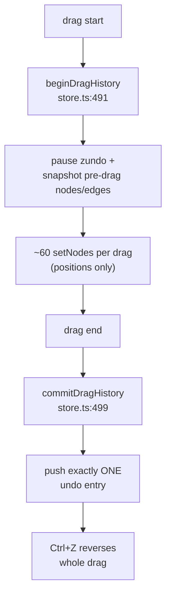
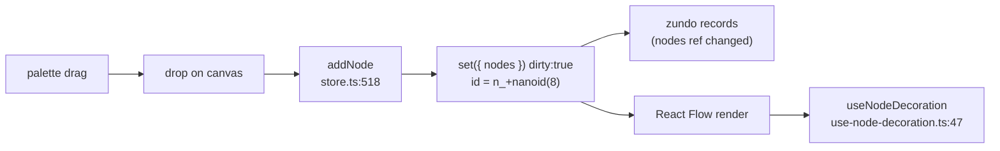
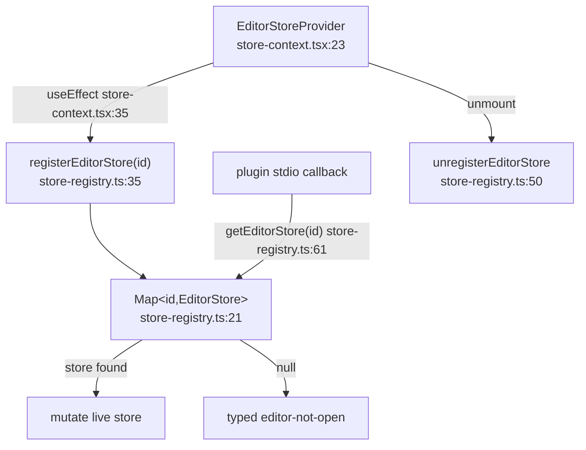
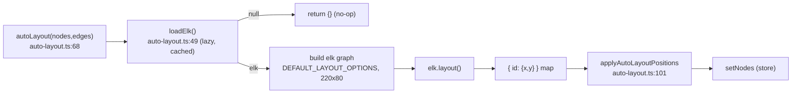

# Editor store & canvas mechanics

<Status variant="stable" />

<TLDR>
Every open workflow gets one Zustand store created by `createEditorStore(initial)` (`lib/workflow/editor/store.ts:389`), wrapped with `zundo` temporal so only `nodes`+`edges` are undoable (`store.ts:981`, `EDITOR_HISTORY_LIMIT = 100` at `store.ts:387`). Graph mutators (`addNode` `store.ts:518`, `updateNodeData` `store.ts:551`, `connect` `store.ts:571`) set `dirty:true` and push history; live-run maps (`runStatusByStepId` `store.ts:96`, sparse `validationByStepId` `store.ts:99`) and ephemeral prefs are deliberately *not* undoable. Drags are coalesced into exactly one undo entry via `beginDragHistory`/`commitDragHistory` (`store.ts:491`/`store.ts:499`) because a naive drag emits ~60 `setNodes` and would exhaust history in 1–2 drags. An out-of-React `Map<id,EditorStore>` (`store-registry.ts:21`) lets plugin stdio callbacks reach a live store; the pure helpers (`auto-layout.ts`, `connection-validator.ts`, `alignment-guides.ts`, `edge-routing.ts`, `performance-tier.ts`) carry all canvas geometry. Expression and AI-proposal modules live on a sibling page — see [./expressions-copilot](./expressions-copilot).
</TLDR>

<StatGrid>
  <Stat label="History limit" value="100" hint="EDITOR_HISTORY_LIMIT store.ts:387" />
  <Stat label="Undoable slice" value="nodes + edges" hint="zundo partialize store.ts:981" />
  <Stat label="Auto-balance threshold" value="80 nodes" hint="AUTO_BALANCED_THRESHOLD" />
  <Stat label="Default node box" value="220 x 80" hint="auto-layout.ts:44" />
</StatGrid>

## Where it lives

| File | Lines | Role |
| --- | --- | --- |
| `lib/workflow/editor/store.ts` | 996 | Per-workflow Zustand+zundo store: state, mutators, history coalescing |
| `lib/workflow/editor/store-registry.ts` | 97 | Out-of-React `Map<id,EditorStore>` so plugin stdio reaches a store |
| `lib/workflow/editor/store-context.tsx` | 61 | `EditorStoreProvider` + `useEditorStore` hook; mirrors store into registry |
| `lib/workflow/editor/workflow-editor-context.tsx` | 53 | Quick-action context (`validate`/`explain`/`suggest`) |
| `lib/workflow/editor/react-flow-converter.ts` | 143 | `VisualWorkflow` ⇄ React Flow node/edge shapes |
| `lib/workflow/editor/auto-layout.ts` | 109 | Lazy ELK layered auto-layout |
| `lib/workflow/editor/connection-validator.ts` | 81 | Ordered connect-time rule checks |
| `lib/workflow/editor/clipboard.ts` | 180 | Copy/paste envelope (`cognia.workflow.clipboard.v1`) |
| `lib/workflow/editor/align-distribute.ts` | 99 | Align / distribute geometry |
| `lib/workflow/editor/alignment-guides.ts` | 254 | Drag-time snap guides via sorted index |
| `lib/workflow/editor/lasso.ts` | 99 | Polygon lasso hit-testing |
| `lib/workflow/editor/edge-routing.ts` | 135 | Smart orthogonal/bezier edge routing |
| `lib/workflow/editor/edge-index.ts` | 124 | WeakMap edge adjacency index |
| `lib/workflow/editor/node-index.ts` | 72 | WeakMap node-by-id index |
| `lib/workflow/editor/node-io-data.ts` | 165 | Input/output panel data (pin wins over run) |
| `lib/workflow/editor/performance-tier.ts` | 111 | Tier → effective render flags |
| `lib/workflow/editor/performance-tier-prefs.ts` | 21 | Load/save tier from `AppSettings` |
| `lib/workflow/editor/viewport-bookmarks-db.ts` | 72 | Saved viewport bookmarks (Dexie) |
| `lib/workflow/editor/use-node-decoration.ts` | 66 | Per-node `useShallow` decoration selector |
| `lib/workflow/editor/node-icons.ts` | 87 | Kind → icon map |
| `lib/workflow/editor/export-image.ts` | 94 | PNG export via `html2canvas` |
| `lib/workflow/editor/persist-workflow.ts` | 28 | Save pipeline (`persistEditorWorkflow`) |
| `lib/workflow/editor/workflow-json.ts` | 40 | JSON import/export of a single workflow |

The canonical graph type is `VisualWorkflow` (`types/workflow/visual.ts:242`); see [./data-model](./data-model). For node-kind semantics see [./node-system](./node-system); for execution see [./runtime-execution](./runtime-execution); for the surrounding UI see [./ui-runs](./ui-runs).

## Store shape

`EditorState` (`store.ts:88-338`) groups into four bands. The store type (`store.ts:340`) is a `UseBoundStore` intersected with `temporal: StoreApi<TemporalState<Pick<EditorState,"nodes"|"edges">>>`.

| Band | Members | Undoable? |
| --- | --- | --- |
| Canvas | `nodes`/`edges`/`viewport` (from `EditorStateSnapshot` `store.ts:54`), `baseWorkflow` (rest of envelope), `selectedNodeIds`/`selectedEdgeIds`, `dirty`, `savedAt` `store.ts:88-94` | only `nodes`+`edges` |
| Live-run maps | `runStatusByStepId` (`NodeRunStatus` `store.ts:66`) `store.ts:96`, `validationByStepId` error-nodes-only `store.ts:99-103`, `lastRunByStepId` Dexie mirror ref-compared `store.ts:104-110` | no |
| Ephemeral prefs | `performanceTier` default `"auto"` `store.ts:120`, `isDraggingAny`, `snapToGrid` default `true`, `hoveredNodeId`/`hoveredEdgeId`, inline-edit flags, `palettePrefillPosition`, `spotlightedNodeId`/`pulseNode`, `connectionState` (`store.ts:79`) | no |
| Out-of-band signals | `requestedContextMenu` `store.ts:185`, `requestedRunFromStepId` `store.ts:200`, `requestedRunSingleStepId` `store.ts:209` — each a request/clear trio | no |

`NodeRunStatus` (`store.ts:66`) is `idle | running | succeeded | failed | skipped | waiting`. `validationByStepId` is **sparse** — only error nodes are kept, so absence means "valid". `labelByKind` (`store.ts:344`) / `defaultLabelFor` (`store.ts:360`) name new nodes; `shallowEqualValidation` (`store.ts:369`) avoids needless validation churn.

## Graph mutators (undoable)

| Mutator | Line | Effect |
| --- | --- | --- |
| `setNodes` / `setEdges` / `setViewport` | `store.ts:487-489` | Replace arrays / viewport, set `dirty:true` |
| `addNode` | `store.ts:518` | Append node; id prefix `n_` + `nanoid(8)` `store.ts:519` |
| `removeNodes` | `store.ts:541` | Drop nodes **and** their incident edges |
| `updateNodeData` | `store.ts:551` | Shallow-merge `data` for one node |
| `updateNodeDataBatch` | `store.ts:560` | Multi-node data patch in one set |
| `connect` | `store.ts:571` | Add edge; id prefix `e_` + `nanoid(8)` `store.ts:572` |
| `updateEdgeData` / `replaceEdge` / `removeEdges` | `store.ts:585` / `598` / `608` | Edge edits |
| `duplicateNodes` / `pasteFromEnvelope` | `store.ts:692` / `706` | Productivity inserts |
| `applyProposalOps` | `store.ts:719` | Apply an AI batch (see [./expressions-copilot](./expressions-copilot)) |
| `groupSelected` | `store.ts:880` | Wrap selection; inserts group node **first** `store.ts:905` |

```ts
// lib/workflow/editor/store.ts:551
updateNodeData: (id, patch) => {
  set({
    nodes: get().nodes.map((n) =>
      n.id === id ? { ...n, data: { ...n.data, ...patch } } : n,
    ),
    dirty: true,
  })
}
```

Every array-producing mutator copies the array, because temporal equality is **array-reference identity** (see below). Mutating in place would silently break undo.

## zundo temporal config & history limit

```ts
// lib/workflow/editor/store.ts:981
{
  partialize: (state) => ({ nodes: state.nodes, edges: state.edges }),
  equality: (a, b) => a.nodes === b.nodes && a.edges === b.edges,
  limit: EDITOR_HISTORY_LIMIT, // = 100  (store.ts:387)
}
```

Only `nodes` and `edges` are tracked — `viewport`, selection, run status and validation are intentionally *not* undoable. `equality` compares array references, so an action that returns the same array reference records **no** history entry, and one that copies records exactly one. `loadWorkflow` (`store.ts:667`) resets state and clears temporal history at `store.ts:681`.

### Undo / redo & drag coalescing



```ts
// lib/workflow/editor/store.ts:510
const past = temporalStore
  .getState()
  .pastStates.concat({ nodes: snap.nodes, edges: snap.edges })
while (past.length > EDITOR_HISTORY_LIMIT) past.shift()
temporalStore.setState({ pastStates: past, futureStates: [] })
```

The pre-drag snapshot is held in a **closure ref** (`dragHistorySnapshot` `store.ts:393`), not store state, so it never re-renders the canvas. Without coalescing, a drag emits ~60 `setNodes` and would exhaust the 100-entry budget in one or two drags. The same single-`set()` discipline applies to `applyProposalOps` (`store.ts:868`): one `set()` lands `nodes`/`edges`/`selected`/`validation`/`dirty` together, so a single Ctrl+Z reverses the entire AI proposal.

## Add-node flow



`useNodeDecoration` (`use-node-decoration.ts:47`) uses a `useShallow` selector reading **only this node's slots** of `runStatusByStepId`/`validationByStepId`/`lastRunByStepId` plus its `pinData` (with a frozen `EMPTY_DECORATION` `use-node-decoration.ts:40`), so unrelated mutations never re-render an unrelated node.

## Envelope, lifecycle & runtime status

Envelope mutators `setName`/`setDescription`/`setSettings`/`setVariables`/`setCredentials` span `store.ts:622-649`; `pinNodeData`/`unpinNodeData` (`store.ts:650-665`) store fixtures on `baseWorkflow.pinData`. Lifecycle: `loadWorkflow` `store.ts:667` (resets + clears history), `toWorkflow` `store.ts:684`, `markSaved`/`resetDirty` `store.ts:689-690`. Runtime status setters are **not** undoable: `setRunStatus`/`setRunStatusBatch`/`clear` `store.ts:920-926`, `setValidation`/`Batch`/`clear` `store.ts:928-938`, `setLastRunByStepId` `store.ts:939`, `revalidateNode` `store.ts:947`, `revalidateAll` `store.ts:967`. Selection lives at `store.ts:618-620` and `selectAll` at `store.ts:912`.

## Per-workflow store registration



The registry is a plain `Map<id,EditorStore>` (`store-registry.ts:21`) with `listeners` (`store-registry.ts:22`). `registerEditorStore` (`store-registry.ts:35`) is idempotent and warns+overwrites on HMR; `unregisterEditorStore` (`store-registry.ts:50`); `getEditorStore` (`store-registry.ts:61`) returns `null` so a plugin tool gets a typed *editor-not-open* error rather than a crash; `listEditorStores` (`store-registry.ts:71`), `subscribeEditorStores` (`store-registry.ts:81`), `__resetRegistryForTesting` (`store-registry.ts:93`). Lifecycle is owned by `EditorStoreProvider` (`store-context.tsx:23`), whose `useEffect` (`store-context.tsx:35-42`) mirrors the store into the registry under `baseWorkflow.id` and cleans up on unmount. `useEditorStoreOrNull` (`store-context.tsx:46`) and `useEditorStore` (`store-context.tsx:54`, throws outside the provider) read it. The quick-action context (`workflow-editor-context.tsx`) exposes `WorkflowQuickActionKind` `validate | explain | suggest` (`workflow-editor-context.tsx:21`) via `WorkflowEditorProvider` (`workflow-editor-context.tsx:36`) / `useWorkflowEditor` (`workflow-editor-context.tsx:51`).

## React Flow conversion

`workflowToReactFlow(wf)` (`react-flow-converter.ts:51`) flattens `kind = n.type` plus `typeVersion` into node `data`; `reactFlowToWorkflow(base,nodes,edges,viewport)` (`react-flow-converter.ts:93`) is the inverse; `toWorkflowViewport` (`react-flow-converter.ts:140`); `DEFAULT_VIEWPORT` (`react-flow-converter.ts:44`).

```ts
// lib/workflow/editor/react-flow-converter.ts:65
// edge gets type "conditional" only when its kind says so, else "default"
type: e.data?.kind === "conditional" ? "conditional" : "default"
```

## Auto-layout pipeline



`loadElk()` (`auto-layout.ts:49`) dynamically imports `elkjs/lib/elk.bundled.js` (~250KB, lazy), caches it in `cachedElk` (`auto-layout.ts:47`), and returns `null` on failure. `autoLayout` (`auto-layout.ts:68`) returns `{}` if ELK is absent or the graph is empty. Defaults are `DEFAULT_NODE_WIDTH = 220` / `HEIGHT = 80` (`auto-layout.ts:44-45`).

```ts
// lib/workflow/editor/auto-layout.ts:35
DEFAULT_LAYOUT_OPTIONS = {
  "elk.algorithm": "layered",
  "elk.direction": "RIGHT",
  "elk.layered.spacing.nodeNodeBetweenLayers": "120",
  "elk.spacing.nodeNode": "60",
  "elk.layered.nodePlacement.bk.fixedAlignment": "BALANCED",
  "elk.layered.crossingMinimization.semiInteractive": "true",
}
```

## Connection validation

`validateConnection(params,nodes,edges)` (`connection-validator.ts:42`) returns a `ValidationResult` (`connection-validator.ts:40`) and checks rules **in order**: missing endpoint (`:47`); self-loop (`:50`); endpoint missing from graph (`:55`); target kind starts with `trigger.` (`:58`); endpoint is an `annotation.note`/`group` node (`:61`); duplicate edge (`:69`).

```ts
// lib/workflow/editor/connection-validator.ts:58
if (target.data.kind.startsWith("trigger."))
  return { valid: false, reason: "Triggers are sources only." }
```

## Clipboard, align & lasso

`clipboard.ts` uses format `cognia.workflow.clipboard.v1` (`clipboard.ts:16`). `cloneNodesAndEdges(...,offset={x:24,y:24})` (`clipboard.ts:46`) remaps ids, drops out-of-subset edges, and strips `selected`/`dragging`; `buildClipboardEnvelope` (`:89`), `serializeClipboard` (`:106`), `parseClipboard` (`:116`, `null` on malformed), `rehydrateFromEnvelope` (`:134`), `selectionBounds` (`:151`).

`align-distribute.ts`: `computeAlign(rects,op)` (`align-distribute.ts:29`) needs ≥2 and aligns to the bounding box; `computeDistribute(rects,axis)` (`:68`) needs ≥3 and equalizes gaps.

`alignment-guides.ts`: `DEFAULT_TOLERANCE = 4` (`:50`); `buildAlignmentIndex(peers)` (`:104`) is built once per drag in `O(n log n)`; `lowerBound` (`:124`) is a binary search; `computeAlignmentGuides(dragged,peersOrIndex,tolerance=4)` (`:159`) returns at most one guide per axis as a `GuidesResult` (`:40`, `vertical[]`/`horizontal[]`/`snap:{dx,dy}`).

`lasso.ts`: `isPointInPolygon` (`:19`, ray-casting), `rectIntersectsPolygon` (`:39`), `nodeIdsInPolygon(nodes,polygon,options)` (`:79`, default node rect `240x80`).

## Edge routing & indices

`computeSmartRoute(input)` (`edge-routing.ts:57`) takes `RouteInputs` (`:26`, lazy `getNodes` blocker source, `cornerRadius` default `8`) and returns a `RouteResult` (`:44`) with `ORTHOGONAL_MIN_DELTA = 60` (`:51`). It picks one of three branches: horizontal L-bend (`:65`), vertical L-bend (`:86`), or a bezier fallback (`:107`) with single-blocker avoidance (`:119`). `getNodes()` is only invoked in the bezier branch (`:120`).

`edge-index.ts` keeps a WeakMap `indexCache` (`:34`) keyed on the edges-array identity, so it rebuilds only when the store yields a fresh array: `buildEdgeIndex` (`:41`), `getEdgeIndex` (`:62`), `getEdgeById` (`:71`), `getOutgoingEdgeIds` (`:84`), `getIncomingEdgeIds` (`:95`), `hasEdgeBetween(from,to)` (`:106`), frozen `EMPTY_ID_ARRAY` (`:123`). `node-index.ts` mirrors this for nodes via WeakMap (`:33`): `buildNodeIndex` (`:44`, later-entry-wins on duplicate id), `getNodeIndex` (`:57`), `getNodeById` (`:66`).

## I/O panel data

`node-io-data.ts`: `pickValue` (`:44`) makes a pinned fixture **win over** a run value (source `"pin" | "run" | "none"`); `resolveNodeIo(input)` (`:59`) produces the Output for the selected node plus deduped Inputs from direct upstream in edge order; `toItems` (`:94`); `typeOf` (`:99`); `sampleOf` (`:109`, truncates samples >40 chars); `flattenSchema` (`:133`) with `FlattenSchemaOptions` (`:121`, `maxDepth 4`, `maxRows 200`).

## Performance tiers

`PerformanceTier` (`performance-tier.ts:17`) is `auto | high | balanced | reduced`. `resolveEffectiveTier` resolves `auto` against node count and reduced-motion:

```ts
// lib/workflow/editor/performance-tier.ts:57
export function resolveEffectiveTier(tier, opts): ResolvedPerformanceTier {
  if (tier !== "auto") return tier
  if (opts.prefersReducedMotion) return "reduced"
  if (opts.nodeCount >= AUTO_BALANCED_THRESHOLD) return "balanced" // 80
  return "high"
}
```

`AUTO_BALANCED_THRESHOLD = 80` (`performance-tier.ts:26`); `EffectivePerfFlags` (`:28`) has 8 flags including `cullingThreshold`; `FLAGS_BY_TIER` (`:67`) / `flagsForTier` (`:100`) / `isPerformanceTier` (`:108`). `high.cullingThreshold = 8`; `balanced`/`reduced` cull always — `balanced` degrades the minimap, drops edge animations and sets `liveQueryWhileDragging` false, while `reduced` kills minimap + motion + live validation. Preferences round-trip via `loadPerformanceTierPref()` (`performance-tier-prefs.ts:12`, `AppSettings.workflowEditorPerformanceTier`, `undefined → "auto"`) and `savePerformanceTierPref` (`:18`).

## Bookmarks, icons, export & persistence

`viewport-bookmarks-db.ts`: `WorkflowViewportBookmarkRow` (`:20`, id `vb_` + `nanoid`) with `listBookmarks` (`:34`, `[workflowId+createdAt]` index), `saveBookmark` (`:45`), `deleteBookmark` (`:63`), `renameBookmark` (`:67`). `node-icons.ts` maps ~40 kinds (`ICONS` `:40`) with `FALLBACK_NODE_ICON = WorkflowIcon` (`:82`) and `getNodeIcon` (`:84`). `export-image.ts` clamps to `MIN_DIMENSION 512` / `MAX_DIMENSION 4096` (`:16-17`); `renderWorkflowImageCanvas` (`:39`) chains `getNodesBounds → getViewportForBounds → html2canvas` on `.react-flow__viewport`, applying the fit transform on a **cloned** DOM via `onclone` (default padding `0.12`); `exportWorkflowImage` (`:69`), `renderWorkflowImageBlob` (`:83`).

`persistEditorWorkflow(store)` (`persist-workflow.ts:19`) runs `toWorkflow → replaceWorkflow → syncWorkflowTriggers` (Tauri-only no-op) `→ markSaved → revalidateAll`, and is **never** blocked on validation. `workflow-json.ts`: `safeFileName` (`:9`), `downloadWorkflowJson` (`:14`), `parseWorkflowImport` (`:31`, shallow validation that throws readable errors and preserves the existing id).

## Gotchas

- History limit is **100** (`store.ts:387`); temporal tracks **only** `nodes`+`edges` — viewport and selection are not undoable.
- Temporal equality is **array-reference identity** — mutators must copy arrays or undo silently breaks.
- A drag without `beginDragHistory`/`commitDragHistory` emits ~60 `setNodes` and exhausts history in 1–2 drags.
- `dragHistorySnapshot` is a closure ref (`store.ts:393`), not store state — it never re-renders the canvas.
- `loadWorkflow` clears temporal history (`store.ts:681`).
- `validationByStepId` is sparse (error nodes only) — absence means valid.
- `groupSelected` inserts the group node **first** (`store.ts:905`).
- Node ids are `n_` + `nanoid(8)` (`store.ts:519`); edge ids `e_` + `nanoid(8)` (`store.ts:572`).
- `getEditorStore` returns `null`, surfaced to plugins as a typed *editor-not-open* error, never a throw.

## See also

- [./index](./index) — subsystem overview
- [./data-model](./data-model) — `VisualWorkflow` envelope
- [./node-system](./node-system) — 74 node kinds / 7 categories
- [./expressions-copilot](./expressions-copilot) — expression engine & AI proposals (`applyProposalOps`)
- [./runtime-execution](./runtime-execution) — executor & run status feed
- [./ui-runs](./ui-runs) — editor shell & run views
- ADR [../../adr/0011-workflows-subsystem](../../adr/0011-workflows-subsystem)
- ADR [../../adr/0034-workflow-editor-completeness-and-plugin-parity](../../adr/0034-workflow-editor-completeness-and-plugin-parity)
