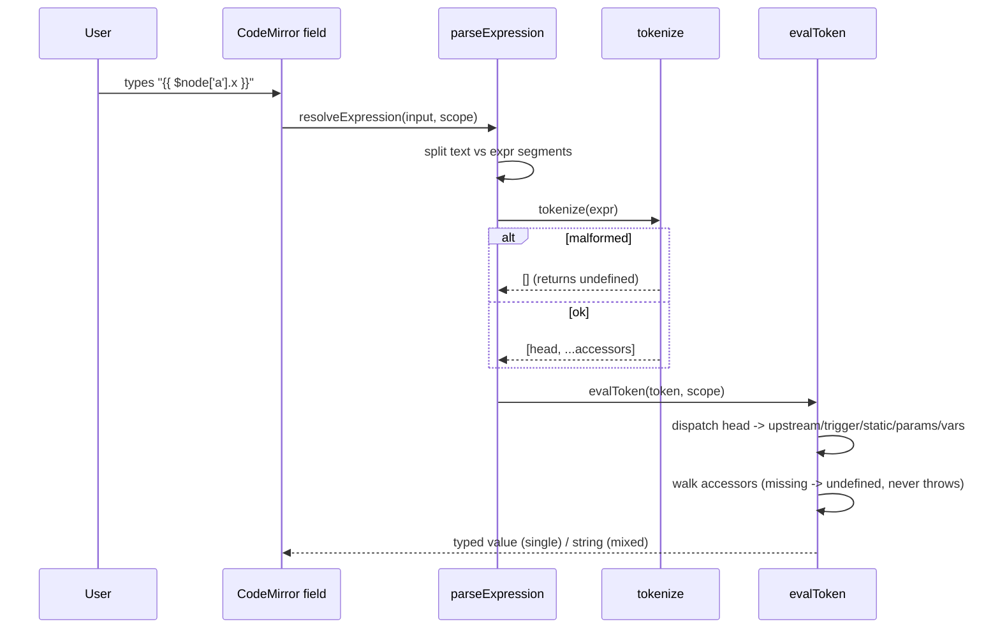
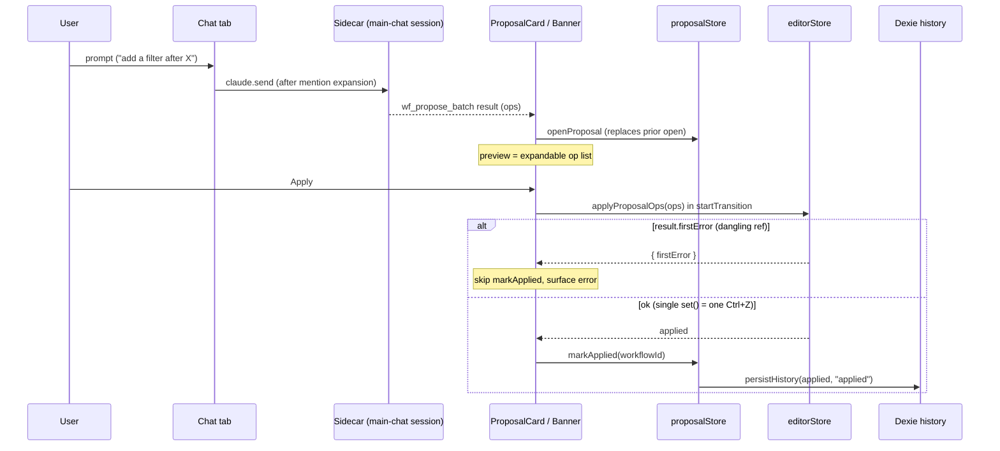

# Expressions & AI co-pilot

<Status variant="stable" />

<TLDR>
Two coupled pillars. (A) An **eval-free** expression mini-language: `resolveExpression` in `lib/workflow/runtime/expression.ts:51` parses `{{ ... }}` tokens with a hand-rolled tokenizer (`tokenize` at `lib/workflow/runtime/expression.ts:198`) — never `eval`/`Function`, never throws, missing paths resolve to `undefined`. The editor adds a color-only CodeMirror `StreamLanguage` (`lib/workflow/editor/expression-language.ts:65`), schema-driven autocomplete (`lib/workflow/editor/expression-suggestions.ts:38`), and drag-to-map references built by `buildNodeRef` (`lib/workflow/editor/expr-ref.ts:56`). (B) An **AI co-pilot**: the model emits batch ops validated by a Zod discriminated union (`lib/workflow/editor/proposal-schema.ts:66`), staged one-per-workflow in `lib/workflow/editor/proposal-store.ts:124`, previewed/applied as a **single `set()` = one Ctrl+Z** entry, with terminal states archived to a Dexie timeline (`lib/workflow/editor/proposal-history.ts:48`). The co-pilot lives in an embedded chat tab (`components/workflow/editor/right-sidebar/chat-tab.tsx:55`) that reuses the main-chat session — no second SDK session. **Critical gotcha**: there is NO `.out` wrapper — `upstream[id]` is addressed directly; the highlighter still colors `out` as a legacy artifact and `.out.` resolves to `undefined`.
</TLDR>

<StatGrid>
- **0** uses of `eval` / `Function` (deliberate; untrusted imported JSON)
- **5** proposal op types (`add_node` `remove_node` `connect_edge` `disconnect_edge` `configure_node`)
- **1** open proposal per workflow; **1** `set()` per apply = **1** Ctrl+Z
- **50** history rows kept per workflow (`PROPOSAL_HISTORY_LIMIT`)
</StatGrid>

Cross-links: [./index](./index) · [./editor-store](./editor-store) · [./node-system](./node-system) · [./runtime-execution](./runtime-execution) · [./ui-runs](./ui-runs) · ADR [../../adr/0011-workflows-subsystem](../../adr/0011-workflows-subsystem).

---

## A. The expression mini-language

### A.1 Grammar & runtime resolver

The grammar header (`lib/workflow/runtime/expression.ts:16`) defines two productions:

```text
// lib/workflow/runtime/expression.ts:16-18
token    := $node['id'] | $trigger | $static | $params
accessor := .field | ['key'] | ["key"] | [index]
```

Heads also accept `$vars` and any `$ident` fallback (resolves to `upstream[name]`, covering loop-injected `$item` / `$loop`). The resolver works against an `ExpressionScope` (`lib/workflow/runtime/expression.ts:33`):

| Member | Resolves head | Notes |
| --- | --- | --- |
| `upstream` | `$node['id']` | the raw output object, **NO `.out` wrapper** |
| `trigger` | `$trigger` | the trigger payload |
| `staticData` | `$static` | workflow static data |
| `params` | `$params` | node params |
| `variables?` | `$vars` | optional; `?? {}` when absent |

```ts
// lib/workflow/runtime/expression.ts:51 — resolveExpression
// parse -> if a single {{ expr }} return the TYPED evalToken value;
// mixed text+exprs -> string concatenation; no braces -> input as-is.
export function resolveExpression(input: string, scope: ExpressionScope): unknown {
  // ... parseExpression(input) then, for a single expr segment:
  //   return evalToken(token, scope)
}
```

Head dispatch is the load-bearing detail — note the absence of any `.out` indirection:

```ts
// lib/workflow/runtime/expression.ts:147-161 — evalToken head dispatch
// "node"    -> scope.upstream[head.id]      // direct, NO .out wrapper
// $trigger  -> scope.trigger
// $static   -> scope.staticData
// $vars     -> scope.variables ?? {}
// $params   -> scope.params
```

Key resolver functions:

| Symbol | Line | Purpose |
| --- | --- | --- |
| `ExpressionScope` | `expression.ts:33-44` | `{ upstream, trigger, staticData, params, variables? }` |
| `resolveExpression` | `expression.ts:51-69` | single segment → typed value; mixed → string concat; no braces → as-is |
| `resolveDeep<T>` | `expression.ts:76-91` | recursive deep-resolve; used by the step executor |
| `parseExpression` | `expression.ts:109-133` | splits text/expr segments; unterminated `{{` → literal |
| `evalToken` | `expression.ts:140-189` | head dispatch + accessor walk; missing path → `undefined`, never throws |
| `tokenize` | `expression.ts:198-261` | hand-rolled lexer; malformed → `[]` → `undefined` |

**Resolver invariants (gotchas):** no `eval`/`Function` anywhere (deliberate — workflow JSON can be imported untrusted); a missing path returns `undefined` rather than throwing; the tokenizer has **no escape support**; an unterminated `{{` is treated as a literal string; and there is **no `.out` wrapper** — legacy `.out.` accessors resolve to `undefined`.

### A.2 Editor: highlighting, autocomplete, drag-to-map

The editor layer is color/UX only — it never evaluates. A hand-rolled CodeMirror 6 `StreamLanguage` colors tokens:

```ts
// lib/workflow/editor/expression-language.ts:24-63 — expressionStreamParser
// inMustache state: {{ }} -> punctuation.special
// $node / $trigger / $static / $params -> keyword
// out -> propertyName   // (legacy: runtime has NO .out wrapper)
// other idents -> variableName
export const workflowExpressionLanguage = /* StreamLanguage.define(...) */;
```

> **Highlighter gotcha** (`expression-language.ts`): `out` is still colored as a property even though the runtime has no `.out` wrapper. This is a legacy artifact; `expression-suggestions.ts:116-118` notes the accessor addresses the raw output object directly (`upstream[id]`) and legacy `.out.` resolves to `undefined`.

Schema-driven suggestions are built from upstream node output schemas:

| Symbol | Line | Purpose |
| --- | --- | --- |
| `SuggestionEntry` | `expression-suggestions.ts:20-31` | label/detail/insert shape consumed by the completion source |
| `buildExpressionSuggestions` | `expression-suggestions.ts:38-154` | keyword roots + per-node `$node['id']` + `.field` from `outputSchemas` |
| `probeOutputFields` | `expression-suggestions.ts:164-167` | extracts field names from an output schema |

Keyword-root boosts (`buildExpressionSuggestions`): `$trigger` 90, `$vars` 85, `$static` 80, `$params` 70. Per-node entries emit `$node['id']` plus `.field` accessors from each node's `outputSchemas`, **excluding** the current node id and any `annotation.*` nodes.

Drag-to-map serializes a node+path into a reference string. The accessor formatter handles three shapes and one unrepresentable case:

```ts
// lib/workflow/editor/expr-ref.ts:25-58
// formatAccessors: number -> [n]; bare ident -> .x; else -> ['k'] / ["k"].
//   keys containing BOTH ' and " are unrepresentable (expr-ref.ts:39-44).
// buildNodeRef(nodeId, segments) returns the reference string:
buildNodeRef(nodeId, segments); // => `{{ $node['<id>'] ... }}`
```

| Symbol | Line | Purpose |
| --- | --- | --- |
| `formatAccessors` | `expr-ref.ts:25-47` | number→`[n]`, ident→`.x`, else→`['k']`/`["k"]`; both-quotes key unrepresentable |
| `formatPath` | `expr-ref.ts:50` | joins formatted accessors |
| `buildNodeRef` | `expr-ref.ts:56-58` | builds the `{{ $node['id'] ... }}` string |
| `EXPR_DRAG_MIME` | `expr-ref.ts:66` | drag MIME `application/x-workflow-expr` |
| `ExprDragPayload` | `expr-ref.ts:68-71` | `{ nodeId, segments }` drag payload |
| `serializeExprDrag` / `parseExprDrag` | `expr-ref.ts:74` / `79-99` | round-trip; `parseExprDrag` → `null` on invalid |

### A.3 `ExpressionField` — the wired input

`ExpressionField` (`components/workflow/editor/inspector/forms/shared/expression-field.tsx:70`) is the inspector control that mounts the language, completion, drop handling, and a live preview.

| Concern | Line | Behavior |
| --- | --- | --- |
| props | `expression-field.tsx:52-68` | field config + callbacks |
| store selector | `expression-field.tsx:98-105` | `nodes` / `workflowId` / `variables` / `pinData` / `isDraggingAny` / `performanceTier`; falls back to `InspectorExpressionProvider` ctx (`91-93`) |
| completion source | `expression-field.tsx:147-180` | matches `$...` / `{{ $...`; maps `SuggestionEntry` → CM completion via `apply: e.insert` |
| mount | `expression-field.tsx:183-254` | `workflowExpressionLanguage`, `autocompletion`; drop inserts `buildNodeRef` (`223-237`); `updateListener` → `onChange` |
| live preview | `expression-field.tsx:281-295` | `resolveExpression` with `upstream = upstreamOutputs`, truncated to 200 chars, errors caught inline |
| perf gating | `expression-field.tsx:116-133` | `liveQueryEnabled` via `resolveEffectiveTier` / `flagsForTier` |
| pinData overlay | `expression-field.tsx:138-141` | overlays run outputs; **pin wins** |

### A.4 Expression evaluation flow



---

## B. The AI co-pilot proposal pipeline

### B.1 Op model — compile-time union + runtime Zod

The model proposes a **batch** of operations. The compile-time union lives in `proposal-types.ts`; the runtime validator mirrors it in `proposal-schema.ts`.

| Op | Type-level line | Schema line |
| --- | --- | --- |
| `add_node` | `proposal-types.ts:32-38` | `proposal-schema.ts:31-63` |
| `remove_node` | `proposal-types.ts:40-43` | (per-op schema, same block) |
| `connect_edge` | `proposal-types.ts:45-53` | (per-op schema, same block) |
| `disconnect_edge` | `proposal-types.ts:55-58` | (per-op schema, same block) |
| `configure_node` | `proposal-types.ts:60-64` | (per-op schema, same block) |
| `ProposalOp` union | `proposal-types.ts:66-71` | — |
| `ProposalOpCount` / `summarizeOps` | `proposal-types.ts:74-80` / `82-104` | — |

The batch invariant (header `proposal-types.ts:7-11`): **apply runs the whole batch in a single `set()` = one zundo entry**, so one Ctrl+Z reverses the entire proposal; node IDs are final at propose time.

Runtime validation is a Zod discriminated union with a compile-time parity guard:

```ts
// lib/workflow/editor/proposal-schema.ts:66 — proposalOpSchema
const proposalOpSchema = z.discriminatedUnion("type", [
  addNodeSchema,
  removeNodeSchema,
  connectEdgeSchema,
  disconnectEdgeSchema,
  configureNodeSchema,
]);
```

| Symbol | Line | Purpose |
| --- | --- | --- |
| per-op schemas | `proposal-schema.ts:31-63` | one Zod object per op; `kind` widened to `string` (not `WorkflowNodeKind`) for plugin kinds |
| `proposalOpSchema` | `proposal-schema.ts:66-72` | discriminated union on `type` |
| `KNOWN_PROPOSAL_OP_TYPES` | `proposal-schema.ts:77-83` | the allow-list of op type strings |
| `ProposalOpSchemaParity` | `proposal-schema.ts:91-92` | compile-time no-drift guard between type union and schema |
| `coerceProposalOp` | `proposal-schema.ts:100-112` | returns a typed op **OR** a human-readable, field-named error string — **never throws** |

### B.2 Staging store + Dexie history

`useProposalStore` (`lib/workflow/editor/proposal-store.ts:124`) is a Zustand singleton holding **at most one open proposal per workflow** (the last-applied may coexist).

| Symbol | Line | Purpose |
| --- | --- | --- |
| `ProposalPayload` | `proposal-store.ts:70-81` | ops + summary + source metadata |
| `ProposalStatus` | `proposal-store.ts:83` | `open` \| `applied` \| `discarded` |
| `ProposalEntry` | `proposal-store.ts:85-100` | staged entry record |
| `openProposal` | `proposal-store.ts:127-156` | replaces any prior open → prior becomes a discarded history row |
| `markApplied` | `proposal-store.ts:158-172` | moves prior open → `lastApplied`; persists history |
| `discardProposal` | `proposal-store.ts:174-188` | discards the open proposal |
| `clearProposalsFor` / `statusOf` / `getProposal` | `proposal-store.ts:190-197` / `199-207` / `209-217` | per-workflow housekeeping + lookups |
| `persistHistory` | `proposal-store.ts:54-68` | fire-and-forget; **never blocks** the store update |
| `affectedNodeIdsFromOps` | `proposal-store.ts:36-52` | derives touched node ids for history rows |

```ts
// lib/workflow/editor/proposal-store.ts:158 — markApplied
// moves prior.open -> lastApplied; if applied: persistHistory(applied, "applied").
```

Terminal states (`applied` / `discarded`) flow to a Dexie timeline that backs the Changelog tab:

| Symbol | Line | Purpose |
| --- | --- | --- |
| `WorkflowProposalHistoryRow` | `proposal-history.ts:17-36` | id = `${proposalId}:${status}` composite; `workflowId` `proposalId` `status` `summary` `opsCount` `affectedNodeIds[]` `messageId?` `createdAt` |
| `PROPOSAL_HISTORY_LIMIT` | `proposal-history.ts:39` | `50` rows kept per workflow |
| `appendProposalHistory` | `proposal-history.ts:48-57` | `put` + prune |
| `listProposalHistory` | `proposal-history.ts:60-70` | newest-first |
| `pruneOldProposalHistory` | `proposal-history.ts:76-86` | keeps newest 50 per workflow |
| `deleteProposalHistoryForWorkflow` | `proposal-history.ts:89-97` | clears a workflow's timeline |

The Dexie table `workflowProposalHistory` was added in **schema v42** with index `[workflowId+createdAt]`.

### B.3 Proposal lifecycle



### B.4 UI surfaces

**Proposal card** (`components/workflow/editor/chat/workflow-proposal-card.tsx:55`) is the inline renderer for `wf_propose_batch` / `wf_apply_template` MCP results, with an expandable op list (`165-193`):

```ts
// components/workflow/editor/chat/workflow-proposal-card.tsx:105-111 — handleApply
addOptimisticStatus("applied");
const result = store.getState().applyProposalOps(proposal.ops);
if (result.firstError) {
  // surface error; do NOT markApplied — catches dangling refs
  // introduced between propose and apply
  return;
}
useProposalStore.getState().markApplied(workflowId);
```

| Symbol | Line | Purpose |
| --- | --- | --- |
| `WorkflowProposalCard` | `workflow-proposal-card.tsx:55-234` | inline result renderer |
| `handleApply` | `workflow-proposal-card.tsx:83-118` | optimistic status → `applyProposalOps` in `startTransition`; on `firstError` skips `markApplied` |
| `handleDiscard` | `workflow-proposal-card.tsx:120-126` | discards the open proposal |

**Sticky banner** (`components/workflow/editor/chat/sticky-proposal-banner.tsx:37`) is the pinned top strip for the OPEN proposal (Apply / Discard / Reveal):

| Symbol | Line | Purpose |
| --- | --- | --- |
| `StickyProposalBanner` | `sticky-proposal-banner.tsx:37-136` | three `useRef`-guarded effects toast on transitions only (`52-77`); `null` when no open (`79`) |
| `discardOpen` | `sticky-proposal-banner.tsx:138-142` | discards |
| `applyOpen` | `sticky-proposal-banner.tsx:144-170` | captures the `getEditorStore` handle **outside** the transition, runs `applyProposalOps` inside, surfaces `firstError` |

**Chat tab** (`components/workflow/editor/right-sidebar/chat-tab.tsx:55`) hosts the co-pilot by reusing the main-chat `ChatPane` and the same sidecar dispatch — **no second SDK session**:

| Symbol | Line | Purpose |
| --- | --- | --- |
| `WorkflowEditorChatTab` | `chat-tab.tsx:55-209` | co-pilot host (reuses `ChatPane`) |
| `handleSend` | `chat-tab.tsx:72-85` | `applyWorkflowMentionExpansion` then `claude.send` |
| `handleQuickAction` | `chat-tab.tsx:106-114` | `buildQuickActionPrompt` |
| slash-command listener | `chat-tab.tsx:121-131` | routes editor slash commands |
| `applyWorkflowMentionExpansion` | `chat-tab.tsx:223-231` | expands `@node:` / `@edge:` mentions |
| `dispatchWorkflowAction` | `chat-tab.tsx:241-276` | routes co-pilot actions back to the editor |

**Quick-action prompts** (`lib/workflow/editor/quick-action-prompts.ts`):

| Symbol | Line | Purpose |
| --- | --- | --- |
| `buildQuickActionPrompt` | `quick-action-prompts.ts:19-33` | dispatch by kind |
| `buildValidatePrompt` | `quick-action-prompts.ts:35-60` | runs `validateAllNodes` + `flattenSummary`, emits `/validate` |
| `buildExplainPrompt` | `quick-action-prompts.ts:62-82` | `/explain` from selection |
| `buildSuggestPrompt` | `quick-action-prompts.ts:84-109` | `/suggest-next` — "Don't add the node yourself — wait for me to confirm" |

**Mention expansion** (`lib/workflow/editor/mention-expand.ts`) rewrites `@node:`/`@edge:` references into readable context:

| Symbol | Line | Purpose |
| --- | --- | --- |
| `expandWorkflowMentions` | `mention-expand.ts:52-86` | regex `@(node\|edge):id`; unknown ids pass through verbatim; node → `id` (kind . label), edge → `id` (src→tgt via handle) |
| `snapshotFromEditorState` | `mention-expand.ts:94-134` | builds the snapshot consumed by expansion |

**Session bar** (`components/workflow/editor/chat/session-bar.tsx:81`) manages per-workflow chat sessions: default id `workflow:${workflowId}`, additional `...:${nanoid(6)}`; `useLiveQuery` lists sessions by prefix with the default pinned to the top; supports rename / clear / create / switch / delete (deleting the default is blocked).

---

## Gotchas (must-know)

| Gotcha | Where | Consequence |
| --- | --- | --- |
| No `eval` / `Function` | `expression.ts` | deliberate — workflow JSON may be imported untrusted |
| Missing path → `undefined`, never throws | `evalToken` `expression.ts:140-189` | partial expressions degrade silently |
| **No `.out` wrapper** | `evalToken` `expression.ts:147-161` | `upstream[id]` is direct; legacy `.out.` resolves to `undefined` |
| Highlighter still colors `out` | `expression-language.ts` | legacy visual artifact; does NOT change runtime |
| Tokenizer has no escape support | `tokenize` `expression.ts:198-261` | quotes inside keys can be unrepresentable (`expr-ref.ts:39-44`) |
| Unterminated `{{` → literal | `parseExpression` `expression.ts:109-133` | half-typed expressions render as text |
| `coerceProposalOp` never throws | `proposal-schema.ts:100-112` | invalid ops return a field-named error string |
| `kind` widened to `string` | `proposal-schema.ts:31-63` | accommodates plugin node kinds |
| `ProposalOpSchemaParity` | `proposal-schema.ts:91-92` | compile-time guard against type/schema drift |
| ≤1 open proposal per workflow | `proposal-store.ts:127-156` | a new propose discards the prior open |
| Apply = one `set()` = one Ctrl+Z | `proposal-types.ts:7-11` | whole batch is atomic for undo |
| Apply atomicity returns `{ firstError }` | `workflow-proposal-card.tsx:105-111` | dangling refs skip `markApplied` |
| History cap 50, fire-and-forget | `proposal-history.ts:39`, `proposal-store.ts:54-68` | persistence never blocks the UI |
| Chat tab reuses single main-chat session | `chat-tab.tsx:55` | no second SDK session is opened |
