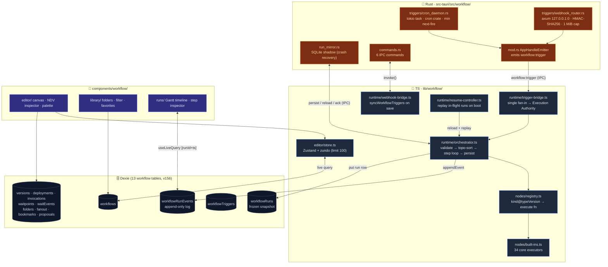

# Visual Workflows

<Status variant="stable" />

<TLDR>
  A React Flow v12 editor (Zustand + zundo store, elkjs auto-layout) over **153 node kinds in 7
  categories**, executed by a **hybrid runtime**: Rust owns *when a workflow starts* (cron daemon,
  HMAC webhook receiver) and *whether a run survived a crash* (SQLite mirror); TS owns *how a run
  walks the graph step by step* (`runWorkflow` — validate → topo-sort → step loop → durable event
  log). The graph type is `VisualWorkflow` (`types/workflow/visual.ts:242`, `schemaVersion: 1`);
  workflow persistence spans **13 Dexie tables** through schema v156. An AI co-pilot drafts
  Zod-validated batch *proposals* the user previews and applies as a single undo step.
</TLDR>

<StatGrid>
  <Stat
    label="Node kinds"
    value="153"
    hint="7 categories · trigger / action / ai / flow / data / io / annotation (+pattern→action)"
  />
  <Stat label="Execution" value="Authority + orchestrator" hint="immutable formal runs · draft preview/test" />
  <Stat label="Built-in templates" value="22" hint="10 seed · 4 advanced pack · 8 GitHub Delivery" />
  <Stat
    label="Dexie tables"
    value="13"
    hint="definitions · runs/events/triggers · versions/deployments/invocations · waitpoints/events · editor auxiliaries"
  />
  <Stat label="lib/workflow" value="~14.7k LOC" hint="editor 4.3k · nodes 4k · runtime 3.2k · definition/library 3k" />
  <Stat label="Rust backend" value="~2.3k LOC" hint="webhook_router 818 · run_mirror 432 · cron_daemon 351" />
</StatGrid>

cognia-next uses this layer to compose its mature runtime entities — [characters](../../chat/chat-and-skills), [agent teams](../../chat/agent-teams), [skills](../skills), [employee twins](../employee-twin), [platform connectors](../platform-connectors), MCP servers, and [plugins](../plugin-system) — into executable graphs. The design follows ADR 0011 (subsystem), ADR 0017 (plugin extension points), and ADR 0034 (editor completeness).

## The one load-bearing principle

> **Rust owns "when does the workflow start" and "did this run survive the crash". TS owns "given a run, how do we walk through the steps one by one".**

Everything else falls out of that split. Cron firing and webhook receipt must work while the webview is minimized to the tray, so they live in Rust (`src-tauri/src/workflow/`). The step-by-step orchestration touches Dexie, the LLM clients, the connector bus, and the agent-team runtime — all of which live in the webview — so it stays in TS (`lib/workflow/runtime/`). The two sides communicate through Tauri events plus scoped trigger, run-mirror, and durable-waitpoint IPC commands. In web mode, Dexie provides the waitpoint fallback while the TS orchestrator remains available.

## Architecture

## Module map

Each card is a documentation page with line-accurate internals. Read the per-module page before any non-trivial change.

<Cards>
  <Card title="Data model & definitions" href="./data-model" description="VisualWorkflow type, the 153-kind taxonomy, validation, and 13 workflow Dexie tables through v156" />
  <Card title="Editor store & canvas mechanics" href="./editor-store" description="The Zustand + zundo store (history 100), React Flow converter, elkjs auto-layout, connection validator, clipboard/align/lasso, WeakMap indexes, perf tiers, viewport bookmarks" />
  <Card title="Expressions & AI co-pilot" href="./expressions-copilot" description="The eval-free {{ }} expression language, CodeMirror highlighting + autocomplete, drag-to-map, and the Zod-validated proposal pipeline with Dexie history" />
  <Card title="Node system & executors" href="./node-system" description="The kind@typeVersion registry, catalog metadata, per-kind Zod param schemas, validation, and the action/flow/data/io built-in executor families" />
  <Card title="AI & pattern nodes" href="./ai-pattern-nodes" description="ai.prompt / classify / extract / embed internals (LLM client, structured output, fall-open) and the 6 synthesizer-only Ultracode pattern.* nodes" />
  <Card title="Runtime execution engine" href="./runtime-execution" description="runWorkflow pipeline, Kahn topo-sort with back-edges, retry/timeout step executor, the durable event log, idempotency, concurrency control, long steps, run-single-node, crash recovery, and the run state machine" />
  <Card title="Triggers & Rust backend" href="./triggers-rust" description="The 5-way trigger taxonomy, the TS bridges, the in-process cron daemon, the HMAC webhook router, and the SQLite run mirror" />
  <Card title="UI, library & runs" href="./ui-runs" description="The 3-pane editor shell, the Config/Input/Output NDV inspector, the 6-tab right sidebar, the folder-aware library, and the Gantt run history" />
</Cards>

## Use cases

| Scenario                           | Recommended graph                                                                     |
| ---------------------------------- | ------------------------------------------------------------------------------------- |
| Scheduled data sync                | `trigger.cron` → `io.http` → `data.transform` → `flow.set`                            |
| Inbound auto-reply                 | `trigger.connector.inbound` → `ai.classify` → `flow.switch` → `action.connector.send` |
| RAG-backed FAQ reply               | `trigger.chat.message` → `action.twin.rag` → `ai.prompt` → `action.character.send`    |
| Webhook bridge                     | `trigger.webhook` → `ai.extract` → `io.webhook.respond`                               |
| Complex aggregation                | `flow.split` → N× `ai.prompt` → `flow.join` → `data.template`                         |
| GitHub PR auto-review              | `trigger.github.webhook` → `ai.prompt` → `action.github.reviewPr`                     |
| Multi-character orchestration      | `action.team.run` drives the agent-team lifecycle                                     |

## Trigger taxonomy (hybrid distribution)

All five trigger paths fan into one TS chokepoint — `trigger-bridge.ts:43 dispatchTrigger` → `runWorkflow`.

| Trigger                     | Fired by              | Path                                                                                 |
| --------------------------- | --------------------- | ------------------------------------------------------------------------------------ |
| `trigger.manual`            | TS                    | Editor Run button / IM tap / resume — direct `dispatchTrigger`                        |
| `trigger.cron`              | **Rust** daemon       | `cron_daemon.rs:229` emit → `workflow:trigger` → bridge (fires while in tray)         |
| `trigger.webhook`           | **Rust** axum         | `webhook_router.rs:292` HMAC → emit → bridge (desktop only)                           |
| `trigger.connector.inbound` | TS hook               | `ConnectorBus` → `findMatchingWorkflows` → `dispatchTrigger`                          |
| `trigger.chat.message`      | TS hook               | `lib/db/messages.ts` → `findMatchingWorkflows` → `dispatchTrigger`                    |

See [Triggers & Rust backend](./triggers-rust) for the full plumbing.

## Related subsystems

<Cards>
  <Card title="Platform Connectors" href="../platform-connectors" description="Source of trigger.connector.inbound + action.connector.send" />
  <Card title="Scheduler" href="../scheduler" description="The in-process cron daemon mirrors the scheduler's absolute-timestamp clock" />
  <Card title="Skills Subsystem" href="../skills/consumption-surfaces" description="Target of action.skill.invoke / action.skill.upsert" />
  <Card title="Agent Teams" href="../../chat/agent-teams" description="action.team.run drives runTeamLifecycle; pattern.* nodes are higher-order team dispatches" />
  <Card title="Employee Twin" href="../employee-twin" description="Entry point for action.twin.rag / action.twin.ingest" />
  <Card title="Plugin System" href="../plugin-system" description="workflow.node / workflow.trigger / workflow.task extension points" />
</Cards>

## Related ADRs

- [ADR 0011 — Visual Workflows Subsystem](../../adr/0011-workflows-subsystem)
- [ADR 0017 — Workflow Plugin Extension Points](../../adr/0017-workflow-plugin-extension-points)
- [ADR 0034 — Workflow Editor Completeness and Plugin Parity](../../adr/0034-workflow-editor-completeness-and-plugin-parity)
- [ADR 0022 — Agent Team](../../adr/0022-agent-team) (the Ultracode `pattern.*` addendum)

## Known limitations

- **Subworkflow recursion** is hard-capped at depth 10 (`built-ins.ts:1212 MAX_SUBWORKFLOW_DEPTH`); exceeding it throws non-retryably.
- **`flow.loop` ceiling**: per-instance `maxIterations` plus a global `LOOP_HARD_CAP = 100_000` (`built-ins.ts:415`) covering `forEach` / `times` / `while`.
- **Web-mode degradation**: cron only fires while the webview is alive; webhook is desktop-only (banner shown); the crash-recovery SQLite mirror is Tauri-only, so web relies on the Dexie event log + boot replay alone.
- **`io.webhook.respond`** is a deferred passthrough (`deliveryDeferred: true`) — there is no synchronous "hold the HTTP response open until the node runs" channel yet.
- **Run snapshots are immutable**: re-running from history uses `WorkflowRunRow.workflowSnapshot`, frozen at run start; later edits never affect historical runs (intentional).
- **The settings shell** (`components/settings/workflows/workflows-section.tsx`) still hard-codes English strings — a known deviation from the project i18n rule.
