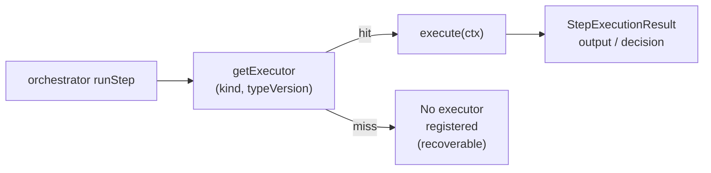
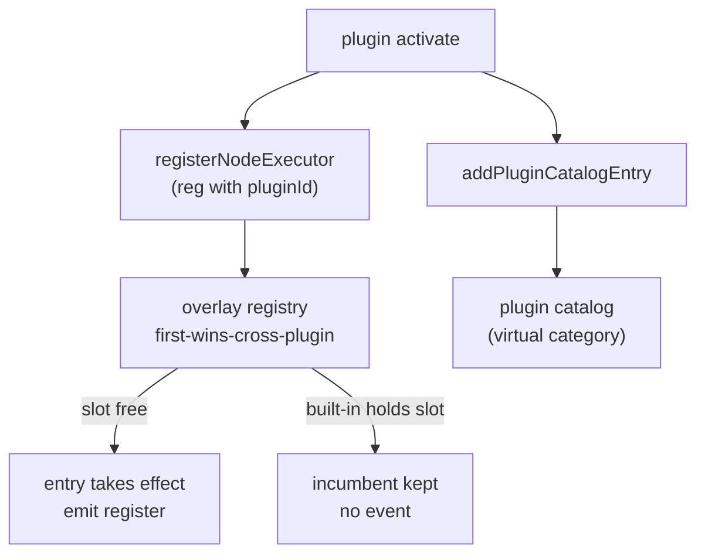

# Node system & executors

<Status variant="stable" />

<TLDR>
Every workflow step is a `kind@typeVersion` pair resolved through an overlay registry (`lib/workflow/nodes/registry.ts:131`) whose built-ins always win cross-plugin collisions (`registry.ts:77`). The palette and search index live in a separate catalog (`lib/workflow/nodes/catalog.ts:489`) keyed by the same kinds, while per-kind Zod schemas (`lib/workflow/nodes/params-schemas.ts:384`) feed both the editor-time validation gate (`lib/workflow/nodes/validate-params.ts:101`) and the compile-time `TypedWorkflowNode` discriminated union (`lib/workflow/nodes/typed-params.ts:47`). Host built-ins register at import in `lib/workflow/nodes/built-ins.ts:1` (side-effect-importing `./desktop` and `./terminal`), covering the flow / data / io / action families; the AI primitives and the 6 `pattern.*` nodes are documented on the sibling page <a href="./ai-pattern-nodes">AI &amp; pattern nodes</a>. `typeVersion` is exact-match — a bump without a matching registration is a recoverable "No executor registered" run failure.
</TLDR>

<StatGrid>
- **153 node kinds** across 7 categories (canonical)
- **`kind@typeVersion`** registry key; every built-in is typeVersion 1
- **`"first-wins-cross-plugin"`** conflict policy, built-ins win (`registry.ts:77`)
- **`LOOP_HARD_CAP=100_000`** + **`MAX_SUBWORKFLOW_DEPTH=10`** safety caps
</StatGrid>

## The registry (`lib/workflow/nodes/registry.ts`)

The registry maps a `kind@typeVersion` key to a single `NodeExecutorRegistration` and is the orchestrator's only lookup surface.

| Symbol | Line | Purpose |
| --- | --- | --- |
| `BUILTIN_PLUGIN_ID = "__builtin__"` | L33 | Owner id stamped on host registrations. |
| `NodeExecuteFn` | L35 | `(ctx: StepExecutionContext) => Promise<StepExecutionResult>`. |
| `NodeExecutorRegistration` | L37-51 | `{kind, typeVersion, execute, retryable?, timeoutMs?, pluginId?}`. |
| `registry = createOverlayRegistry(...)` | L77-89 | keyFn `kind@version`, conflictPolicy `"first-wins-cross-plugin"`, `onConflict` logs. |
| `registerNodeExecutor(reg)` | L108-118 | owner = `pluginId ?? BUILTIN_PLUGIN_ID`; emits `"register"` only if the entry took effect. |
| `unregisterNodeExecutor(...)` | L126-129 | Removes a registration. |
| `getExecutor(kind, version)` | L131-136 | Orchestrator lookup by exact key. |
| `listRegisteredKinds()` | L138-142 | Enumerates live registrations. |
| `subscribeNodeRegistry(...)` | L150-155 | Change subscription (events are `queueMicrotask`-deferred, L95). |
| `__resetRegistryForTesting()` | L158-161 | Test-only reset. |

Built-ins win collisions: the overlay's `"first-wins-cross-plugin"` policy plus the `BUILTIN_PLUGIN_ID` owner means a plugin can never shadow a host executor for the same `kind@typeVersion`.

```ts
// lib/workflow/nodes/registry.ts:108
export function registerNodeExecutor(reg: NodeExecutorRegistration): void {
  const owner = reg.pluginId ?? BUILTIN_PLUGIN_ID
  const k = key(reg.kind, reg.typeVersion)
  registry.register(reg.kind, reg, { pluginId: owner })
  if (registry.get(k) === reg) { emit({ type: "register", kind: reg.kind, typeVersion: reg.typeVersion }) }
}
```

The `emit` guard (`registry.get(k) === reg`) ensures the `"register"` event fires only when the registration actually took effect — a losing cross-plugin attempt registers no event and never shadows the incumbent.



## Catalog metadata (`lib/workflow/nodes/catalog.ts`)

The catalog is the palette / search layer; it is intentionally separate from the registry so that synthesizer-only kinds can execute without shipping palette metadata.

| Symbol | Line | Purpose |
| --- | --- | --- |
| `NodeCatalogEntry` | L18-45 | `{kind, category WorkflowNodeCategory \| "plugin", label, description, iconName, keywords[], hidden?, desktopOnly?, pluginId?, paramsSchema?}`. |
| `ENTRIES` | L53-482 | `Partial<Record<...>>` — partial because synthesizer-only `pattern.*` ship **no** palette metadata. |
| `NODE_CATALOG` | L489-493 | `WORKFLOW_NODE_KINDS.flatMap(...)`, skips kinds with no `ENTRIES`. |
| plugin entries | L497-553 | `addPluginCatalogEntry` / `removePluginCatalogEntry` / `subscribePluginCatalog` / `getPluginCatalogSnapshot` (useSyncExternalStore-friendly). |
| `nodeCatalogEntry(kind)` | L563-574 | Fallback synthesized entry, `iconName "Box"`. |
| `groupedCatalog()` | L584-611 | Order trigger / action / ai / flow / data / io / annotation + virtual `"plugin"`. |
| `searchCatalog()` | L624-651 | Weighted fuzzy: label-exact 100 → kind-contains 10. |

All catalog-visible kinds are enumerated in `ENTRIES`; `pattern.*` are deliberately absent (synthesizer-only — see <a href="./ai-pattern-nodes">AI &amp; pattern nodes</a>).

```ts
// lib/workflow/nodes/catalog.ts:363
"ai.prompt": {
  label: "AI prompt",
  description: "Direct LLM call. Uses the configured provider routing.",
  iconName: "Bot",
  keywords: ["llm", "prompt", "chat", "claude", "openai", "ai"],
}
```

## Param schemas (`lib/workflow/nodes/params-schemas.ts`)

Each kind owns a Zod schema validating `node.data.params`; all errors surface as **stable i18n keys** (camelCase) so the editor can localize them.

| Symbol | Line | Purpose |
| --- | --- | --- |
| helpers | L24-51 | `requiredString`, `optionalString`, `numberRange`, `isHttpUrlOrExpression` (lets `{{ }}` through). |
| schema consts | L55-380 | Per-kind shape definitions. |
| `PARAMS_SCHEMAS` | L384-479 | `satisfies Record<WorkflowNodeKind, z.ZodTypeAny>` — `satisfies` preserves per-key types for typed-params **and** gives compile-time exhaustiveness. |
| `ParamsSchemas` | L489 | Derived type. |
| `KNOWN_KINDS` | L492 | Kinds with a concrete schema. |
| `paramsSchemaFor(kind)` | L499-501 | Fallback permissive `z.record(z.string(), z.unknown())`. |

GitHub Delivery and Desktop Automation now have concrete schemas in this registry, even though their executors live outside `built-ins.ts`. The remaining permissive family is the 6 synthesizer-only `pattern.*` nodes, whose params are emitted by the orchestration synthesizer instead of edited directly.

```ts
// lib/workflow/nodes/params-schemas.ts:283
const LoopParams = z.object({
  mode: z.enum(["forEach", "times", "while"]).optional(),
  times: numberRange(0).optional(),
  inputExpression: optionalString,
  bodyExpression: requiredString("required"),
  whileCondition: optionalString,
  maxIterations: numberRange(1, 1_000_000).optional(),
}).refine(/* while -> whileCondition, forEach -> inputExpression, else times > 0 */, {
  message: "loopBodyRequired",
  path: ["mode"],
})
```

> **Gotcha (`params-schemas.ts:133-135`)**: `requiredString` MUST be *called* — passing the bare function reference silently disabled validation for that field.

## Validation gate (`lib/workflow/nodes/validate-params.ts`)

This is the editor-time "block run on errors" gate, independent from runtime checks.

| Symbol | Line | Purpose |
| --- | --- | --- |
| `looksLikeI18nKey(...)` | L19-22 | Detects already-localizable messages. |
| `FieldError` / `NodeValidationResult` | L29-41 | Per-field + per-node result shapes. |
| `mapIssueToFieldError(...)` | L47-83 | Trusts i18n-key messages; maps zod4 codes `invalid_type` / `too_small` / `too_big` → `required` / `minItems` / `minValue` / `maxValue`. |
| `validateNodeParams(kind, params)` | L101-111 | `paramsSchemaFor(kind).safeParse`; plugin/unknown → empty. |
| `validateAllNodes(nodes)` | L136-148 | Returns only error entries. |
| `flattenSummary(...)` | L154-162 | Collapses to a flat list. |

## Typed params (`lib/workflow/nodes/typed-params.ts`)

Type-only module (`import type { z }` only) that lifts the schemas into the type layer:

| Symbol | Line | Purpose |
| --- | --- | --- |
| `WorkflowNodeParamsFor<K>` | L32-34 | `z.infer<ParamsSchemas[K]>`. |
| `TypedWorkflowNodeData` | L37-39 | Params + node-data shape per kind. |
| `TypedWorkflowNode` | L47-49 | Discriminated union keyed by `type`. |
| `TypedStepExecutionContext` | L52-54 | Context narrowed to the node's params. |

## Built-in executor families (`lib/workflow/nodes/built-ins.ts`)

All host built-ins register at import (`built-ins.ts:1`), and the module side-effect-imports `./desktop` (L37) and `./terminal` (L41). AI helpers live at L51-82; shared helpers (`sha256Hex`, `nonRetryable`, `isTruthy`, `firstUpstream`, `evalItemExpression`, `evalLoopExpression`) at L1835-1907.

### Trigger & flow

| Kind | Line | Notes |
| --- | --- | --- |
| `trigger.manual` | L85 | Manual entry point. |
| `trigger.team` | L101 | Passthrough — does **not** start a team. |
| `flow.set` | L113 | Sets static / expression values. |
| `flow.branch` | L139 | Two-way truthy decision. |
| `flow.switch` | L359 | Multi-case routing. |
| `flow.split` | L383 | Passthrough; orchestrator fans out. |
| `flow.join` | L394 | Freezes `ctx.upstream` per `joinPolicy`. |
| `flow.loop` | L416 | `forEach` / `times` / `while`; abort-aware (`LOOP_HARD_CAP=100_000` L415). |
| `flow.wait` | L534 | Duration only; event mode no-op. |
| `flow.subworkflow` | L1213 | Recursive `runWorkflow` (`MAX_SUBWORKFLOW_DEPTH=10` L1212). |

```ts
// lib/workflow/nodes/built-ins.ts:139
execute: async (ctx) => {
  const params = ctx.params as { condition?: unknown; truthyLabel?: string; falsyLabel?: string }
  const truthyLabel = /* ... */ "true"
  const falsyLabel = /* ... */ "false"
  if (params.condition === undefined || params.condition === "") {
    return { output: { decision: falsyLabel }, decision: falsyLabel }
  }
  const decision = isTruthy(params.condition) ? truthyLabel : falsyLabel
  return { output: { decision, evaluated: params.condition }, decision }
}
```

### Data & io

| Kind | Line | Notes |
| --- | --- | --- |
| `data.transform` | L170 | `map` / `filter` / `sort` / `flatten` / `reduce`. |
| `data.template` | L566 | String templating. |
| `data.code` | L582 | `new Function`, `timeoutMs 5000`, non-retryable on fail. |
| `io.http` | L612 | `fetch(url, { signal: ctx.signal })`; 5xx retryable, 4xx not. |
| `io.webhook.respond` | L1281 | Passthrough, `deliveryDeferred: true`. |

```ts
// lib/workflow/nodes/built-ins.ts:170
// data.transform: input = firstUpstream(ctx); if not array return { output: input };
// switch map / filter / sort / flatten / reduce using evalItemExpression
```

### Action family

| Kind | Line | Notes |
| --- | --- | --- |
| `action.skill.invoke` | L678 | Invoke a skill. |
| `action.skill.upsert` | L852 | Create / update a skill. |
| `action.character.create` | L727 | New character. |
| `action.character.update` | L760 | Mutate character. |
| `action.character.send` | L1310 | Send as character. |
| `action.team.create` | L791 | New team. |
| `action.team.update` | L820 | Mutate team. |
| `action.team.run` | L1379 | `runTeamLifecycle` with live Zustand reader/writer + IM-origin propagation. |
| `action.team.task.dispatch` | L1472 | `retryable: true` (each retry re-claims a teammate). |
| `action.twin.rag` | L1534 | `tryBuildTwinDeps` → embed → `store.searchByEmbedding` → enrich; degrades (`degraded: true`, never throws). |
| `action.twin.ingest` | L1630 | Ingest into the twin store. |
| `action.connector.send` | L896 | `enqueueOutbound` source `"workflow"`, idempotency `${runId}:${stepId}`. |
| `action.connector.draft` | L950 | Stage an outbound draft. |
| `action.mcp.invokeTool` | L1700 | Call an MCP tool. |
| `action.plugin.invoke` | L1777 | Call a plugin-exposed action. |

> The 13 `action.github.*` kinds were provided by the github-delivery plugin and were **removed in 2026-07** along with it (ADR-0018). The 12 desktop kinds + `trigger.desktop.event` live in `desktop.ts`; `action.system.terminal` lives in `terminal.ts`.

### AI primitives (summary — full detail on the sibling page)

| Kind | Line | One-line |
| --- | --- | --- |
| `ai.prompt` | L228 | Direct LLM call via provider routing (fail-open stub). |
| `ai.classify` | L984 | Label / route an input. |
| `ai.extract` | L1049 | Structured field extraction. |
| `ai.embed` | L1134 | Embedding (hash fallback). |

See <a href="./ai-pattern-nodes">AI &amp; pattern nodes</a> for `ai.*` internals and the 6 synthesizer-only `pattern.*` nodes.

## Desktop nodes (`lib/workflow/nodes/automation/desktop.ts`)

Registers 12 desktop executors + `trigger.desktop.event`, each wrapping a desktop client method from `@/lib/automation/client` and tagging `surface: "workflow"` so the Rust gate evaluates **workflow** policy. The executor accepts both direct automation params (`locator`, `elementRef`, `target`, `rect`) and inspector convenience fields (`selector`, `clickCount`, `width`/`height`). `callCtx` routes to a cua sandbox (ADR-0020) when `target.connectionId` is present, else local.

| Kind | Line | Kind | Line |
| --- | --- | --- | --- |
| screenshot | L101 | type | L168 |
| findElement | L126 | keys | L181 |
| readTree | L136 | invokePattern | L194 |
| click | L147 | windowFocus | L210 |
| windowClose | L223 | windowResize | L236 |
| wait (poll, abort-aware) | L262 | `trigger.desktop.event` (passthrough) | L285 |

`trigger.desktop.event` is a runtime passthrough; real UIA firing happens via the Rust trigger bridge. Its params schema still constrains `kinds` to the supported UIA event kinds. `invokePattern` values are aligned with the automation `PatternKind` wire values such as `invoke`, `toggle`, and `expandCollapse`.

## Terminal node (`lib/workflow/nodes/terminal.ts`)

A single executor `action.system.terminal` (L48, `retryable: false`) lazy-imports `runTerminalDockAction` from `@/lib/terminal/dock-tool-handler` (renderer-only). It reuses the consent gate `requestAgentTrust` (scoped to `ctx.runId`), waits on OSC 633 `command_end`, spawns when there is no `tabId` else writes, clamps timeout to 5-600s, and decides `exit 0 -> "success"` else `"failure"` or throw per `onFailure` (default `"throw"`). Output: `{ exitCode, output, sessionId, command }`.

## Twin-injector helper (`lib/workflow/nodes/shared/twin-injector.ts`)

`injectTwinContext(input)` (L40) is shared by `ai.prompt`-style paths and connector outbound. For a character: if there is no `twinId` it returns the base; otherwise `tryBuildTwinDeps` → embed prompt + RAG + `applyTwinContext` (4-segment system prompt) + records to the M6 inject-log ring buffer. It **never throws** (degrades silently) and returns `{ systemPrompt, applied, degradedReason? }`.

## Plugin executor registration path

Plugins register executors through the same `registerNodeExecutor` entry point with a `pluginId`, and add palette metadata via `addPluginCatalogEntry`. Built-ins always win a `kind@typeVersion` collision.



See ADR-0017 (<a href="../../adr/0017-workflow-plugin-extension-points">workflow plugin extension points</a>) for the contract.

## Gotchas

- **`typeVersion` is exact-match** — a version bump without a matching registration becomes a recoverable "No executor registered" run failure.
- **Idempotency**: `ctx` / `runStep` keep a per-run output cache; `honorPinData` short-circuits (skips the executor) when a pin is present.
- **Fail-open**: `ai.prompt` stub, `ai.embed` hash fallback, `twin.rag` degraded, twin-injector base, `io.webhook.respond` deferred.
- **Fail-closed / non-retryable**: `nonRetryable()` on missing required, `data.code`, terminal, subworkflow depth cap (10). `io.http` has an explicit retry case; `action.team.task.dispatch` is `retryable` so each retry re-claims a teammate.
- **Resolved params**: `params` arrive already `resolveDeep`-expanded before `execute`. `flow.loop` `while` / `forEach` use raw expression strings re-evaluated per iteration with `$item` / `$loop` in scope. Long executors honor abort.

## Related pages

- <a href="./index">Visual Workflows overview</a>
- <a href="./data-model">Data model</a>
- <a href="./ai-pattern-nodes">AI &amp; pattern nodes</a>
- <a href="./runtime-execution">Runtime &amp; execution</a>
- <a href="./expressions-copilot">Expressions &amp; copilot</a>
- <a href="./ui-runs">UI &amp; runs</a>
- ADRs: <a href="../../adr/0011-workflows-subsystem">0011 Workflows subsystem</a> · <a href="../../adr/0017-workflow-plugin-extension-points">0017 Workflow plugin extension points</a>
