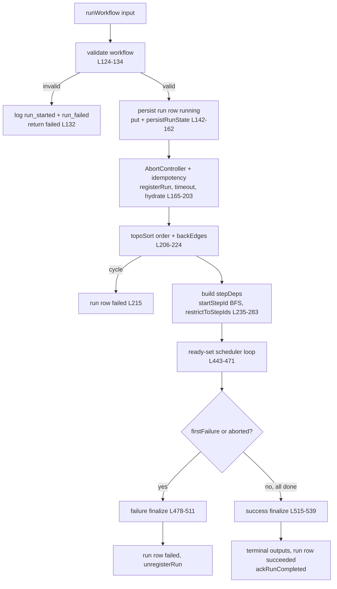
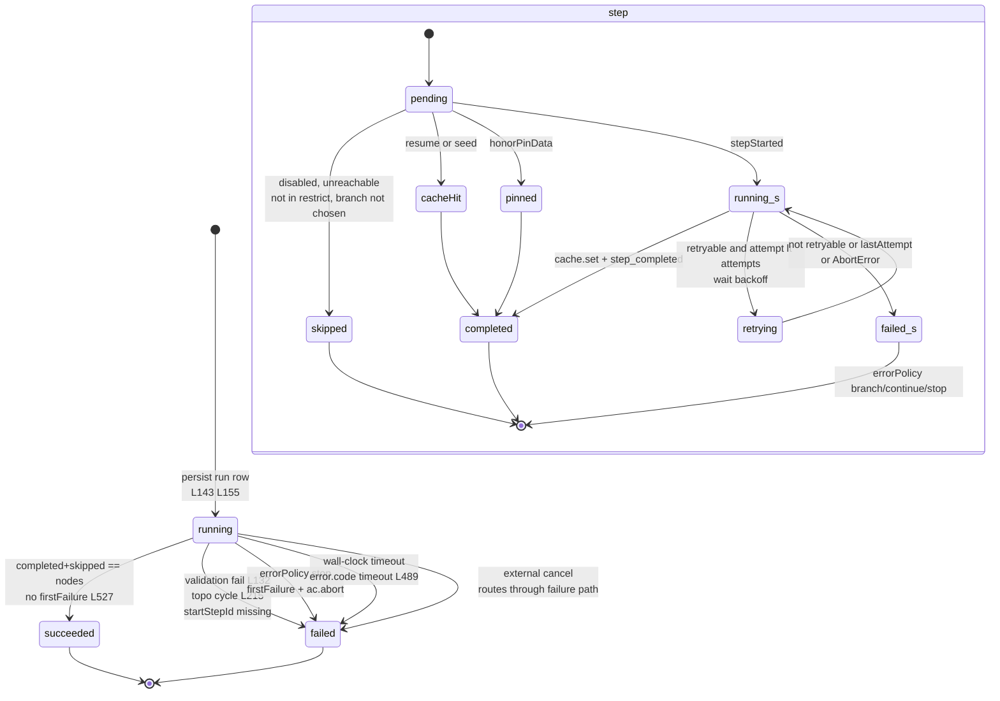
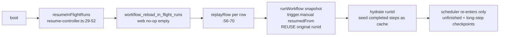

# Runtime execution engine

<Status variant="stable" />

<TLDR>
`lib/workflow/runtime/orchestrator.ts:118` `runWorkflow(input)` is the core: it validates, persists a `WorkflowRunRow` (`orchestrator.ts:142`), wires a single run-level `AbortController` plus wall-clock timeout (`orchestrator.ts:165-203`), topo-sorts the `VisualWorkflow` (`topo-sort.ts:23`), then runs a ready-set scheduler loop (`orchestrator.ts:443-471`) that respects an in-run `maxConcurrency` budget. Each step goes through `step-executor.ts:56` `runStep` with cache short-circuit, `resolveDeep` param resolution, a retry-with-backoff loop (`step-executor.ts:142-160`, attempts 3 / exponential / baseMs 1000 / maxMs 30000, no jitter), and per-step timeout (`step-executor.ts:186`). Every transition is appended to `workflowRunEvents` via `event-log.ts:21`, and `IdempotencyCache.hydrate(runId)` (`idempotency.ts:33`) replays only the completed steps of that run, so crash recovery (`resume-controller.ts:29`) re-runs the same `runId` and skips finished work. Trigger bridges and the Rust mirror live on [./triggers-rust](./triggers-rust); UI run views on [./ui-runs](./ui-runs).
</TLDR>

<Callout type="info" title="Formal execution authority">
CLI, API, MCP, trigger, IM, run-history, and dead-letter operations first pass through `execution-authority.ts`. It rejects unpublished workflows, pins an immutable version, deployment revision and dependency lock, creates a new invocation/run, and propagates trace, lineage, provenance, and Connector-origin PII policy. Editor Preview/Test remains the intentional draft-only exception. Approval, risk-gate, and event-wait pending state lives in the Dexie v156/SQLite durable waitpoint store, not in the event log.
</Callout>

<StatGrid>
- **Core** `runWorkflow` 579 lines, `orchestrator.ts:118-540`
- **Retry default** attempts 3 / exponential / baseMs 1000 / maxMs 30000, no jitter
- **maxConcurrency default** 1 (sequential preserved)
- **timeoutMs default** 600000 (0 disables)
- **errorPolicy default** `"stop"`
- **Event types** 9 + long-step checkpoint/progress
</StatGrid>

## Module map

| Module | Lines | Role |
| --- | --- | --- |
| `orchestrator.ts` | 579 | `runWorkflow` core: validate → persist → schedule → finalize |
| `execution-authority.ts` | — | Formal admission, immutable version/dependency lock, retry modes, provenance |
| `topo-sort.ts` | 145 | Deterministic Kahn topo-sort with back-edge removal |
| `step-executor.ts` | 228 | Per-step run: cache, params, retry/backoff, timeout |
| `event-log.ts` | 123 | `workflowRunEvents` append/list + `RunLogger` |
| `idempotency.ts` | 45 | In-memory memo keyed by `stepId`, run-scoped `hydrate` |
| `secret-resolver.ts` | 35 | `SecretResolver` iface + `NoopSecretResolver` (web default) |
| `secret-resolver-keyring.ts` | 49 | Keyring-backed resolver + `parseRef` |
| `concurrency-controller.ts` | 53 | Monotone non-increasing in-run node budget |
| `model-preference-controller.ts` | 55 | One-way model downshift, run-scoped |
| `long-step-runner.ts` | 265 | Checkpoint/progress long-running steps via event log |
| `waitpoint-repository.ts` / `db/workflow-waitpoints.ts` | — | Durable approval/risk/event waits, CAS decisions, persisted event matching |
| `run-single-node.ts` | 87 | Run one node + its ancestors (editor) |
| `run-cancel-registry.ts` | 46 | Module-singleton `runId → AbortController` |
| `error-explainer.ts` | 181 | Pure copilot validation / last-run explainers |
| `resume-controller.ts` | 71 | Boot-path replay of in-flight runs |
| `last-run-by-step.ts` / `last-run-summary.ts` | 52 / 139 | `useLiveQuery` editor badges |

## `runWorkflow` pipeline

```ts
// lib/workflow/runtime/orchestrator.ts:50-116
export interface RunWorkflowInput {
  workflow: VisualWorkflow
  trigger: WorkflowTriggerEvent
  runId?: string
  secretResolver?: SecretResolver
  signal?: AbortSignal
  startStepId?: string
  concurrency?: ConcurrencyController
  triggeredBy?: string
  honorPinData?: boolean
  seedOutputs?: Record<string, unknown>
  restrictToStepIds?: string[]
  traceId?: string
  lineage?: WorkflowRunLineage
  securityContext?: WorkflowRunSecurityContext
  executionBinding?: WorkflowExecutionBinding
}
// RunWorkflowResult — orchestrator.ts:111-116
```



### Phases

| Phase | Lines | What happens |
| --- | --- | --- |
| Validate | `orchestrator.ts:124-134` | On fail: log `run_started` + `run_failed`, fire plugin hooks, return `failed` |
| Persist run | `orchestrator.ts:142-162` | `WorkflowRunRow {status:"running", workflowSnapshot: validated}`, `put`, `persistRunState` Rust mirror, `logger.runStarted` |
| Abort + idempotency | `orchestrator.ts:165-203` | new `AbortController`; chain external `signal` (`:171-174`); wall-clock timeout from `settings.timeoutMs` (`:178-189`, 0 disables); `IdempotencyCache.hydrate(runId)` (`:190`); seed `seedOutputs` if absent (`:193-197`); `concurrency = input.concurrency ?? createConcurrencyController(settings.maxConcurrency ?? 1)` (`:202-203`) |
| Topo-sort | `orchestrator.ts:206-224` | `order` + `backEdgeIds`; throw → `failed` |
| Schedule | `orchestrator.ts:227-471` | dependency map, reachability skips, ready-set loop |
| Finalize | `orchestrator.ts:478-539` | success or failure terminal write |

## Scheduling and the ready-set loop

`stepDeps` is a forward-edge map with back-edges excluded (`orchestrator.ts:235-240`), so `flow.loop` / `flow.wait` cycles never deadlock. `startStepId` BFS forward-skips unreachable nodes (`:247-274`); `restrictToStepIds` skips non-allowed nodes (`:278-283`).

`isReady(stepId)` (`orchestrator.ts:307-317`) is true when the step is not completed/skipped/inflight, there is no `firstFailure`, and all deps are completed-or-skipped. The orchestrator polls `concurrency.get()` every tick (`:449`).

```ts
// lib/workflow/runtime/orchestrator.ts:443-471
while (completed.size + skipped.size < validated.nodes.length) {
  if (firstFailure) break
  if (ac.signal.aborted && inflight.size === 0) break
  let scheduledThisTick = 0
  for (const stepId of order) {
    if (inflight.size >= concurrency.get()) break
    if (!isReady(stepId)) continue
    const promise = scheduleOne(stepId).finally(() => { inflight.delete(stepId) })
    inflight.set(stepId, promise); scheduledThisTick += 1
  }
  if (inflight.size === 0) { if (scheduledThisTick === 0) break; await flushNewSkipLogs(); continue }
  await Promise.race(inflight.values()); await flushNewSkipLogs()
}
```

`scheduleOne(stepId)` (`orchestrator.ts:319-440`): disabled-node skip + propagate (`:325-331`); gather `upstreamMap` from `stepOutputs` then cache (`:334-342`); `runStep` (`:347-360`); on success record output / `lastCompletedStepId` / persist / hooks (`:361-384`); branch routing via `result.decision` skips non-chosen edge targets (`:388-397`); then `errorPolicy` handling — branch (`:407-420`) / continue (`:425-431`) / stop default sets `firstFailure` + `ac.abort` (`:433-438`).

### Branch skip and re-convergence

`isErrorEdge` (`orchestrator.ts:546-548`) is `sourceHandle === "error" || data.kind === "error"`. `propagateSkip` (`:555-571`) is a transitive BFS skip that **stops** when a downstream node still has a non-skipped parent, so branches can re-converge:

```ts
// lib/workflow/runtime/orchestrator.ts:560-566
const liveParents = edges.filter(e => e.target === id && e.source !== startId && !skipped.has(e.source))
if (liveParents.length > 0 && id !== startId) continue
skipped.add(id)
```

`computeTerminalNodes` (`orchestrator.ts:573-578`) selects nodes with no outgoing edges that are not `trigger.*`.

### Finalize

```ts
// success — lib/workflow/runtime/orchestrator.ts:515-539
// computeTerminalNodes -> collect terminalOutputs (skip skipped)
// finalOutput = single value if one terminal else object
// put run row succeeded -> logger.runCompleted -> persistRunState succeeded -> ackRunCompleted(runId)
```

```ts
// failure — lib/workflow/runtime/orchestrator.ts:478-511
// clears timeout; writes row failed
// error.code = wallClockExpired ? "timeout" : undefined   // :489
// persists, fires hooks, unregisterRun
```

## Deterministic topology

```ts
// lib/workflow/runtime/topo-sort.ts:14-21
export interface TopoSortResult { order: string[]; backEdges: string[] }
const BACK_EDGE_KINDS = new Set(["flow.loop", "flow.wait"])
```

An edge is a back-edge **iff** its TARGET is `flow.loop` / `flow.wait` AND `isReachable(target → source)` along non-back-edges (`topo-sort.ts:32-48`). `isReachable` is a DFS that excludes back-edge targets (`:100-128`). The Kahn core (`:63-91`) stable-sorts the queue by original node-array index every iteration, yielding deterministic traces. It throws `"Cycle detected after back-edge removal"` if `order.length != nodes.length`. Helpers: `downstream` (`:134-136`), `upstream` (`:142-144`).

## Per-step execution

`runStep(input)` (`step-executor.ts:56-162`): cache hit returns early (`:59-61`); pin-data short-circuit is editor-only (`:66-76`); a missing executor logs `step_failed{retryable:false}` and throws (`:78-86`); `resolveDeep` resolves params against `{upstream, trigger, staticData, params, variables}` (`:89-95`); `StepExecutionContext` is built (`:97-108`); then a `while(true)` retry loop (`:112-161`).

```ts
// lib/workflow/runtime/step-executor.ts:142-160
} catch (err) {
  const message = err instanceof Error ? err.message : String(err)
  const retryable = isRetryableError(err)
  const lastAttempt = attempt >= retryPolicy.attempts
  await logger.stepFailed(node.id, { message, retryable })
  if (!retryable || lastAttempt) { throw err instanceof Error ? err : new Error(message) }
  const delay = computeBackoffMs(retryPolicy, attempt)
  await logger.log("warn", `step ${node.id} failed (attempt ${attempt}/${retryPolicy.attempts}); retrying in ${delay}ms`, { error: message }, node.id)
  await wait(delay, signal)
}
```

```ts
// lib/workflow/runtime/step-executor.ts:176-184
function computeBackoffMs(policy, attempt) {
  const base = Math.max(0, policy.baseMs)
  if (policy.backoff === "fixed") return base
  const raw = base * Math.pow(2, attempt - 1)
  if (typeof policy.maxMs === "number") return Math.min(raw, policy.maxMs)
  return raw
}
```

`attempt` is 1-indexed and there is **no jitter** — delays are `base, base*2, base*4, ...`. `isRetryableError` (`step-executor.ts:164-174`) respects `err.retryable`, never retries `AbortError`, and defaults conservatively to retryable. `runWithTimeout` (`:186-212`) uses a per-step timeout of `reg.timeoutMs ?? workflow.settings.timeoutMs` (`<= 0` skips) with an inner `AbortController`. `wait` (`:214-227`) is abort-aware.

## Event log and `RunLogger`

```ts
// lib/workflow/runtime/event-log.ts:21-32
export async function appendEvent(input) {
  const row = { id: "evt_" + nanoid(10), runId: input.runId, ts: Date.now(), type: input.type, stepId: input.stepId, level: input.level, payload: input.payload }
  await getDb().workflowRunEvents.put(row); return row
}
```

`appendEvents` batches and bumps `ts` + `idx` to preserve order (`event-log.ts:36-50`); `listRunEvents` ranges over `[runId+ts]` (`:56-61`); `completedStepIds` filters `step_completed` over `[runId+stepId]` (`:67-74`). `createRunLogger(runId)` (`:79-120`) exposes `runStarted`, `runCompleted`, `runFailed(error{message,stack?,nodeId?})`, `runCancelled`, `stepStarted(stepId,params)`, `stepCompleted(stepId,output)`, `stepFailed(stepId,{message,retryable?})`, `stepSkipped(stepId,reason)`, `log(level,message,payload?,stepId?)`.

Event types: `run_started` | `run_completed` | `run_failed` | `run_cancelled` | `step_started` | `step_completed` | `step_failed` | `step_skipped` | `run_log` (+ long-step `checkpoint` / `progress`).

## Run and step state machine



Run-status writes: `running` at `orchestrator.ts:143` / `:155`; `succeeded` at `:527`; `failed` via validation (`:132`), topo cycle (`:215`), missing `startStepId`, `errorPolicy` stop, or wall-clock timeout (`error.code "timeout"`, `:489`). Cancellation surfaces as `failed` — a `run_cancelled` event exists, but an external abort routes through the failure finalize path.

## Crash recovery via replay + idempotency

```ts
// lib/workflow/runtime/idempotency.ts:33-43
static async hydrate(runId) {
  // reads listRunEvents; for each step_completed sets cache[stepId] = payload.output
}
```

`IdempotencyCache` is an in-memory `Map<stepId, output>` (`idempotency.ts`) with `has/get/set/clear`. The memo key is `stepId`; run scoping comes from `hydrate(runId)`, which reads only that run's `step_completed` events. A resumed run therefore replays nothing already completed.



`resumeInFlightRuns()` (`resume-controller.ts:29-52`) asks Rust `workflow_reload_in_flight_runs` (returns `[]` in web); each row carries the snapshot and replays via `runWorkflow({workflow: snapshot, trigger: {kind:"trigger.manual", payload:{resumedFrom: row.runId}}, runId: row.runId})` — reusing the original `runId` so `hydrate` skips completed steps (`replayRow` `:56-70`). A bad snapshot is skipped.

### Long-running steps

General `runLongStep` progress still rides `workflowRunEvents`. Human approval, workflow risk gates, and `flow.wait(event)` use the separate Dexie v156/SQLite durable waitpoint store so pending state, absolute deadlines, and first-writer-wins decisions survive renderer and process restarts.

```ts
// lib/workflow/runtime/long-step-runner.ts:139-148
try {
  await appendEvent({ runId: opts.runId, stepId: opts.stepId, type: "step.long_running.checkpoint", payload: { checkpointKey: opts.checkpointKey, state: next } })
} catch (err) { console.warn("runLongStep: checkpoint persistence failed", err) }
```

`LongStepCtx<S>` (`:37-46`) carries `state`, `checkpoint(next)`, `progress(msg,data)`, `signal`; `registerLongStepResumer` / `getLongStepResumer` (`:98-107`); `resumeLongStep` (`:222-245`); `findLatestCheckpoint` (`:251-264`).

## Concurrency, secrets, model preference

```ts
// lib/workflow/runtime/concurrency-controller.ts:13-19
export interface ConcurrencyController { get(): number; reduceTo(n: number): void; subscribe(fn): () => void }
```

`createConcurrencyController(initial)` (`concurrency-controller.ts:21-53`) is **monotone non-increasing** — `reduceTo(n)` is a no-op when `n >= current` (`:35`). Producers: `BudgetGuard` `reduce_concurrency` and the team synthesizer HITL gate. Two distinct knobs: `concurrency` (concurrent **runs**) vs `maxConcurrency` (in-run **nodes**); there is no global concurrency ceiling in the runtime.

Secrets: `SecretResolver` (`secret-resolver.ts:13-15`); `NoopSecretResolver` (`:22-24`) is the web / Phase-4 default and returns `undefined`; `createInMemoryResolver` (`:30-34`). The keyring resolver `createKeyringSecretResolver()` (`secret-resolver-keyring.ts:17-26`) reads from `@/lib/keyring`; `parseRef` (`:33-49`) accepts `keyring:ns:key` and `ns/key` shorthand, returning `null` (→ `undefined`) on non-match.

Model preference: `createModelPreferenceController` (`model-preference-controller.ts:26-54`) holds `{preferCheap, modelHint?}` and only `downshift()`s (no upshift, `:34-46`); it is run-scoped and read directly by AI node executors.

## Editor entry points

`runSingleNode(input)` (`run-single-node.ts:53-86`) builds `seedOutputs` from ancestors using pin then last-run, sets `restrictToStepIds = [nodeId, ...ancestors]`, `trigger.manual`, `honorPinData: true`. `ancestorsOf` (`:30-51`) is a BFS over incoming edges that deletes self (`:49`).

```ts
// lib/workflow/runtime/run-single-node.ts:53-85
// for each ancestor: pin[a] if present else latestOutputs[a]
// restrictToStepIds = [nodeId, ...ancestors]
// runWorkflow({ workflow, trigger, seedOutputs, restrictToStepIds, honorPinData: true, ... })
```

Contrast: `startStepId` runs target + ALL descendants; `runSingleNode` runs target + ancestors only (ancestors with data are seeded as cache-hits, ancestors without data execute).

`run-cancel-registry.ts` is a module-singleton `Map<runId, AbortController>`: `registerRun` (`:20`), `unregisterRun` (`:25`), `requestCancelRun(runId,reason?)` (`:34-40`, returns `false` when not live so the caller falls back to Dexie soft-cancel), `liveRunCount` (`:43-45`). Production caller: the Companion API `workflow_cancel_run` RPC.

`error-explainer.ts` is pure, powering copilot tools `wf_explain_validation` / `wf_explain_last_run`: `explainValidation` (`:62-93`), `explainLastRun` (`:100-137`, picks most-recent failed by `finishedAt`; status `no-run` | `succeeded` | `partial` | `failed`), `suggestionFor` (`:144-158`), `suggestionForRunError` (`:165-180`, matches `timeout` / `401` / `404` / `429`).

`last-run-by-step.ts` and `last-run-summary.ts` are `"use client"` Dexie `useLiveQuery` hooks for canvas badges: `useLastRunByStep` (`:21-52`) → `Map<stepId, ts>`; `deriveLastRunSummary(events)` (`:75-106`, sort by `ts`, latest-terminal-wins, `durationMs = finishedAt - startedAt`); `useLastRunSummaryByStep` (`:113-139`, aggregates across every run, older first so newer overwrites).

## Gotchas

- `maxConcurrency` default 1 keeps sequential execution; `concurrency` (runs) and `maxConcurrency` (in-run nodes) are distinct, and there is no global ceiling.
- `computeBackoffMs` is 1-indexed with **no jitter**.
- Subworkflow recursion depth cap (`MAX_SUBWORKFLOW_DEPTH` 10) lives in `built-ins.ts`, **not** the engine.
- One run-level `AbortController` chains to per-step inner `AbortController`s; the wall-clock `setTimeout` calls `ac.abort`.
- Cancellation is out-of-band via `run-cancel-registry` and manifests as `failed`.
- Secret resolver is a no-op in web (`Noop`); `tauri-bridge` persist/reload/ack are no-ops in web, so web crash recovery relies on the Dexie event log alone.
- Idempotency key is `stepId`, run-scoped by `hydrate(runId)`.
- Back-edges are excluded from `stepDeps` so loop/wait cycles don't deadlock; `propagateSkip` won't skip a node with a live parent (branch re-convergence); determinism comes from the stable topo-queue sort.

## See also

- [./index](./index) — subsystem overview
- [./node-system](./node-system) — node registry and executors
- [./triggers-rust](./triggers-rust) — trigger bridges and the Rust mirror
- [./data-model](./data-model) — `WorkflowRunRow`, `workflowRunEvents` schema
- [./ui-runs](./ui-runs) — run inspector and canvas badges
- [../../adr/0011-workflows-subsystem](../../adr/0011-workflows-subsystem) — ADR-0011
