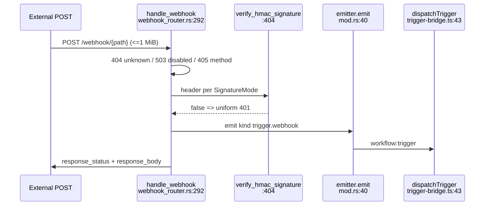
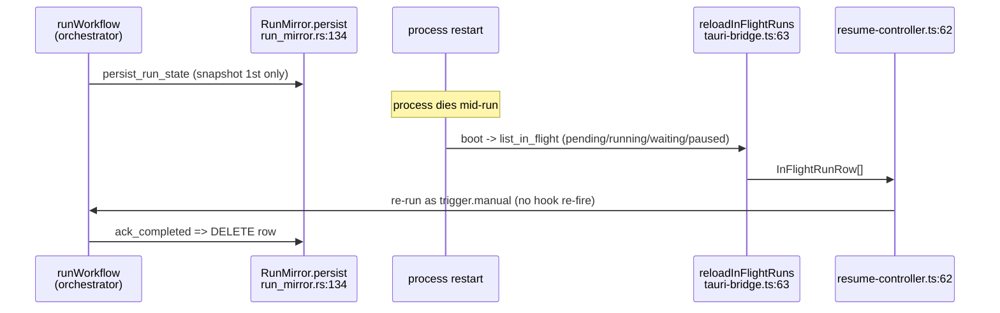

# Triggers & Rust backend

<Status variant="stable" />

<TLDR>
Rust owns two questions — "when does a workflow start" (cron daemon + axum webhook receiver) and "did this run survive a crash" (the SQLite run mirror) — while the TS orchestrator on [runtime-execution](./runtime-execution) owns step execution. Every trigger kind fans into ONE chokepoint, `dispatchTrigger(event)` at `lib/workflow/runtime/trigger-bridge.ts:43`, which resolves the Dexie workflow, fires the plugin hook, and calls `runWorkflow`. Cross-process firing rides the single `workflow:trigger` Tauri event emitted from `src-tauri/src/workflow/mod.rs:40` and received by `listenTriggerEvents` at `tauri-bridge.ts:90`. The whole Rust plane is desktop-only: web mode is a total no-op behind the `isTauri()` gate (`safeInvoke` returns null, `reloadInFlightRuns` returns `[]`, listeners no-op). The mirror (`run_mirror.rs`) is a thin shadow — the Dexie event log stays the canonical source of truth.
</TLDR>

## Trigger taxonomy

Five trigger kinds (plus `trigger.goal.completed`) split by who fires them. Rust fires the two that must run while the webview is closed (cron, webhook); TS fires the three that tap in-process event buses (connector inbound, chat message, goal completed); `trigger.manual` is TS-only.

| Kind | Fired by | Path & file:line |
| --- | --- | --- |
| `trigger.manual` | TS only | Run button; IM tap `start-from-im.ts:53` -> `runWorkflow`; resume `resume-controller.ts:62`. Rust register is a no-op at `commands.rs:83` |
| `trigger.cron` | Rust daemon | `cron_daemon.rs:229` `fire()` -> `AppHandleEmitter::emit` `mod.rs:40` -> `workflow:trigger` -> `tauri-bridge.ts:90` `listenTriggerEvents` -> `trigger-bridge.ts:43` `dispatchTrigger` -> `runWorkflow`. Register `commands.rs:27` `state.cron.upsert` |
| `trigger.webhook` (+`trigger.github.webhook`) | Rust axum | `webhook_router.rs:292` `handle_webhook` -> HMAC `L404` -> `state.emitter.emit` (`kind:"trigger.webhook"`) -> `mod.rs:40` -> `workflow:trigger` -> `trigger-bridge.ts:43`. Register `commands.rs:47` `state.webhook.upsert` |
| `trigger.connector.inbound` | TS hook | `ConnectorBus` -> `findMatchingWorkflows("trigger.connector.inbound")` -> `dispatchTrigger`. Rust no-op `commands.rs:83` |
| `trigger.chat.message` | TS hook | `lib/db/messages.ts` `findMatchingWorkflows("trigger.chat.message",{characterId,sessionId})` -> `dispatchTrigger` (lazy-imported to avoid memory spikes). Rust no-op |

`trigger.goal.completed` is also indexed (`trigger-subscriptions.ts:32`) and fired from goal completion-linkage in `lib/goal`.

## TS runtime bridges (lib/workflow/runtime/)

| File | Symbol:line | Role |
| --- | --- | --- |
| `trigger-bridge.ts` | `installTriggerBridge:21` | Mounts once on boot; wraps `listenTriggerEvents`, validates, calls `dispatchTrigger` |
| `trigger-bridge.ts` | `dispatchTrigger:43` | THE chokepoint — resolves Dexie workflow, fires plugin hook, calls orchestrator; ALL trigger kinds route here |
| `trigger-bridge.ts` | `isTriggerEvent:61` | Shape guard for inbound `workflow:trigger` payloads |
| `trigger-subscriptions.ts` | `INDEXED_KINDS:32` | In-memory index of TS-side trigger nodes; only `connector.inbound` / `chat.message` / `goal.completed` (cron/webhook EXCLUDED — Rust owns them) |
| `trigger-subscriptions.ts` | `rebuildIndex:45` / `initTriggerSubscriptions:66` | Rebuilt from a Dexie `liveQuery` over workflows; idempotent, window-guarded |
| `trigger-subscriptions.ts` | `findMatchingWorkflows:128` / `matches:137` | Synchronous cache read; required vs optional params, empty param = match any |
| `webhook-bridge.ts` | `syncWorkflowTriggers:35` / `syncOneTrigger:40` | Filters `n.type.startsWith("trigger.")`, eager-registers each (Rust handlers idempotent, no diff computed) |
| `tauri-bridge.ts` | `safeInvoke:34` + 6 commands `L46-81` | `persistRunState` / `registerTrigger` / `unregisterTrigger` / `reloadInFlightRuns` / `ackRunCompleted` / `getWebhookUrl` |
| `tauri-bridge.ts` | `listenTriggerEvents:90` / `listenResumeEvents:101` | Subscribe to `workflow:trigger` and `workflow:resume`; ALL no-op when `!isTauri()` |
| `wake-bus.ts` | `subscribeWake:49` / `emitWake:102` | In-process oneshot bus for `flow.wait(event)` steps, key `${runId}:${stepId}`; `emitWake` returns false if no subscriber (early events dropped) |
| `start-from-im.ts` | `startWorkflowFromIM:47` | Hydrates row, builds `trigger.manual` event, generates `runId` up front, fire-and-forget `void runWorkflow` |
| `run-status-bridge.ts` | `deriveRunStatusFromEvents:29` / `startRunStatusBridge:67` | Passive observer; tracks most-recent run via `[workflowId+startedAt]` (must match schema v22) |

```ts
// lib/workflow/runtime/trigger-bridge.ts:43
export async function dispatchTrigger(event: TriggerEvent): Promise<void> {
  const workflow = await getWorkflow(event.workflowId)
  if (!workflow) { console.warn(...); return }
  getPluginEventHooks().dispatchWorkflowTriggerFired(event.workflowId, event.kind, event.payload)
  await runWorkflow({ workflow, trigger: event })
}
```

`webhook-bridge.ts:40` maps node config into the Rust register shape: `cron` -> `{cron}`; `webhook` -> `{path,method,hmacSecret,responseStatus,responseTemplate}`; `connector` / `chat` / `manual` -> base fields only. `wake-bus` covers in-process waits; cross-process Rust->TS wakes ride the same `workflow:trigger` event. Note that **resume does NOT go through `dispatchTrigger`** — resumed runs use `trigger.manual` directly so the plugin trigger hook does not re-fire.

## Rust backend (src-tauri/src/workflow/)

| File | Symbol:line | Role |
| --- | --- | --- |
| `mod.rs` | `AppHandleEmitter:34` / `impl TriggerEmitter:38` | The single Rust->TS emit point: `Emitter::emit(&handle, "workflow:trigger", event)` |
| `state.rs` | `WorkflowState:14` / `open:25` | Holds `{mirror, cron, webhook}`; `open(mirror_path, emitter)` wires all three but does NOT spawn loops; `impl Drop:51` calls `webhook.stop()` |
| `types.rs` | `TRIGGER_KINDS:14` / `RunStatus:25` / `TriggerEvent:124` | camelCase serde DTOs; `RegisterTriggerInput:91`, `PersistRunStateInput:139` (snapshot only on first persist), `InFlightRunRow:156`, `WebhookTriggerPayload:172` |
| `commands.rs` | `workflow_register_trigger:21` | Dispatch `L26-85`: cron -> `state.cron.upsert`; webhook/github.webhook -> `WebhookEntry` + `state.webhook.upsert`; connector/chat/manual -> no-op Ok `L83`; else error |
| `commands.rs` | the other 5 commands `L91-134` | `unregister` (sweeps cron + webhook by id), `get_webhook_url`, `persist_run_state`, `reload_in_flight_runs`, `ack_completed` |
| `run_mirror.rs` | `RunMirror:47` / `persist:134` / `list_in_flight:192` / `ack_completed:231` | SQLite shadow; lazy `open:60`, `conn:96` does mkdir+DDL on first use; `default_mirror_path:269` = `<dir>/cognia/workflow-runs.sqlite` |
| `triggers/cron_daemon.rs` | `CronDaemon:110` / `upsert:127` / `spawn:177` / `fire:229` | In-process cron (`cron::Schedule`, 6-7 field with seconds), fires while the Tauri process runs regardless of webview |
| `triggers/webhook_router.rs` | `WebhookRouter:120` / `start:210` / `handle_webhook:292` / `verify_hmac_signature:404` | Local axum receiver, binds `127.0.0.1` only, 1 MiB body cap, HMAC-SHA256 |

Boot wiring (`lib.rs:872-903`): `default_mirror_path` -> `AppHandleEmitter` -> `WorkflowState::open` -> `cron.clone().spawn()` `L884` -> `async_runtime::spawn webhook.start(emitter, 0)` `L894-896` (port 0 = OS picks) -> `app.manage(state)`. Web mode never reaches this branch. `triggers/mod.rs:1` exposes only `cron_daemon` and `webhook_router` (connector-inbound + chat taps stay TS-side).

```rust
// src-tauri/src/workflow/mod.rs:38
impl TriggerEmitter for AppHandleEmitter {
    fn emit(&self, event: types::TriggerEvent) {
        if let Err(err) = tauri::Emitter::emit(&self.handle, "workflow:trigger", event) {
            log::warn!("workflow:trigger emit failed: {err}");
        }
    }
}
```

### Cron daemon — fire path

The cron daemon is distinct from `crate::scheduler` (OS-level): it is in-process and fires while the process runs (tray / minimized). `CronEntry:34` caches `next_fire_at`; `recompute:46` uses `schedule.after(&anchor).next()`; `next_fire:66` is the min over enabled entries; `due_ids:76` collects fireable ids. `spawn:177` must use `tauri::async_runtime::spawn` (a plain `tokio::spawn` panics in setup); `run_loop:186` sleeps until the next fire (floored to 25ms, capped at a 1h idle woken by `Notify`); `fire:229` emits `kind:"trigger.cron"` with payload `{triggerId, firedAt}`.

```rust
// src-tauri/src/workflow/triggers/cron_daemon.rs:66
fn next_fire(&self) -> Option<DateTime<Utc>> { self.entries.values().filter(|e| e.enabled).filter_map(|e| e.next_fire_at).min() }
// run_loop sleep: Some(t) => from_millis(((t - now).max(0)).max(25)), None => from_secs(3600)
// tokio::select! { _ = sleep(sleep_dur) => {} _ = self.notify.notified() => {} }
```

```mermaid
sequenceDiagram
  participant Loop as run_loop<br/>cron_daemon.rs:186
  participant Fire as fire()<br/>:229
  participant Emit as AppHandleEmitter<br/>mod.rs:40
  participant Listen as listenTriggerEvents<br/>tauri-bridge.ts:90
  participant Disp as dispatchTrigger<br/>trigger-bridge.ts:43
  Loop->>Loop: sleep until next_fire_at (floor 25ms)
  Loop->>Fire: due_ids(now)
  Fire->>Emit: emit kind trigger.cron
  Emit->>Listen: Tauri event workflow:trigger
  Listen->>Disp: validated TriggerEvent
  Disp->>Disp: getWorkflow + plugin hook + runWorkflow
```

### Webhook receiver — POST path

`start:210` binds `127.0.0.1`, routes `/webhook/{*path}` (any method) plus a 404 `/webhook/`, applies `RequestBodyLimitLayer`, and supports graceful shutdown via `stop:257`. `upsert:153` is path-keyed and rejects cross-trigger collisions; `bound_url_for_path:197` returns `http://{addr}/webhook/{path}` (knowable only after bind, via `workflow_get_webhook_url`). `handle_webhook:292` gates in order: 404 unknown -> 503 disabled -> 405 method -> 401 HMAC -> parse body -> emit `kind:"trigger.webhook"` -> respond with `response_status` / `response_body`. `SignatureMode:63` defaults `Cognia` (header `x-signature-256`) vs `github` (`x-hub-signature-256`); register defaults to github when the kind is github-flavored, else cognia.

```rust
// src-tauri/src/workflow/triggers/webhook_router.rs:404
fn verify_hmac_signature(secret, body, headers, mode) -> bool {
    let Some(raw) = headers.get(mode.header_name()) else { return false };
    let Ok(value) = raw.to_str() else { return false };
    let Some(hex_part) = value.strip_prefix("sha256=") else { return false };
    let Ok(provided) = decode_hex(hex_part) else { return false };
    let mut mac = match <Hmac<Sha256> as KeyInit>::new_from_slice(secret.as_bytes()) { Ok(m) => m, Err(_) => return false };
    mac.update(body);
    mac.verify_slice(&provided).is_ok()
}
```



### Crash recovery — run mirror + resume

The mirror is a thin shadow, not canonical — the Dexie event log is the source of truth. `open:60` is LAZY (registers the path, no disk touch); `conn:96` does `get_or_try_init` (mkdir, open, DDL) on first real use. `persist:134` preserves the existing snapshot/started_at (`INSERT ... ON CONFLICT(run_id) DO UPDATE`) so the snapshot is mandatory only on first persist. `list_in_flight:192` selects `status IN (pending/running/waiting/paused) ORDER BY started_at ASC`; `ack_completed:231` simply `DELETE`s the row. On boot, `reloadInFlightRuns` (`tauri-bridge.ts:63`) reads survivors and the resume controller re-runs them as `trigger.manual` (NOT through `dispatchTrigger`, so no hook re-fire).

```rust
// src-tauri/src/workflow/run_mirror.rs:111
CREATE TABLE IF NOT EXISTS workflow_run_mirror (
    run_id TEXT PRIMARY KEY, workflow_id TEXT NOT NULL, status TEXT NOT NULL,
    last_step_id TEXT, snapshot_json TEXT NOT NULL, started_at INTEGER NOT NULL, updated_at INTEGER NOT NULL
);
CREATE INDEX IF NOT EXISTS idx_run_mirror_status ON workflow_run_mirror(status);
CREATE INDEX IF NOT EXISTS idx_run_mirror_workflow ON workflow_run_mirror(workflow_id);
-- PRAGMA journal_mode=WAL; synchronous=NORMAL (L108-109)
```



## Gotchas

- **Web-mode total no-op** — `isTauri()` gate (`tauri-bridge.ts:21`): `safeInvoke` returns null, `reloadInFlightRuns` returns `[]`, listeners no-op. The entire Rust plane never boots.
- **Webhook desktop-only & ephemeral port** — binds `127.0.0.1:0`, so the URL is knowable only after bind via `workflow_get_webhook_url`.
- **HMAC specifics** — `sha256=` hex prefix, header per `SignatureMode`, constant-time `verify_slice`, uniform 401 on any failure; a github-mode trigger will NOT verify a cognia-mode signature and vice-versa.
- **Body cap 1 MiB** — `RequestBodyLimitLayer` rejects with 413 before the handler runs.
- **Mirror is a thin shadow** — Dexie event log is canonical; snapshot mandatory only on first persist; open is lazy; `ack_completed` deletes the row.
- **Resume bypasses the chokepoint** — uses `trigger.manual` and does NOT call `dispatchTrigger`, so the plugin trigger hook does not re-fire.
- **Cron daemon vs OS scheduler** — in-process, `cron` crate 6-7 field (seconds), `spawn` must use `tauri::async_runtime::spawn`, `next_fire_at` cached, sleep floored 25ms, 1h idle woken by `Notify`.
- **Index scope** — `trigger-subscriptions` indexes only `connector.inbound` / `chat.message` / `goal.completed`; `run-status-bridge` is locked to the `[workflowId+startedAt]` v22 index.

## See also

- [index](./index) · [runtime-execution](./runtime-execution) · [data-model](./data-model) · [ui-runs](./ui-runs)
- [../scheduler](../scheduler) (OS-level alarm daemon, distinct from the in-process cron daemon) · [../platform-connectors](../platform-connectors) (`ConnectorBus` inbound source)
- [ADR-0011 Workflows subsystem](../../adr/0011-workflows-subsystem)
