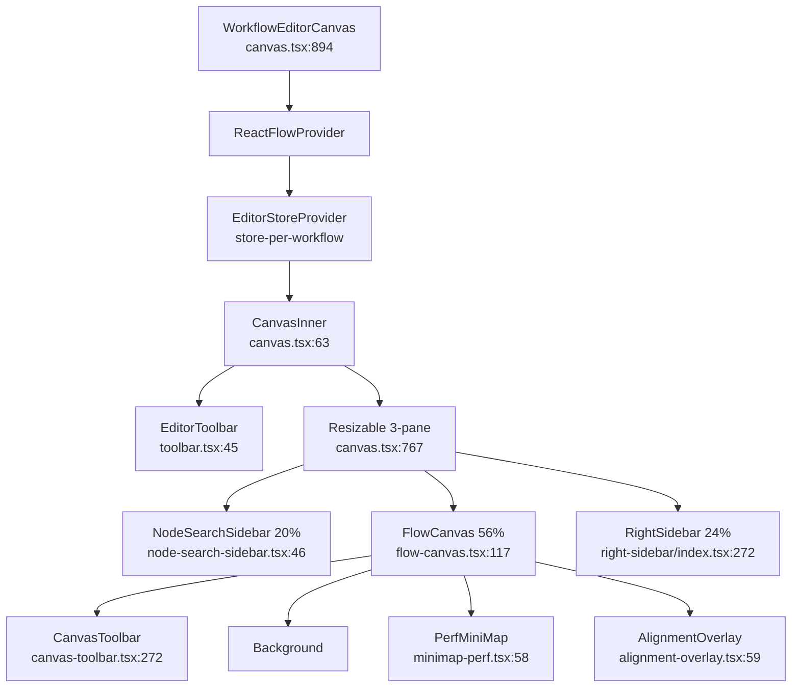
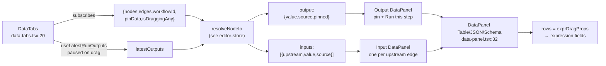
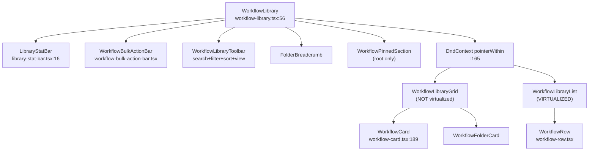
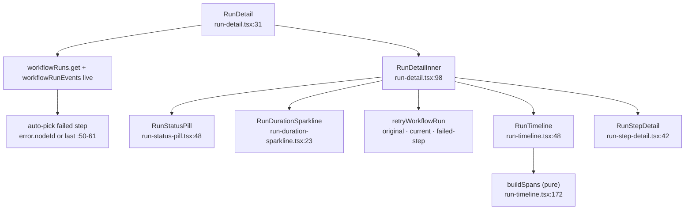
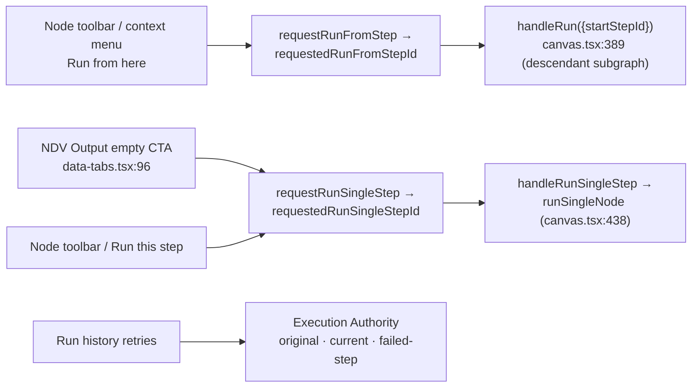

# UI, library & runs

<Status variant="stable" />

<TLDR>
Everything a user touches lives under `components/workflow/`: the 3-pane editor shell mounts a store-per-workflow at `canvas.tsx:894` wrapping `ReactFlowProvider` + `EditorStoreProvider`, with `FlowCanvas` (`flow-canvas.tsx:117`) as the **only** per-frame subscriber while chrome reads through `getState()`. Selection drives a Config/Input/Output NDV inspector (`inspector-panel.tsx:351` + `inspector/data/data-tabs.tsx:20`) whose tabs are fed by `resolveNodeIo` / `useLatestRunOutputs`, and a 6-tab right sidebar (`right-sidebar/index.tsx:272`) that auto-switches to the inspector on selection. The folder-aware library (`workflow-library.tsx:56`) layers `filterWorkflows`/`sortWorkflows`, `@dnd-kit` folder DnD, virtualized list rows, and a self-hiding stat bar. Run history renders a Gantt plus provenance, lineage, immutable version/deployment metadata, and three authority-backed retry actions. Routes live in `app/workflows/` and ship a static-export `[id]` stub via `generateStaticParams [{id:"_"}]`.
</TLDR>

Pure store/geometry helpers (`createEditorStore`, alignment math, `resolveNodeIo`, `flattenSchema`) are documented on [./editor-store](./editor-store) — this page references them and never re-derives. For node semantics see [./node-system](./node-system), for the copilot/expression panes see [./expressions-copilot](./expressions-copilot), for execution internals see [./runtime-execution](./runtime-execution), and for schemas see [./data-model](./data-model). Authority: [../../adr/0034-workflow-editor-completeness-and-plugin-parity](../../adr/0034-workflow-editor-completeness-and-plugin-parity).

<StatGrid>
- **3** panes (NodeSearchSidebar 20% / FlowCanvas 56% / RightSidebar 24%)
- **6** right-sidebar tabs (chat / inspector / runs / templates / settings / changelog)
- **6** run actions: three draft editor actions plus original-version, current-deployment, and failed-step retries
- **~70** per-kind config components in the NDV registry
</StatGrid>

## Editor shell

The canvas owns a **store-per-workflow lifecycle**: `WorkflowEditorCanvas` (`canvas.tsx:894`, props `canvas.tsx:889`) lazily builds an `EditorStore` in `useState`, resets it at render time when `workflow.id` changes, and wraps `ReactFlowProvider` + `EditorStoreProvider` (`canvas.tsx:894-913`). `CanvasInner` (`canvas.tsx:63`) reads a chrome slice (`canvas.tsx:76-100`) that does **not** subscribe to nodes/edges — only `nodeCount` + viewport — so re-renders of the shell stay cheap.

| Region | Component | Line | Purpose |
| --- | --- | --- | --- |
| Shell entry | `WorkflowEditorCanvas` | `canvas.tsx:894` | store-per-workflow + providers |
| Inner | `CanvasInner` | `canvas.tsx:63` | chrome slice, run effects, drop, keys |
| Layout | 3-pane `ResizablePrimitive.Group` | `canvas.tsx:767-848` | search 20% / canvas 56% / right 24% |
| Top bar | `EditorToolbar` | `toolbar.tsx:45` | name, dirty pill, overflow menu, Save, Run |
| Floating | `CanvasToolbar` | `canvas-toolbar.tsx:272` | add-node, zoom, lock, auto-layout |
| Canvas | `FlowCanvas` | `flow-canvas.tsx:117` | the sole per-frame subscriber |



### The single per-frame subscriber

`FlowCanvas` (`flow-canvas.tsx:117`) is the only component subscribing per frame: `{nodes, edges, viewport, isDraggingAny, snapToGrid}` (`flow-canvas.tsx:141-149`). `nodeTypes`/`edgeTypes` map `workflowNode` to `WorkflowNodeComponent` and `default`/`smart` to `SmartEdge` (`flow-canvas.tsx:75-82`). Every change handler reads the live store via `getState()` to avoid stale closures: `onNodesChange` / `onEdgesChange` / `onConnect` (validated via `validateConnection`, `flow-canvas.tsx:190`) at `flow-canvas.tsx:161-215`. Drag and alignment: `handleNodeDragStart` snapshots peer rects + `beginDragHistory` (`flow-canvas.tsx:260`), `handleNodeDrag` is rAF-throttled `computeAlignmentGuides` (`flow-canvas.tsx:296`), `handleNodeDragStop` calls `commitDragHistory` (`flow-canvas.tsx:322`). The `ReactFlow` element configures `panOnScroll` / `selectionOnDrag` / `deleteKeyCode` / `multiSelectionKeyCode` (`flow-canvas.tsx:362`), is wrapped in a `PerfBoundary` (`flow-canvas.tsx:361`), and applies tier culling via `onlyRenderVisibleElements` when `nodes.length >= cullingThreshold || tier !== "high"` (`flow-canvas.tsx:400-402`).

### Drop, keyboard & run effects

The drop handler (`canvas.tsx:669-683`) reads `event.dataTransfer.getData(NODE_DRAG_MIME)`, runs `screenToFlowPosition`, then `addNode` + `recordUsed`. Keyboard shortcuts cover `Ctrl+S/Z/Y/K/F` plus clipboard `A/C/X/V/D/G` (`canvas.tsx:553-660`). Run wiring: `handleRun` (`canvas.tsx:315`, optional `startStepId`) and `handleRunSingleStep` (`canvas.tsx:401`, via `runSingleNode`) both block on `revalidateAll` issues (`canvas.tsx:320-327`); store-driven request effects are `requestedRunFromStepId` (`canvas.tsx:389`) and `requestedRunSingleStepId` (`canvas.tsx:438`).

### Node & edge rendering

`WorkflowNodeComponent` (memo, `nodes/workflow-node.tsx:155`) uses fine-grained `useNodeDecoration(id)` (`nodes/workflow-node.tsx:173`) so a node only re-renders on its own status. It hosts `StatusCornerBadge` (`nodes/workflow-node.tsx:78`), `LastRunFooter` (`nodes/workflow-node.tsx:113`), an AI-authored badge (`nodes/workflow-node.tsx:306`), target/source handles (`nodes/workflow-node.tsx:349` / `397`), an error-branch handle when `errorPolicy === "branch"` (`nodes/workflow-node.tsx:257` + `402-419`), a connection-state ring (`nodes/workflow-node.tsx:241-253`), a sticky-note color override (`nodes/workflow-node.tsx:268`), and a `NodeFloatingToolbar` (`nodes/workflow-node.tsx:316`). The floating toolbar (`nodes/node-floating-toolbar.tsx:43`) has 5 ghost buttons — Run (disabled for trigger/annotation, `nodes/node-floating-toolbar.tsx:82`, fires `requestRunFromStep`), Copy, Configure (`setSelectedNodes`), Delete, More (`requestContextMenu`, `nodes/node-floating-toolbar.tsx:162-166`) — with motion gated (`nodes/node-floating-toolbar.tsx:69-72`). `SmartEdge` (memo, `edges/smart-edge.tsx:56`) routes via `computeSmartRoute` (`edges/smart-edge.tsx:98`), shows a then/else/true/false/error kind chip (error inferred from `sourceHandleId === "error"`, `edges/smart-edge.tsx:114-119`), supports inline double-click label edit (`edges/smart-edge.tsx:193-222`), subscribes only to the node **count** primitive (`edges/smart-edge.tsx:90-93`), and strips dashed animation at reduced tier (`edges/smart-edge.tsx:130-140`).

### Discovery & overlays

`NodeSearchSidebar` (memo, `node-search-sidebar.tsx:46`) is the palette and drag source. The canonical drag MIME is `NODE_DRAG_MIME = "application/x-workflow-kind"` (`node-search-sidebar.tsx:34`); the plugin catalog flows through `useSyncExternalStore` (`node-search-sidebar.tsx:68`), grouped vs searched (`node-search-sidebar.tsx:73-82`), with favorites/recent from `usePalettePreferencesStore` intersected against live catalog kinds (`node-search-sidebar.tsx:88-111`, `PinnedNodeGroup` `:227`). `NodeChip` (`node-search-sidebar.tsx:269`) sets both MIMEs on drag start (`node-search-sidebar.tsx:285-287`), toggles favorites (`node-search-sidebar.tsx:316-331`), and shows a `desktopOnly` badge (`node-search-sidebar.tsx:304`).

```tsx
// node-search-sidebar.tsx:285
e.dataTransfer.setData(NODE_DRAG_MIME, entry.kind);
e.dataTransfer.setData("text/plain", entry.kind);
```

| Overlay | Component | Line | Role |
| --- | --- | --- | --- |
| Command palette | `CommandPalette` | `command-palette.tsx:59` | Cmd-K: actions `:107-195`, add-node `:199-224`, recent (5) `:226-245` |
| Canvas search | `SpotlightSearch` | `spotlight-search.tsx:37` | Ctrl-F: filter `:104`, pan + pulse `:121`, caps 200 `:81` |
| MiniMap | `PerfMiniMap` | `minimap-perf.tsx:58` | degraded strips pan/zoom + flat color |
| Perf tier | `PerformanceTierFields` | `performance-tier-popover.tsx:33` | auto/high/balanced/reduced; resolved tier `:65` |
| Selection | `SelectionToolbar` | `selection-toolbar.tsx:181` | only subscriber to `selectedNodeIds` `:187`; align/distribute `:213-218` |
| Context menu | `CanvasContextMenu` | `canvas-context-menu.tsx:52` | pane/node/edge; run gated by category `:198`; reverse validated `:278` |
| Bookmarks | `ViewportBookmarksContent` | `viewport-bookmarks.tsx:48` | Dexie list/save/delete + `useLiveQuery` |
| Breadcrumb | `ViewportBreadcrumb` | `viewport-breadcrumb.tsx:80` | name + active-group crumb, rAF-throttled `:86-96` |
| Lasso | `LassoOverlay` | `lasso-overlay.tsx:33` | Alt+drag polygon, `nodeIdsInPolygon` `:95`, `ViewportPortal` `:134` |
| Alignment | `AlignmentOverlay` | `alignment-overlay.tsx:59` | dashed SVG guides in `ViewportPortal` |
| Connection | `ConnectionPointerListener` | `connection-overlay.tsx:82` | `SNAP_DISTANCE_SCREEN` 32 `:28` + ghost factory `:161` |
| Cheatsheet | `ShortcutsCheatsheet` | `shortcuts-cheatsheet.tsx:72` | shortcut reference |

## Inspector (NDV)

`InspectorPanel` (memo, `inspector-panel.tsx:351`) is the Node Detail View. Selectors resolve `selectedId`, `isMultiSelect`, and `{node, validation}` through a WeakMap `getNodeIndex` (`inspector-panel.tsx:120-139`); a multi-selection routes to `BulkNodeInspector` (`inspector-panel.tsx:207`). The per-kind form is dispatched by `NodeConfigFormSection` (memo, `inspector-panel.tsx:48`) calling `getNodeConfigComponentForEntry({kind, paramsSchema})` (`inspector-panel.tsx:59`); shared label/notes/disabled fields render at `inspector-panel.tsx:279-305`, wrapped in `FieldErrorProvider` + `InspectorExpressionProvider` (`inspector-panel.tsx:307-316`). Revalidation is debounced 150ms (`inspector-panel.tsx:73`) and flushed on selection change (`inspector-panel.tsx:157-165`); an error badge cycles `[data-invalid="true"]` via `jumpToNextError` (`inspector-panel.tsx:189-205`). The panel hosts `DataTabs` wrapping the config children (`inspector-panel.tsx:277`).

### The config dispatcher

`getNodeConfigComponentForEntry` (`inspector/node-config-registry.tsx:198`) is the canonical dispatcher: a built-in `REGISTRY` (`Partial<Record<WorkflowNodeKind, NodeConfigComponent>>`, ~70 mappings, `inspector/node-config-registry.tsx:97`) wins first; else a `paramsSchema` drives `SchemaForm` (`inspector/node-config-registry.tsx:205`); else `GenericJsonConfig`. `getNodeConfigComponent(kind)` (`:188`) and `hasDedicatedConfig` (`:215`) are the lookup helpers.

```ts
// node-config-registry.tsx:201
const builtIn = REGISTRY[entry.kind];
if (entry.paramsSchema) {
  // ... SchemaForm ...
}
```

### NDV data tabs (Config / Input / Output)

`DataTabs` (`inspector/data/data-tabs.tsx:20`) is a Config/Input/Output `ToggleGroup` (`:65`). It subscribes `{nodes, edges, workflowId, pinData, isDraggingAny}` (`:32`) and calls `resolveNodeIo` (`:51`) with `latestOutputs = useLatestRunOutputs(workflowId, !isDraggingAny, {anyStatus: true})` (`:49`) — so live-output reads pause during drag. **Config** renders `children`; **Output** is a single `DataPanel` with pin + `onRunStep` (`:86`); **Input** renders one `DataPanel` per upstream edge (`:100-121`).



`DataPanel` (`inspector/data/data-panel.tsx:32`) offers a Table/JSON/Schema `ToggleGroup` (`:97`), an array-item navigator (`:122-148`), an empty state when `source === "none"` with a **Run this step** CTA (`:59-74`), a pin badge (`:114`), and pin/unpin/edit-fixture (`:82`). `DataTableView` (`data-table-view.tsx:15`) rows (`FieldRow` `:66`) are drag sources via `exprDragProps` that insert an expression ref; `DataSchemaView` (`data-schema-view.tsx:15`) renders `flattenSchema` paths whose rows are likewise draggable (`:36`). `source` is one of `pin | run | none`.

### Forms, edges & bulk

`inspector/forms/index.tsx` (2538 lines) holds ~70 co-located per-kind config components (e.g. `ManualTriggerConfig` `:54`, `CronConfig` `:60`). `inspector/forms/shared.tsx` provides `Field` (stamps `data-invalid`, `:53`/`:81`), `FieldErrorProvider`/`useFieldError`/`useTranslatedError` (`:16`/`:36`), coercers `readString`/`readNumber`/`readBoolean` (`:115-134`), and `patchParam` (`:140`). `inspector/forms/schema-form.tsx` turns JSON-Schema into a form for plugin nodes — `SchemaForm` (`:521`), `StringField` (`:99`, enum→Select, format expression/textarea/password/url/email), `NumberField` (`:217`), `BooleanField` (`:262`), `StringArrayField` (`:295`), `JsonFallbackField` (`:350`), `ObjectFields` (`:400`, recurses + seeds defaults `:412-426`). The expression-field and other shared widgets live under `inspector/forms/shared/*` (expression-field documented on [./expressions-copilot](./expressions-copilot)).

`EdgeInspector` (memo, `edge-inspector.tsx:264`) edits label + kind (`EDGE_KINDS` `:40`), reverse, and delete. It performs a **dual-field write** — top-level `label` + `data.label`, and `data.kind` + `data.workflowKind` (`edge-inspector.tsx:9-15`) — so live-render and save both survive; `setLabel` (`:95`), `setKind` (`:108`), multi-edge bulk delete (`:133`). `BulkNodeInspector` (memo, `bulk-node-inspector.tsx:196`) is cross-kind-safe only: tri-state disabled (`:55-68`) + notes apply/clear via `updateNodeDataBatch` (single undo, `:70`); params are **not** bulk-editable by design, and bulk delete is `AlertDialog`-confirmed (`:149`).

## Right sidebar

`RightSidebar` (memo, `right-sidebar/index.tsx:272`) is a 6-tab `Tabs` grid (`:139`, `grid-cols-6`): chat | inspector | runs | templates | settings | changelog (`:56`). Non-inspector tabs are lazy (`:40-54`); default is chat (`:70`); it auto-switches to inspector on a `0 -> >=1` selection unless chat is pinned (`:73` / `:99-105`). Chat is `forceMount` with an Activity overlay (`:162-188`), and the inspector tab renders `EdgeInspector` when only edges are selected, else `InspectorPanel` (`:189-195`).

| Tab | Component | Line | What it shows |
| --- | --- | --- | --- |
| runs | `RunsTab` | `right-sidebar/runs-tab.tsx:35` | rail executions; `RunListRail` `:50` → `RunDetailRail` `:121` (auto-picks failed/last `:145`); reveal-on-canvas `:159` |
| settings | `SettingsTab` | `right-sidebar/settings-tab.tsx:37` | envelope mutators; run policy / retry / timezone / variables / credentials / plugins / fan-out |
| changelog | `ChangelogTab` | `right-sidebar/changelog-tab.tsx:43` | proposal apply/discard timeline from `workflowProposalHistory` (`:56-72`) |
| templates | `TemplatesTab` | `right-sidebar/templates-tab.tsx:51` | copilot scaffolds → `materializeCopilotTemplate` → `templateToProposalOps` |

`SettingsTab` edits through store envelope mutators `setSettings`/`setVariables`/`setCredentials` (Ctrl+S persists), with sections for `errorPolicy` stop/continue/branch (`:70`), timeout `DurationField`, concurrency/`maxConcurrency`, retry attempts/backoff/baseMs/maxMs, timezone `TimezoneSelect`, `WorkflowVariablesEditor`, `WorkflowCredentialsList`, `PluginCapabilitiesSection`, and `FanoutSubscriptionsPanel`. Supporting widgets: `PluginCapabilitiesSection` (`right-sidebar/settings/plugin-capabilities-section.tsx:40`, read-only plugin nodes/triggers + plugin templates with warning chips + Use), `WorkflowCredentialsList` (`workflow-credentials-list.tsx`), and `WorkflowVariablesEditor` (`workflow-variables-editor.tsx:43`, `KEY_RE = /^[A-Za-z_][A-Za-z0-9_]*$/` `:19`, inline duplicate/invalid errors).

## Library

`WorkflowLibrary` (`workflow-library.tsx:56`) is the page orchestrator. UI state comes from `useWorkflowLibraryStore` (`currentFolderId`/`viewMode`/`sort`/`filters`/`query`, `:58-64`); live data uses the folder-scoped `listChildFolders`/`getFolderPath`/`listWorkflowsInFolder` plus `getRecentlyFailedWorkflowIds`/`getRunCounts` (`:66-87`) — folder scoping is the main perf lever. The visible set is `filterWorkflows` + `sortWorkflows` (`:89`). Folder drag-and-drop is `@dnd-kit/core` `DndContext` with `pointerWithin` (`:165`); `handleDragEnd` reads `over.folderId`, runs `resolveDragMoveIds`, then `moveWorkflowsToFolder` (`:140-153`), with a `DragOverlay` (`:209`). The create-dialog is driven by `useUIStore.pendingCreateRequest` (`:114-122`).



| Concern | Component | Line | Notes |
| --- | --- | --- | --- |
| Grid | `WorkflowLibraryGrid` | `workflow-library-grid.tsx:23` | folders + workflows grids; **not** virtualized |
| List | `WorkflowLibraryList` | `workflow-library-list.tsx:29` | virtualized via `@tanstack/react-virtual` `:41`, row 64 `:18`, overscan 8 |
| Card | `WorkflowCard` | `workflow-card.tsx:189` | checkbox, node/trigger/action/builtin/template/tag badges `:137-168`, pin |
| Stat bar | `LibraryStatBar` | `library-stat-bar.tsx:16` | 4 cards runs7d/successRate/active/failedToday; self-hides when zero `:36-43` |
| Toolbar | toolbar | `workflow-library-toolbar.tsx` | search 200ms debounced + filter + sort + view + new-folder/new |
| Filter | filter bar | `workflow-filter-bar.tsx` | type all/user/template/builtin + hasTrigger/recentlyFailed |
| Sort | sort menu | `workflow-sort-menu.tsx` | nameAsc/nameDesc/updated/created/runCount |
| Pinned | `WorkflowPinnedSection` | `workflow-pinned-section.tsx` | root-only from `settings.pinnedWorkflowIds` |

Only the **list** view is virtualized; the grid relies on the folder-scoped Dexie query for bounded result sets.

### Folders, bulk & fan-out

The folder system pairs `@dnd-kit` draggables/droppables: `workflow-draggable.tsx:18` uses `useDraggable` data `{type:"workflow", workflowId}`; `workflow-folder-droppable.tsx:23` uses `useDroppable` id `folder-drop-${id}` data `{type:"folder", folderId}`. Folder cards/rows (`workflow-folder-card.tsx` / `workflow-folder-row.tsx`) call `enterFolder`; `workflow-folder-menu.tsx` renames and deletes via `deleteFolder(id, "reparent")` so contents move to the parent (`:46`); plus breadcrumb (`workflow-folder-breadcrumb.tsx`) and create/move dialogs.

Bulk operations: `WorkflowBulkActionBar` (`workflow-bulk-action-bar.tsx`) sticks when `selection.size > 0` (Move/Tag/Delete/Clear) with `workflow-bulk-tag-dialog.tsx` for tags. `FanoutSubscriptionsPanel` (`fanout-subscriptions-panel.tsx:50`) mirrors per-workflow run progress to IM channels — an adapter picker + `conversationKey` + enable + delete via `createFanoutSubscription`/`setSubscriptionEnabled`/`deleteFanoutSubscription` over live `workflowFanoutSubscriptions`, read on the **next** run start.

The backend name→id resolver `lib/workflow/library/lookup.ts` is distinct from the UI store: `findWorkflowByName` (`:47`, exact → substring → ambiguous, `MAX_CANDIDATES` 5 `:34`) and `listWorkflowSummaries` (`:84`) are pure Dexie callable from plugin executors and the IM bus.

## Runs

Run history is a Gantt timeline built from the durable event log. `RunTimeline` (`run-timeline.tsx:48`) renders bars; the pure `buildSpans` (`run-timeline.tsx:172`) rolls per-event logs into one `StepSpan` per `stepId`: first `step_started` wins (a retry bumps `attemptCount`, `:177-191`), `step_completed → succeeded` (`:192`), `step_failed → failed` (`:195`), `step_skipped` (`:198-211`), sorted by `startTs` (`:214`), with running steps using `fallbackEnd` = latest event ts (`:67-72`). Bars are positioned proportionally `left = (startTs - startedAt) / total * 100` with a 0.5% min-width clamp (`:92-94`), per-category colors (`:20-38`), click → `onSelectStep`, attempt counter `xN` (`:154`).

```ts
// run-timeline.tsx:172
export function buildSpans(events, fallbackEnd): StepSpan[] {
  // retry collapses into one bar via existing.attemptCount += 1 (line 180)
}
```



| Component | Line | Purpose |
| --- | --- | --- |
| `RunDetail` | `run-detail.tsx:31` | joins run + events live; auto-picks failed/last step `:50-61` |
| `RunDetailInner` | `run-detail.tsx` | status, trigger/caller, version/deployment/revision, trace, parent/child/retry navigation |
| `retryWorkflowRun` | `execution-authority.ts` | creates a new invocation from the original version, current production, or failed step |
| `RunStepDetail` | `run-step-detail.tsx:42` | params from `step_started.payload.params`, output from `step_completed`, error+stack `:163` retryable `:175`, filterable logs `:202-210` |
| `RunList` | `run-list.tsx:28` | full-page table, live `[workflowId+startedAt]` reversed |
| `RunStatusPill` | `run-status-pill.tsx:48` | `STATUS_META` `:17` maps 7 statuses → color+icon; running spins |
| `RunDurationSparkline` | `run-duration-sparkline.tsx:23` | last 20 runs recharts; hidden when `<2`, `MAX_RUNS` 20 `:21` |

`RunStepDetail` reads **only** the durable event log — resolved params, output, error message + collapsible stack, skip reason, and filterable `run_log` logs (level multi-toggle `:210` + search `:202`), with duration math at `:57-83`.

### Run entry points



- **Run from here** → node toolbar / context-menu → `requestRunFromStep`/`requestedRunFromStepId` → `handleRun({startStepId})` (`canvas.tsx:389`, scoped to the descendant subgraph).
- **Run this step** → `requestRunSingleStep`/`requestedRunSingleStepId` → `handleRunSingleStep` → `runSingleNode` (`canvas.tsx:438`); the NDV Output empty-state CTA also fires `requestRunSingleStep` (`data-tabs.tsx:96`).
- **Original version** → starts from the original immutable version and dependency lock.
- **Current deployment** → resolves the active production deployment at admission time.
- **Failed step** → uses the original immutable version, seeds completed outputs, skips their side effects, and resumes at the selected/failed step.

Every retry creates a new run and invocation with `retryOfRunId`, `retryMode`, and operator identity. Legacy draft runs without an immutable binding remain inspectable but cannot masquerade as formal retries.

## Routes & settings

| Route | File | Line | Behavior |
| --- | --- | --- | --- |
| `/workflows` | `app/workflows/page.tsx` | 26 | `WorkflowLibrary` (desktop) or `WorkflowList` (mobile via `usePlatform`) |
| `/workflows/[id]` | `app/workflows/[id]/page.tsx` | 26 | server stub `generateStaticParams [{id:"_"}]` for `output:"export"` `:16` |
| editor client | `page-client.tsx` | 27 | `getWorkflow(id)`, `notFound` on null, Mobile or `WorkflowEditorCanvas` `data-bg-target="canvas"` `:66` |
| runs / run detail | `runs/page.tsx`, `runs/[runId]/page.tsx` | — | `RunList`/`RunDetail` (+ mobile variants) |

Because the app is statically exported, `[id]` ships a single stub HTML; real ids resolve through SPA client routing at runtime.

The settings shell `components/settings/workflows/workflows-section.tsx:41` is a 5-tab shell keyed by `?wfTab=` (`:31`): library / runs / templates / defaults / audit, where the library tab embeds `WorkflowLibrary`. **Known i18n deviation:** this section's strings are hard-coded English (`:59-88`) — every other surface on this page is fully `next-intl`-wired.

## Gotchas

- **Perf-tier gating in the UI** — tier flags drive minimap availability, alignment guides, edge animations, and the `onlyRenderVisibleElements` culling threshold (`flow-canvas.tsx:400-402`).
- **Only the library list is virtualized** — the grid relies on the folder-scoped Dexie query (`workflow-library.tsx:66-87`) for bounded result sets.
- **`FlowCanvas` is the sole per-frame subscriber** — chrome reads via `getState()`, node/edge/breadcrumb subscribe only to the `nodes.length` primitive.
- **i18n fully wired except** `settings/workflows-section.tsx` (hard-coded English `:59-88`).
- **Static-export ships stub `[id]` HTML** — `generateStaticParams [{id:"_"}]`; real ids via SPA client routing.
- **Edge dual-field write** — top-level + `data.*` for both save survival and live render (`edge-inspector.tsx:9-15`).
