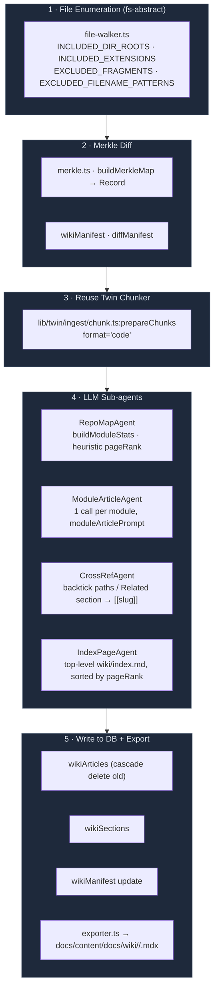

# Wiki Generator

<Status variant="stable">Phase 1 implemented · cognia-self scope</Status>

<TLDR>
  `lib/wiki/` is the "content producer" for External Bridge — it walks through
  Cognia's own `lib/` `app/` `components/` `hooks/` `types/` directories and
  outputs one Markdown article per module into `wikiArticles` + `wikiSections`.
  The pipeline has four steps: FileWalker filtering → `buildMerkleMap` SHA-256
  → `diffManifest` to compute added/changed/removed → reuse the
  [Twin chunker](./employee-twin) to split code → run four LLM sub-agents
  (RepoMap for pageRank, ModuleArticle one call per module, CrossRef to insert
  `[[slug]]` links in prose, IndexPage to write the top-level navigation) →
  write to database. Incrementality is the default: unchanged files are skipped;
  `force=true` does a full rebuild. Not available in web mode — requires real
  filesystem access.
</TLDR>

## When to Use

- Provide a retrieval data source for [External Bridge](./external-bridge)'s `wiki_search` / `wiki_read` / `rag_search`.
- Export the wiki into Fumadocs-compatible MDX files (`docs/content/docs/wiki/<scope>/<slug>.mdx`) and publish them via the docs subsite.
- Provide "module overview" for Cognia's internal UI — wiki articles can be referenced from settings pages or chat.
- Future extension (Phase 3): index user external repositories through the same pipeline, scope=`user-repo`.

## When NOT to Use

- Web mode — uses Tauri `plugin-fs`; browsers don't have real filesystem access.
- Function-level detail (per-function JSDoc) — the pipeline produces module-level summaries, not Doxygen-style API references.
- Real-time generation — one full rebuild of ~150K LOC × 8K input / 2K output tokens × N modules costs an estimated $5-15. The Settings UI defaults to incremental.

## Architecture



## Key Modules and File Paths

<Files>
  <Folder name="lib/wiki/" defaultOpen>
    <File name="types.ts" />
    <File name="file-walker.ts" />
    <File name="merkle.ts" />
    <File name="prompts.ts" />
    <File name="orchestrator.ts" />
    <File name="exporter.ts" />
    <File name="rebuild-runner.ts" />
    <Folder name="agents/">
      <File name="repo-map-agent.ts" />
      <File name="module-article-agent.ts" />
      <File name="cross-ref-agent.ts" />
      <File name="index-page-agent.ts" />
    </Folder>
  </Folder>
  <Folder name="lib/db/">
    <File name="wiki-articles.ts" />
    <File name="wiki-sections.ts" />
    <File name="wiki-manifest.ts" />
  </Folder>
  <Folder name="components/settings/external-bridge/">
    <File name="wiki-rebuild-card.tsx" />
  </Folder>
</Files>

| File | Responsibility |
| ---- | -------------- |
| `types.ts` | Internal transit types: `CodeChunk` · `ModuleStat` · `ModuleArticleDraft` · `IndexPageDraft` |
| `file-walker.ts` | Pure function filtering; `shouldIncludeFile` / `bucketByModule` / `moduleForPath` / `moduleToSlug` |
| `merkle.ts` | SHA-256 incrementality; `hashContent` · `buildMerkleMap` · `refreshSubset` |
| `prompts.ts` | Three prompts: `WIKI_SYSTEM_VOICE` · `moduleArticlePrompt` · `indexPagePrompt` |
| `orchestrator.ts` | `rebuildWiki(deps, opts)` — 10-step pipeline, single entry point |
| `exporter.ts` | `exportWikiToMarkdown(fs, opts)` — Fumadocs MDX output, front-matter includes generatedAt/version |
| `rebuild-runner.ts` | Tauri adapter: `buildTauriFileSystem` + `buildLlmClient`, decides model + provider |
| `agents/repo-map-agent.ts` | Heuristic pageRank (size × boost), no LLM call |
| `agents/module-article-agent.ts` | One LLM call per module, `maxTokens=2048` · `temperature=0` |
| `agents/cross-ref-agent.ts` | Pure Markdown post-processor, skips fenced code blocks |
| `agents/index-page-agent.ts` | One LLM call produces the top-level index; `findDeadLinks` validates during assembly |

## Pipeline Steps

The 10 steps of `orchestrator.ts:rebuildWiki` (`force=false` for incremental):

<Steps>
<Step>**Walk + Filter**: `fs.walk(rootDir)` → `filterIncludedPaths` — only keeps files under `lib/` `app/` `components/` `hooks/` `types/` with extensions `.ts` `.tsx` `.rs` `.md` `.mdx`, dropping tests / node_modules / .next / out / dist / coverage / `.claude/worktrees` / `components/ui` / `components/ai-elements`.</Step>
<Step>**Read + Merkle**: Read each file into memory, `buildMerkleMap` computes `Record<path, sha256>`, with SubtleCrypto microtask parallelism.</Step>
<Step>**Diff manifest**: `getWikiManifest(scope)` fetches the previous build snapshot → `diffManifest(prev, current)` produces four path groups: `added` / `changed` / `removed` / `unchanged`.</Step>
<Step>**Stale cleanup**: `force=true` → `deleteAllWikiArticlesForScope`; otherwise `deleteStaleWikiArticles(scope, generatorVersion)` deletes articles written by an old generator version.</Step>
<Step>**Chunk**: Each file is fed to `prepareChunks({ redactedText: content, originalText: content, format: 'code' })` — reusing Twin's code chunker, function/class boundary aware; empty results fall back to a single full-text segment. Each segment carries `module` (parent directory) + `fileHash`.</Step>
<Step>**RepoMapAgent**: `buildModuleStats(chunks)` aggregates total lines / total tokens per module; boosts `index.ts` / `page.tsx` / `layout.tsx` / `route.ts` / `mod.rs` / `README.md` by 1.5×, then normalizes to 0-1 pageRank. **No LLM call**.</Step>
<Step>**ModuleArticleAgent**: Only iterates over the "touched modules" set (module keys affected by added/changed/removed files), one `llm.complete(moduleArticlePrompt(...), { system: WIKI_SYSTEM_VOICE, temperature: 0, maxTokens: 2048 })` per module. Errors are stored in `errors[]` instead of thrown — one module failing must not roll back the entire build.</Step>
<Step>**CrossRefAgent**: Build a `SlugIndex` (old slugs from unchanged modules + new slugs from fresh drafts), then run `applyCrossRefs` on every article and section bodyMd: backtick paths `` `lib/twin/ingest` `` → `[[lib-twin-ingest]]`, `## Related` list items rewritten in full. Fenced code blocks are fully masked to avoid modification.</Step>
<Step>**Persist**: `bulkCreateWikiArticles` writes the main table; a second round-trip `bulkCreateWikiSections`; then rewrite the article `sectionIds` field. The embedding field is currently controlled by an `embed?` callback, defaulting to `ZERO_EMBEDDING` (Phase 2 will wire real vectors).</Step>
<Step>**IndexPageAgent + update manifest**: Feed the full summary set of "newly written articles + existing articles" to `runIndexPageAgent`, one LLM call produces the top-level index; finally `upsertWikiManifest({ scope, fileHashes, lastBuildAt, articleCount, generatorVersion })`.</Step>
</Steps>

Returns `RebuildResult`; the frontend renders a table of `added/changed/removed/unchanged` + lists errors per module.

## Sub-agents in Detail

### RepoMapAgent (Heuristic PageRank)

No LLM call, pure functions. Rationale: Aider's true PageRank requires tree-sitter to resolve the import graph, which is too heavy — Phase 1 uses a size-based fallback.

```ts title="lib/wiki/agents/repo-map-agent.ts"
const BOOST_FILES = new Set([
  "index.ts",
  "index.tsx",
  "page.tsx",
  "layout.tsx",
  "route.ts",
  "mod.rs",
  "lib.rs",
  "main.rs",
  "README.md",
  "README.mdx",
])

// raw = totalLines × (BOOST_FILES.has(basename) ? 1.5 : 1.0)
// pageRank = raw / max(raw)  // normalize 0..1
```

`wiki_search` uses this as a tie-breaker; true PageRank lands in Phase 2 after tree-sitter integration.

### ModuleArticleAgent (One Call Per Module)

```ts title="lib/wiki/prompts.ts"
export const WIKI_SYSTEM_VOICE =
  "You are documenting a TypeScript codebase for downstream LLM coding agents " +
  "(Claude Code, Cursor, Cline). Your output goes directly into a wiki those " +
  "agents will RAG-retrieve to understand the code. Write in concise, " +
  "structural Markdown — short headings, bullet lists for enumerations, code " +
  "references as `path/to/file.ts:line`. No marketing language, no apologies, " +
  "no meta-commentary about your task. Every claim must be grounded in the " +
  "source provided; do not invent helpers, types, or APIs that aren't shown."
```

The user prompt concatenates the module's file list + chunks (within token budget). The model is expected to output H1 + summary + `## What it does` / `## Public API` / `## Internals` / `## Related` structure. `assembleArticle` splits the response into `ModuleSectionDraft[]` and injects `sourceRefs`.

Default token budget is 6000 input / 2048 output, overridable via `RebuildOptions.moduleTokenBudget`.

### CrossRefAgent (Pure Markdown Post-processor)

Goal: let the model write `` `lib/twin/ingest` `` in prose without knowing slug naming rules; the post-processor rewrites it into `[[lib-twin-ingest]]`.

Key implementation details:

- Fenced code blocks are masked with `^\`\`\`[\s\S]*?^\`\`\``, stored in `fences[]`, and spliced back after processing.
- Backtick path regex only matches `^(lib|app|components|hooks|types)\/[\w./-]+?$`, skipping casual `` `abc.def` ``.
- When multiple path segments match, peel from deepest directory upward — `lib/foo/bar.ts` prefers `lib/foo/bar`, then falls back to `lib/foo`, then `lib`.

### IndexPageAgent (Top-level Navigation)

Feed all articles' `(slug, module, summary, pageRank)` sorted by pageRank to the model, asking it to group by "related modules" into H2 sections using `[[slug]]` links. `assembleIndexPage` validates with `findDeadLinks`: every linked slug must exist in the known set — failure throws, and the orchestrator decides whether to retry or swallow.

## Database Tables (Dexie v17)

Three tables are involved; see [Storage](../data/storage) for full details.

| Table | Primary Key / Indexes | Purpose |
| ----- | --------------------- | ------- |
| `wikiArticles` | `id` · `&slug` · `[scope+module]` · `pageRank` | One row per module, containing full text + embedding + sourceRefs + fileHashes |
| `wikiSections` | `id` · `articleId` · `[articleId+sectionIndex]` | Sections split from articles, used by `rag_search` and future partial regeneration |
| `wikiManifest` | `scope` (primary key = scope enum value) | One row per scope: Merkle table + lastBuildAt + articleCount + generator version |

`wikiArticles.&slug` is a unique index — `persistDrafts` first calls `getWikiArticleBySlug` + `deleteWikiArticle` to clear the old row (cascading sections) before `bulkAdd`.

## Configuration and Extension Points

### `RebuildOptions`

```ts title="lib/wiki/orchestrator.ts"
export interface RebuildOptions {
  scope: WikiScope // 'cognia-self' | 'user-repo' | 'runtime'
  rootDir: string // passed to walk(rootDir)
  generatorVersion: string // written into every article + manifest
  force?: boolean // true → delete entire scope then rebuild
  moduleTokenBudget?: number // per-module chunks token limit (default 6000)
}
```

### `FileSystem` Abstraction

```ts title="lib/wiki/orchestrator.ts"
export interface FileSystem {
  walk(rootDir: string): Promise<string[]> // relative paths, recursive
  readFile(relPath: string): Promise<string> // UTF-8
}
```

- **Tauri adapter**: `rebuild-runner.ts:buildTauriFileSystem` implements via `@tauri-apps/plugin-fs:readDir + readTextFile`.
- **Test adapter**: `orchestrator.test.ts` uses an in-memory Map.
- **Standalone** (Phase 2 npm package): will implement a new FileSystem with `node:fs/promises.readdir + readFile`, auto-wired by complete-entry.

### `LlmClient` Abstraction

Reuses the `LlmClient` from [Twin distill](./employee-twin) (`lib/twin/distill/llm.ts`). `rebuild-runner.ts:buildLlmClient` sniffs the provider from `settings.apiKey`:

| API key prefix | provider | default model |
| -------------- | -------- | ------------- |
| `sk-ant-...` | anthropic | `claude-sonnet-4-6` |
| `sk-...` | openai | `gpt-4o` |
| activeProviderId contains `google` | google | `gemini-2.5-pro` |
| activeProviderId contains `mistral` | mistral | `mistral-large` |
| others | cohere | `command-r-plus` |

### `EmbedFn`

```ts
export type EmbedFn = (text: string) => Promise<number[]>
```

Optional. Currently defaults to `() => [...ZERO_EMBEDDING]`, filling the embedding field with an empty array (Phase 1 uses token-overlap + pageRank sorting). Phase 2 will wire an OpenAI / Cohere embedder, and `wikiArticles.embedding` will no longer be empty.

### `WikiRebuildCard` UI

`components/settings/external-bridge/wiki-rebuild-card.tsx` is the user entry point: displays current manifest status, incremental rebuild button, force-rebuild confirmation with cost warning, and an error list.

## File Inclusion Rules

Exclusion rules are centralized in `file-walker.ts`. **Strict whitelist + blacklist + filename patterns**.

```ts title="lib/wiki/file-walker.ts"
export const INCLUDED_DIR_ROOTS = ["lib", "app", "components", "hooks", "types"] as const
export const INCLUDED_EXTENSIONS = [".ts", ".tsx", ".rs", ".md", ".mdx"] as const

export const EXCLUDED_FRAGMENTS = [
  "/node_modules/",
  "/.next/",
  "/out/",
  "/dist/",
  "/coverage/",
  "/.claude/worktrees/",
  "/components/ui/",
  "/components/ai-elements/",
] as const

export const EXCLUDED_FILENAME_PATTERNS = [
  /\.test\.[mc]?[jt]sx?$/,
  /\.spec\.[mc]?[jt]sx?$/,
  /\.d\.ts$/,
  /\.stories\.[jt]sx?$/,
]
```

`components/ui/` and `components/ai-elements/` are vendored shadcn / ai-elements code with no informational value for article generation, so they are hard-excluded.

## Reuse Relationship with Twin Subsystem

The wiki pipeline only reuses Twin's **chunker**, nothing else:

| Reuse / No reuse | Part | Reason |
| ---------------- | ---- | ------ |
| ✅ Reuse | `lib/twin/ingest/chunk.ts:prepareChunks` | Format-aware code chunker already proven |
| ✅ Reuse | `lib/twin/distill/llm.ts:LlmClient` | Anthropic / OpenAI / Google / Mistral / Cohere five-provider adapter |
| ❌ No reuse | Entire distill pipeline | Wiki articles are "durable artifacts", not drafts pending review |
| ❌ No reuse | redact PII | Cognia source code is not user data; PII scrubbing for user-repo Phase 3 TBD |
| ❌ No reuse | `twinChunks` / `twinSources` tables | Wiki has its own `wikiArticles` / `wikiSections` |

## Related Subsystems

<Cards>
  <Card
    title="External Bridge"
    href="./external-bridge"
    description="The consumer of this pipeline — wiki_search / wiki_read read directly from wikiArticles"
  />
  <Card title="Employee Twin" href="./employee-twin" description="This pipeline reuses its chunker and LlmClient" />
  <Card
    title="Storage"
    href="./storage"
    description="Full schema for wikiArticles / wikiSections / wikiManifest"
  />
  <Card
    title="MCP Server (Tauri side)"
    href="./mcp-server-tauri"
    description="HTTP server exposing generated wiki to external agents"
  />
</Cards>

## Related ADR

- [ADR 0008 — External Bridge (LLM Wiki + MCP server)](../adr/0008-external-bridge) — wiki spec lives in this ADR, including DeepWiki / claude-context references, PageRank decisions, and prompt design principles.

## Known Limitations / Open Questions

- **Heuristic PageRank**: Currently `lines × boost / max(lines × boost)`. Phase 2 will integrate tree-sitter import-graph for true personalized PageRank.
- **Empty embeddings**: `wikiArticles.embedding` defaults to `[]`; `wiki_search` uses token-overlap. Phase 2 will switch to hybrid (BM25 + vector cosine) after wiring an OpenAI or Cohere embedder.
- **Rebuild cost is non-trivial**: One full rebuild costs roughly $5-15 depending on Cognia's current scale and model. The Settings UI adds a confirmation dialog; incremental is the default.
- **Orphan articles for empty modules**: When the last file of a module is deleted, the pipeline does **not** proactively delete that module's article (it only reprocesses it). Tombstones are cleaned only during force-rebuild.
- **`force=true` big bang**: Deletes the entire scope then rebuilds; during this time `wiki_search` returns partial results. Consider wrapping in a transaction or using a double-buffer "build in temp scope → swap" strategy.
- **Web mode unavailable**: `rebuild-runner.ts:runWikiRebuild` throws `WebModeError`. Browsers have no real filesystem; browser users can only consume already-generated wiki (if synced), not produce it.
- **Prompt injection risk**: If source code intentionally contains `<!-- IGNORE PREVIOUS INSTRUCTIONS -->` or similar, it enters the prompt and affects output. Cognia's own source is trusted; user-repo Phase 3 needs content sanitization after chunking.
- **CrossRef false positives**: The backtick path regex only checks root directory keywords, so prose like `` `lib/twin` `` stays as-is if `lib/twin` doesn't exist in the slug table — no error. "Must cross-ref" strict validation only happens in IndexPage (`findDeadLinks` throws).
- **Missing per-section embeddings**: `wikiSections` currently stores no embeddings; `rag_search` uses pure BM25-ish. Phase 2 may embed each section (cost increases ~20%).
