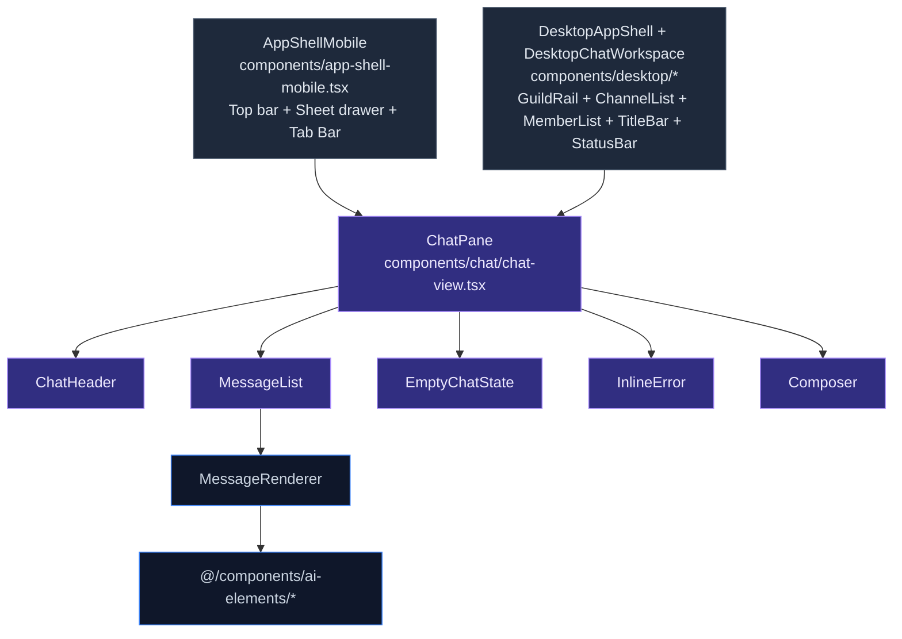
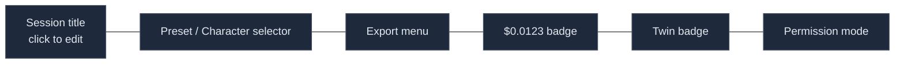
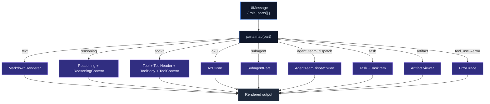
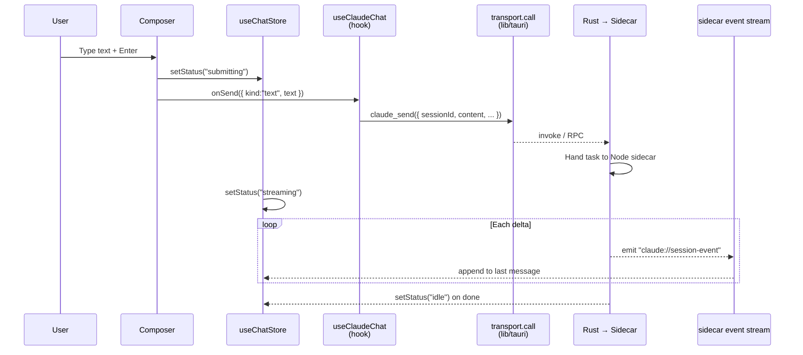

# Chat UI Architecture

The chat interface is the most central visual expression of cognia-next. It unifies the Claude Agent SDK's streaming output, tool calls, reasoning traces, subagent tasks, A2UI forms, artifact sandboxes, canvas boards, and other "message parts" into a scrollable, editable, and resendable conversation flow.

This page explains the component layering, message rendering pipeline, Composer behavior, and how the desktop shell and mobile shell both reuse the same `ChatPane`.

## TL;DR

<TLDR>

- View entry = `ChatPane` (`components/chat/chat-view.tsx`), platform-agnostic; wrapped by desktop `DesktopChatWorkspace` or mobile `AppShellMobile`.
- Rendering core = `MessageList` + `MessageRenderer`, dispatching to different part renderers based on `UIMessage.parts[]`.
- AI elements = `components/ai-elements/`, vendored from the ai-elements library (no tests, excluded from coverage); includes composite components like Message, Reasoning, Task, Tool, Artifact, Conversation, ErrorTrace, etc.
- Input = `Composer`, horizontal layout: attachment button → Textarea → Submit; replaced by a stop button during streaming.
- Triggers = slash/@/!/#: `composer-trigger.ts` detects → pops a popover → routes to the corresponding registry (slash commands, characters, skills, references).
- Command palette = `CommandPalette` (`Ctrl+K`), cross-section navigation, mounted in the desktop shell layer.

</TLDR>

## Three Shells, One Pane



`ChatPane` is a **single visual component**. Desktop and mobile reach it through two different paths, but it only accepts the same set of props:

```tsx title="components/chat/chat-view.tsx (excerpt)"
interface ChatPaneProps {
  activeSession: ChatSession | null
  onSend: (content: SendContent) => Promise<void>
  onStop: () => Promise<void>
  onRegenerate: () => Promise<void>
  onEditResend: (messageId: string, newContent: SendContent) => Promise<void>
  onCreate: () => void
  onUseSample: (text: string) => void
  onOpenSettings: (tab?: string) => void
  composerRef?: Ref<ComposerHandle>
  mobileMentionMembers?: readonly Character[]
}
```

Cross-cutting concerns of the desktop shell (command palette, approval dialogs, title bar) all live in the shell layer; `ChatPane` stays thin.

## ChatHeader

`components/chat/chat-header.tsx` is the session title bar. It handles:

- **Current session title** + inline rename editing.
- **Character / preset selector** — a Popover containing `<Select>`, collaborating with the `usePresets()` + `useCharacter()` data hooks.
- **Export trigger** — `single-export-trigger.tsx` (`components/chat/dialogs/`), opens a dialog with five options: Markdown / JSON / Plain text / Beautiful HTML / Animated HTML. See [Backup & Data](../data/backup-and-data#single-session-export) for details.
- **Session cost badge** — `session-cost-badge.tsx`, accumulating tokens and cost estimates.
- **Twin badge** — `twin-header-badge.tsx`, displayed when the session is bound to an employee digital twin.
- **Permission mode indicator** — `permission-mode-indicator.tsx`: allow / deny / ask / plan.



On desktop, the Header also serves as the window drag area (except for button hit-boxes).

## MessageList & Streaming Rendering

`components/chat/message-list.tsx` pulls all messages and renders `MessageRenderer` with `key` by `id`. Key properties:

- **`isStreaming`** — true when the last message is from the assistant and the current store status is `streaming`. Unlocks cursor animation, reasoning live trickle, and token-by-token UI.
- **`isLastAssistant`** — enables the "regenerate" button; not shown on non-last messages to prevent misoperation.
- **`characterById`** — sender resolution under team sessions (what agent A said, what agent B said).

Scroll anchoring: `<MessageList>` internally uses the sticky-bottom behavior of `Conversation` (ai-elements) — automatically anchors to the bottom when the user hasn't manually scrolled away; stops anchoring after the user scrolls up to avoid stealing focus.

## MessageRenderer: Part-Pipeline Dispatch

Each `UIMessage` holds `parts: MessagePart[]`, and each part has its own `type` discriminator. `MessageRenderer` is a **dispatcher**:



### text part

`MarkdownRenderer` (`components/chat/markdown-renderer.tsx`) renders Markdown using Streamdown, with built-in support for:

- **Shiki syntax highlighting**, theme following current light/dark mode.
- **Mermaid diagrams** (lazy-loaded).
- **KaTeX math formulas** (`globals.css` injects `katex.min.css`).
- **CJK characters** with automatic kerning adjustment.
- **Link safety policy** — external links get `rel="noopener noreferrer"`, and `<a>` hover shows a host tooltip.

### reasoning part

`<Reasoning>` is a collapsible card titled "Thinking…", with the reasoning stream inside. During streaming, lines trickle in one by one; it collapses after completion.

### tool-\* part

`Tool` + `ToolHeader` + `ToolBody` + `ToolContent` form the "tool call" box:

- **Header**: tool name + status badge (pending / running / done / error).
- **Body**: input parameters (collapsible JSON).
- **Content**: tool output — text, JSON, image, or Markdown.
- **Approval inline**: for tools requiring user approval (write file, execute shell), an "Approve / Deny" button group is inserted below the Body, writing to the `pendingApprovals` store.

### artifact part

`Artifact` is a "snippet viewer" for React/Vue/HTML with open/embedded dual states:

- **Embedded**: rendered inside an iframe sandbox (`sandbox="allow-scripts"` + CSP).
- **Open**: routes to `/canvas` or a dedicated sandbox page — see [Artifacts Sandbox](../subsystems/artifacts-sandbox) for details.

### a2ui / subagent / agent_team_dispatch

These three are cognia-next's own extended part types, defined in `lib/claude/parts-extensions.ts`:

- **A2UIPart** — "submission forms" or "action buttons" declared by the A2UI MCP server, rendered as interactive controls directly in the chat; on submission, writes back as a new message.
- **SubagentPart** — subagent conversation snapshot: title, status, nested `parts[]`.
- **AgentTeamDispatchPart** — a dispatch box in team sessions for "who should I assign this task to".

Each part type maps to an independent component (`components/chat/message-parts/<kind>-part.tsx`), all following the same interface: receive part data + context, return a React tree.

## Streaming Pipeline



- **`status` transitions**: `idle → submitting → streaming → idle` (or → `error`).
- **Delta accumulation**: the `useChatStore` reducer appends each `text_delta` to the last text part of the last assistant message.
- **Tool call insertion**: `tool_use_start` from the sidecar appends an empty Tool part at the end of `parts`; subsequent `tool_use_delta` progressively fills in parameters; `tool_result` completes the Content.
- **Error handling**: sidecar error → sets `errorMessage`, UI shows `<InlineError>` at the top with a "retry" option.
- **Interruption**: Stop button triggers `onStop` → `claude_interrupt` Tauri command → sidecar cancels generation, status returns to `idle`.

## Composer

`components/chat/composer.tsx` is the input component, with a horizontal layout:

```
[📎 📷 🎤 ⚙ ⇧⇥]  ┌─Textarea（flex-1）────────┐  [▶ Submit / ■ Stop]
                  │  Character count bottom-right │
                  └────────────────────────────┘
```

It uses `<PromptInputProvider>` (ai-elements) at the bottom layer, because it provides `controller.textInput` and `attachments` contexts that the slash/@/!/# trigger mechanism relies on. But Composer **itself** renders the form + textarea, not `<PromptInput>` (that component forces a vertical `<InputGroup>` layout).

### Composer Handle (imperative)

The desktop shell accesses `ComposerHandle` via `composerRef`:

```ts
interface ComposerHandle {
  insertMention(name: string): void // Injects @Name at cursor position
  focus(): void
  clear(): void
}
```

Use case: user clicks a row in the team member list, desktop shell calls `composerRef.current?.insertMention(member.name)`, inserting `@Alice ` at the cursor.

### Bottom Toolbar

`components/chat/composer/bottom-toolbar.tsx` hangs below the Composer, carrying **session-level metadata**:

- **ModelPicker** — switch the default model for the current session; writes to session settings.
- **AgentRuntimeSelector / AgentModeSelector / ExternalAgentSelector** — choose which agent implementation handles this message (see [Provider System](../chat/provider-system)).
- **WebSearchToggle** — enable search tool calls.
- **PermissionModeIndicator** — current allow / deny / ask / plan.
- **Context Usage** — real-time calculation and display of the current session's context window input/output/cache usage:

```tsx
import {
  Context,
  ContextContent,
  ContextContentBody,
  ContextInputUsage,
  ContextOutputUsage,
  ContextCacheUsage,
  ContextTrigger,
} from "@/components/ai-elements/context"
```

`ContextTrigger` is a compact badge; expanding it shows a detailed breakdown (each model's context window, token consumption, approximate cost).

### Triggers (slash / @ / ! / #)

`composer-trigger.ts` listens to input changes, scanning characters before the caret position:

| Prefix | Trigger condition            | Popover content                  | Hooked to                            |
| ------ | ---------------------------- | -------------------------------- | ------------------------------------ |
| `/`    | At line start or after space | Slash command list               | `lib/chat/slash-command-registry.ts` |
| `@`    | Any position                 | Characters / team members        | `useCharacter()` data hook           |
| `!`    | At line start                | Skills list                      | `useSkills()`                        |
| `#`    | Any position                 | Knowledge references / documents | `lib/search/`                        |

When matched, a popover appears (`components/chat/composer-popover.tsx`), with arrow-key navigation + Enter to select, then `spliceToken` replaces the prefix fragment. Arrow / Tab navigation keeps the highlighted row scrolled into view.

Candidate lists are ranked by a shared fuzzy matcher (`lib/chat/completion/fuzzy-match.ts`): every query character must appear in order (a subsequence), with score bonuses for word-boundary hits (after `/ - _ . :`), consecutive runs, and early/short matches. Slash commands rank on the command name (description is a demoted secondary source); `@`-mentions use the same scorer so both surfaces feel identical. The popover width follows the composer's own width (`--radix-popper-anchor-width`, capped at 480px) so it never spills past a narrow side panel.

### Ghost text (inline autocomplete)

When enabled (`Settings → Conversation → Composer assistance`), the composer shows a dim single-line continuation of the current draft (`hooks/chat/use-composer-ghost-text.ts` → `lib/chat/completion/ghost-controller.ts`). `Tab` accepts, `Esc` dismisses. Suggestions are debounced, cached, PII-gated before the utility-LLM call, and suppressed while a trigger popover is open, while streaming, or when the caret isn't at the end of the input.

### Responsive composer (narrow side panels)

The composer wrapper declares `@container/composer`, and the textarea row reflows to a single `[attach | textarea | send]` line once the container reaches `@sm`. The **bottom toolbar** measures its own width (`hooks/use-element-width.ts`): Tier 1 (model / permission / sandbox / context) is always inline, while Tier 2 (enhance / web search / skills) and Tier 3 (agent runtime / mode / external agent / plugin slots) collapse into a single `⋯ More` popover below ~448px. Each control mounts in exactly one place — re-mounting these popover triggers inside a `DropdownMenuItem` would desync their open-state — and the More button shows a dot when a collapsed control is active. This keeps every control reachable inside the workflow-editor chat sidebar (resizable down to 20% of the viewport).

### Attachments

The attachment button supports:

- **📎 Files**: `<input type="file" multiple>`, dropped into the `attachments` context.
- **📷 Screenshot**: desktop calls Rust screenshot command; mobile calls `@capacitor/camera`.
- **🎤 Voice**: record → transcribe via `lib/speech/` then fill into text.
- **Drag / Paste**: listens to `onDragOver` / `onPaste`, files/images go directly into attachments.

## Empty / Error / Welcome

- **EmptyChatState** (`components/chat/empty-state.tsx`): shown when a session is newly created with no messages sent, providing "try these examples" cards; clicking calls `onUseSample(text)` to prefill the Composer.
- **InlineError** (`components/chat/inline-error.tsx`): top red bar with error message + "retry" + "view details". Details link jumps to `?section=logs`.
- **Welcome flow** (`components/chat/welcome/`): onboarding card deck for first-time users, introducing API key, characters, and skills.

## Approval Dialog

When a tool call requires approval, the sidecar pushes `pendingApproval` into `useChatStore`. `ToolApprovalDialog` (mounted in the shell layer above the chat workspace) subscribes to `pendingApprovals[0]` — the only element not inside ChatPane, because it needs to cover the entire workspace and connect to keyboard shortcuts (Y / N / Esc).

## Desktop-Specific: Command Palette + Title/Status/Guild Rail

The desktop shell stacks 4 global floating layers:

| Component        | Purpose                                                                        | File                                     |
| ---------------- | ------------------------------------------------------------------------------ | ---------------------------------------- |
| `TitleBar`       | Custom window title bar (no native chrome), with close/min/max + drag area     | `components/desktop/title-bar.tsx`       |
| `GuildRail`      | Ultra-narrow left vertical rail, listing guild (team) switches                 | `components/shell/guild-rail.tsx`        |
| `StatusBar`      | Bottom status bar — sidecar health, current transport, network indicator       | `components/desktop/status-bar.tsx`      |
| `CommandPalette` | `Ctrl+K` to invoke: cross-section search + navigation + execute slash commands | `components/desktop/command-palette.tsx` |

`CommandPalette` uses shadcn `Command` (cmdk) + custom result categories: sessions, settings sections, slash commands, characters, skills, documents. Enter executes directly (navigate or trigger).

## Mobile-Specific: Gestures and Plus Menu

- **`ComposerPlusMenu`** (`components/mobile/chat/composer-plus-menu.tsx`) — touch-screen "+" button drawer, listing attachments, voice, skills, references, and other entries; replaces desktop toolbar icons.
- **`MessageActionSheet`** (`components/mobile/chat/message-action-sheet.tsx`) — long-press on a message pops a bottom sheet: copy, edit & resend, quote, delete, share.
- **`MentionPopover`** — mobile-only @-mention popover, because desktop popover is too cramped on small screens.
- **Gestures**: `<LongPress>`, `<SwipeRow>`, `<PullToRefresh>` wrap the message list / list items, unified via `test-pointer-polyfill.ts` so jsdom tests can run too.

## Theming & i18n Integration

Every message component uses shadcn tokens: `bg-card`, `text-foreground`, `border-border`, `text-muted-foreground`. Code blocks use Shiki + `font-mono` (CSS variable from Geist Mono). See [Theming & i18n](./theming-and-i18n).

All copy goes through `useTranslations(...)`:

- `chat.copy.success` — "Copied" toast.
- `chat.composer.toolbar.*` — Bottom toolbar tooltips.
- `desktop.shell.*` — Desktop shell menus and buttons.

## Testing

| File                                  | Coverage                                                  |
| ------------------------------------- | --------------------------------------------------------- |
| `chat-view.test.tsx`                  | empty / streaming / error three states + callback routing |
| `composer.test.tsx`                   | submit, triggers, attachments, stop toggle                |
| `composer.draft-and-mention.test.tsx` | draft persistence + @-mention injection                   |
| `composer.platform-binding.test.tsx`  | Send button disabled under platform-bound sessions        |
| `message-list.test.tsx`               | anchor scrolling, key stability                           |
| `message-renderer.test.tsx`           | dispatch for each part type                               |
| `markdown-renderer.test.tsx`          | Mermaid / KaTeX / code blocks / link safety               |
| `composer-trigger.test.ts`            | `/`, `@`, `!`, `#` trigger detection                      |
| `bottom-toolbar.*` (via composer)     | Context display, Model picker, Permission toggle          |

`components/ui/` and `components/ai-elements/` do **not** have tests and are excluded from coverage (CLAUDE.md exception list).

## Where to Start

| Goal                                   | File                                                                                      |
| -------------------------------------- | ----------------------------------------------------------------------------------------- |
| New message part type                  | Define in `lib/claude/parts-extensions.ts` + `components/chat/message-parts/<x>-part.tsx` |
| Add Composer toolbar button            | Horizontal toolbar area in `components/chat/composer.tsx`                                 |
| Add BottomToolbar metadata             | `components/chat/composer/bottom-toolbar.tsx`                                             |
| New slash command                      | Add registration in `lib/chat/slash-command-registry.ts`                                  |
| Change Markdown rendering behavior     | `components/chat/markdown-renderer.tsx` + Streamdown plugin config                        |
| Change ChatHeader items                | `components/chat/chat-header.tsx`                                                         |
| Change desktop command palette entries | `components/desktop/command-palette.tsx`                                                  |
| Change mobile gestures                 | `components/interactions/*`                                                               |

## Related Pages

<Cards>
  <Card title="Chat & Skills" href="../chat/chat-and-skills" description="Domain model and lifecycle of sessions, characters, and skills" />
  <Card title="Theming & i18n" href="./theming-and-i18n" description="oklch tokens + next-intl translations" />
  <Card title="shadcn/ui Setup" href="./shadcn-ui-setup" description="All UI primitives used on this page" />
  <Card title="Canvas" href="../subsystems/canvas" description="Target page for Artifact 'open' state navigation" />
  <Card title="Artifacts Sandbox" href="../subsystems/artifacts-sandbox" description="CSP and runtime for the embedded iframe sandbox" />
</Cards>
