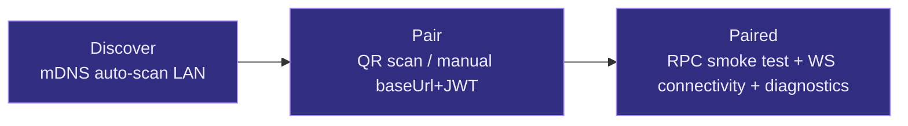
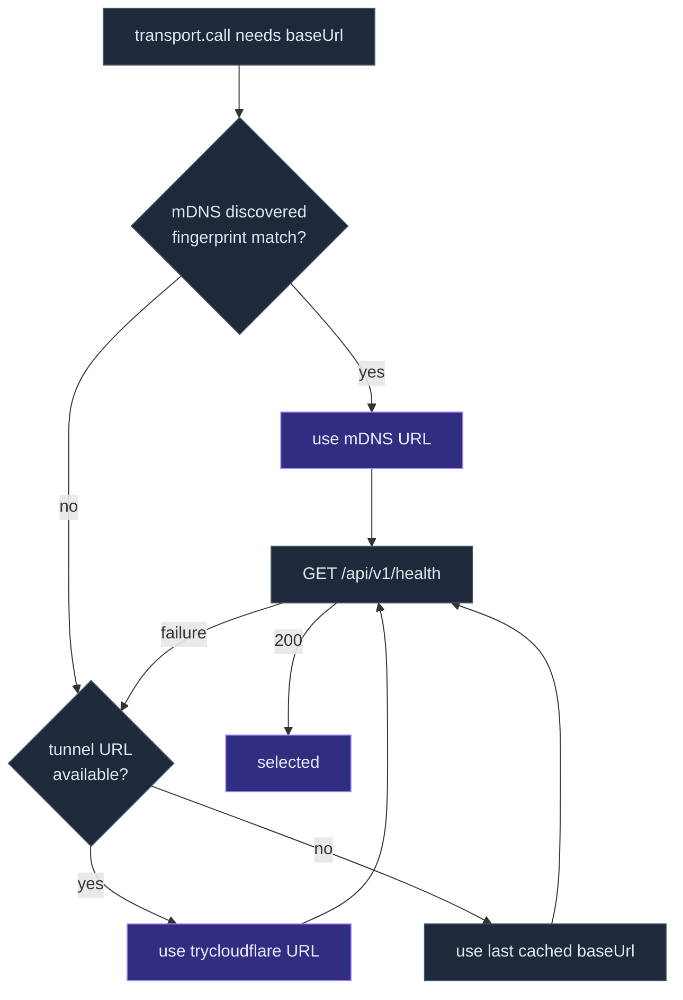

# Mobile Architecture

cognia-next's mobile client is **not** a standalone React Native app, nor is it a stripped-down desktop version. It is the **same** Next.js static export (`out/`), wrapped by **Capacitor 7** inside an iOS / Android native WebView, then connected back to the desktop's `/api/v1/*` via HTTP/WS. One JS bundle, three shells (Tauri, Capacitor, Web), one shared React codebase.

<Callout type="info">
  This page corresponds to ADRs: [0014 — Capacitor Mobile
  Shell](../adr/0014-capacitor-mobile-shell), [0015 — Mobile V2
  Completion](../adr/0015-mobile-v2-completion), [0012 — Transport
  Abstraction](../adr/0012-transport-abstraction), [0013 — Command
  Manifest](../adr/0013-command-manifest).
</Callout>

## TL;DR

<TLDR>

- Mobile client = **Capacitor 7 + the same `out/` static export**; no UI rewrite, no parallel component library.
- Tri-state `Transport` is chosen at module load time: `TauriTransport` (desktop) / `CompanionTransport` (mobile) / `WebStubTransport` (browser-only).
- Desktop is the true "server" — sidecar, vector store, MCP, subscription, and connectors all live on the desktop; the phone is a trusted client.
- Device JWT is stored in the OS keystore (iOS Keychain / Android Keystore) via `capacitor-secure-storage-plugin`.
- `lib/capacitor/*` wraps 16 native plugins (haptics, camera, share, deeplink, barcode, biometric, etc.) through a single `withPlugin` template.
- TLS self-signed certificate (10-year validity) + SubjectPublicKeyInfo pinning, distributed to the phone via QR pairing payload v2.
- mDNS broadcast `_cognia._tcp.local.` + Cloudflared tunnel + cached URL = three connection candidates.

</TLDR>

## Design Rationale

| Option             | Evaluation                                                                                                      | Decision |
| ------------------ | --------------------------------------------------------------------------------------------------------------- | -------- |
| **Tauri 2 Mobile** | Mobile lacks sidecar support (Tauri issues #11454 / #9774); Claude Agent SDK sidecar is a core desktop runtime. | Rejected |
| **React Native**   | Rewriting 57 shadcn/ui components to RN primitives would take weeks with zero functional gain.                  | Rejected |
| **Capacitor 7**    | Drop the existing Next.js static export into a native WebView — zero UI rewrite.                                | Adopted  |

Deeper insight: the phone is **never** a sidecar runtime. Claude Agent SDK requires Node >= 20, native extensions, and the `keyring` crate doesn't cover mobile keystores; connector webhook services can't expose a public URL from behind NAT on a phone. Accepting these five subsystems as "desktop-only" is a platform reality, not a framework legacy.

## Project Structure

```
pnpm-workspace.yaml
├── docs        # Fumadocs documentation site (standalone Next.js server, port 3001)
└── mobile      # Capacitor shell (no Next.js server — directly consumes ../out)
```

`mobile/capacitor.config.ts` sets `webDir: "../out"`, and `src-tauri/tauri.conf.json` sets `frontendDist: "../out"` — both point to the **same directory**. A single `pnpm build` produces one static export consumed by both native shells.

## Layer 1 — Browser Engine (WebView)

```mermaid
flowchart TB
  subgraph Phone["📱 Phone · iOS Safari WebKit / Android System WebView"]
    NextOut[["/out static export (same as desktop)"]]
    React[["app/, components/, hooks/, lib/...\nSame React + Zustand + Dexie"]]
    Cap["@capacitor/core bridge"]
  end

  subgraph Native["📦 Native Capacitor Plugins"]
    Keystore[["SecureStorage\nJWT, config"]]
    Camera[["Camera / Barcode\nQR pairing"]]
    Push[["Push Notifications"]]
    Deep[["@capacitor/app\nappUrlOpen"]]
  end

  subgraph Desktop["🖥️ Desktop (the true \"server\")"]
    Companion["src-tauri/companion_api/\naxum HTTP + WS"]
    RustCmd[["companion_api/commands.rs\n~40 allowed commands"]]
    Tauri[["Regular Tauri commands (200+)\nnot exposed over RPC"]]
  end

  React --> Cap
  Cap --> Keystore
  Cap --> Camera
  Cap --> Push
  Cap --> Deep

  React -- "POST /api/v1/_rpc/<cmd>" --> Companion
  React -- "GET /ws/v1/events (WS)" --> Companion
  Companion --> RustCmd
  RustCmd -.- Tauri

  classDef phone fill:#1e293b,stroke:#475569,color:#e2e8f0
  classDef native fill:#312e81,stroke:#a78bfa,color:#ede9fe
  classDef server fill:#0f172a,stroke:#3b82f6,color:#cbd5e1
  class Phone,NextOut,React,Cap phone
  class Native,Keystore,Camera,Push,Deep native
  class Desktop,Companion,RustCmd,Tauri server
```

The code running inside the WebView is the same code that normally runs inside Tauri — Zustand store, Dexie schema, `useTranslations(...)` calls, all identical. The only differences are which `Transport` is selected by `lib/tauri/transport-instance.ts`, and which enum `usePlatform()` returns.

## Layer 2 — Transport Tri-State Abstraction

`lib/tauri.ts` is the **sole** named-export aggregation layer; underneath it sits a `Transport` interface:

```ts title="lib/tauri/transport-types.ts"
export interface Transport {
  call<T = unknown>(name: string, args?: Record<string, unknown>): Promise<T>
  subscribe<T = unknown>(event: string, handler: (payload: T) => void): () => void
}
```

Implementation is chosen at module load time:

```
window.__TAURI_INTERNALS__ exists                  → TauriTransport
window.Capacitor?.isNativePlatform() === true   → CompanionTransport
otherwise                                          → WebStubTransport
```

| Implementation       | Used In                 | `call`                                                  | `subscribe`                                        |
| -------------------- | ----------------------- | ------------------------------------------------------- | -------------------------------------------------- |
| `TauriTransport`     | Desktop (inside Tauri)  | `@tauri-apps/api/core` `invoke`                         | `listen` wrapped into synchronous `unsubscribe`    |
| `CompanionTransport` | Capacitor mobile        | `POST {baseUrl}/api/v1/_rpc/<name>`, Bearer JWT         | `GET {baseUrl}/ws/v1/events` long-lived connection |
| `WebStubTransport`   | Browser-only (no Tauri) | Rejects with `tauri-only command from web mode: <name>` | no-op                                              |

Configuration lives in `lib/tauri/transport-companion.ts` — it reads `CompanionConfig` (baseUrl + JWT + fingerprint) from `companion-storage`, adds `Authorization: Bearer <JWT>`, and POSTs to `/api/v1/_rpc/<command>` with the original Tauri argument object as the request body, returning JSON.

WS uses `?token=<JWT>` for auth; the server maintains a seq cursor, and on reconnect resumes from `?since=<seq>` to avoid missing events. See [Companion API](../subsystems/companion-api) for details.

### Why Not 1:1 Expose All Tauri Commands

Desktop `src-tauri/src/lib.rs` registers 200+ commands. Exposing all of them over RPC would mean:

1. Tray manipulation, desktop wallpaper writes, system scheduler privilege escalation — any paired phone could call them, a **security regression**.
2. API surface too large for realistic security review.
3. Mixing "internal Tauri utility commands" with "stable external API".

Mobile only needs ~30-40: send message, skill CRUD, MCP test, subscription credentials, settings read/write. `src-tauri/src/companion_api/commands.rs` is a **hand-written match table**, each arm calling the corresponding Tauri function body. This is the entirety of [ADR-0013 Command Manifest](../adr/0013-command-manifest).

## Layer 3 — Pairing Flow

`app/(mobile-onboard)/pair/page.tsx` + `components/mobile/pair-onboarding-client.tsx` implement a three-step wizard, supported by the `components/mobile/pair/` subdirectory:



### Discover Step

Calls `lib/connectivity/lan-scanner.ts`:

1. Subscribe to `_cognia._tcp.local.` via the Capacitor mDNS plugin.
2. On failure, fall back to IP-range scan (derive local IP from WebRTC ICE candidates, scan same subnet 1-254).
3. For each candidate, send `GET {baseUrl}/api/v1/discover/info` to confirm it's a cognia server.
4. Tapping a service pre-fills its baseUrl into the Pair step.

### Pair Step

Two paths: QR scan or manual form.

- **QR**: `lib/capacitor/barcode.ts` wraps `@capacitor-mlkit/barcode-scanning`; parses the v2 payload from `lib/qr/pair-payload.ts` (`cgnp2|<base64url JSON>`), with backward compatibility for M3.4 bare JSON.
- **Manual**: Two textareas — baseUrl and pair JWT; validation delegated to `pair-helpers.ts:validateBaseUrl/validatePairJwt`.

After submission:

```ts
const r = await transport.call("companion_api_pair", {
  baseUrl,
  pairJwt,
  deviceLabel,
  platform,
  publicKey: optionalEd25519,
})
// returns { deviceJwt, deviceId, serverVersion, fingerprint }
```

Then `saveCompanionConfig(...)` writes the `CompanionConfig` into the OS keystore.

### Paired Step

- Calls `claude_sidecar_status` once — already on the RPC allowlist, serving as a read-only smoke test.
- `transport.subscribe("claude://session-event", …)` verifies WS path, waiting for the first frame or a 5-second timeout.
- Provides a collapsible "Diagnostics" panel: server version, bound address, first 8 bytes of fingerprint, last heartbeat time.
- The "Unpair" button is protected by the [biometric guard](#native-plugin-matrix).

## Layer 4 — Secure Storage

`lib/tauri/companion-storage.ts` abstracts `CompanionConfigStorage`:

```ts title="lib/tauri/companion-storage.ts"
export interface CompanionConfigStorage {
  read(): Promise<CompanionConfig | null>
  write(config: CompanionConfig): Promise<void>
  clear(): Promise<void>
}
```

Two implementations:

- **`LocalStorageCompanionStorage`** — wraps `window.localStorage`. Used for web builds and jsdom tests.
- **`SecureStorageCompanionStorage`** — dynamically imports `capacitor-secure-storage-plugin`, writes to iOS Keychain / Android Keystore under key `cognia.companion.config.v1`.

The selector `pickCompanionStorage()` mirrors the tri-state transport selection. The read path uses an in-memory cache (`hydrateCompanionConfig()` warms it at startup), so `transport.call()` reading the JWT doesn't need to await.

**Never** written to `~/.claude/.credentials.json` — that's the `claude login` file, owned by subscription OAuth, unrelated to mobile.

## Security: TLS Self-Signed Certificate + Pinning

Desktop `src-tauri/src/companion_api/tls.rs`:

1. Generates a 10-year self-signed certificate at startup using `rcgen`.
2. Persists to `<app_data>/cognia/companion/tls.{pem,key}`.
3. Computes SHA-256 SubjectPublicKeyInfo fingerprint (~32 bytes).
4. Pushes the fingerprint to the phone via the QR pairing payload.

On every subsequent HTTPS request, the mobile side compares the actual certificate's SPKI hash against the cached fingerprint; mismatch means connection refused. When re-signing, **keep the same private key** → fingerprint stays unchanged → no re-pairing needed.

QR payload v2 format:

```
cgnp2|<base64url(JSON)>
JSON: { baseUrl, pairJwt, version, fingerprint }
```

Legacy M3.4 bare JSON is also accepted; auto-detection of prefix decides which parser path to use.

## Connection Strategy: mDNS → Tunnel → Cache

`lib/connectivity/connection-strategy.ts` maintains a prioritized candidate list:



- **mDNS** server lives in `src-tauri/src/companion_api/mdns.rs`, broadcasting `_cognia._tcp.local.` with TXT records containing `ver`, `fp`, `path`.
- **Cloudflared tunnel** in `src-tauri/src/companion_api/tunnel.rs` spawns `cloudflared tunnel --url <local>`, parsing the trycloudflare URL from stderr. Off by default, manually enabled in settings.
- **Cache** = `CompanionConfig.baseUrl`, the last successfully connected URL.

`pickReachable(candidates, probe)` tries them in order, returning the first responder.

## Native Plugin Matrix

All mobile-specific capabilities go through `lib/capacitor/<plugin>.ts`, unified via the template from `_shared.ts`:

```ts title="lib/capacitor/_shared.ts (excerpt)"
export async function withPlugin<P, R>(
  loader: () => Promise<P>,
  action: (plugin: P) => Promise<R>
): Promise<R | { kind: "unsupported" } | { kind: "error"; message: string }> {
  let plugin: P
  try {
    plugin = await loader()
  } catch {
    return { kind: "unsupported" }
  }
  try {
    return await action(plugin)
  } catch (err) {
    return { kind: "error"; message: err instanceof Error ? err.message : String(err) }
  }
}
```

Benefit of this template: every wrapper file returns a **discriminated union** outcome; callers handle the `unsupported` / `error` branches and never see exceptions. Web/Tauri automatically degrades to `unsupported`, and the UI hides the entry accordingly.

| File                     | Package                               | Purpose                                           |
| ------------------------ | ------------------------------------- | ------------------------------------------------- |
| `haptics.ts`             | `@capacitor/haptics`                  | Button feedback, error vibration                  |
| `toast.ts`               | `@capacitor/toast`                    | Short toast (not Sonner)                          |
| `dialog.ts`              | `@capacitor/dialog`                   | Native alert / confirm                            |
| `status-bar.ts`          | `@capacitor/status-bar`               | iOS status bar styling                            |
| `splash-screen.ts`       | `@capacitor/splash-screen`            | Splash screen control                             |
| `network.ts`             | `@capacitor/network`                  | Connection status + change events                 |
| `screen-orientation.ts`  | `@capacitor/screen-orientation`       | Lock portrait / landscape                         |
| `filesystem.ts`          | `@capacitor/filesystem`               | Cache directory, download attachments             |
| `camera.ts`              | `@capacitor/camera`                   | Take photo, pick from gallery                     |
| `share.ts`               | `@capacitor/share`                    | Invoke system share sheet                         |
| `browser.ts`             | `@capacitor/browser`                  | In-app browser for OAuth                          |
| `deeplink.ts`            | `@capacitor/app` (`appUrlOpen` event) | Parse `cognia://` URLs                            |
| `local-notifications.ts` | `@capacitor/local-notifications`      | Offline reminders                                 |
| `geolocation.ts`         | `@capacitor/geolocation`              | Location (opt-in subsystems only)                 |
| `biometric.ts`           | `capacitor-native-biometric`          | Face ID / fingerprint guard for sensitive actions |
| `barcode.ts`             | `@capacitor-mlkit/barcode-scanning`   | Pairing QR decoding                               |

Biometric guard is exposed by `hooks/use-biometric-guard.ts:verify()`, wrapping actions like "delete pairing", "export backup", "decrypt sensitive data"; devices without biometric authentication pass through directly (default fallthrough).

## Layer 5 — Mobile UI Shell

`components/app-shell-mobile.tsx` replaces the desktop shell when `usePlatform() === "mobile"`:

```
┌────────────── Top Bar (56px) ──────────────┐
│ ☰   Session Title                       ⋯    │
├──────────────────────────────────────────────┤
│                                              │
│            ChatPane (single column)          │
│                                              │
└──────────────────────────────────────────────┘
```

- **Left drawer** (Sheet slide-from-left): `GuildRail` + `MobileChannelList` — desktop sidebar content下沉 into a drawer.
- **Bottom drawer** (Sheet slide-from-bottom): Session actions (settings, character selection, member list, sign out).
- **Tab Bar**: `components/mobile/shell/mobile-tab-bar.tsx` — Chat / Inbox / Workflows / Me, four tabs.
- **Gestures**: `components/interactions/` — `LongPress`, `PullToRefresh`, `SwipeRow`, all using the same pointer polyfill (shared across mobile and desktop where applicable).
- **OfflineBanner**: `components/mobile/offline-banner.tsx` shows a horizontal bar when `@capacitor/network` reports `connected: false`.

Desktop and mobile shells **do not** share components outside of `chat-view.tsx` — `ChatPane` itself is platform-agnostic, but containers, drawers, and tabs are all independent. Mobile uses `Sheet`/`Drawer`; desktop uses `SidebarProvider` + draggable splits.

## Sync & Offline

- **Incremental sync**: The phone still maintains a local Dexie database; at startup it calls `companion_sync_pull` to fetch deltas.
- **Outbound queue**: Failed RPCs are automatically retried; desktop online → send directly, offline → stash.
- **Push Notifications**: `@capacitor/push-notifications` connects to FCM/APNs; push content transparently forwards the payload sent by the desktop, triggering a `cognia://session/<id>` deep link back to the specific session.

> Server-side push delivery and credential storage implementation is covered in the "Push Delivery" section of [Companion API](../subsystems/companion-api).

## Pairing Credentials & Revocation

Device JWT is issued by desktop `src-tauri/src/companion_api/auth.rs`, with a payload containing `deviceId` + expiry + optional public-key fingerprint. Two revocation paths:

1. **Desktop → Settings → Companion → Paired Devices list**: Each entry has an X; writing to the blacklist causes the next token validation to fail.
2. **Phone → Me → App Security → Unpair**: Locally clears `companion-storage` + notifies the desktop to add itself to the blacklist.

## Web Mode Degradation

The `mobile/` workspace default output is the Capacitor shell, but the same `out/` can also be deployed as a PWA. In that case:

- `Transport` selects `WebStubTransport`.
- All `transport.call(...)` are rejected; the UI detects this via `usePlatform()` and hides Tauri-only entries.
- All `lib/capacitor/*` wrappers return `unsupported`, and corresponding buttons are not rendered.
- Only Dexie + translations + theme — pure frontend features — remain available. This minimal subset is preserved for demo screenshots and browser-based trials.

## Debugging & Build

```bash title="Desktop + phone running together"
# 1. Desktop side: start service + sidecar
pnpm tauri dev
# 2. Settings → Companion → enable LAN bind + generate 5-minute pair JWT

# 3. Static export
pnpm build

# 4. Sync to native project
pnpm mobile:sync          # equivalent to pnpm build && pnpm -F mobile sync

# 5. Open native IDE
pnpm mobile:open:android  # or :ios (macOS required)
```

Android build (verified on Windows + JDK 21 + Android SDK 35):

```bash
cd mobile/android
./gradlew assembleDebug
# Output: app/build/outputs/apk/debug/app-debug.apk (~22 MB)
```

`compileSdk` / `targetSdk` = 35 (Capacitor 7 default), `minSdk` = 24, debug-only `usesCleartextTraffic="true"` only in `app/src/debug/AndroidManifest.xml`; release builds use the default security policy.

iOS (requires macOS + Xcode):

- `iOS Deployment Target = 16.0`.
- `Info.plist`: `NSCameraUsageDescription`, `NSLocalNetworkUsageDescription`, `NSAppTransportSecurity / NSAllowsLocalNetworking = true` (can be tightened after M2.9 TLS trust anchor integration).

## Testing

| Suite                                                       | Coverage                                                           |
| ----------------------------------------------------------- | ------------------------------------------------------------------ |
| `companion-storage.test.ts`                                 | `LocalStorageCompanionStorage` and SecureStorage backend switching |
| `transport-companion.test.ts`                               | `CompanionTransport.call`, WS subscription, token injection        |
| `pair-onboarding-client.test.tsx` and its sub-steps         | Discover / Pair / Paired three-step state machine                  |
| `lib/capacitor/*.test.ts`                                   | Each native plugin wrapper's unsupported / ok / error branches     |
| `lib/connectivity/connection-strategy.test.ts`              | Three-layer candidate selection + probe                            |
| `lib/qr/pair-payload.test.ts`                               | v2 payload encoding + backward compatibility with legacy bare JSON |
| Rust: `companion_api/{tls,mdns,tunnel,auth}.rs#[cfg(test)]` | Self-signed cert, mDNS broadcast, tunnel spawn, JWT issuance       |

Overall coverage threshold matches the main repo — every source file >= 90% (lines / branches / functions), verified with `pnpm test:coverage`.

## Where to Land Code

| Target                           | File                                                                       |
| -------------------------------- | -------------------------------------------------------------------------- |
| New native plugin wrapper        | `lib/capacitor/<plugin>.ts` + corresponding `.test.ts`, reuse `_shared.ts` |
| New deep-link route kind         | Extend `DeeplinkRoute` union in `lib/capacitor/deeplink.ts`                |
| New mobile-specific UI           | `components/mobile/<area>/<component>.tsx`                                 |
| New RPC command exposed to phone | Add arm in `src-tauri/src/companion_api/commands.rs` + write docs          |
| New connection candidate source  | Candidate builder in `lib/connectivity/connection-strategy.ts`             |
| New mobile tab                   | `components/mobile/shell/mobile-tab-bar.tsx` + corresponding route         |

## Related Pages

<Cards>
  <Card
    title="Companion API"
    href="./companion-api"
    description="Server side: RPC routes, WS protocol, push, JWT issuance"
  />
  <Card
    title="Platform Connectors"
    href="./platform-connectors"
    description="Desktop-side Telegram / Discord / Lark adapters, coordinated with mobile push"
  />
  <Card
    title="Remote Control"
    href="./remote-control"
    description="Another 'client' semantics: desktop lends a session to another endpoint"
  />
  <Card
    title="Settings UI"
    href="./settings-ui"
    description="Mobile settings panel lives under the same settings-shell framework"
  />
</Cards>
