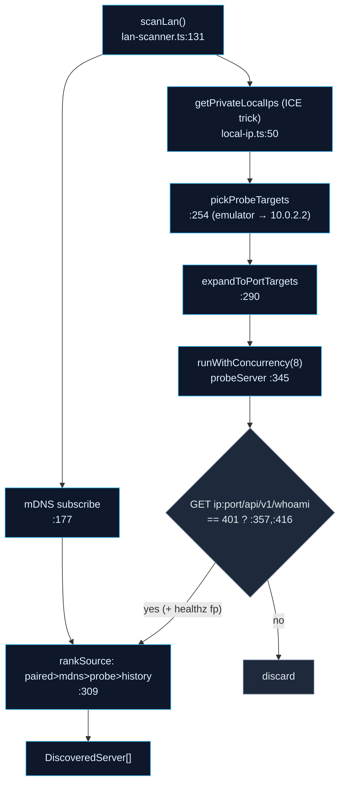

# Discovery & Pairing

<Status variant="beta" />

<TLDR>
  Before a phone can call anything it must (a) find a desktop and (b) establish trust. Discovery is
  two distinct systems: `lan-scanner.ts` *discovers unknown* hosts (parallel mDNS subscribe + IP-range
  probe, accepting a `401` from `/api/v1/whoami` as proof-of-Cognia), while `connection-strategy.ts`
  *resolves a known* paired device's reachable URL by walking a prioritized candidate list (mDNS →
  tunnel → cached) and probing `/api/v1/healthz`. Trust is the three-step pairing wizard: scan the QR
  (or type a 6-digit code), redeem it for a device JWT, pin the TLS fingerprint, and persist the
  `CompanionConfig` to the OS keystore. The local IP needed for scanning is recovered via a WebRTC ICE
  trick (`local-ip.ts:50`) because mobile WebViews can't read network interfaces.
</TLDR>

<StatGrid>
  <Stat label="mDNS service" value="_cognia._tcp" hint="mdns-discovery.ts:42" />
  <Stat label="Probe ports" value="27890·7890·7891·7900·8443" hint="lan-scanner.ts:119" />
  <Stat label="Probe target" value="GET /api/v1/whoami → 401" hint="lan-scanner.ts:357" />
  <Stat label="Candidate order" value="mDNS → tunnel → cache" hint="connection-strategy.ts:43" />
</StatGrid>

## Two discovery systems

They share the fingerprint-pinning idea but no code — keep them distinct:

- **`lan-scanner.ts` — discover unknown hosts.** Used by the pairing wizard's Discover step to surface
  desktops the phone has never seen.
- **`connection-strategy.ts` — reach a known host.** Used at call time to pick the best URL for an
  *already-paired* device whose fingerprint is known.

### LAN scanner — `scanLan` (`lan-scanner.ts:131`)

Runs an mDNS subscribe (`:177`) and an IP-range probe in parallel, racing against a 5-second mDNS
window or abort (`:225`):

A candidate is accepted **only** if it returns HTTP `401` with a `{code,message}` body
(`evaluateProbeResponse`, `:409-432`) — an unauthenticated request to `/api/v1/whoami` *should* be
rejected, which is exactly what proves the host is a Cognia server. The result is then enriched with
the TLS fingerprint via `healthz`. Default port `27890` (`:110`); the extra ports `[27890, 7890, 7891, 7900,
8443]` (`:119`) are tried only for paired/emulator IPs.

### The local-IP trick — `local-ip.ts:50`

A mobile WebView can't enumerate network interfaces, so `getPrivateLocalIps()` opens a STUN-less
`RTCPeerConnection` with a dummy data channel and harvests the host ICE candidates (`:50`), filtering
to RFC-1918 ranges (`isPrivateIpv4`, `:151`). `enumerateSlash24()` (`:159`) then expands a discovered
IP to its `/24` for the scanner to sweep.

### Connection strategy — `connection-strategy.ts`

For a *known* device, `buildCandidates()` (`:43`) produces an ordered try-list:

1. **mDNS** — only if the discovered TXT `fp` matches the pinned fingerprint (`:47-59`);
2. **tunnel** — the cloudflared URL if available (`:62-68`);
3. **cache** — the last successfully used `baseUrl` (`:71-80`).

`pickReachable(candidates, probe)` (`:90`) walks them in order and returns the first that responds to
`GET /api/v1/healthz` (`healthz.ts:48`).

## mDNS subscribe

`mdns-discovery.ts` subscribes to `_cognia._tcp` (`SERVICE_TYPE`, `:42`) via `capacitor-zeroconf`.
`subscribe()` (`:119`) returns a no-op unsubscribe off-mobile (`:127`). On iOS, the OS gates multicast
behind a Local Network permission; `mdns-permission.ts:requestMdnsPermission` (`:46`) requests it,
returning `granted` / `denied` / `unsupported`. The desktop broadcaster is controlled from the same
file via Tauri (`startBroadcast` → `companion_mdns_start`, `:172`).

## The pairing wizard

`app/(mobile-onboard)/pair/page.tsx` mounts a three-step stepper (`components/mobile/pair/`):

<Steps>
<Step>
**Discover** — `discover-step.tsx` runs `scanLan`, shows a radar of found servers
(`scan-radar.tsx` + `server-card.tsx`); tapping one pre-fills its `baseUrl`.
</Step>
<Step>
**Pair** — `pair-step.tsx`. Either scan the QR (`barcode.ts` → parse the payload) or type the 6-digit
code. The submit calls `pair-api.ts`, which redeems against `POST /api/v1/auth/pair` (QR) or
`/api/v1/auth/pair/redeem-code` (code), receiving `{ deviceJwt, deviceId, serverVersion,
rendezvousId, rendezvousSecret, fingerprint }`. Validation lives in `pair-helpers.ts`.
</Step>
<Step>
**Paired** — `paired-step.tsx` runs a read-only smoke test (`claude_sidecar_status`), verifies the WS
path, and offers a diagnostics panel (server version, bound address, fingerprint prefix, last
heartbeat). `saveCompanionConfig(...)` writes the config to the keystore. Unpair is behind the
[biometric guard](./capacitor-shell#biometric-guard).
</Step>
</Steps>

## QR payload & TLS pinning

The QR encodes the desktop's resolved `baseUrl` (priority tunnel > LAN > loopback), the 5-minute pair
JWT, the server version, and the **TLS SPKI fingerprint**. The phone parses it, redeems the JWT, and
stores the fingerprint in `CompanionConfig.serverFingerprint`. From then on every request goes through
the [TLS-pinned fetch](./transport-layer#tls-pinned-fetch): the phone compares the live certificate's
SPKI hash against the pinned value and refuses on mismatch. Because the desktop reuses its key across
re-signs, the fingerprint never changes and the phone never has to re-pair.

## Recent servers

`recent-servers.ts` keeps a capped (`MAX_RECENTS = 5`, `:23`) localStorage log of recently paired
servers under `cognia.mobile.recentServers` (`:22`). `recordRecentServer()` (`:84`) upserts to the
front; `recentServersToDiscovered()` (`:125`) projects them into the scan list with source `history`,
so a previously paired desktop ranks above a cold probe. `paired-summary.ts:companionConfigToPairedSummary`
(`:21`) turns the live `CompanionConfig` into the ranking entry used by the scanner.

## Related pages

<Cards>
  <Card title="External API: discovery, tunnel & TLS" href="../../subsystems/companion-api/discovery-tunnel" description="The server side — mDNS broadcast, healthz, the cloudflared tunnel, and the fingerprint source." />
  <Card title="External API: server & authentication" href="../../subsystems/companion-api/server-and-auth" description="The pairing handlers the wizard redeems against." />
  <Card title="Transport layer" href="./transport-layer" description="Where the resulting CompanionConfig is consumed by every call." />
</Cards>
