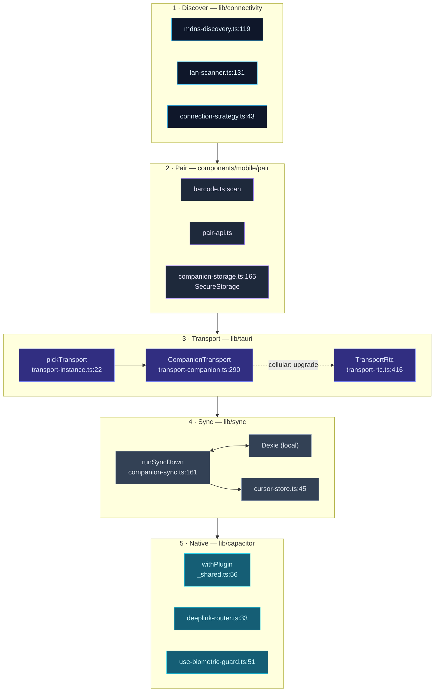

# Mobile Architecture

<Status variant="beta">beta · V2 + WebRTC</Status>

<TLDR>
  Cognia's mobile client is **not** a separate React Native app and **not** a trimmed desktop build —
  it is the *same* `out/` static export wrapped by **Capacitor 8** inside an iOS/Android WebView, then
  connected back to the desktop's [External API](../../subsystems/companion-api). One JS bundle, three
  shells (Tauri / Capacitor / Web), one shared React codebase. The seam is the `Transport` interface:
  desktop uses `TauriTransport`, while Web/Capacitor bind `CompanionTransport` whenever the account's
  active runtime target is a paired Host. Each `transport.call(name, args)` resolves to Tauri IPC,
  an HTTPS DPoP `_rpc` POST, or an upgraded WebRTC DataChannel. Native capabilities go through `lib/capacitor/*` wrappers that
  degrade to `unsupported` off-device, and reads come from a local Dexie that syncs incrementally.
</TLDR>

<StatGrid>
  <Stat label="Runtime targets" value="isolated" hint="standalone / companion" />
  <Stat label="Transport tiers" value="4" hint="ws-lan · ws-tunnel · rtc-direct · rtc-relay" />
  <Stat label="Native wrappers" value="20" hint="lib/capacitor/*.ts via withPlugin" />
  <Stat label="Sync tables" value="10" hint="lib/sync/handlers/*" />
  <Stat label="Deep-link routes" value="6" hint="DeeplinkRoute — deeplink.ts:16" />
  <Stat label="Mobile components" value="100+" hint="components/mobile/**" />
</StatGrid>

## The thesis: one bundle, three shells

`mobile/capacitor.config.ts` sets `webDir: "../out"` (`:17`); `src-tauri/tauri.conf.json` sets
`frontendDist: "../out"`. Both native shells point at the **same** directory a single `pnpm build`
produces. The React running inside the iOS/Android WebView is byte-for-byte the React that runs in
Tauri — same Zustand stores, same Dexie schema, same `useTranslations()` calls. Only two things differ
at runtime: which `Transport` the selector returns, and which enum `usePlatform()` reports.

| Option | Verdict |
| --- | --- |
| **Tauri 2 Mobile** | Rejected — mobile lacks sidecar support; the Claude Agent SDK sidecar is a core desktop runtime. |
| **React Native** | Rejected — rewriting 57 shadcn/ui components to RN primitives for zero functional gain. |
| **Capacitor 8** | Adopted — drop the existing static export into a native WebView, no UI rewrite. |

The deeper truth: the phone is **never** a sidecar runtime. The Claude Agent SDK needs Node ≥ 20 and
native extensions; connector webhooks can't expose a public URL from behind carrier NAT. So five
subsystems are "desktop-only" by platform reality — the desktop is the true server, the phone a trusted
client. See [ADR-0014](../../adr/0014-capacitor-mobile-shell).

## The client spine

A mobile session walks a fixed spine: **discover** the desktop, **pair** with it, choose a
**transport**, **sync** local data, and reach **native** capabilities. Each box is annotated with the
file and line where it lives.

## The module map

Read the per-module page for line-accurate internals. Each card is one documentation page.

<Cards>
  <Card title="Capacitor shell & native bridges" href="./capacitor-shell" description="The withPlugin degradation template, the 20 native plugin wrappers, runtime plugin registration, the 6-route deep-link parser/router, capacitor.config.ts, and the AppShellMobile drawer/tab/sheet structure." />
  <Card title="Transport layer" href="./transport-layer" description="The Transport interface, the tri-state selector, CompanionTransport (HTTPS _rpc + WSS events with replay), the WebRTC sub-tier, TLS-pinned fetch, the tier classifier, and the SecureStorage credential store." />
  <Card title="Discovery & pairing" href="./discovery-pairing" description="mDNS subscribe, the LAN IP-range scanner, the WebRTC-ICE local-IP trick, the connection-strategy candidate walk, the three-step pairing wizard, the QR payload, and TLS fingerprint pinning." />
  <Card title="Sync & offline" href="./sync-offline" description="The runSyncDown orchestrator, the 10 per-table handlers, paginated deltas, the durable cursor store, the allowlist-merge for settings, the four sync triggers, and the Dexie-first query hook." />
  <Card title="WebRTC transport" href="./webrtc-transport" description="The v2-only ECDSA/ECDH/AES-GCM signaling client, bounded DataChannel offerer, recovery controls, and Cloudflare Durable-Object rendezvous (ADR-0021)." />
</Cards>

## Why the phone is a client, not a server

Everything stateful and privileged stays on the Host. The phone holds a P-256 device key, a pinned TLS
fingerprint, a v2 room descriptor, a separate signaling key, and a local Dexie cache — nothing more. It cannot run the agent
sidecar, the vector store, MCP, or connector webhooks. This keeps the attack surface small (a lost
phone is revoked through the Host's [SecurityStore](../../subsystems/companion-api/server-and-auth))
and keeps the bundle identical, which is the whole point of the Capacitor approach.

## Web runtime targets

The same `out/` is the production Web client. A browser account can stay on an isolated standalone
target or activate any paired Headless target, at which point transport, database, manifest, and
event cursors rebind together. Native-only `lib/capacitor/*` wrappers still return `unsupported`;
standalone browser chat and Headless-backed capabilities remain available according to the active manifest.

## Related pages

<Cards>
  <Card title="External API" href="../../subsystems/companion-api" description="The desktop server half — the endpoints, RPC manifest, and signaling plane this client talks to." />
  <Card title="Settings UI" href="../settings-ui" description="The Companion settings panel that drives pairing, mDNS, tunnel, and WebRTC from the desktop." />
</Cards>

## Related ADRs

- [ADR-0012 — Transport Abstraction](../../adr/0012-transport-abstraction)
- [ADR-0013 — Command Manifest](../../adr/0013-command-manifest)
- [ADR-0014 — Capacitor Mobile Shell](../../adr/0014-capacitor-mobile-shell)
- [ADR-0015 — Mobile V2 Completion](../../adr/0015-mobile-v2-completion)
- [ADR-0021 — WebRTC DataChannel WAN Transport](../../adr/0021-webrtc-datachannel-wan-transport)
- [ADR-0027 — Mobile Offline & Discovery](../../adr/0027-mobile-offline-and-discovery)
