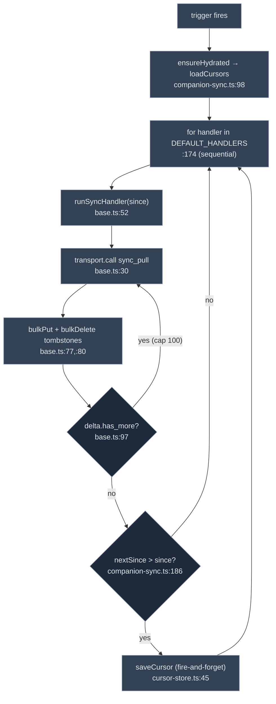

# Sync & Offline

<Status variant="beta">beta · offline-first</Status>

<TLDR>
  The phone keeps its own Dexie database and reads from it first; the network only fills it in. The
  engine is `runSyncDown` (`companion-sync.ts:161`), which iterates **10** registered table handlers
  in order, each calling the `sync_pull` RPC with its last cursor and applying the returned delta
  (`bulkPut` + tombstone `bulkDelete`) through the generic `runSyncHandler` (`base.ts:52`). Cursors
  persist per-table in Dexie (`cursor-store.ts`) and advance only monotonically. Four triggers drive a
  sync — foreground, event-driven, network-up, and resume — and `useDexieFirstQuery`
  (`use-dexie-first-query.ts:54`) is the read primitive that renders from Dexie immediately and kicks a
  background sync on mount.
</TLDR>

<StatGrid>
  <Stat label="Sync handlers" value="10" hint="DEFAULT_HANDLERS — companion-sync.ts:52" />
  <Stat label="RPC" value="sync_pull" hint="base.ts:30" />
  <Stat label="Page cap" value="100" hint="MAX_PAGES — base.ts:38" />
  <Stat label="Cursor table" value="syncCursors" hint="Dexie v44 — cursor-store.ts" />
  <Stat label="Triggers" value="4" hint="foreground · event · network · resume" />
</StatGrid>

## The orchestrator

`runSyncDown(opts)` (`companion-sync.ts:161`) iterates `DEFAULT_HANDLERS` (`:52`, the 10 tables in
execution order) **sequentially** (`:174`). A re-entrancy gate (`inflight`, `:163`) prevents overlap
except for targeted `opts.only` runs. For each handler it reads the table's cursor (`:176`), calls
`run(t, { since })` (`:177`), applies a **monotonic guard** (`nextSince > since`, `:186`) so a stale
response can't rewind the cursor, and fire-and-forget-persists the new cursor (`:196`). `ensureHydrated()`
(`:98`) loads the cursor map once on first run.



## The handlers

Each handler is thin — it delegates to `runSyncHandler<TRow extends { id: string }>` (`base.ts:52`),
which drains pages until `!has_more` (cap `MAX_PAGES = 100`, `:38`), `bulkPut`s rows and `bulkDelete`s
tombstones keyed by `id`:

| Handler | Table | Strategy | Entry |
| --- | --- | --- | --- |
| `syncCharacters` | `characters` | `bulkPut`; filters built-ins | `characters.ts:15` |
| `syncSkills` | `skills` | `bulkPut` | `skills.ts:8` |
| `syncSessions` | `sessions` | `bulkPut` | `sessions.ts:8` |
| `syncMessages` | `messages` | `bulkPut`, **paged** | `messages.ts:14` |
| `syncWorkflows` | `workflows` | `bulkPut`; filters built-ins | `workflows.ts:14` |
| `syncTwinProfile` | `twinProfile` | `bulkPut` | `twin-profile.ts:13` |
| `syncPlugins` | `plugins` | `bulkPut` | `plugins.ts:12` |
| `syncAdapterInstances` | `adapterInstances` | `bulkPut` | `adapter-instances.ts:13` |
| `syncConversationOverrides` | `conversationOverrides` | `bulkPut` | `conversation-overrides.ts:14` |
| `syncAppSettings` | `settings` | **allowlist-merge** | `app-settings.ts:66` |

These mirror the server's [sync-table allowlist](../../subsystems/companion-api/data-plane-bridges#the-sync-table-allowlist)
one-for-one. The settings handler is special: it does **not** clobber the local singleton — it merges
only the keys in `CROSS_PLATFORM_SETTING_KEYS` (`app-settings.ts:21-40`) via `applySettingsRows`
(`:47`), so device-local preferences survive a sync.

## The cursor store

`cursor-store.ts` persists `{ table, lastSyncAt, since }` rows in the Dexie `syncCursors` table
(v44). `loadCursors()` (`:24`) hydrates the in-memory map; `saveCursor(row)` (`:45`) `put`s one;
`clearCursors()` (`:57`) resets everything (used on `resync_required`). All three are wrapped in a
swallowing try/catch — the cursor store is an optimization, never on the critical read path.

## The triggers

`companion-sync.ts` ships four installers, each wiring a different signal to `runSyncDown`:

| Installer | Signal | Where |
| --- | --- | --- |
| `installForegroundSync` | `visibilitychange` → visible | `:222` |
| `installEventDrivenSync` | the `sync://invalidate` channel | `:239` |
| `installNetworkSync` | network back online | `:256` |
| `installResumeSync` | Capacitor app resume | `:271` |

The `sync://invalidate` channel is how a WebSocket event ([event bus](../../subsystems/companion-api/events-ws-push#the-event-bus))
turns into a targeted re-pull: a frame arrives, the WS handler emits `sync://invalidate`, and the
event-driven installer runs `runSyncDown({ only: [table] })` for just the affected table.

## The read primitive

`useDexieFirstQuery<T>(opts)` (`use-dexie-first-query.ts:54`) is how screens read data:

```ts title="hooks/data/use-dexie-first-query.ts:54"
const data = useClientLiveQuery(opts.query, opts.deps, opts.initial)  // :57 — renders from Dexie now
useEffect(() => { /* :75 */
  if (opts.table) { await runSyncDown(); snapshot getSyncStateFor(table) }  // :87,:93
}, …)
return { data, isSyncing, lastSyncedAt, error }  // :106
```

It renders the local IndexedDB rows immediately (offline-first), then kicks a background sync on mount
and surfaces an SWR-style `{ isSyncing, lastSyncedAt, error }` status. The UI never blocks on the
network.

## Offline & outbound

Reads always work offline from Dexie. Writes go through `transport.call`, which on the mobile path
mints an [Idempotency-Key](./transport-layer#call--transport-companionts290) so a retry after a flaky
connection is safe to replay. The connection state and last-seen are surfaced by
`components/mobile/me/sync-status-panel.tsx` and `connection-state-badge.tsx`; an `OfflineBanner`
(`components/mobile/offline-banner.tsx`) shows when `@capacitor/network` reports disconnected.

## Related pages

<Cards>
  <Card title="External API: data plane & bridges" href="../../subsystems/companion-api/data-plane-bridges" description="The server side of sync_pull and the 10-table allowlist this mirrors." />
  <Card title="External API: events, WS & push" href="../../subsystems/companion-api/events-ws-push" description="The WebSocket frames that drive sync://invalidate." />
  <Card title="Transport layer" href="./transport-layer" description="The transport.call that every handler and write goes through." />
</Cards>
