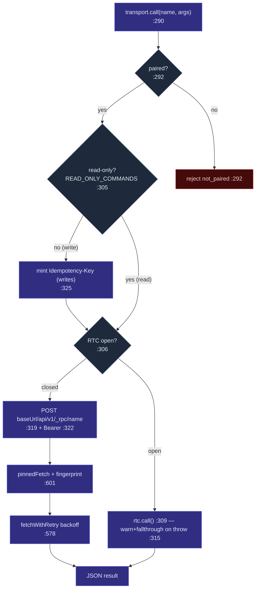

# Transport Layer

<Status variant="beta" />

<TLDR>
  `Transport` (`transport-types.ts:19`) is a two-method interface — `call(name, args)` and
  `subscribe(event, handler)` — that every part of the shared bundle uses instead of touching Tauri or
  HTTP directly. `pickTransport()` (`transport-instance.ts:22`) selects the implementation once at
  module load: `TauriTransport` (IPC) on desktop, `CompanionTransport` on Capacitor, `WebStubTransport`
  in a plain browser. `CompanionTransport` (`transport-companion.ts`) POSTs to `/api/v1/_rpc/<name>`
  with a Bearer JWT through a **TLS-pinned** fetch and opens one `/ws/v1/events` socket with `?since=`
  replay. On cellular it transparently upgrades to a **WebRTC DataChannel** sub-tier (`transport-rtc.ts`)
  and falls back to HTTP on failure. Credentials live in the OS keystore via `SecureStorage`
  (`companion-storage.ts:127`).
</TLDR>

<StatGrid>
  <Stat label="Selector states" value="3" hint="Tauri / Companion / WebStub" />
  <Stat label="Call timeout" value="30 s" hint="transport-companion.ts:206" />
  <Stat label="Transport tiers" value="4" hint="ws-lan · ws-tunnel · rtc-direct · rtc-relay" />
  <Stat label="Config key" value="cognia.companion.config.v1" hint="companion-storage.ts:68" />
</StatGrid>

## The interface

```ts title="lib/tauri/transport-types.ts"
export interface Transport {
  call<T = unknown>(name: string, args?: Record<string, unknown>): Promise<T>  // :19
  subscribe<T = unknown>(event: string, handler: (payload: T) => void): () => void  // :26
}
```

`lib/tauri.ts` is the public barrel — it re-exports the singleton `transport`, the `isTauri` /
`isCapacitor` detectors, and the plugin wrappers. Nothing in `app/`, `components/`, or `hooks/`
constructs a transport; they import `transport` and call it.

## Tri-state selection

```ts title="lib/tauri/transport-instance.ts:22"
function pickTransport(): Transport {
  if (isTauri()) return new TauriTransport()       // __TAURI_INTERNALS__ present
  if (isCapacitor()) return new CompanionTransport() // Capacitor.isNativePlatform()
  return new WebStubTransport()                     // plain web
}
export const transport = pickTransport()            // eager, module-load
```

`isTauri` / `isCapacitor` delegate to the canonical detection leaf `@/lib/platform/detect` (`:16`) —
the file inspects no `window` global directly. The selection is **3-state**; the WebRTC tier is *not*
a fourth peer here — it is a sub-tier *inside* `CompanionTransport`, reachable only on the Capacitor
branch and chosen per-call at runtime.

| Implementation | `call` | `subscribe` |
| --- | --- | --- |
| `TauriTransport` (`transport-tauri.ts`) | `@tauri-apps/api` `invoke` | `listen` → unsubscribe |
| `CompanionTransport` (`transport-companion.ts:290`) | `POST {baseUrl}/api/v1/_rpc/<name>` + Bearer | `GET {baseUrl}/ws/v1/events` |
| `WebStubTransport` (`transport-web.ts`) | rejects (`tauri-only command from web`) | no-op |

## CompanionTransport — the HTTP+WS path

### call() — `transport-companion.ts:290`



A write mints an `Idempotency-Key = crypto.randomUUID()` only when the name is **not** in
`READ_ONLY_COMMANDS` (`:15-59`, `:325`) — that set is the client mirror of the Rust
`READ_ONLY_COMMANDS` and must stay in lockstep. If the RTC tier is open it routes through `rtc.call()`
(`:309`) and, on any throw, warns and falls through to HTTP (`:315`). `fetchWithRetry` (`:578`) backs
off over `[250, 500, 1000] ms` (`:200`) within a 30-second `CALL_TIMEOUT_MS` (`:206`), routing through
`pinnedFetch` (`:601`) with the server fingerprint; `401` flips the connection state to
`unauthenticated` and throws non-retryably (`:637`).

### subscribe() — `transport-companion.ts:334`

Registers the handler per channel (`:341`), also subscribes on the RTC tier when open (`:351`), and
opens the WebSocket if none exists (`:356`). `openWebSocket` (`:680`) computes `since` as the highest
seq across channels (`globalMaxSeq`, `:827`), rewrites `https→wss`, and connects to
`{wsBase}/ws/v1/events?token=<jwt>&since=<seq>` (`:688-689`). `handleWsMessage` (`:726`) handles
`resync_required` (clears cursors, `:739`), replies `pong` to `ping` (`:758`), and dispatches event
frames while advancing the per-channel cursor (`:771-782`). Reconnect backs off over
`[1, 2, 4, 8, 16, 30] s` (`:197`); when the last channel unsubscribes the socket closes after a 30-second
grace (`WS_CLOSE_GRACE_MS`, `:203`).

## TLS-pinned fetch

`pinned-fetch.ts` routes the request through the native `CapacitorHttp` plugin with
`serverTrustMode: "self-signed"` so the phone trusts the desktop's self-signed cert **and** verifies the
SPKI fingerprint, something the WebView's `fetch` cannot do. This is why `capacitor.config.ts` sets
`CapacitorHttp.enabled: true`. The fingerprint comes from the stored `CompanionConfig.serverFingerprint`.

## Transport tiers

`CompanionTransport` exposes the *quality* of the live connection as a `TransportTier`
(`transport-companion.ts:145`), surfaced in the UI by `transport-tier-indicator.tsx`:

| Tier | Meaning | How chosen |
| --- | --- | --- |
| `ws-lan` | WebSocket to a LAN/`.local`/loopback host | `classifyWsHost` (`:173`) |
| `ws-tunnel` | WebSocket over the Cloudflared tunnel | `classifyWsHost` (`:173`) |
| `rtc-direct` | WebRTC, host/srflx ICE pair | `getSelectedCandidateKind` (`transport-rtc.ts:469`) |
| `rtc-relay` | WebRTC over a TURN relay | same |

`recomputeTier()` (`:549`) prefers an open RTC tier, else the classified WS host, else offline;
consumers subscribe via `onTierChange` (`:526`).

## The WebRTC sub-tier

`TransportRtc` (`transport-rtc.ts`) is the offerer half of [ADR-0021](../../adr/0021-webrtc-datachannel-wan-transport).
It is *not* selected by `pickTransport`; it is *enabled* by `enableWebRtcTier()` (`:395`), called from
the [mobile signaling controller](./webrtc-transport#the-controllers) when the network conditions
warrant it. `call()` (`:416`) sends `{ id, method, params }` over the DataChannel (`:432`) with a
30-second timeout (`:178`); `subscribe()` (`:437`) dispatches `{ kind: "event", event, seq, payload }`
frames. On `closed`/`failed`, `CompanionTransport`'s listener drops `this.rtc = null`
(`transport-companion.ts:424`), so subsequent calls skip the RTC branch and use HTTP — the fallback is
automatic. Full mechanics are in [WebRTC transport](./webrtc-transport).

## Credential storage

`CompanionConfig` (`companion-storage.ts:28`) is `{ baseUrl, deviceJwt, deviceId, serverVersion,
serverFingerprint?, rendezvousId?, rendezvousSecret? }`. The `CompanionConfigStorage` interface (`:62`)
has two implementations selected by `pickCompanionStorage()` (`:165`):

- **`LocalStorageCompanionStorage`** (`:74`) — `window.localStorage`, for web/jsdom.
- **`SecureStorageCompanionStorage`** (`:127`) — the iOS Keychain / Android Keystore via
  `capacitor-secure-storage-plugin`, under key `cognia.companion.config.v1` (`:68`).

Reads use an in-memory cache in `transport-companion.ts` — `hydrateCompanionConfig()` (`:83`) warms it
at startup so `call()` reads the JWT synchronously, and `saveCompanionConfig()` (`:88`) updates the
cache *before* awaiting the keystore write. The config is **never** written to
`~/.claude/.credentials.json` — that file is owned by subscription OAuth, unrelated to mobile.

## Related pages

<Cards>
  <Card title="External API: RPC manifest" href="../../subsystems/companion-api/rpc-manifest" description="The server side of these _rpc calls, and the READ_ONLY set the client mirrors." />
  <Card title="WebRTC transport" href="./webrtc-transport" description="The DataChannel offerer, the signed envelope, and the rendezvous server." />
  <Card title="Discovery & pairing" href="./discovery-pairing" description="How baseUrl + fingerprint + JWT get into the CompanionConfig in the first place." />
</Cards>
