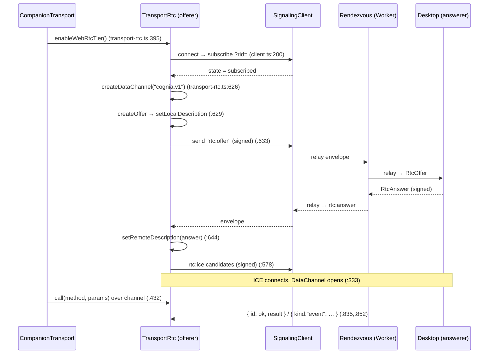

# WebRTC Transport

<Status variant="beta">beta · M-RTC</Status>

<TLDR>
  When the phone is on cellular — no LAN, no tunnel — `CompanionTransport` upgrades to a **WebRTC
  DataChannel**. The phone is the **offerer**: `TransportRtc` (`transport-rtc.ts`) creates the
  `cognia.v1` DataChannel and an SDP offer, exchanges it through a `SignalingClient`
  (`lib/signaling/client.ts:89`) connected to a public rendezvous, and on open routes `transport.call`
  over the channel. Every signaling frame is wrapped in an HMAC-SHA256-signed canonical-JSON envelope
  (`lib/signaling/envelope.ts`) keyed by the `rendezvousSecret` from pairing — the byte-exact TS twin
  of the Rust envelope, so neither end trusts the relay. The rendezvous is a tiny Cloudflare Worker
  that shards one **Durable Object per room** and forwards opaque envelopes between peers.
</TLDR>

<StatGrid>
  <Stat label="DataChannel" value="cognia.v1" hint="types.ts:97 — ordered" />
  <Stat label="Phone role" value="offerer" hint="desktop is answerer" />
  <Stat label="Replay LRU" value="256" hint="types.ts:88" />
  <Stat label="Rendezvous" value="wss://signaling.cognia.cn" hint="types.ts:108" />
  <Stat label="Room cap" value="4 peers / 1 desktop" hint="wrangler.toml" />
</StatGrid>

## Where it sits

This is the client half of the [WebRTC signaling plane](../../subsystems/companion-api/signaling-webrtc).
`TransportRtc` is *enabled* (not selected) by `enableWebRtcTier()` (`transport-rtc.ts:395`), invoked by
the mobile controller; `CompanionTransport` then prefers it per-call and falls back to HTTP if it
closes. The split-by-role is deliberate: the **phone offers** (it knows when it needs the channel), the
**desktop answers** (it keeps a standing rendezvous client per paired device).

## The offerer

`TransportRtc.connect()` (`:258`) builds a `SignalingClient` and, when it reports `subscribed`, runs
`startNegotiation()` (`:563`):

`call()` (`:416`) sends `{ id: "rpc-N", method, params }` (`:420`) over `dc.send` (`:432`), resolved by
matching `{ id, ok, result|error }` in `handleDataChannelMessage` (`:852`); `subscribe()` (`:437`)
dispatches `{ kind: "event", event, seq, payload }` frames (`:835`) with a per-channel seq cursor.
Resilience: reconnect backoff `[1…60] s` (`:66`), throttled `reconnectNow` (`:379`), and an ICE-restart
ladder (`attemptIceRestart`, `:760`; `createOffer({ iceRestart: true })`, `:772`).

## The signed envelope (TS twin)

`lib/signaling/envelope.ts` is byte-compatible with the [Rust
envelope](../../subsystems/companion-api/signaling-webrtc#the-signed-envelope) — a cross-implementation
MAC test pins them together. The relay is untrusted, so authenticity is end-to-end:

- **Canonical JSON** — `canonicalJson` (`:71`) sorts keys (`:94`) and rejects non-finite and
  **non-integer** numbers (`:86-88`) to stay byte-identical with Rust's serde output.
- **Sign** — `buildSignedEnvelope` (`:159`) drafts with `mac: ""`, then `macFor` (`:236`) HMAC-SHA256s
  the canonical bytes with the 32-byte imported `rendezvousSecret` (`importSecret`, `:122`).
- **Verify** — `verifySignedEnvelope` (`:203`) checks shape, `ver === 1`, the clock-skew window
  (`REPLAY_CLOCK_SKEW_MS`, `types.ts:85`), and a constant-time MAC compare (`:216`).
- **Replay** — `ReplayWindow` (`:267`); `observe(role, seq, nonce)` (`:282`) keeps a per-role
  256-entry LRU (`REPLAY_LRU_CAPACITY`, `types.ts:88`) on both `(role,seq)` and `(role,nonce)`.

`freshNonce` (`:250`) supplies 16 random bytes per envelope.

## The signaling client

`SignalingClient` (`client.ts:89`) is a thin WSS client to the rendezvous. `connectUrl()` appends
`?rid=<rendezvousId>` (`:200`) so the Worker can route the connection to the right room. On open it
sends a `subscribe` frame and starts a 25-second ping (`:214-221`). `send(kind, body)` (`:156`) builds
a signed envelope, base64url-encodes it, and wraps it in a `relay` `ClientFrame` (`:168`). Inbound
server frames are handled in `handleRaw` (`:238`): `subscribed` / `peerJoined` / `peerLeft` / `relay`
/ `pong` / `error`; terminal errors `room_full` / `role_taken` (`:49`) reject the connection.
`handleRelay` (`:289`) parses, **verifies** (`:297`), **replay-checks** (`:304`), then emits the
envelope. The wire types (`ClientFrame` / `ServerFrame` / `Envelope` / `EnvelopeKind`, `types.ts:16-49`)
mirror the Rust `proto` crate exactly.

## The controllers

The controllers only wire configuration — they do *not* contain the RTC logic:

- **`mobile-controller.ts`** (Capacitor) — `installMobileSignalingController` (`:63`) projects
  `AppSettings` into a call to `tx.enableWebRtcTier({ signalingUrl, rtcConfiguration })` (`:169`),
  deciding *when* the phone should attempt the RTC tier.
- **`desktop-controller.ts`** (Tauri) — `installDesktopSignalingController` (`:90`) pushes the paired
  device list + config into the Rust hub via `companion_signaling_sync_devices` /
  `companion_signaling_configure` (`:113-140`).

## The rendezvous server

`signaling-server/` is a Rust signaling relay with two interchangeable backends sharing the
`cognia_signaling_core` crate (`proto` / `policy` / `limits`). The client sends `?rid=` either way; the
HMAC envelope is **opaque** to both — the server forwards it verbatim and never sees plaintext.

### Cloudflare Worker (production)

The deployed backend is a Worker that shards **one Durable Object per room**:

- `lib.rs:fetch` (`:23`) routes `/healthz` (`:32`) and `/v1/signaling` → `route_signaling` (`:37`).
- `route_signaling` (`:59`) requires the WebSocket upgrade, checks origin, reads `?rid=` (`:74`), and
  resolves the DO with `env.durable_object("ROOM").id_from_name(&rid).get_stub()` (`:84`) — so each
  room is an isolated, single-instance actor.
- `RoomDurableObject` (`room.rs:68`) uses hibernatable WebSockets; `websocket_message` (`:123`) mirrors
  the axum backend frame-for-frame — `Subscribe` (policy-gated `evaluate_subscribe`, `:179`),
  `Unsubscribe`, `Relay` → fan-out to `subscribed_others` (`:233`), `Ping`. Room caps come from
  `wrangler.toml` `[vars]`: `SIGNALING_MAX_PEERS_PER_ROOM = 4`, `SIGNALING_MAX_DESKTOPS = 1`,
  `SIGNALING_MAX_CONN_PER_IP_PER_ROOM = 4`. The Worker is `cognia-signaling`, bound to the custom
  domain `signaling.cognia.cn` (a `*.workers.dev` host is GFW-blocked in CN).

### axum (self-host)

`signaling-server/src/` is the equivalent single-process server for self-hosting: `router()`
(`server.rs:76`) serves `/healthz`, `/metrics`, and `any /v1/signaling` → `ws_upgrade` (`ws.rs:62`); a
`Mutex<HashMap<rid, Vec<PeerHandle>>>` `RoomRegistry` (`room.rs:45`) holds rooms in memory; `handle_frame`
(`ws.rs:256`) implements the same `Subscribe` / `Relay` / `Ping` semantics. Default `$PORT` 7892,
deployable to Fly.io.

## Why this design

- **Zero-trust relay.** The rendezvous can be a commodity Worker because it only moves signed,
  replay-protected envelopes. Compromising it leaks nothing and forges nothing.
- **One room, one actor.** A Durable Object per `rid` gives strict per-room isolation and trivial
  fan-out without a shared datastore.
- **Same protocol, two backends.** Sharing `cognia_signaling_core` means the TS client, the Rust
  desktop answerer, the axum self-host, and the Worker all speak one wire format — verified by the
  cross-impl MAC test.

## Related pages

<Cards>
  <Card title="External API: WebRTC signaling plane" href="../../subsystems/companion-api/signaling-webrtc" description="The desktop answerer, the webrtc-rs peer, and the DataChannel→dispatch pump." />
  <Card title="Transport layer" href="./transport-layer" description="How CompanionTransport enables, prefers, and falls back from the RTC tier." />
  <Card title="Discovery & pairing" href="./discovery-pairing" description="Where the rendezvousId + rendezvousSecret are minted." />
</Cards>
