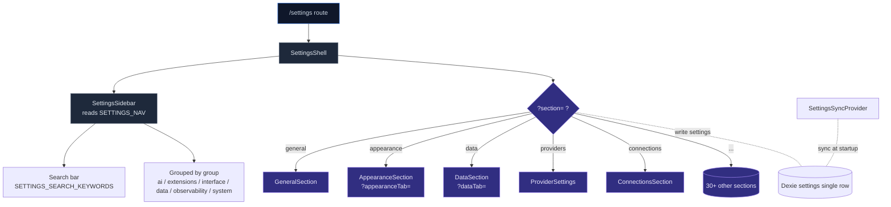

# Settings UI

cognia-next's settings center is a **single-page + sidebar navigation** subsystem: a grouped sidebar on the left, and a dynamically loaded "section" on the right driven by URL parameters. All configurable options for every subsystem are exposed through this single entry point, using the same layout, the same i18n keys, and the same URL protocol (`?section=` selects the section, `?<sectionTab>=` selects its internal sub-tab).

## TL;DR

<TLDR>

- Routing = `/settings`, a single route; section switching uses `?section=<id>` query without full-page reload.
- Navigation source of truth: `components/settings/settings-nav-config.ts` — a static `SETTINGS_NAV[]` array; add a section by adding one line here.
- Each section is an independent component, asynchronously loaded via `dynamic()`, landing in the `<SectionContent>` big switch inside `settings-shell.tsx`.
- Second-level tabs are maintained by the section itself; the URL key uses `?<sectionName>Tab=` (e.g. `?dataTab=overview`, `?appearanceTab=theme`) for deep-linking.
- Desktop and mobile reuse the same `SettingsShell`; the mobile shell wraps it in a drawer with tighter spacing.
- Settings data lives in the Dexie `settings` table (single row with key `"singleton"`), synced from Rust at startup by `SettingsSyncProvider`.

</TLDR>

## Overall Structure



## Navigation Registry

`components/settings/settings-nav-config.ts` is the **sole** source of truth for the settings sidebar. It exports three things:

```ts title="components/settings/settings-nav-config.ts"
export type SettingsGroup = "ai" | "extensions" | "interface" | "data" | "observability" | "system"

export type SettingsSectionId =
  | "general"
  | "api-key"
  | "providers"
  | "subscription"
  | "ccswitch"
  | "agents"
  | "agent-modes"
  | "agent-runtime"
  | "agent-teams"
  | "hooks"
  | "slash-commands"
  | "tools"
  | "search"
  | "appearance"
  | "speech"
  | "characters"
  | "skills"
  | "subagents"
  | "teams"
  | "presets"
  | "artifacts"
  | "canvas"
  | "mcp"
  | "a2ui"
  | "plugins"
  | "connections"
  | "data"
  | "workflows"
  | "scheduled-tasks"
  | "logs"
  | "diagnostics"
  | "remote-control"
  | "external-bridge"
  | "companion"
  | "network"
  | "desktop"
  | "about"

export const SETTINGS_NAV: NavItem[]
export const SETTINGS_GROUP_ORDER: SettingsGroup[]
export const SETTINGS_SEARCH_KEYWORDS: Record<SettingsSectionId, string[]>
```

Each `NavItem`:

```ts
interface NavItem {
  id: SettingsSectionId
  labelKey: string // i18n key under settings.tabs.<key>
  descriptionKey: string // settings.descriptions.<key>
  group: SettingsGroup
  icon: ComponentType<{ className?: string }>
  desktopOnly?: boolean // Tauri/desktop only
}
```

Entries with `desktopOnly: true` (e.g. `subscription`, `ccswitch`, `hooks`, `tools`, `connections`, `remote-control`, `companion`, `desktop`) are automatically filtered out by the sidebar when `usePlatform() === "web" | "mobile"`. This is a single toggle; the section itself does not need to repeat the check.

## Group Semantics

| Group           | Meaning                        | Typical sections                                                              |
| --------------- | ------------------------------ | ----------------------------------------------------------------------------- |
| `ai`            | Models, keys, agent behavior   | general, api-key, providers, subscription, ccswitch, agents...                |
| `extensions`    | User-assemblable extension points | characters, skills, teams, mcp, a2ui, plugins, connections                 |
| `interface`     | Visuals and interaction        | appearance, speech, presets, artifacts, canvas                                |
| `data`          | Data lifecycle                 | data (backup/export), workflows, scheduled-tasks                              |
| `observability` | Troubleshooting and monitoring | logs, diagnostics                                                             |
| `system`        | System-level integrations      | remote-control, external-bridge, companion, network, desktop, about           |

Order is controlled by `SETTINGS_GROUP_ORDER`, **not** alphabetical.

## Shell: URL as State

`components/settings/settings-shell.tsx` is the skeleton:

```tsx title="components/settings/settings-shell.tsx (excerpt)"
const requested = searchParams.get("section")
const activeSection: SettingsSectionId = isSection(requested) ? requested : "general"

const handleSectionSelect = (section: SettingsSectionId) => {
  const next = new URLSearchParams(searchParams.toString())
  next.set("section", section)
  router.replace(`/settings?${next.toString()}`, { scroll: false })
}
```

Key design decisions:

1. **`router.replace` instead of `push`** — switching tabs inside settings does not pollute the history stack; one browser back takes the user directly to the app's main screen.
2. **Fallback to `general` without validation** — the `isSection()` guard catches invalid values, preventing broken links from throwing errors.
3. **URLSearchParams copy** — preserves second-level tabs within the section (`?dataTab=`, `?appearanceTab=`).

Sections are loaded with `next/dynamic`:

```tsx
const DataSection = dynamic(() => import("./data/data-section").then((m) => m.DataSection), {
  ssr: false,
  loading: () => <SectionLoading />,
})
```

`ssr: false` — the settings page only runs on the client (Dexie is IndexedDB, which does not exist during SSR). `<SectionLoading />` is a skeleton placeholder to avoid blank flashes.

### Suspense Boundary

The entire Shell is wrapped in `<Suspense>` to satisfy the Next.js 16 requirement for `useSearchParams()`:

```tsx
export function SettingsShell({ actions }: Props = {}) {
  return (
    <Suspense fallback={<SettingsShellFallback />}>
      <SettingsShellInner actions={actions} />
    </Suspense>
  )
}
```

### FILL_HEIGHT_SECTIONS

Some sections (e.g. `providers`, which uses a list+detail dual-column layout) have their own internal scrolling; an outer `ScrollArea` would cause double scrollbars. Members of the `FILL_HEIGHT_SECTIONS` set bypass the outer ScrollArea, filling the full height and managing scrolling internally:

```tsx
const FILL_HEIGHT_SECTIONS = new Set<SettingsSectionId>(["providers"])
```

To give a new list+detail section the same experience, add its id to this set.

## Tabbed Shell Inside a Section

Most sections contain another tabbed container. Conventions:

- URL key = `?<section>Tab=<tabId>`, e.g. `?dataTab=backup`, `?appearanceTab=theme`, `?wfTab=runs`.
- Tab state lives in the query, **not** in React local state (so it survives refresh).
- Use shadcn `<Tabs>`, with the TabsList wrapped in `overflow-x-auto` for narrow screens.

### Template: data-section

```tsx title="components/settings/data/data-section.tsx (excerpt)"
const DATA_TAB_PARAM = "dataTab"
export type DataTabId = "overview" | "backup" | "domain" | "maintenance"

export function DataSection() {
  const router = useRouter()
  const searchParams = useSearchParams()
  const requested = searchParams.get(DATA_TAB_PARAM)
  const activeTab: DataTabId = isDataTab(requested) ? requested : "overview"

  const onTabChange = (value: string) => {
    if (!isDataTab(value)) return
    const next = new URLSearchParams(searchParams.toString())
    next.set(DATA_TAB_PARAM, value)
    router.replace(`?${next.toString()}`, { scroll: false })
  }

  return (
    <Tabs value={activeTab} onValueChange={onTabChange}>
      <TabsList>
        <TabsTrigger value="overview">Overview</TabsTrigger>
        <TabsTrigger value="backup">Backup & Restore</TabsTrigger>
        <TabsTrigger value="domain">Domain Transfer</TabsTrigger>
        <TabsTrigger value="maintenance">Maintenance</TabsTrigger>
      </TabsList>
      <TabsContent value="overview">
        <DataOverviewTab />
      </TabsContent>
      {/* ... */}
    </Tabs>
  )
}
```

When writing a new section, copy this 35-line template directly, changing `DATA_TAB_PARAM`, `DataTabId`, and the TabsContent contents.

### Existing Tabbed Sections

| Section           | URL tab key       | tabs                                                              |
| ----------------- | ----------------- | ----------------------------------------------------------------- |
| `data`            | `?dataTab=`       | overview / backup / domain / maintenance                          |
| `appearance`      | `?appearanceTab=` | theme / wallpaper / custom / import / typography / advanced       |
| `workflows`       | `?wfTab=`         | library / runs / templates / defaults / audit                     |
| `subscription`    | `?subTab=`        | overview / account / usage / settings                             |
| `connections`     | (inline)          | overview / adapters / conversations / inbox / outbound / audit    |
| `external-bridge` | (inline)          | server / scopes / setup / audit                                   |

## Search and Keyboard

A search box at the top of the sidebar matches across label, description, and `SETTINGS_SEARCH_KEYWORDS`:

```ts
export const SETTINGS_SEARCH_KEYWORDS: Record<SettingsSectionId, string[]> = {
  general: ["defaults", "model", "system prompt", "permission"],
  "api-key": ["anthropic", "key", "secret", "claude"],
  providers: ["openai", "anthropic", "google", "gemini", "mistral", ...],
  // ...
}
```

When adding a section, be sure to add keywords at the same time — otherwise a user searching for "openai" won't find providers.

## Desktop vs Mobile

The desktop shell uses `<SidebarProvider>` wrapping `<SettingsSidebar>` and `<SidebarInset>`, with a fixed width of `15rem`; it automatically collapses to a hamburger menu button on narrow screens.

The mobile shell (`components/mobile/settings/mobile-settings-panel.tsx`) puts the same `SettingsShell` inside a Sheet drawer:

- On entering `/settings`, it checks `usePlatform()`.
- Mobile = a top-bar hamburger button triggers the Sheet; the section list lives inside the Sheet; the Sheet auto-closes after selection.
- Mobile chrome (status bar / safe area) is handled by the top-level mobile-shell-wrapper; the settings panel does not repeat that concern.

## SettingsSyncProvider

Settings data itself flows through `lib/settings/` + Dexie:

- **Dexie table**: `settings`, single row, primary key `"singleton"`. Schema details in [storage](../data/storage).
- **TypeScript type**: `AppSettings` from `types/settings/index.ts`; each subsystem owns its own namespace (`AppSettings.externalBridge`, `AppSettings.connectors`, ...).
- **Provider**: `SettingsSyncProvider` (the 3rd provider in the `app/layout.tsx` provider chain), which calls `settings_load` from Rust at startup; reverse writes are automatically mirrored by Dexie live query.
- **Store**: Zustand `useSettingsStore`; section components read directly via `useSettingsStore((s) => s.settings?.something)`, and update via `useSettingsStore.getState().setSettings(...)`.

Every section's write path is: local form state → validation → `setSettings({ ...partial })` → Dexie patch → live query notifies all subscribers. The Rust side does not hold the full settings directly; only a few commands (e.g. `external_bridge_set_scopes`) read a snapshot from the store and persist it to sqlite.

## Adding a New Section (Steps)

<Steps>

<Step>

### Write the component

Create `components/settings/<area>/<area>-section.tsx` with a named export. If it has second-level tabs, reuse the data-section template.

</Step>

<Step>

### Register in SETTINGS_NAV

Add a line to the array in `settings-nav-config.ts`:

```ts
{
  id: "my-section",
  labelKey: "mySection",
  descriptionKey: "mySection",
  group: "extensions",
  icon: BlocksIcon,
  desktopOnly: false,
}
```

Also add the member to the `SettingsSectionId` union.

</Step>

<Step>

### Write i18n

Add keys under `settings.tabs` and `settings.descriptions` in both `i18n/messages/en.json` and `i18n/messages/zh-CN.json`.

</Step>

<Step>

### Register in the Shell

In `settings-shell.tsx`:

```tsx
const MySection = dynamic(() => import("./my-area/my-section").then((m) => m.MySection), {
  ssr: false,
  loading: () => <SectionLoading />,
})
```

Add a `case "my-section": return <MySection />` to the `<SectionContent>` switch.

</Step>

<Step>

### Add search keywords

`SETTINGS_SEARCH_KEYWORDS["my-section"] = ["...", "..."]`.

</Step>

<Step>

### Write tests

`<area>-section.test.tsx` plus tests for each sub-tab, targeting ≥90% coverage.

</Step>

</Steps>

## Testing

| File                          | Coverage                                                                 |
| ----------------------------- | ------------------------------------------------------------------------ |
| `settings-nav-config.test.ts` | Type IDs match array members one-to-one, group order, keyword index completeness |
| `settings-shell` indirect     | Section switching, URL validation, ScrollArea switching                  |
| Each section `*.test.tsx`     | Form state, Dexie write path, degradation branches                       |

Verify overall thresholds with `pnpm test:coverage`; CI will fail if a new section does not reach 90%.

## URL Protocol Summary

| URL                                                 | Behavior                                              |
| --------------------------------------------------- | ----------------------------------------------------- |
| `/settings`                                         | Default section = `general`                           |
| `/settings?section=providers`                       | Jump to Providers section                             |
| `/settings?section=data&dataTab=backup`             | Data section's backup tab                             |
| `/settings?section=external-bridge`                 | External Bridge section (includes server/scopes subpages) |
| `/settings?section=appearance&appearanceTab=custom` | Appearance custom theme tab                           |

Any setting you want to send as a "deep link to a colleague" should use this URL protocol — it preserves both section and tab state.

## Related Pages

The Settings UI is the "entry panel" for nearly every subsystem. The table below maps each section to its core subsystem documentation:

<Cards>
  <Card
    title="Provider System"
    href="./provider-system"
    description="Registration of 6+ AI providers behind ?section=providers"
  />
  <Card
    title="Platform Connectors"
    href="./platform-connectors"
    description="5 connector adapters under ?section=connections"
  />
  <Card
    title="Backup & Data"
    href="./backup-and-data"
    description="Backup/restore/domain transfer/maintenance under ?section=data"
  />
  <Card
    title="Visual Workflows"
    href="./visual-workflows"
    description="Library / runs / templates / audit under ?section=workflows"
  />
  <Card title="Skills System" href="./skills-system" description="Skill library management under ?section=skills" />
  <Card title="Character Management" href="./chat-and-skills" description="Character editing under ?section=characters" />
  <Card
    title="MCP Servers"
    href="./misc-subsystems"
    description="Local and remote MCP registration under ?section=mcp"
  />
  <Card title="A2UI" href="./a2ui-system" description="A2UI tool panel under ?section=a2ui" />
  <Card title="Plugin System" href="./plugin-system" description="Local plugin installation under ?section=plugins" />
  <Card title="Scheduler" href="./scheduler" description="Cron and history under ?section=scheduled-tasks" />
  <Card
    title="External Bridge"
    href="./external-bridge"
    description="MCP server external exposure under ?section=external-bridge"
  />
  <Card title="Remote Control" href="./remote-control" description="Device linking under ?section=remote-control" />
  <Card
    title="Companion API"
    href="./companion-api"
    description="LAN bind / pair JWT management under ?section=companion"
  />
  <Card
    title="Claude Subscription OAuth"
    href="./claude-subscription-oauth"
    description="Subscription login and quotas under ?section=subscription"
  />
  <Card
    title="CCSwitch"
    href="./ccswitch"
    description="Claude Code profile management under ?section=ccswitch"
  />
  <Card
    title="Appearance, Themes & i18n"
    href="./theming-and-i18n"
    description="Theme / wallpaper / font / language under ?section=appearance"
  />
  <Card title="Slash Commands" href="./slash-commands" description="Registry under ?section=slash-commands" />
  <Card title="Speech" href="./misc-subsystems" description="TTS / STT configuration under ?section=speech" />
  <Card title="Logs" href="./observability" description="?section=logs and ?section=diagnostics" />
</Cards>
