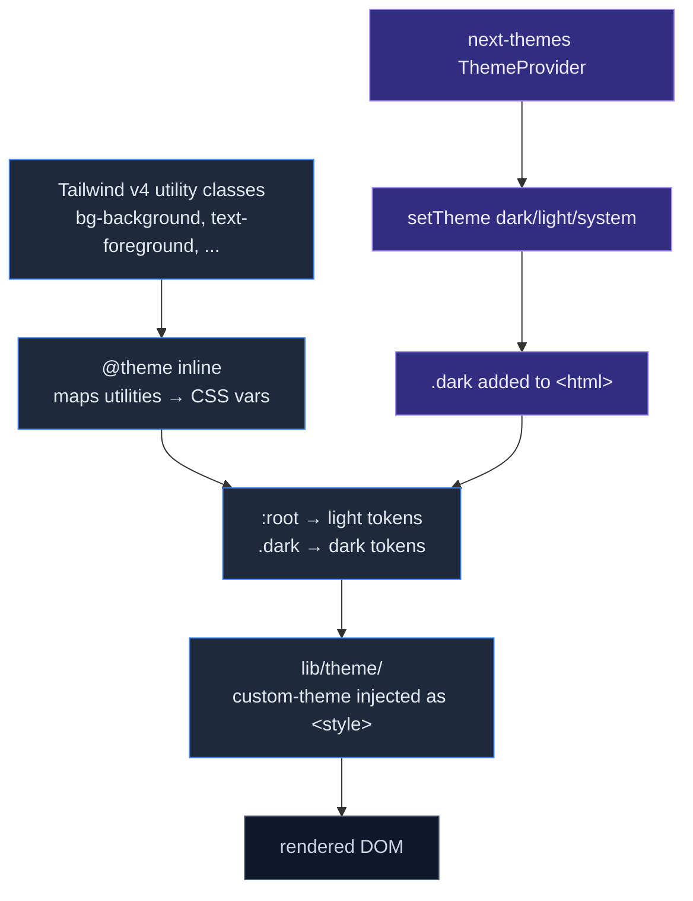

# Theming & i18n

Cognia is fully themeable and ships with English and Simplified Chinese translations. This page covers both the visual theming pipeline and the i18n architecture.

## Tailwind CSS v4

Cognia uses **Tailwind CSS v4** via the PostCSS plugin (`@tailwindcss/postcss`). There is no `tailwind.config.{js,ts}` file — v4 is config-less and reads directives directly from `app/globals.css`.

`app/globals.css`:

```css
@import "tailwindcss";
@import "tw-animate-css";

@custom-variant dark (&:is(.dark *));

@theme inline {
  /* tokens map to CSS variables defined below */
  --color-background: var(--background);
  --color-foreground: var(--foreground);
  /* ... */
}

:root {
  --background: oklch(1 0 0);
  --foreground: oklch(0.145 0 0);
  /* ... */
}

.dark {
  --background: oklch(0.145 0 0);
  --foreground: oklch(0.985 0 0);
  /* ... */
}
```

Notice three things:

1. **`@theme inline`** maps Tailwind utility classes to CSS variables.
2. **CSS variables** are the single source of truth — change `--background` and every `bg-background` class follows.
3. **oklch colour space** (not HSL or RGB) for perceptually uniform contrast across light/dark.

The custom variant `@custom-variant dark (&:is(.dark *))` makes `dark:bg-foo` apply when any ancestor has the `.dark` class. This is class-based dark mode (not `prefers-color-scheme`); `next-themes` toggles `.dark` on `<html>`.

## Theme cascade



## Theme tokens

The full token set in `globals.css` covers:

- `background`, `foreground` — base canvas
- `card`, `card-foreground` — surface
- `popover`, `popover-foreground` — overlays
- `primary`, `primary-foreground` — call-to-action
- `secondary`, `secondary-foreground` — alternative
- `muted`, `muted-foreground` — subdued
- `accent`, `accent-foreground` — highlights
- `destructive`, `destructive-foreground` — danger
- `border`, `input`, `ring` — chrome
- `chart-1` … `chart-5` — chart palette
- `sidebar-*` — sidebar-specific tokens

Every shadcn/ui component reads from these tokens; restyling Cognia is a matter of editing the CSS variables.

## Custom themes

Cognia supports user-supplied custom themes — JSON blobs that override the CSS variables. They live in `lib/themes/` (system + user) and `lib/theme/` (theming runtime).

A custom theme JSON:

```jsonc
{
  "id": "ocean",
  "name": "Ocean",
  "tokens": {
    "light": {
      "--background": "oklch(0.98 0.02 220)",
      "--foreground": "oklch(0.18 0.04 250)",
      // ...
    },
    "dark": {
      // ...
    },
  },
}
```

The theming runtime (`lib/theme/`) injects a `<style>` tag with the active theme's tokens at the top of the body. Switching themes is a re-render of that style tag.

Themes are exportable / importable via the [Domain transfer](../data/backup-and-data#per-domain-transfers) UI.

## Dark mode toggle

The dark mode toggle is wired through `next-themes`:

- `ThemeProvider` (mounted in `app/layout.tsx`) exposes `theme`, `setTheme`, `resolvedTheme`.
- `setTheme("dark" | "light" | "system")` writes to `localStorage` and toggles `.dark` on `<html>`.
- The user's choice persists across sessions.

In components, use `useTheme()` from `next-themes` directly — don't duplicate the state.

## Beautiful HTML / Animated HTML export

The chat export formats (Beautiful HTML, Animated HTML) use the same theme tokens. The exporter:

1. Reads the active theme tokens from `lib/themes/`.
2. Inlines them as a `<style>` block in the exported HTML.
3. Optionally accepts a custom theme override (the export dialog has a JSON editor).

This means an exported chat looks the same whether opened in Cognia, in a browser, or attached to an email.

## Fonts

Geist Sans + Geist Mono via `next/font/google`:

```tsx
// app/layout.tsx
const geistSans = Geist({ variable: "--font-geist-sans", subsets: ["latin"] })
const geistMono = Geist_Mono({ variable: "--font-geist-mono", subsets: ["latin"] })
```

Applied to the `body` element via:

```tsx
<body className={`${geistSans.variable} ${geistMono.variable} antialiased`}>
```

Tailwind's `font-sans` and `font-mono` utilities then read from these CSS variables.

For CJK glyphs, the system fallback chain in `globals.css` covers Chinese / Japanese / Korean. There is **no** webfont download for CJK — system fonts are used to keep the bundle small.

## Internationalisation (next-intl)

`next-intl` is the i18n library. Locales:

- `en` — English (default)
- `zh-CN` — Simplified Chinese

Locales live in `i18n/messages/{en,zh-CN}.json`. The structure mirrors the route tree: `chat.send`, `settings.data.export`, etc.

### Locale gate

`LocaleGate` (`components/providers/locale-gate.tsx`) waits for translations to load before rendering. This prevents a flash of English text when the user's locale is `zh-CN`.

### Usage in components

```tsx
import { useTranslations } from "next-intl"

function Button() {
  const t = useTranslations("chat")
  return <button>{t("send")}</button>
}
```

Pass formatted values:

```tsx
t("greeting", { name: "Alice" })
// "你好，Alice" if zh-CN, "Hello, Alice" if en
```

### Adding a new locale

1. Add `i18n/messages/<locale>.json` mirroring the EN file.
2. Register the locale in `lib/i18n/`.
3. Add a UI control in **Settings → Appearance → Language** (the dropdown reads from the registered list).
4. Translate every key. The build fails if a key is missing.

The translation file is checked into source control. There is no auto-translation pipeline — every string is human-written.

### Adding a new translation key

1. Add the key to **both** `en.json` and `zh-CN.json` under the appropriate section.
2. Use `useTranslations(...)` in the component.
3. Run `pnpm typecheck` — if a key is missing in any locale, TypeScript errors out (the JSON files are typed via `next-intl`'s schema generation).

### CLI message extraction

`next-intl` doesn't ship a built-in extraction tool. Cognia uses a discipline-only approach: every new string goes through `useTranslations` from the start. Ad-hoc strings in components are flagged in code review.

## Locale switcher

The locale switcher is in **Settings → Appearance → Language**. On change:

1. The choice is persisted to the `settings` Dexie table.
2. `LocaleGate` re-fetches the new locale's messages.
3. The UI re-renders.

No reload needed.

## RTL support

`@radix-ui/react-direction` is installed but **not** wired into the theme — Cognia's locales are all LTR today. Adding an RTL locale would require:

1. Wrapping the app in `<DirectionProvider dir="rtl">`.
2. Auditing every CSS rule for direction-sensitive properties (`text-align: left` → `start`, etc.).
3. Replacing `→` arrows with their bidirectional equivalents.

This is documented in case you need to do it; today, it's a follow-up.

## Where to start contributing

| Goal                        | Files                                                  |
| --------------------------- | ------------------------------------------------------ |
| Tweak default theme tokens  | `app/globals.css`                                      |
| Add a built-in custom theme | `lib/themes/`                                          |
| Add a translation           | `i18n/messages/{en,zh-CN}.json`, use `useTranslations` |
| Add a new locale            | New JSON file + register in `lib/i18n/` + settings UI  |
| Add a new chart palette     | `app/globals.css` (`--chart-*` tokens)                 |

## Tests

- Translation keys are validated at build time by `next-intl`.
- `lib/themes/` has unit tests for theme parsing + injection.

## Next

<Cards>
  <Card title="Development workflow" href="../dev/development" description="Daily-loop scripts, conventions, testing." />
  <Card title="Backup & data transfer" href="../data/backup-and-data" description="Custom themes export through the domain transfer system." />
</Cards>
