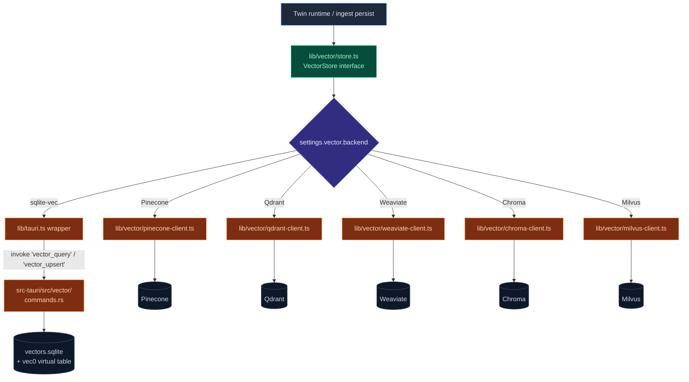

# Vector store

Cognia needs a vector index for the [Employee Digital Twin](./employee-twin) RAG path. The store lives behind a thin abstraction (`lib/vector/store.ts`) so the rest of the app doesn't care which backend is active.

The full design rationale is in [ADR-0004](../adr/0004-vector-native-backend).

## Backends

| Backend                 | Available in  | Notes                                                           |
| ----------------------- | ------------- | --------------------------------------------------------------- |
| **sqlite-vec (native)** | Desktop only  | Default on desktop. Data at `<app_data>/cognia/vectors.sqlite`. |
| **Pinecone**            | Web + Desktop | `@pinecone-database/pinecone`                                   |
| **Qdrant**              | Web + Desktop | `@qdrant/js-client-rest`                                        |
| **Weaviate**            | Web + Desktop | `weaviate-client`                                               |
| **Chroma**              | Web + Desktop | `chromadb`                                                      |
| **Milvus**              | Web + Desktop | `@zilliz/milvus2-sdk-node`                                      |

Web mode hides the native option in twin settings (`!isTauri()`); cloud is required.

<Tabs groupId="vector-backend" persist items={["sqlite-vec", "Pinecone", "Qdrant", "Weaviate", "Chroma", "Milvus"]}>
  <Tab value="sqlite-vec">
    **Pros**: zero ops, single file, no network round-trip, easy to back up.
    **Cons**: desktop only, no horizontal scaling, brute-force scan (fine up to ~100k chunks).

    File: `<app_data>/cognia/vectors.sqlite`. Inspect with `sqlite3` and `.tables`.

  </Tab>
  <Tab value="Pinecone">
    Managed cloud, fastest setup. Set API key + environment in twin settings.
    **Note**: latency is dominated by region — pick the one closest to your users.
  </Tab>
  <Tab value="Qdrant">
    Self-hostable or managed. Supports rich filtering. Good open-source choice
    if you want to keep data in-house.
  </Tab>
  <Tab value="Weaviate">
    Modular, with built-in modules for hybrid search. Heavier infra footprint.
  </Tab>
  <Tab value="Chroma">
    Lightest cloud option. Good for prototyping; enterprise features come later.
  </Tab>
  <Tab value="Milvus">
    Best at very large scale (millions to billions of vectors). Heaviest setup.
    Use only when sqlite-vec / smaller backends won't fit.
  </Tab>
</Tabs>

<Callout type="info" title="Switching backends">
  Re-embedding is **manual**. Use the "Re-embed all" action in the twin Sources tab after switching
  backends — dimensions, distance metrics, and metadata schemas may differ.
</Callout>

## Why sqlite-vec on desktop

ADR-0004 picked sqlite-vec because:

- **Single file** — easy to back up, copy across devices, and inspect with any sqlite tool.
- **No server** — zero ops cost; data lives next to the user's other Cognia data.
- **Bundled in Tauri** — `sqlite-vec = "0.1"` is loaded as a SQLite **auto-extension** before any connection opens. The crate has no rusqlite dependency, so the only constraint is that the host SQLite supports loadable extensions (Tauri's bundled SQLite via `rusqlite` with `bundled` feature does).
- **Fast enough** — for the scale of one user's twin (typically < 100k chunks), sqlite-vec's brute-force scan with SIMD is fine and avoids the complexity of HNSW maintenance.

## Native backend internals

```
src-tauri/src/vector/
  mod.rs          # Public API: register_extension, open_store, etc.
  db.rs           # Connection pool, migration runner
  schema.rs       # Table definitions (vectors + metadata)
  filters.rs      # WHERE clause builder for metadata filters
  types.rs        # Insert / Query / Result structs
  commands.rs     # #[tauri::command] wrappers
  error.rs        # Vector-specific error type
```

### Schema

Two tables per collection:

```sql
CREATE TABLE vec_<name> (
  id        INTEGER PRIMARY KEY,
  embedding BLOB    -- sqlite-vec FIXED-VECTOR encoded
);

CREATE VIRTUAL TABLE vec_<name>_idx USING vec0(
  embedding float[<dim>]
);

CREATE TABLE meta_<name> (
  id        TEXT    PRIMARY KEY,
  source    TEXT    NOT NULL,
  metadata  TEXT    NOT NULL  -- JSON
);
```

The `vec0` virtual table is the sqlite-vec index; the metadata table is plain SQL so we can filter by source / chunk type / etc. before / during similarity search.

### Auto-extension load

`db.rs` registers the sqlite-vec extension via `unsafe { Connection::load_extension_enable() }` **once at process start**, before any connection opens. This mirrors the pattern from sqlite-vec's own integration tests. Subsequent connections inherit the extension.

### Querying

The native `query` command takes:

- A query embedding (Float32 array).
- A collection name.
- Optional metadata filters (key/value JSON match).
- A `topK` cap.

It returns `(id, score, metadata)` triples sorted by cosine similarity. The score range is `[0, 1]` (sqlite-vec returns `1 - cosine`).

## Architecture at a glance



## Frontend abstraction (`lib/vector/`)

```
lib/vector/
  index.ts            # Public API (createStore, fromSettings)
  store.ts            # Implementation switch
  embedding.ts        # Embedding client (also used by twin ingest)
  readiness.ts        # Health check (used by SettingsSyncProvider)
  pinecone-client.ts  # Cloud client implementations
  qdrant-client.ts
  weaviate-client.ts
  chroma-client.ts
  milvus-client.ts
```

`store.ts` exposes a single `VectorStore` interface:

```ts
interface VectorStore {
  upsert(rows: VectorRow[]): Promise<void>
  query(input: QueryInput): Promise<QueryResult[]>
  delete(ids: string[]): Promise<void>
  collectionExists(name: string): Promise<boolean>
  ensureCollection(name: string, dim: number): Promise<void>
}
```

Each backend has its own implementation; `fromSettings(settings)` reads the user's vector settings from Dexie and returns the right one. The native backend goes through `lib/tauri.ts` (commands defined in `src-tauri/src/vector/commands.rs`); cloud backends call their respective SDKs directly.

## Settings

The user picks their backend in **Settings → Twin → Vector store**:

- Backend (radio: sqlite-vec / Pinecone / Qdrant / Weaviate / Chroma / Milvus). Native is hidden in web mode.
- Connection details (URL, API key, namespace) for cloud backends.
- Embedding dimension — must match the chosen embedder's output (default 1536 for OpenAI text-embedding-3-small).

`readiness.ts` runs a health check on save: a tiny upsert + query round-trip. If it fails, the user sees a clear error and the previous backend stays active.

## Re-ingest on backend switch

Switching backends does **not** automatically migrate. The Sources tab in the twin workbench has a "Re-embed all" action that re-runs the embed + persist stages of the ingest pipeline against the new backend. This is the only safe way: dimensions, distance metrics, and metadata schemas may differ.

## Performance notes

<TypeTable
  type={{
    "Batch size": {
      description:
        "100 chunks per LLM embed call, 100 rows per backend upsert. Tunable in `lib/twin/ingest/{embed,persist}.ts`.",
      type: "tuning",
    },
    "Concurrent ingests": {
      description: "One at a time per twin. The job worker enforces this.",
      type: "invariant",
    },
    "Native query latency": {
      description: "sub-50ms for `topK ≤ 20` against ~50k chunks on a 2024-class laptop.",
      type: "metric",
    },
    "Cloud latency": {
      description:
        "Round-trip-dominated; Pinecone us-east-1 is typically 80–150ms from a non-US user.",
      type: "metric",
    },
  }}
/>

<Callout type="info" title="Don't mix dimensions">
  Switching the embedding model means switching the vector dimension — re-embed every chunk before
  querying. The store doesn't auto-detect mismatched dimensions; you'll get nearest-neighbour
  garbage instead of a clean error.
</Callout>

## Where to start contributing

| Goal                      | Files                                                                      |
| ------------------------- | -------------------------------------------------------------------------- |
| Add a new cloud backend   | `lib/vector/<provider>-client.ts`, register in `store.ts`, add settings UI |
| Tweak sqlite-vec schema   | `src-tauri/src/vector/schema.rs` (bump migration version)                  |
| Add a new metadata filter | `src-tauri/src/vector/filters.rs` and `lib/vector/store.ts` types          |
| Improve readiness checks  | `lib/vector/readiness.ts`                                                  |

## Tests

- Unit tests per cloud client mock the SDK (`*-client.test.ts`).
- `lib/vector/store.test.ts` covers the dispatch logic.
- Native backend has a Rust integration test in `src-tauri/tests/` that creates a temp DB, upserts vectors, and queries.

## Next

<Cards>
  <Card
    title="Employee Digital Twin"
    href="./employee-twin"
    description="What the vector store is for."
  />
  <Card
    title="Backup & data transfer"
    href="./backup-and-data"
    description="Vector data is NOT in backups by default — only twin sources + chunk metadata."
  />
  <Card
    title="Storage"
    href="./storage"
    description="The Dexie tables that mirror chunk metadata."
  />
</Cards>
