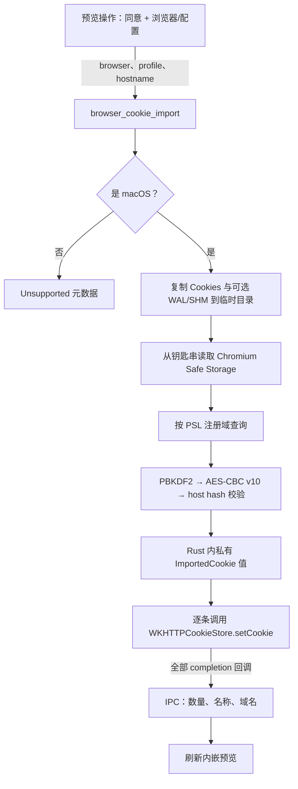

# ADR-0073 — 为内嵌浏览器导入 Chromium Cookie

**状态**：已采纳（2026-07-16）
**作者**：Max Qian + Codex

## 背景

内嵌浏览器与所有外部浏览器配置完全隔离。macOS 使用 WKWebView，Windows
使用 WebView2，Linux 使用 WebKitGTK。因此，即使 Chrome 已登录某站点，浏览器智能体、
操作录制与人工预览所使用的内嵌页面仍然没有同一登录态。

通过 CDP 驱动用户的真实 Chrome 不能可靠解决这个问题：Chrome 136 要求远程调试使用
非默认 user-data 目录。直接解密当前 Windows Chromium Cookie 则需要绕过 App-Bound
Encryption，这超出了 Cognia 的安全边界。Linux 凭据存储存在多种变体，首版刻意推迟，
以保留一条可审计的解密路径。

## 决策

为 Chrome、Edge、Brave 与 Chromium 增加默认关闭的 macOS 导入流程。用户先在内嵌预览
打开公网 HTTP(S) 页面，在「设置 → 桌面」中启用功能，确认 Cognia 的本机访问说明，选择
浏览器配置，再开始导入。随后 macOS 可能显示自己的钥匙串授权框。

功能开关与已记住的同意，是 Cognia 可信主渲染进程中的 UX 门；真正的原生安全门是浏览器
钥匙串条目与操作系统授权框。命令不会创建或修改任何钥匙串条目。

### 平台矩阵

| 平台 | 行为 | 理由 |
| --- | --- | --- |
| macOS | 读取所选 Chromium 配置、解密匹配 Cookie，并注入活跃 WKWebView | Chromium 使用本方案支持且需授权的 Safe Storage 钥匙串机制 |
| Windows | 返回 reason 为 `macos_only` 的 `unsupported`，操作灰显并给出引导 | 不绕过 App-Bound Encryption |
| Linux | 返回 reason 为 `macos_only` 的 `unsupported`，操作灰显并给出引导 | libsecret/KWallet 变体留待后续 |

休眠分支由三层共同钉住：带 tag 的 Rust 结果、灰显且本地化的 UI，以及平台分支单测。

### 一个原生命令把值留在 IPC 之外

`ImportedCookie.value` 只在 `src-tauri/src/browser/cookie_import/` 内可见，其自定义
`Debug` 永远输出 `[REDACTED]`。值不会写日志、不会进入 Dexie、不会返回 Cognia 渲染进程，
也不会上传到 Cognia。注入后，目标站点会正常收到自己的 Cookie；非 HttpOnly Cookie 仍可
由该目标页面读取，而浏览器智能体按产品设计仍能读取已登录页面内容。

### Chromium 配置与数据库处理

可用性命令绝不访问钥匙串。它只列出含当前 `Network/Cookies` 或旧版 `Cookies` 路径的配置
目录。导入命令只接受单个普通路径分量，因此绝对路径、路径穿越与嵌套路径注入都会被拒绝。

选中的数据库以及可选 `-wal` / `-shm` 同伴文件，会先复制到自动清理的临时目录，再通过
`mode=ro&immutable=1` URI 打开 SQLite。查询先通过 Public Suffix List 缩小到注册域，再按 Cookie domain-match
规则对当前精确主机复核。因此导入 `www.github.com` 会接纳 `.github.com` 域 Cookie 和
`www.github.com` host-only Cookie，但拒绝 host-only `github.com`、`.api.github.com` 等
兄弟域 Cookie，以及 `evilgithub.com`。
现代 schema 存在 `top_frame_site_key` 时，会跳过分区 Cookie，避免把它们提升为 WKWebView
中的非分区 Cookie。

### macOS 解密

每种浏览器都提供固定的 Safe Storage service/account 对与配置根目录。钥匙串密码会直接
作为 PBKDF2 口令：

- PBKDF2-HMAC-SHA1，salt 为 `saltysalt`，1003 轮，16 字节密钥；
- AES-128-CBC，IV 为 16 个 `0x20` 字节，使用 PKCS#7 padding；
- 必须以 `v10` 开头；
- 数据库版本不小于 24 时，UTF-8 值之前必须存在 32 字节 `SHA256(host_key)` 前缀；
- 把 Chromium 自 1601 年起的微秒过期时间转换为 Unix 秒，零值保留为 session Cookie。

格式错误、未知前缀、padding 错误、host hash 不匹配与非法 UTF-8 都只跳过当前行。配置不
存在、或目标域没有任何有效匹配行，会返回类型化的非错误结果。

### WKWebView 兼容性

注入复用现有 `browser-embed` 子 webview，并通过 `with_webview` 进入底层 WKWebView。
构造 Cookie 时映射 name、value、domain、path、Secure、HttpOnly、Expires 与 SameSite。
每条 Cookie 都调用一次 `setCookie:completionHandler:`，并用聚合计数器等待全部完成。刻意不
使用较新的批量 setter，因为它只在 macOS 26 可用。Rust 命令只会在所有单条 completion
回调完成后报告成功，并设置有界超时。
Foundation 拒绝构造的 Cookie 会按单条跳过，返回摘要只描述实际交给 WebKit 的 Cookie。

## 实现

- `src-tauri/src/browser/cookie_import/` —— 平台分发、配置发现、SQLite 快照/读取、
  加解密、钥匙串适配器与 WKWebView sink。
- `lib/browser/cookie-import.ts` —— 只传元数据的类型化 transport，以及功能关闭时的本地短路。
- `components/browser/browser-cookie-import-action.tsx` —— 公网 URL 门、可用性探测、首次同意、
  浏览器/配置选择、结果 UX 与预览刷新。
- `components/settings/desktop-section.tsx` —— 默认关闭的开关与平台说明。

## 验证与边界

纯 Rust 测试覆盖已知答案密钥、两个数据库版本分支、非法密文与 host hash、时间转换、PSL
域名边界、SQLite 解析、WAL/SHM 复制、路径穿越、脱敏 Debug、伪 Keychain/sink 编排，以及
非 macOS 休眠。Jest 覆盖设置默认值、transport 短路与载荷、同意流程、浏览器/配置选择、
探测拒绝、不支持平台、原生拒绝/失败、成功刷新与预览接线。

真实钥匙串授权与 WKWebView 持久化仍需 macOS 桌面冒烟验证。若未来 macOS Chromium 切换到
App-Bound Encryption，本路径将失效；届时应重新审视本 ADR，而不是削弱解密边界。

## 后果

- 浏览器智能体与录制可以复用现有 macOS Chromium 登录态，而无需通过 JavaScript 导出
  整个 Cookie jar。
- 用户会看到两道明确边界：Cognia 自身说明与 macOS 钥匙串授权。
- Windows、Linux、Firefox 与控制用户真实浏览器仍不属于本决策。

## 附录（2026-08-09）——真实浏览器控制改由独立 Seam 提供

上面的最后一项后果现在仅在 Chrome 与 Edge 控制方面被修订。`playwright-existing-browser`
MCP 预设可以连接用户通过 Microsoft 官方 Playwright 扩展明确选择的标签页，从而复用其中的
实时登录态。它不会把 Cookie 导出或迁移到 Cognia，并且与内嵌 WebView 分别安装、授权、
信任和断开连接。

Cookie 导入仍然是内嵌 WKWebView 的支持桥梁，继续保持显式启用、仅限 macOS、元数据脱敏和
钥匙串授权边界。本 ADR 仍不覆盖 Firefox、Safari、任意 Chromium 分支或自动会话迁移。
