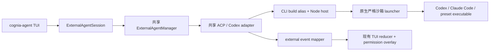

# ADR-0077 — TUI 外部 Agent 托管

**状态**：已接受（2026-07-16）

## 背景

桌面应用已经具备成熟的外部 Agent 协议平面：preset、ACP 与 Codex adapter、
`ExternalAgentManager`、权限回调、事件类型、凭据覆盖和会话生命周期。独立的
`cognia-agent` TUI 却只能运行内置 sidecar。若代理到正在运行的桌面端，会违背 CLI
不依赖桌面端的契约；若把 adapter 复制进 `cli/`，则会形成第二套协议实现。

可复用平面并非完全与宿主无关：少量模块会直接调用 Tauri 的进程、事件、hook、文件系统和
终端命令。此外，外部事件还包含 plan、diff 和 error，而内置 `CaptureStreamEvent` union
无法无损表达这些变体。

## 决策

采用混合宿主：

1. 原样复用共享 preset registry、adapter、manager、ACP client、credential builder 和公开
   事件契约。
2. 仅在 CLI 打包阶段把宿主相关 import 重定向到 Node shim。Node backend 负责白名单 spawn、
   stdio 行分帧、生命周期事件、进程组回收和命令发现。
3. 增加 CLI session adapter 和 event mapper，把外部会话翻译为现有 `AgentSession`、TUI
   reducer action、权限 overlay、usage 状态和 JSONL transcript。
4. 所有外部进程必须经过原生 `cognia-external-agent-launcher`。macOS 使用 Seatbelt，Linux
   使用 bubblewrap。缺少 launcher 支持时直接报错，不存在无沙箱回退。
5. 使用 `cognia-agent chat --backend <preset>` 或持久化的 `agentBackend` 配置选择宿主；
   `builtin` 仍为默认值。

## 已确认的决策

- **D1 — 严格沙箱**：强制启用。支持 macOS 与 Linux；不支持的平台失败即拒绝。workspace
  可写、home 可读、网络启用，并且只额外放行所选 Agent 的状态路径。
- **D2 — 宿主接缝**：v1 使用 CLI build alias。功能稳定前不修改共享桌面 adapter；将所有
  原始宿主调用统一进共享 seam 可作为后续清理。
- **D3 — ACP terminal capability**：CLI 宿主关闭。提供文件系统回调，但不声明桌面专属的
  terminal RPC。
- **D4 — TUI 本地化**：沿用现有 TUI 约定。新增 Ink 与 doctor 字符串保持英文，不把
  `next-intl` 引入终端 bundle。

## 认证

CLI config loader 已能解析 `~/.cognia/credentials.json` 和普通环境变量。session adapter
将 Codex 凭据映射为 `CODEX_ACCESS_TOKEN` 或 `OPENAI_API_KEY`/`CODEX_API_KEY`，将
Anthropic 凭据映射为 `CLAUDE_CODE_OAUTH_TOKEN` 或 `ANTHROPIC_API_KEY`。现有共享 env
builder 仍位于 spawn 路径中。若 Cognia 没有可注入凭据，外部 CLI 自己的登录状态
（`~/.codex/auth.json` 或 Claude Code 登录）仍作为回退。

## 影响

- TUI 无需运行桌面端，也无需 fork ACP stack，即可托管 Codex 与 Claude Code。
- 外部 text、thinking、tool、plan、diff、usage、error 和 permission request 使用与内置 turn
  相同的 cell 与审批界面。
- 原生 launcher 成为打包要求。开发构建可通过 `COGNIA_EXTERNAL_AGENT_LAUNCHER` 指向明确的
  可执行文件。
- 在出现等价的严格、保持 stdio 的沙箱前，Windows 有意不支持外部 Agent 托管。
- 白名单意味着任意命令字符串不是受支持的 backend；新增可执行 preset 必须显式接入。

## 备选方案

- **代理到正在运行的桌面端**：拒绝，因为 headless 使用会依赖 GUI 进程。
- **把协议栈移植进 `cli/`**：拒绝，因为 adapter 和行为会漂移。
- **无沙箱运行本地进程**：拒绝，因为 CLI 经常用于无人值守和仓库级任务。
- **移植容器与 Kubernetes backend**：拒绝；本决策只覆盖本地可执行托管。
