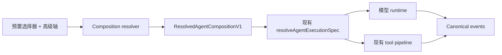

# ADR-0117：可组合的 Agent 模式、Creator 与 code 工具呈现

- 状态：已接受，分阶段发布
- 日期：2026-08-14

## 背景

`types/agent/agent-mode.ts` 用一个扁平的 `AgentModeType` 混装了四类互不相关的
概念：人格（`research`、`writing`、`academic`）、权限姿态（`plan`、`build`）、
编排方式（`workflow`）以及来源（`plugin`、`custom`）。每加一种能力就要往联合
类型里加一个成员，所有消费方都要对整个联合分支。而 `plan` 与 `build` 根本不是
人格，它们只设置 `permissionMode`。

选择的作用域同样是错的。`stores/agent/agent-runtime-store.ts` 把唯一的
`modeId` 存在 localStorage 里，模式因此不归属任何会话，也没有任何机制阻止它在
同一个 turn 的两次模型调用之间发生变化。

有两个既有权威不能被分叉：运行时路由属于 ADR-0090 的 `AgentExecutionPolicy` /
`ResolvedAgentExecutionSpec`，它已经输出稳定的 `executionFingerprint`；权限收窄
属于 `AgentPermissionCeiling`。如果模式系统重新声明其中任何一个，就等于新增了
第二套路由和第二套权限模型。

## 决策

模式是五个独立控制轴的组合，而不是单一枚举值。

| 控制轴   | 取值                                                     | 归属                              |
| -------- | -------------------------------------------------------- | --------------------------------- |
| 预置     | Standard、Minimal、Code、Creator、领域预置、自定义       | 新增 `AgentPresetDefinitionV1`    |
| 权限     | `plan`、`default`、`acceptEdits`、`bypassPermissions`    | 现有 `AgentPermissionCeiling`     |
| 工具呈现 | `native`、`code`、`both`                                 | 新增 `ToolPresentationMode`       |
| 编排     | `direct`、`subagent`、`workflow`、`verified-fresh-agent` | 新增 `AgentOrchestrationPolicy`   |
| Runtime  | Claude Agent SDK、AI SDK、External/ACP                   | 现有 `AgentExecutionPolicy`       |

三个版本化契约落在 `packages/agent-config-types`，让 CLI、sidecar 和插件 SDK
消费同一份定义：`AgentPresetDefinitionV1`（人格、prompt 增量、默认工具集、推荐
轴值）、`AgentCompositionSelectionV1`（用户选了什么）、
`ResolvedAgentCompositionV1`（某个 turn 实际跑了什么，携带 `promptDigest`、
`toolDigest`、`compositionDigest` 和现有的 `executionFingerprint`）。

选择按会话保存。新建会话继承应用级默认值，全局 localStorage 值不再是活动会话
的权威。组合只允许在空闲或 turn 边界切换，并在一次模型调用期间冻结。子 Agent
只能收窄已解析的权限上限，绝不能放大；Reviewer 子 Agent 默认只读并使用独立
上下文。

Creator 是正式的内置预置加 `/creator` 工作台，仅在开发者模式下可见。两处全局
开发者模式信号收敛为唯一来源 `pluginSettings.developerModeEnabled`
（`stores/plugin-runtime/plugin-store.ts`，已持久化且已有
`updatePluginSettings` action）：`components/plugins/plugin-devtools-panel.tsx`
中直接读 `cognia.plugins.developerMode` 的分支改为读取该来源，旧 key 在启动时
一次性迁移。`lib/plugin/core/manager.ts` 中的 `config.debug` / `config.devMode`
是**单个插件**的调试插桩开关，与全局门禁不是同一个概念，保持独立。路由保留在
静态导出中，关闭开发者模式时渲染访问门禁。Creator
只在用户显式选择的 authoring root 内写入，进度记录在现有 workflow run event
log，而不是新建存储。

Code 即 `toolPresentation: "code"`：模型只看到一个 `run_code` 工具加一份 typed
SDK，SDK 的每次调用都重新进入正常的 tool registry、参数校验、权限、沙箱和事件
链路。资格由一方声明的 allowlist 标记 `programmaticReadOnly` 决定，**不**从 MCP
的 `readOnlyHint` 注解推导——该注解是第三方服务器提供的建议性元数据，不是安全
边界。首期严格只读；严格沙箱不可用时 Code 直接 fail closed，不提供降级路径。

## 复用边界

本决策不新增第二套 runtime 枚举、路由、事件总线、权限系统、沙箱或 Dexie 表，
而是增强 `resolveAgentExecutionSpec()` 及其 fingerprint、
`AgentPermissionCeiling`、现有 tool registry 与权限管线、
`lib/workflow/runtime/event-log.ts` 的 workflow run event log，以及现有插件
disposable scope、CLI 和 Devtools（用于 Creator 预览与销毁）。Creator 生成的
一切以源文件为事实来源。

## 兼容与回滚

`agentModeId` 在 session、scheduler payload、prompt preset 和插件契约上继续作为
受支持的公开字段。`general` 映射到 Standard，`plan` 映射到 Standard 加 `plan`
权限，`build` 映射到 Standard 加 `acceptEdits`，`workflow` 映射到 Standard 加
workflow 编排；领域模式继续作为预置；custom 与 plugin 模式转为使用 native 呈现
的预置。未知的旧 ID 回退到 Standard 加 `default` 权限并显示兼容警告——绝不推断
或继承 `bypassPermissions`。runtime store 升级到 persist v2，保留 `modeId` /
`setModeId` 作为兼容适配层。发布由 `agentCompositionV2` 控制，Code 有独立
kill switch，Creator 由开发者模式门禁隐藏。所有新增字段均为可选、additive，
回滚不需要反向迁移。

## 影响

权限、编排与工具呈现变成可独立选择、可独立测试的维度，每个 turn 都携带能重现
该组合的 digest（由 ADR-0118 消费）。代价是每个 turn 多一次解析、兼容期内"模式"
存在两种表示，以及在 Code 面向开发者以外的人开放前，必须先有可用的严格沙箱。
