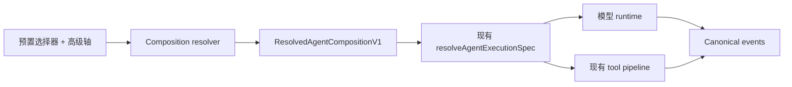

# ADR-0117：可组合的 Agent 模式、Creator 与 code 工具呈现

**状态：** 已接受，分阶段发布
**日期：** 2026-08-14

## 背景

`types/agent/agent-mode.ts` 用一个扁平的 `AgentModeType` 混装了四类互不相关的
概念：人格（`research`、`writing`、`academic`）、权限姿态（`plan`、`build`）、
编排方式（`workflow`）以及来源（`plugin`、`custom`）。每加一种能力就要往联合
类型里加一个成员，所有消费方都要对整个联合分支。而 `plan` 与 `build` 根本不是
人格，它们只设置 `permissionMode`。

选择的作用域同样是错的。`stores/agent/agent-runtime-store.ts` 把唯一的
`modeId` 存在 localStorage 里，模式因此不归属任何会话，也没有任何机制阻止它在
同一个 turn 的两次模型调用之间发生变化。

有两个既有权威不能被分叉：运行时路由属于 ADR-0090 的 `AgentExecutionPolicy` /
`ResolvedAgentExecutionSpec`，它已经输出稳定的 `executionFingerprint`；权限收窄
属于 `AgentPermissionCeiling`。如果模式系统重新声明其中任何一个，就等于新增了
第二套路由和第二套权限模型。

## 决策

模式是五个独立控制轴的组合，而不是单一枚举值。

| 控制轴   | 取值                                                     | 归属                              |
| -------- | -------------------------------------------------------- | --------------------------------- |
| 预置     | Standard、Minimal、Code、Creator、领域预置、自定义       | 新增 `AgentPresetDefinitionV1`    |
| 权限     | `plan`、`default`、`acceptEdits`、`bypassPermissions`    | 现有 `AgentPermissionCeiling`     |
| 工具呈现 | `native`、`code`、`both`                                 | 新增 `ToolPresentationMode`       |
| 编排     | `direct`、`subagent`、`workflow`、`verified-fresh-agent` | 新增 `AgentOrchestrationPolicy`   |
| Runtime  | Claude Agent SDK、AI SDK、External/ACP                   | 现有 `AgentExecutionPolicy`       |

三个版本化契约落在 `packages/agent-config-types`，让 CLI、sidecar 和插件 SDK
消费同一份定义：`AgentPresetDefinitionV1`（人格、prompt 增量、默认工具集、推荐
轴值）、`AgentCompositionSelectionV1`（用户选了什么）、
`ResolvedAgentCompositionV1`（某个 turn 实际跑了什么，携带 `promptDigest`、
`toolDigest`、`compositionDigest` 和现有的 `executionFingerprint`）。

选择按会话保存。新建会话继承应用级默认值，全局 localStorage 值不再是活动会话
的权威。组合只允许在空闲或 turn 边界切换，并在一次模型调用期间冻结。子 Agent
只能收窄已解析的权限上限，绝不能放大；Reviewer 子 Agent 默认只读并使用独立
上下文。

Creator 是正式的内置预置加 `/creator` 工作台，仅在开发者模式下可见。两处全局
开发者模式信号收敛为唯一来源 `pluginSettings.developerModeEnabled`
（`stores/plugin-runtime/plugin-store.ts`，已持久化且已有
`updatePluginSettings` action）：`components/plugins/plugin-devtools-panel.tsx`
中直接读 `cognia.plugins.developerMode` 的分支改为读取该来源，旧 key 在启动时
一次性迁移。每插件的 `config.debug` 仍可额外启用 instrumentation；全局 Developer Mode
会为非内置插件启用带 generation 标签的结构化日志，两者都不会形成第二套可见性门禁。路由保留在
静态导出中，关闭开发者模式时渲染访问门禁。Creator
只在用户显式选择的 authoring root 内写入，进度记录在现有 workflow run event
log，而不是新建存储。

Code 即 `toolPresentation: "code"`：模型只看到一个 `run_code` 工具加一份 typed
SDK，SDK 的每次调用都重新进入正常的 tool registry、参数校验、权限、沙箱和事件
链路。资格由一方声明的 allowlist 标记 `programmaticReadOnly` 决定，**不**从 MCP
的 `readOnlyHint` 注解推导——该注解是第三方服务器提供的建议性元数据，不是安全
边界。首期严格只读；严格沙箱不可用时 Code 直接 fail closed，不提供降级路径。

## 修订（2026-08-21）—— Engagement 与 Autonomy

五条轴之外再加两条。两条都来自连接器侧 —— 那里的"模式"一直由一套完全不同的机制决
定 —— 把它们并进来，正是为了不让世上存在两套模式系统。

IM 栈用两个从未被命名为轴的正交字段决定一次轮次的行为：`ConnectorMode`
（`auto` / `manual` / `draft`）与 `ImExecutionTarget`（`direct` / `team` /
`workflow`）。它们的乘积就是人们一直称作"助理模式"和"委派模式"的东西 —— 而这两个
名字在代码里任何地方都不存在。九个格子，其中两个静默损坏。

### Engagement —— `inline` / `background` / `human`

决定性的用例是 `direct` × `background`：单 agent、无团队、交一个任务后台跑，带进
度、可 steer、有停止按钮。它用的是与 `direct` × `inline` **同一个执行器**，所以
orchestration 表达不了它；而 `human` 压根没有 agent loop。

Engagement 不选执行器 —— 那是 orchestration 的职责。它命名的是一个早已隐式存在、
且早已互斥的挂载开关：

| 取值 | 挂到哪里 |
| --- | --- |
| `inline` | `opts.runAndCapture` —— 轮次就地作答 |
| `background` | `ExecutionRun` + binding + 呈现 runner + run control |
| `human` | `setAssignee` + SLA 阶梯 |

### Autonomy —— `observe` / `suggest` / `confirm` / `act` / `autopilot`

Autonomy **不是第二套权限模型**。它是对 Authority 的上限加对 ceremony 的下限，把两
套现成机制各复用一次：

| Autonomy | Authority 上限（走 `narrowAuthority`） | Ceremony 下限（OR 进 `requiredCeremony`） |
| --- | --- | --- |
| `observe` | 不跑 | — |
| `suggest` | `plan` | `{gate, requirePlanApproval, requireAcceptance}` |
| `confirm` | `default` | `{gate}` |
| `act` | `acceptEdits` | 无 —— 只由风险决定 |
| `autopilot` | 不封顶（仍受父 ceiling 约束） | 无 |

`resolve-composition.ts` 本来就是按序收窄 —— 先 `preset.maxAuthority`，再
`input.ceiling` —— 所以 autonomy 上限是**同一个循环的第三个输入**，不是新的权限代
码。与风险的合成是按位 OR，这就是全部的安全属性：宽松的 autonomy 档位永远无法取消
风险抬起的门。`autopilot` 只清零**操作者的**下限；从风险抬起的门里逃出去的口子仍
然是那个独立、可见的 `riskGating` 开关。

宿主默认是 `autopilot`，这是刻意的：它是唯一什么都不贡献的取值，所以加这条轴不改
变任何既有行为。任何更低的档位都会悄悄收窄一个已经选择了 `bypassPermissions` 的用
户。

### 它修掉了什么

`draft` × 委派的 bug 是旧形状的必然结果，在新形状里自然消失。`draft` 曾是一条**路
由** —— `routeInbound` 的一个分支 —— 所以绑了团队的会话根本解析不出目标，静默降级
成单 agent 草稿。作为一条轴，它是 `autonomy: "suggest"`，由它产生
`requireAcceptance`，而只有**投递阶段**发生变化：这一轮照常走真正的路径 —— 同样的
路由、同样的团队、同样的工作流、同样的 PII 闸门。

#### 验收的三种形状

`requireAcceptance` 是**产物**的属性，每个执行目标用它真正拥有的机制来兑现它。这里
没有第四套审批系统 —— 下面每一个都是给既有闸门增加一个调用方：

| 目标 | 被扣住的是什么 | 机制 | 审计 |
| --- | --- | --- | --- |
| direct | 产物 | 一条 `connectorDrafts`，由人批准、编辑或丢弃 | `draft.prepared` |
| team | 计划 | `requirePlanApprovalFloor` → ADR-0070 计划闸门，在 IM 卡片上询问（ADR-0137） | `team.dispatched`，`acceptance: "plan-approval"` |
| workflow | 派发本身 | 一张 `wf_approve` / `wf_cancel` 卡片；按下由既有的那个回调分发器启动 run | `workflow.dispatch_held`，`acceptance: "run-approval"` |

团队的产物是几分钟后经由呈现 runner 落地的，那里已经没有东西可扣；扣住成品等于评审
已经做完的工作。工作流既没有计划闸门，产物也不回到这里 —— 由它自己的节点投递 ——
所以等到有东西可扣时，工作已经发出去了。对工作流来说，"人在它动手前签字"仍然成立的
唯一时刻是 run 开始**之前**，被扣住的正是这一刻。

工作流这道扣留有两个承重属性。它**失败即关闭**：卡片投不出去就不派发，因为照样把工
作流跑掉正是这个缺口本身、只是更响。以及权限上限是**冻结在 binding 上**而不是在批
准时重新推导：卡片可能挂着几个小时无人回答，而重新推导会让"提问与按下之间的策略变
更"悄悄放宽那个真正被批准的 run。

Engagement 跟随的是**目标**，不是模式 —— 这就是同一个缺陷的轴级表述：

| 旧值 | Engagement | Autonomy | Authority 上限 | Orchestration |
| --- | --- | --- | --- | --- |
| `auto` + direct | `inline` | `act` | `acceptEdits` | `direct` |
| `auto` + team/workflow | `background` | `act` | `acceptEdits` | `team`/`workflow` + ref |
| `draft`（任意目标） | `inline` | `suggest` | `plan` | 由路由决定 |
| `manual` | `human` | `observe` | — | — |
| `approvalMode: "yolo"` | — | — | `bypassPermissions` | — |
| `assignee.kind === "human"` | `human` | `observe` | — | — |

Orchestration 新增 `"team"` 与 `orchestrationRef`，于是 `ImExecutionTarget` 并入。
路由字段仍是 orchestration 的**存储权威** —— composition 永不自带 `teamId`。这是不
出现第二个路由器的硬线：`/team`、`/workflow`、`/character` 的写入完全不变。

### 唯一的接缝

`BuildOptionsContext` 增加一个字段 `compositionSelection`。连接器 runtime 在
`effectiveConfig` 解析完之后填它，`resolveTurnCompositionSafely` 转发它。在此之前
`build-options.ts` 调解析器时不传 selection，于是回落到从 localStorage 读桌面
zustand store —— **每一次 IM 轮次的 composition 实际上都是桌面用户最后在 composer
里点的那个**，而整套 IM 配置栈闲置不用。一个字段就是全部的收敛：没有新解析器、没
有新 store、没有重复的优先级链。

### 存储

无需 Dexie 版本号。所有新字段非索引、可选，与 `teamId` / `workflowId` /
`approvalMode` / `reasoningOverride` 已确立的先例一致。`ConversationOverrideRow`
新增 `autonomy` / `engagement` / `authority`（以及指派快照）；`AdapterInstanceRow`
新增对应的 `default*` 字段。**不做回填**：读时从 `mode` 推导 `{autonomy,
engagement}` 是无损可逆的，写进行里就不是。

`ConnectorMode` 保留为兼容镜像 —— `InboxSendPolicy.forcedMode` 在定时出站里仍是活
路径，插件 SDK 也镜像了该字段。写时同时写两边；读时新轴优先，缺失则由 `mode` 推
导。

## 复用边界

本决策不新增第二套 runtime 枚举、路由、事件总线、权限系统、沙箱或 Dexie 表，
而是增强 `resolveAgentExecutionSpec()` 及其 fingerprint、
`AgentPermissionCeiling`、现有 tool registry 与权限管线、
`lib/workflow/runtime/event-log.ts` 的 workflow run event log，以及现有插件
disposable scope、CLI 和 Devtools（用于 Creator 预览与销毁）。Creator 生成的
一切以源文件为事实来源。

## 兼容与回滚

`agentModeId` 在 session、scheduler payload、prompt preset 和插件契约上继续作为
受支持的公开字段。`general` 映射到 Standard，`plan` 映射到 Standard 加 `plan`
权限，`build` 映射到 Standard 加 `acceptEdits`，`workflow` 映射到 Standard 加
workflow 编排；领域模式继续作为预置；custom 与 plugin 模式转为使用 native 呈现
的预置。未知的旧 ID 回退到 Standard 加 `default` 权限并显示兼容警告——绝不推断
或继承 `bypassPermissions`。runtime store 升级到 persist v2，保留 `modeId` /
`setModeId` 作为兼容适配层。发布由 `agentCompositionV2` 控制，Code 有独立
kill switch，Creator 由开发者模式门禁隐藏。所有新增字段均为可选、additive，
回滚不需要反向迁移。

## 影响

权限、编排与工具呈现变成可独立选择、可独立测试的维度，每个 turn 都携带能重现
该组合的 digest（由 ADR-0118 消费）。代价是每个 turn 多一次解析、兼容期内"模式"
存在两种表示，以及在 Code 面向开发者以外的人开放前，必须先有可用的严格沙箱。
