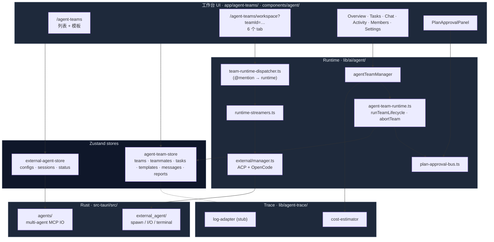
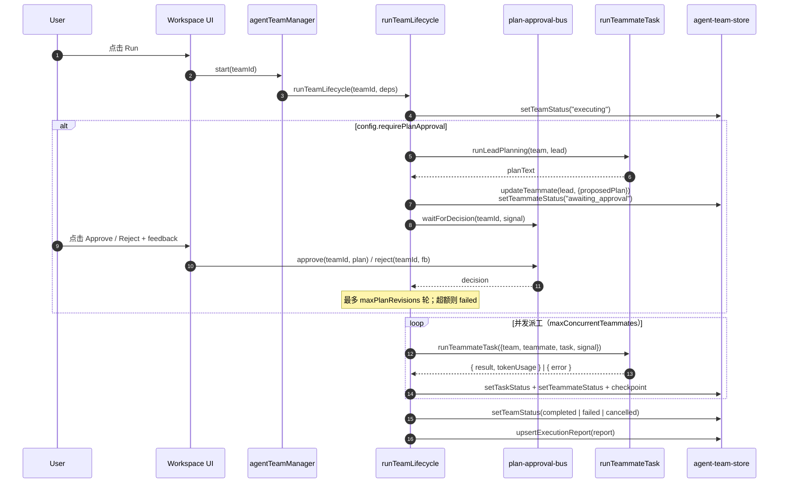
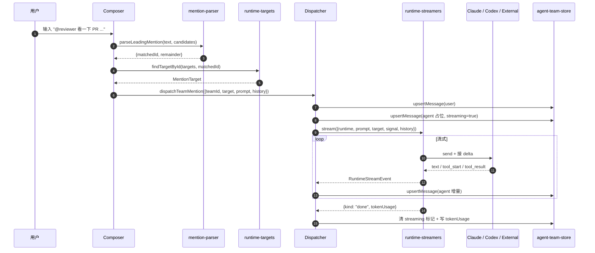

# Agent 团队

Agent 团队（Agent Teams）允许把多个 AI 角色聚合成一个"团"，由一个 lead 协调、若干个 teammate 并行执行。本页是 agent-teams 子系统的深度剖析；关于团队在聊天侧如何被引用，请回看[聊天、角色、技能 & 团队](./chat-and-skills)。

<TLDR>
团队 = lead + teammates + tasks + 执行报告。Lead 可走「计划审批」环节，
teammates 以受限并发被并行派工。Runtime 通过 `runTeamLifecycle` 推进、
`abortTeam` 撤销。每个 teammate 的 runtime 可选 Claude / Codex / 自定义
external agent CLI（ACP / OpenCode），其中 external agent 由 Rust 端
进程管理器拉起。`@<name>` 提及在 workspace chat 中走 `dispatchTeamMention`
分派给目标 runtime 并流式回填消息。
</TLDR>

## 适用场景

- 一项任务需要拆成多人协同（例如「代码评审 + 测试 + 文档」三角色并行）。
- 想在一个工作台里同时使用 Claude API、OpenAI Codex CLI、外部 Claude Code CLI、Cursor、Cline 等多个工具。
- 需要在执行前由人审批 lead 给出的计划，而后再开始派工。
- 需要把团队执行结果留档（checkpoints + tokenUsage + 失败原因）以便回放。

## 架构图



## 关键模块与文件路径

### TypeScript 业务层

| 文件 / 模块                                   | 作用                                                                                                                                                                                                                                        |
| --------------------------------------------- | ------------------------------------------------------------------------------------------------------------------------------------------------------------------------------------------------------------------------------------------- |
| `lib/ai/agent/agent-team.ts`                  | `agentTeamManager` —— Zustand store 上的 CRUD + lifecycle 入口。`start` / `pause` / `shutdown` 是 `runTeamLifecycle` / `abortTeam` 的薄封装。`configureAgentTeamRuntime(deps)` 在应用启动时注入真实 `runTeammateTask` / `runLeadPlanning`。 |
| `lib/ai/agent/agent-team-runtime.ts`          | 核心生命周期：状态置 executing → 可选计划审批轮 → 按 `maxConcurrentTeammates` 并发派工 → 写 `TeamExecutionReport`。每个 exit path 都会显式 setTeamStatus 防"卡 executing"。                                                                 |
| `lib/ai/agent/agent-team-runtime-deps.ts`     | 默认依赖工厂 —— 把 Claude SDK + ExternalAgentManager 接到 `runTeammateTask`。                                                                                                                                                               |
| `lib/ai/agent/plan-approval-bus.ts`           | 纯 pub/sub。Runtime 调 `waitForDecision(teamId, signal)`，UI 调 `approve(teamId, plan)` / `reject(teamId, feedback)`。最多 `maxPlanRevisions` 轮，超额视为 failed。                                                                         |
| `lib/ai/agent/agent-executor.ts`              | 把"一个 teammate 跑一个 task"具体化为对 Claude SDK / external agent 的一次 send。                                                                                                                                                           |
| `lib/ai/agent/background-agent-manager.ts`    | 背景型 agent（长期运行）的运行队列。                                                                                                                                                                                                        |
| `lib/ai/agent/sample-team.ts`                 | "Try a sample team" 按钮背后的工厂 —— 创建 1 lead + 2 teammate + 3 task 演示用例。                                                                                                                                                          |
| `lib/ai/agent/external/manager.ts`            | `ExternalAgentManager` —— 外部 CLI agent 的统一入口；按 protocol 选择 `acp-client` 或 `opencode-client`。                                                                                                                                   |
| `lib/ai/agent/external/protocol-adapter.ts`   | 协议适配器注册表（ACP / OpenCode 各一）。                                                                                                                                                                                                   |
| `lib/ai/agent/external/canonical-contract.ts` | external agent 配置归一化 —— 不同 CLI 的入参格式 → 一份 `ExternalAgentConfig`。                                                                                                                                                             |
| `lib/ai/agent/external/ecosystem-adapters.ts` | 针对 Claude Code / Cursor / Codex / Cline / Roo Code / Windsurf / Gemini 各自的"准备就绪"探针。                                                                                                                                             |
| `lib/ai/agent/external/agent-trace-bridge.ts` | 把 external agent 的 trace 事件转写到聊天 agent-trace 视图。                                                                                                                                                                                |
| `lib/agent-team/team-runtime-dispatcher.ts`   | 把团队 workspace 聊天里的 `@<name>` 路由到对应 runtime。无 React 依赖（注入 streamer + writer）；流式回填占位 assistant 消息。                                                                                                              |
| `lib/agent-team/mention-parser.ts`            | 纯函数解析首 token `@<name>`；不命中返回 `target: null`。                                                                                                                                                                                   |
| `lib/agent-team/runtime-targets.ts`           | 把团队成员 + 两个保留虚拟体（`@claude`、`@codex`）合并为可提及目标列表；同名时虚拟体优先解析。                                                                                                                                              |
| `lib/agent-team/runtime-streamers.ts`         | 把 Anthropic SDK / external agent 的流封装成 `RuntimeStreamEvent` 序列。                                                                                                                                                                    |
| `lib/agent-team/conversation-context.ts`      | 把团队消息列表转成 `ConversationTurn[]`，给 runtime 提供多轮上下文。                                                                                                                                                                        |
| `lib/agent-team/use-runtime-availability.ts`  | React hook，根据当前 API key / external agent 状态判断每个 runtime 是否可用。                                                                                                                                                               |
| `lib/agent/index.ts`                          | 跨子系统共享的常量与图标（状态颜色、工具状态、任务看板列、回放事件）。                                                                                                                                                                      |
| `lib/agent-trace/cost-estimator.ts`           | 按 model + tokens 估算成本（USD），用于团队 token 用量面板。                                                                                                                                                                                |
| `lib/agent-trace/log-adapter.ts`              | 当前是 stub —— 等真实 agent-trace 子系统落地后接入。                                                                                                                                                                                        |

### React 工作台

```text
app/agent-teams/
├── page.tsx                # 团队列表 + 模板浏览 + 创建对话框
└── workspace/page.tsx      # ?teamId=... 的统一详情，6 tab
```

`workspace` 用 `?teamId=...` 而不是动态段，是因为 Tauri 的 `next.config.ts` 强制 `output: "export"`，构建期无法穷举 runtime 创建的 id（详见[架构](./architecture)）。

UI 组件矩阵（`components/agent/`）：

- **`workspace/overview.tsx`** —— 团队进度卡 + Run / Stop 按钮。
- **`workspace/tasks.tsx`** —— 任务看板（pending / in_progress / completed / failed / blocked）。
- **`workspace/chat.tsx`** —— 多 agent 聊天面，输入解析首 `@<name>` 后走 dispatcher。
- **`workspace/activity.tsx`** —— 实时事件流（checkpoints + token 使用）。
- **`workspace/members.tsx`** —— teammate 管理（添加 / 编辑 / 删除）。
- **`workspace/settings.tsx`** —— 团队级 config（并发上限、计划审批开关、最大计划修订次数……）。
- **`plan-approval-panel.tsx`** —— 计划审批 UI，调 `approve` / `reject` 终结 `waitForDecision` 的等待。
- **`external-agent-*.tsx`** —— 外部 agent 选择、配置、命令、计划、会话面板。
- **`tool-approval-dialog.tsx`** —— 单次工具调用的人工放行确认。
- **`trace-health-badge.tsx`** —— agent-trace 接入健康度。
- **`agent-mode-selector.tsx`** + **`agent-runtime-selector.tsx`** —— 聊天侧选择 agent 模式与 runtime。
- **`custom-mode-editor/`** —— 自定义 agent 模式编辑器（icon / template / tool / MCP tool 选择器）。

### Rust 后端

| 模块                                       | 命令 / 用途                                                                                                                                                   |
| ------------------------------------------ | ------------------------------------------------------------------------------------------------------------------------------------------------------------- |
| `src-tauri/src/agents/mod.rs`              | 多 agent MCP 配置 IO 入口。读 / 写 Claude Code / Cursor / VS Code / Codex / Gemini / Windsurf / Cline / Roo Code 各自的 MCP 配置文件。                        |
| `src-tauri/src/agents/paths.rs`            | 按 OS + agent 解析配置路径，登记每种格式（JSON / JSONC / TOML）。                                                                                             |
| `src-tauri/src/agents/io.rs`               | 读写时保留注释（`toml_edit` 等），并把 JSONC 注释/尾逗号容忍。                                                                                                |
| `src-tauri/src/agents/commands.rs`         | Tauri 命令 `read_agent_config` / `write_agent_config`，前端 `lib/claude/agents/*` 适配器消费。                                                                |
| `src-tauri/src/external_agent/process.rs`  | `ExternalAgentProcessManager` —— tokio 子进程管理器，跟踪 Starting / Running / Stopping / Stopped / Failed 五态，stdout / stderr 通过 mpsc 回流。             |
| `src-tauri/src/external_agent/terminal.rs` | `AcpTerminalManager` —— ACP 协议下的伪终端：写入 stdin、接收 exit code。                                                                                      |
| `src-tauri/src/external_agent/commands.rs` | `spawn_external_agent` / `send_to_external_agent` / `kill_external_agent` 等 Tauri 命令，每次状态切换都 emit `external-agent://state-change` 事件供前端订阅。 |

## 数据流 / 控制流

### 团队生命周期



**并发模型**：

- `concurrency = max(1, team.config.maxConcurrentTeammates ?? 1)`。
- 任务按 `task.order` 升序入队，pending 之外的状态跳过。
- `inflight: Set<Promise>` 维持一个滑动窗口，每次 `Promise.race(inflight)` 才会送下一个。
- Teammate 选择采用简单 round-robin（`teammateRotation++ % workers.length`）。

**Abort 语义**：

- `inflightControllers` 是 `Map<teamId, AbortController>`。
- `abortTeam(teamId, reason?)` 调用对应 controller 的 `abort`，runtime 在每个分支前检查 `ac.signal.aborted` 并把 team 置 `cancelled`。
- 同一 team 重复 start 会抛 "Team X is already running"。

**TeamExecutionReport** 始终落 store（`upsertExecutionReport`），即便失败 / 取消，便于"回放历史"。

### Workspace 聊天的 `@<name>` 分派



**保留虚拟体（virtual agents）**：

- `@claude` —— Anthropic Claude API（无需添加 teammate 即可用）。
- `@codex` —— OpenAI Codex CLI。
- 真实 teammate 与虚拟体重名时，虚拟体优先匹配（首先进入候选列表），并在 UI 给该 teammate 打 `nameCollision` 标。

**永不抛出**：dispatcher 把所有错误转写成"错误指示卡"消息，保证演示路径的确定性。

### 外部 Agent 进程接入

`ExternalAgentManager` 在 React 端按 protocol 选择 `AcpClientAdapter` 或 `OpenCodeClientAdapter`；具体进程由 Rust 的 `ExternalAgentProcessManager` 拉起。

```text
[React] useExternalAgent
    │
    ▼
ExternalAgentManager
    │ protocol switch
    ├── AcpClientAdapter ─── stdio JSON-lines ─┐
    └── OpenCodeClientAdapter ─── HTTP / WS ───┤
                                                ▼
                                    Tauri invoke()
                                                │
                                                ▼
                                   src-tauri/external_agent/
                                   ├── process.rs (spawn + mpsc)
                                   └── terminal.rs (ACP terminal)
```

进程状态机 `Starting → Running → (Stopping → ) Stopped | Failed`；每次切换 emit `external-agent://state-change` 事件，前端订阅以驱动 badge / 列表。

## 数据库表

详见 [存储](./storage)。当前 agent-team 数据**主要在 Zustand store**（持久化到 IndexedDB 通过 zustand persist），而非 Dexie 主 schema。涉及的核心 store：

- `stores/agent/agent-team-store` —— teams / teammates / tasks / templates / messages / reports。
- `stores/agent/external-agent-store` —— external agent configs / sessions / status。
- `stores/agent/sub-agent-store` —— 通用 sub-agent 状态。

部分跨子系统数据回落到 Dexie：

- `teams` 表（来自 v3 schema）—— 用于聊天侧"团队"作为路由器引用（详见 [chat-and-skills](./chat-and-skills)）。
- `mcpServers` —— 团队成员共享的 MCP 服务器池。

## 配置项与扩展点

### 团队级 config（`AgentTeam.config`）

- `requirePlanApproval: boolean` —— 是否需要 lead 出计划 + 人审批。
- `maxPlanRevisions: number` —— 最大计划修订轮次（默认 1）。
- `maxConcurrentTeammates: number` —— 派工并发上限（默认 1）。
- `executionMode: "coordinated" | "autonomous" | "delegate"` —— 类型已落，但目前 runtime 走 coordinated 默认路径。
- `executionPattern: TeamExecutionPattern` —— 推荐执行模式，类型已落，runtime 当前未消费。

### Teammate 级 config（`AgentTeammate.config`）

- `runtime: TeammateRuntime` —— `claude` / `codex` / `external`，决定 dispatcher 把消息送哪个 streamer。
- `model: string` —— 覆盖模型。
- `systemPromptOverride?: string` —— 替换角色默认系统提示。
- `allowedTools?: string[]` —— 工具白名单（取并）。
- `externalAgentId?: string` —— 当 runtime === "external" 时绑定的外部 agent 配置 id。

### 扩展点：注入自定义 runner

在应用启动时调用：

```ts title="app/layout.tsx"
import { configureAgentTeamRuntime } from "@/lib/ai/agent/agent-team"

configureAgentTeamRuntime({
  runTeammateTask: async ({ team, teammate, task, signal }) => {
    // 自定义实现 —— 默认实现见 lib/ai/agent/agent-team-runtime-deps.ts
    return { result: "...", tokenUsage: {...} }
  },
  runLeadPlanning: async ({ team, lead, feedback, signal }) => {
    return { planText: "...", tokenUsage: {...} }
  },
})
```

不注入时，`start()` 抛 "runtime not configured"；`pause` / `shutdown` 不受影响（它们只 abort 已存在的 controller）。

### 扩展点：新增外部 agent CLI 适配器

1. 在 `lib/ai/agent/external/` 新增 `<your-cli>-client.ts` 实现 `ProtocolAdapter`。
2. 在 `protocol-adapter.ts:protocolAdapterRegistry` 注册。
3. 在 `ecosystem-adapters.ts` 加 "ready 探针"。
4. 在 `canonical-contract.ts` 把 CLI 自有配置归一化为 `ExternalAgentConfig`。

### 扩展点：插件贡献 teammate / 团队模板

插件 manifest 的 `agentTeams` 字段（如已声明）由 plugin manager 在启用时合并入 `agent-team-store.templates`；禁用时按 `pluginId` 整批移除。详见[插件系统](./plugin-system)。

## 关联子系统

- [聊天、角色、技能 & 团队](./chat-and-skills) —— 聊天侧的 `Team` 是更轻量的路由器；workspace 是更重的协同舞台。
- [调度器](./scheduler) —— scheduler `agent` 类型任务可触发团队 lifecycle，调度入口同样要走 `resolveSendOptions`。
- [可视化工作流](./visual-workflows) —— workflow 节点 `action.team.run` 直接调 `runTeamLifecycle`；recursion 深度被硬限制 10。
- [斜杠命令](./slash-commands) —— `/agents` 等命令可打开 settings 的 characters / teams 面板。
- [Sidecar & Claude SDK](./sidecar-and-claude-sdk) —— teammate 的 Claude runtime 共用 sidecar。
- [插件系统](./plugin-system) —— 插件可贡献模板、teammate runtime、external agent 适配器。

## 关联 ADR

- [ADR-0002 Scheduler full agent resolution](../adr/0002-scheduler-full-agent-resolution) —— 调度器入口要与交互式聊天等价地走 `resolveSendOptions`；agent 任务因此可在不进入 workspace 的情况下被触发。
- [ADR-0011 Workflows subsystem](../adr/0011-workflows-subsystem) —— 工作流节点 `action.team.run` 调 `runTeamLifecycle` 的契约。

## 已知限制

- **`executionMode` / `executionPattern` 仅是 type-only**：runtime 当前总走 coordinated 单 lead + 并发 worker 模式，autonomous / delegate / parallel_specialists 等模式未被消费。
- **共识投票 / 结构化消息路由 / 死锁恢复 / 自动重试退避 / 路由模式自动推荐** —— 类型已落，引擎未实现（runtime 顶注释明确"out of scope"）。
- **`teammateRotation` 简单轮询**：负载倾斜下不会重新分配。生产场景需要加权时请扩展 `runOne`。
- **Plan-approval 修订上限**：超过 `maxPlanRevisions` 直接 fail；没有"再问一次" UI 兜底。
- **External agent 进程持久化**：进程状态保存在 Rust 内存里；应用重启后所有 external agent 进程都需要重新 spawn。
- **`@<name>` 解析仅识别消息首 token**：行内多次提及不会触发多次 dispatch；想"广播"请改用团队级 Run。
- **`AgentTeamMessage` 当前主要在 Zustand store 持久化**，不在 Dexie 主备份 schema 之内。完整团队历史需要专门导出（详见 backup 子系统的后续 ADR）。
- **`agent-trace` 接入是 stub**：`lib/agent-trace/log-adapter.ts` 当前 always-null；真实 trace 子系统落地后才能看到回放/分析视图。
- **Web 模式下 external agent 不可用**：Tauri 进程管理器是唯一进程源；`useRuntimeAvailability` 在 web 上会把 external runtime 置灰。
