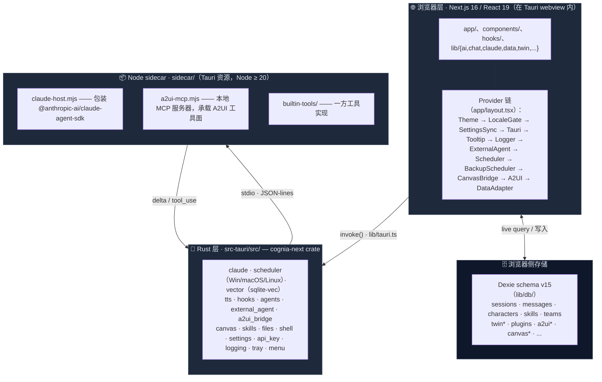

# 架构

Cognia 由四个相互协作的层组成。理解某项工作属于哪一层，是参与代码库时最重要的架构判断。



## 第 1 层 —— 浏览器 / React

`app/`、`components/`、`hooks/` 以及 `lib/` 的大部分都在 webview 内运行：

- **路由**（`app/`）—— 聊天工作台、孪生工作台、调度器、agent-teams、A2UI、画板、技能、日志。
- **状态** —— Zustand store 用于短暂 UI 状态；Dexie（IndexedDB）持久化数据；`lib/settings/` 存放用户偏好。
- **AI 编排** —— `lib/ai/`、`lib/claude/build-options.ts`、`lib/twin/runtime/apply-twin-context.ts`。
- **领域逻辑** —— `lib/character/`（经由 `lib/claude/types.ts`）、`lib/skills/`、`lib/data/`（备份）……

浏览器层**不直接访问** OS 资源 —— 所有原生操作必须经由第 2 层。

### `app/layout.tsx` 的 Provider 顺序

`app/layout.tsx` 中 Provider 的顺序是有讲究的：

1. `ThemeProvider`（next-themes）—— 基于 class 的暗色模式驱动。
2. `LocaleGate` —— 等 `next-intl` 翻译加载完毕再渲染。
3. `SettingsSyncProvider` —— 读写 `settings` Dexie 表。
4. `TauriProvider` —— 提供 `isTauri()` 上下文、OS 信息、深链事件。
5. `TooltipProvider` —— Radix；全局只挂一次。
6. `LoggerProvider` —— 把浏览器 logger 接到 Rust 日志桥。
7. `ExternalAgentInitializer`、`SchedulerInitializer` —— 首屏即启动相应子系统。
8. `BackupSchedulerProvider` —— 调度加密自动备份（仅 Tauri）。
9. `CanvasBridgeProvider`、`A2UIDispatchProvider` —— 路由 Claude 响应到不同输出层。
10. `DataAdapterProvider` —— 把 Dexie 适配器注入 data-hooks。

依赖语言环境的新 Provider → 放进 `LocaleGate` 内部；依赖 Tauri 的 → 放进 `TauriProvider` 内部。这条链是有意分层的，不要折叠。

## 第 2 层 —— IPC 桥（`lib/tauri.ts`）

`lib/tauri.ts` 是**唯一**调用 Tauri `invoke()` 的位置。每个 Rust 命令都有一个类型化封装。业务代码从 `@/lib/tauri` 导入命名函数，**不要**直接用 `invoke()`。

```ts
import { greet, isTauri } from "@/lib/tauri"
if (isTauri()) {
  greet("World").then(console.log)
}
```

`isTauri()` 让同一个组件同时支持 Web 和桌面模式。仅当 `window.__TAURI_INTERNALS__` 存在时返回 `true`。

封装统一在 `lib/tauri/index.ts` 集中导出，按插件分组（clipboard、dialog、fs、notification、opener、os、process、store……）。新增封装的步骤见 [运行时 & Tauri](./runtime-and-tauri)。

## 第 3 层 —— Rust 后端（`src-tauri/src/`）

`cognia-next` crate 是产品级 Rust 后端。顶层模块：

| 模块                                               | 用途                                                                                                                        |
| -------------------------------------------------- | --------------------------------------------------------------------------------------------------------------------------- |
| `claude`                                           | 启动并监督 Node sidecar（`SidecarState`）；API key 变更时重启。                                                             |
| `scheduler`                                        | 跨平台原生调度器 —— `windows.rs`（Task Scheduler）、`macos.rs`（launchd）、`linux.rs`（systemd），sqlite 元数据表用于恢复。 |
| `vector`                                           | sqlite-vec 后端；在任何连接打开前加载 FFI 扩展。                                                                            |
| `tts`                                              | 语音供应商密钥保管库（keyring）、Edge-TTS WebSocket 桥、通用 HTTP 代理。                                                    |
| `hooks`                                            | 生命周期钩子（chat send、response、error）。                                                                                |
| `agents` / `external_agent`                        | Agent 团队协调，外部 CLI agent。                                                                                            |
| `a2ui_bridge`                                      | webview ↔ A2UI MCP sidecar 之间的桥。                                                                                       |
| `canvas`                                           | 画板文档落盘存储。                                                                                                          |
| `skills`                                           | 技能资源解析 + 沙箱准备。                                                                                                   |
| `files`、`shell`、`settings`、`api_key`、`logging` | 文件操作、shell 执行、设置持久化、密钥保管、fern → 原生日志分发。                                                           |
| `tray`、`menu`、`window_behavior`                  | 桌面"外壳"（系统托盘、菜单栏、窗口状态）。                                                                                  |

外加在 `lib.rs` 注册的 Tauri 插件：`single-instance`、`deep-link`、`autostart`、`global-shortcut`、`cli`、`store`、`updater`、`dialog`、`fs`、`notification`、`clipboard-manager`、`opener`、`os`、`process`、`log`、`window-state`。

仅桌面的模块用 `cfg(desktop)` 与 `cfg(not(any(target_os = "android", target_os = "ios")))` 守护 —— Cognia 仅面向桌面。

## 第 4 层 —— Node sidecar（`sidecar/`）

Sidecar 是 Tauri 启动时拉起的小型 Node 进程，承载：

- `claude-host.mjs` —— 官方 `@anthropic-ai/claude-agent-sdk`，通过 stdio 上的 JSON-lines 协议暴露。
- `a2ui-mcp.mjs` —— 本地 MCP 服务器，承载 A2UI 工具面（`builtin-tools/`）。

为什么独立进程？

- Claude Agent SDK 有 Node-only 依赖，无法在 webview 中运行。
- 进程隔离让宿主可以杀死/重启 sidecar 而不影响主应用（例如 API key 变更）。
- Sidecar 可以 fork 自己的子进程来执行 shell 工具。

Rust 侧（`src-tauri/src/claude/sidecar.rs`）通过 `SidecarState` 持有子进程句柄，并暴露 `claude_send`、`claude_set_api_key`、`claude_restart_sidecar` 等命令。

## 横切关注点

### 存储策略

| 数据                               | 位置                                                              | 原因                                                                                        |
| ---------------------------------- | ----------------------------------------------------------------- | ------------------------------------------------------------------------------------------- |
| 聊天会话、角色、技能、团队、孪生表 | Dexie（IndexedDB）                                                | webview 本地、低延迟、可建索引。Schema 版本只增不改，不要修改旧的 `version().stores()` 块。 |
| 向量嵌入                           | `<app_data>/cognia/vectors.sqlite`（桌面）或远程（Web）           | 原生定长向量索引需要 sqlite-vec；Web 退回云端后端。                                         |
| 备份快照                           | 用户通过 Tauri 对话框选择的文件夹                                 | 默认 AES-GCM 加密。                                                                         |
| 调度器元数据                       | sqlite（Rust 侧 `metadata_store.rs`）                             | 跨重启保留；交叉引用原生 task ID。                                                          |
| 设置                               | Dexie `settings` 表（单行 key 为 `"singleton"`）+ `lib/settings/` | 启动时由 `SettingsSyncProvider` 从 Rust 同步。                                              |
| API key                            | OS keyring（`keyring` crate）                                     | 永不以明文落盘。                                                                            |

### 日志

浏览器 logger（`lib/logger/`）通过 `tauri-log-bridge` 镜像到 Rust。Rust 用 `fern` 分发到：

- Tauri 日志插件（文件 + 控制台）。
- 原生平台日志（Windows Event Log、macOS `os_log`、Linux `systemd-journald` / `syslog`）。

也就是说，React 中的一次 `logger.error(...)` 直接出现在 OS 原生日志查看器里，无需额外接线。

### 可观测性

`lib/observability/` 是 `@opentelemetry/api` 的薄壳。AI 供应商、孪生流水线、调度器都会发 span，dev 控制台可见。

## 下一篇

<Cards>
  <Card title="运行时 & Tauri" href="./runtime-and-tauri" description="IPC 桥的实际用法" />
  <Card
    title="Sidecar & Claude SDK"
    href="./sidecar-and-claude-sdk"
    description="基于 stdio 的 JSON-lines 协议"
  />
  <Card title="存储" href="./storage" description="Dexie schema v15 细节" />
  <Card title="插件系统" href="./plugin-system" description="沙箱 + 权限模型" />
</Cards>
