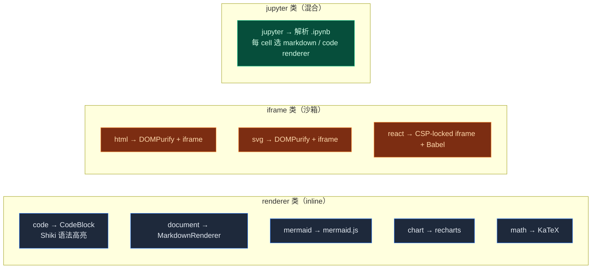

# Artifacts / Sandbox

<Status variant="stable" />

<TLDR>
  当模型生成 HTML / SVG / React / Mermaid / Chart / Math / Jupyter 时，cognia-next 把它包成
  `Artifact` 行写进 Zustand store，再用 9 种 renderer 之一渲染到 UI。 HTML / SVG / React 走 iframe +
  DOMPurify + CSP 三重隔离；其余类型走 React inline renderer。`lib/sandbox/`
  是独立的代码执行沙箱表层——目前 Web 端是 stub，桌面端 Python 路径在 [./canvas](./canvas) 里实现。
</TLDR>

<StatGrid>
  <Stat
    label="Artifact 类型"
    value="9"
    hint="code · document · svg · html · react · mermaid · chart · math · jupyter"
  />
  <Stat label="Iframe 沙箱类型" value="3" hint="html · svg · react" />
  <Stat label="预览友好类型" value="8" hint="PREVIEWABLE_TYPES" />
  <Stat label="可设计类型" value="3" hint="html · react · svg" />
</StatGrid>

## 概念区分

cognia-next 里有三个相关但不同的概念，先理清：

| 概念         | 角色                                        | 隔离手段                               |
| ------------ | ------------------------------------------- | -------------------------------------- |
| **Artifact** | 模型一次性产出的内容（HTML / React / SVG…） | iframe + CSP + DOMPurify（按类型不同） |
| **Canvas**   | 用户可持续迭代的代码 / 文档                 | 主 React 树内 Monaco；不需要隔离       |
| **A2UI**     | 模型用 MCP 工具拼装的交互式声明 UI          | 目录白名单 + 不允许内联脚本字符串      |
| **Sandbox**  | 用来跑代码（Python / JS / …）的运行时       | Web stub / 桌面真子进程（详见下文）    |

Artifact 与 Canvas 经常衔接：用户在聊天里看到 artifact → 点 "Open in Canvas" →
artifact 升级为可编辑文档（`lib/artifacts/reveal.ts`）。详见 [./canvas](./canvas)。

## 代码位置

<Files>
  <Folder name="lib/artifacts/" defaultOpen>
    <File name="index.ts — 桶导出" />
    <File name="constants.ts — 9 种类型、扩展名、color、语言映射、检测正则" />
    <File name="preview-utils.ts — DOMPurify 清洗 + React iframe shell HTML" />
    <File name="diff.ts — Artifact 版本 diff" />
    <File name="source-metadata.ts — 内容指纹（FNV-1a），消息去重用" />
    <File name="reveal.ts — revealArtifactInWorkspace（Artifact → Canvas）" />
    <File name="renderer-registry.ts — 插件 renderer 注册（PluginArtifactRenderer）" />
    <File name="utils.ts — 通用工具" />
  </Folder>
  <Folder name="lib/sandbox/">
    <Folder name="web/">
      <File name="index.ts — getWebSandboxService()（目前为 stub，executeCode 返回 ok:false）" />
    </Folder>
  </Folder>
  <Folder name="components/artifacts/">
    <File name="artifact-panel.tsx — 右侧 Sheet 容器，Tabs 切换 preview/code/version/designer" />
    <File name="artifact-preview.tsx — 9 种类型分发渲染" />
    <File name="artifact-renderers.tsx — 非 iframe 类型的 inline renderer + plugin host" />
    <File name="runtime-adapters.ts — 每类型的 transport / sandbox / 导出格式表" />
    <File name="artifact-card.tsx · artifact-list.tsx — 消息内卡片 + 列表视图" />
    <File name="artifact-create-button.tsx — 手动创建" />
    <File name="artifact-icons.tsx — 9 个类型的图标" />
    <File name="chart-renderer.tsx — recharts driver" />
    <File name="jupyter-renderer.tsx — .ipynb cell + output 渲染" />
    <File name="panel-version-history.tsx · version-diff-view.tsx — 版本历史" />
    <File name="panel-designer-wrapper.tsx — Designer 入口（cognia-next 内未启用）" />
  </Folder>
  <Folder name="stores/artifact/">
    <File name="artifact-store.ts — useArtifactStore（同时持 artifacts 和 canvasDocuments）" />
  </Folder>
  <Folder name="types/">
    <File name="artifact/artifact.ts — Artifact / ArtifactType / Metadata 接口" />
    <File name="system/sandbox.ts — SandboxExecutionResult 接口" />
  </Folder>
</Files>

## 九种 Artifact 类型



权威表 `lib/artifacts/runtime-adapters.ts:ARTIFACT_RUNTIME_ADAPTERS`：

| 类型       | transport | sandbox 属性        | 可预览 | 可设计 |
| ---------- | --------- | ------------------- | :----: | :----: |
| `code`     | renderer  | —                   |   否   |   否   |
| `document` | renderer  | —                   |   是   |   否   |
| `svg`      | iframe    | `allow-same-origin` |   是   |   是   |
| `html`     | iframe    | `allow-same-origin` |   是   |   是   |
| `react`    | iframe    | `allow-scripts`     |   是   |   是   |
| `mermaid`  | renderer  | —                   |   是   |   否   |
| `chart`    | renderer  | —                   |   是   |   否   |
| `math`     | renderer  | —                   |   是   |   否   |
| `jupyter`  | jupyter   | —                   |   是   |   否   |

注意 `react` 是 `allow-scripts` 而不是 `allow-same-origin`——故意切断 iframe 对
父页的 DOM 访问，靠 `postMessage` 通信。

## 类型检测

`lib/artifacts/constants.ts:DETECTION_PATTERNS` 用正则把代码块归类：

```ts
html:    [/<!DOCTYPE\s+html/i, /<html[\s>]/i, /<head[\s>]/i, /<body[\s>]/i]
react:   [/import\s+(?:React|{[^}]*})\s+from\s+['"]react['"]/, /<[A-Z]\w*[\s/>]/, ...]
svg:     [/<svg[\s>]/i, /xmlns="http:\/\/www\.w3\.org\/2000\/svg"/]
mermaid: [/^(graph|flowchart|sequenceDiagram|classDiagram|...)/m]
chart:   [/\[\s*{\s*"name"\s*:\s*"[^"]+"\s*,\s*"value"\s*:/, ...]
math:    [/\$\$[\s\S]+?\$\$/, /\\begin\{(equation|align|...)/, ...]
jupyter: [/"cells"\s*:\s*\[/, /"cell_type"\s*:\s*"(code|markdown)"/, /"nbformat"\s*:/]
```

聊天消息进来时，`useChatStore` 把代码块和消息内嵌内容路由到 `useArtifactStore`，
检测命中 → 自动建 artifact。`ALWAYS_CREATE_TYPES` 强制创建（如 mermaid、chart）
不论行数；其他类型有最小行阈值。

## HTML / SVG 安全

`lib/artifacts/preview-utils.ts:renderHTML` 与 `renderSVG`：

```ts title="lib/artifacts/preview-utils.ts (摘要)"
export function renderHTML(doc: Document, content: string): void {
  const sanitized = DOMPurify.sanitize(content, {
    WHOLE_DOCUMENT: true,
    ADD_TAGS: ["style", "link", "meta"],
    ADD_ATTR: ["target", "rel", "class", "id", "style"],
    ALLOW_DATA_ATTR: true,
  })
  doc.open()
  doc.write(sanitized)
  doc.close()
}

export function renderSVG(doc: Document, content: string): void {
  const sanitized = DOMPurify.sanitize(content, {
    USE_PROFILES: { svg: true, svgFilters: true },
    ADD_TAGS: ["style"],
  })
  // 写入一个居中容器 + 注入清洗后的 SVG
}
```

要点：

- **DOMPurify** 移除所有事件处理器（`onload`、`onclick`…）、`javascript:` URL、
  内联脚本等已知 XSS 向量。
- **iframe 的 `sandbox="allow-same-origin"`** 仍允许 iframe 读自己的 document，
  但**不允许 top navigation**——即便 sanitizer 漏一个 `<a target="_top">`，也无
  法逃出。
- 我们故意不带 `allow-scripts`——HTML 与 SVG artifact 都是**静态展示**用的。

## React 预览（CSP + postMessage）

React artifact 最棘手——既要跑 JSX 又要隔离。方案是把代码**通过 postMessage 传
进去**，绝不拼字符串进 HTML：

```ts title="lib/artifacts/preview-utils.ts:getReactShellHtml (核心)"
<meta http-equiv="Content-Security-Policy" content="
  default-src 'none';
  script-src 'unsafe-inline' 'unsafe-eval' https://unpkg.com https://cdn.tailwindcss.com;
  style-src 'unsafe-inline' https://cdn.tailwindcss.com;
  img-src data: blob:;
  font-src data:;
">
<script src="https://unpkg.com/react@19/umd/react.development.js"></script>
<script src="https://unpkg.com/react-dom@19/umd/react-dom.development.js"></script>
<script src="https://unpkg.com/@babel/standalone/babel.min.js"></script>
<script src="https://cdn.tailwindcss.com"></script>

window.addEventListener("message", (event) => {
  if (event.data?.type !== "render-component") return
  const code = event.data.code
  // 把 code 作为 <script type="text/babel"> 注入，Babel 转译后 ReactDOM.render
})
```

四道防线：

1. **`allow-scripts` 但**不**`allow-same-origin`** —— iframe 不能读父页 DOM、
   不能 cookies、不能 localStorage。
2. **CSP `default-src 'none'`** —— 阻止 iframe 内的任何代码 `fetch()` 别的源；只
   有显式列出的 unpkg + tailwindcss CDN 能加载。
3. **postMessage code injection** —— 代码不通过 template literal 进 HTML（杜绝
   通过模板字符串注入新 `<script>` 的可能）。父页用 JSON.stringify + `</`
   转义构造 messages，避免任何「闭合 script 标签」式攻击。
4. **CDN load watchdog** —— 15 秒拿不到 React 就显示一条"CDN load failed"提示，
   方便离线 / 受限网络下排查。

错误冒泡：iframe 内部出错 → `postMessage({type: "artifact-preview-error", message})`
→ 父页 `setError` → 红色 Alert + retry 按钮。

## Mermaid / Chart / Math —— 为什么不要 iframe？

这三类都是**确定性的**确认输出：

- **Mermaid** —— DSL 文本，渲染器（`mermaid.js`）保证输出是 SVG。
- **Chart** —— 我们自己实现的 recharts 包装器，只接受声明式 JSON。
- **Math** —— KaTeX 渲染，纯字符串变 MathML。

没有任意 JS 执行的可能性，iframe 沙箱反而是浪费。直接 inline 渲染让交互（hover
tooltip、chart 缩放、math 选区）更顺畅。

## Jupyter

`.ipynb` 是 JSON 数组，每个 cell 有 `cell_type` 与 `outputs[]`。
`jupyter-renderer.tsx`：

1. JSON 解析，校验 `cells` 是数组——失败就显示一条「无法解析 notebook」错误。
2. 每个 cell 根据 `cell_type`：
   - `markdown` → `MarkdownRenderer`（继承聊天消息的 markdown 渲染管线，KaTeX
     - Shiki 都已经接好）。
   - `code` → `CodeBlock` 显示源码，下面挂 `outputs[]`：
     - `stream` → 终端样式 `<pre>`。
     - `display_data` / `execute_result` → 选最佳 mime（`image/png` → ``、
       `text/html` → 受限渲染、`text/plain` → `<pre>`）。
3. **不**支持「点击执行 cell」——cognia-next 把可编辑改交给 Canvas（`Open in
Canvas` 把 .ipynb 升级成可执行的文档）。

## Plugin Renderer 扩展

`lib/artifacts/renderer-registry.ts:registerArtifactRenderer()` 允许[插件](./plugin-system)
注册自己的渲染器：

```ts title="lib/artifacts/renderer-registry.ts"
interface PluginArtifactRenderer {
  id: string // 插件作用域的 stable id
  type?: string // 用作 UI 标签（namespaced "<pluginId>:<type>"）
  name?: string
  canRender(artifact: Artifact): boolean
  render(artifact: Artifact, container?: HTMLElement): ReactElement | null
  priority?: number // 多个 renderer 竞标时，高的赢
}
```

`resolveRegisteredArtifactRenderer()` 在 `ArtifactPreview` 拉起内置渲染前先问一
轮——如果有插件认领，走插件路径；否则 fallback 到内置。

cognia-next 主程目前**没启用**插件运行时（`registerArtifactRenderer` 总是返回
空），但接口与 Cognia 上游兼容，未来加插件路径时这条已经准备好。详见
[./plugin-system](./plugin-system) —— 那条沙箱模型（每插件一个 Web Worker、
postMessage RPC）与本页的 iframe 模型可以并存。

## `lib/sandbox/`（代码执行）

这是与 artifact 渲染**不同**的另一条沙箱——给「跑代码」用：

```ts title="lib/sandbox/web/index.ts (现状)"
const stub: WebSandboxService = {
  isAvailable: () => false,
  isLanguageSupported: () => false,
  execute: async (req) => ({
    ok: false,
    error: `Web sandbox is not yet available; cannot execute ${req.language}.`,
    durationMs: 0,
  }),
}
```

Web 端目前是**占位 stub**——返回 `ok: false` 而非抛 `Cannot find module`，让上层
（[插件系统](./plugin-system)的 `executeCode` API）能给出有意义的报错。

桌面端实际跑代码的路径分两条：

1. **Python** —— `src-tauri/src/canvas/python_exec.rs:canvas_run_python` 真正
   spawn 系统 `python` 子进程，详见 [./canvas](./canvas)。
2. **JavaScript / TypeScript** —— 走 react/html artifact iframe，本质上是
   "preview" 而不是 "run"。

未来要加 Pyodide / WebContainer / Worker 路径时，替换 `lib/sandbox/web/index.ts`
的 body 即可，类型签名（`SandboxExecutionResult`）保持兼容。

## Artifact 存储

`stores/artifact/artifact-store.ts:useArtifactStore` 是单一权威：

```ts
interface ArtifactStoreState {
  artifacts: Record<string, Artifact>       // 按 id 字典
  canvasDocuments: Record<string, CanvasDocument>  // canvas 升级路径
  activeArtifactId: string | null
  recentArtifactIds: string[]               // LRU
  // ...
  createArtifact, updateArtifact, removeArtifact, ...
}
```

- **LRU 容量上限** —— `MAX_PERSISTED_ARTIFACTS`，超过就淘汰最早访问的。
- **持久化** —— `persist` middleware 写到 `cognia-artifacts` localStorage key
  （继承 Cognia 上游命名空间）。
- **rehydrate hook** —— `rehydrateArtifact()` 在恢复时补齐缺失字段、Date 反序列化。
- **指纹去重** —— `lib/artifacts/source-metadata.ts:buildArtifactSourceFingerprint()`
  用 FNV-1a 哈希同一条消息里的内容，避免同一个 code block 被检测两遍后建出两个
  artifact 行。

`reveal.ts:revealArtifactInWorkspace(id)` 是「打开右侧 panel + 切换到 artifact tab

- 设置 active」的统一入口，无论来自聊天卡片、版本历史、CLI 命令都走这。

## ArtifactPanel UI

`components/artifacts/artifact-panel.tsx`：

- **Sheet 容器** —— 右侧滑出式，可拖动改宽。Title / Actions / Content 三段式。
- **Tabs** —— `preview` / `code` / `versionHistory` / `designer`（cognia-next 没
  挂 designer，按钮 hidden）。
- **Code tab** —— Monaco editor（lazy-loaded），按 artifact 类型推断
  `getMonacoLanguage()`，dark mode 时用 `vs-dark`。
- **Preview tab** —— `<ArtifactPreview artifact={...} />` 派发到正确的 renderer。
- **运行时健康徽章** —— iframe 加载中 / 出错 / 就绪三态显示在右上角，方便调试。
- **复制 / 下载 / 在文件管理器中显示** —— 通过 `runtime-adapters.ts:exportFormats`
  限制可选格式（html 可以"下载为 html"，code 只能 "raw"）。
- **Plugin 扩展槽** —— `PluginExtensionSlot` 让插件追加自定义操作按钮。

## 测试

| 文件                                                  | 覆盖                                      |
| ----------------------------------------------------- | ----------------------------------------- |
| `lib/artifacts/constants.test.ts`                     | 类型映射、检测正则                        |
| `lib/artifacts/preview-utils.test.ts`                 | DOMPurify 配置、React shell HTML 生成     |
| `lib/artifacts/diff.test.ts`                          | 版本 diff 边界                            |
| `lib/artifacts/source-metadata.test.ts`               | 指纹稳定性                                |
| `lib/artifacts/reveal.test.ts`                        | reveal 行为 / 错过 id 的回退              |
| `lib/artifacts/renderer-registry.test.ts`             | 注册 / 撤销 / 优先级 / canRender 抛错保护 |
| `lib/artifacts/utils.test.ts` `preview-utils.test.ts` | 工具函数纯函数测试                        |
| `lib/sandbox/web/index.test.ts`                       | stub 返回值；executeCode 报错路径         |
| `components/artifacts/artifact-preview.test.tsx`      | 9 种类型渲染 + 出错回退                   |
| `components/artifacts/artifact-renderers.test.tsx`    | 插件 host 协作                            |
| `components/artifacts/jupyter-renderer.test.tsx`      | 损坏 JSON / 空 cell / mime 选择           |

## 在哪里入手

| 目标                             | 文件                                                                                                             |
| -------------------------------- | ---------------------------------------------------------------------------------------------------------------- |
| 加一个新的 artifact 类型         | `types/artifact/artifact.ts:ArtifactType` → `lib/artifacts/constants.ts` → `runtime-adapters.ts` → 实现 renderer |
| 调整 React iframe CSP            | `lib/artifacts/preview-utils.ts:getReactShellHtml` 的 `meta http-equiv`                                          |
| 把 HTML/SVG 改成 `allow-scripts` | `runtime-adapters.ts`（强烈不推荐——会拆掉一道防线）                                                              |
| 加新的 Mermaid 图类              | `lib/artifacts/constants.ts:MERMAID_TYPE_NAMES` + `MERMAID_TYPE_I18N_KEYS`                                       |
| 真正实现 Web 沙箱                | 替换 `lib/sandbox/web/index.ts` body，保持 `SandboxExecutionService` 接口                                        |
| 让插件注册自定义 renderer        | `lib/artifacts/renderer-registry.ts` + 插件 API（[plugin-system](./plugin-system)）                              |

## 下一篇

<Cards>
  <Card title="Canvas" href="./canvas" description="可编辑的文档形式，Artifact 升级目标" />
  <Card
    title="插件系统"
    href="./plugin-system"
    description="Worker 沙箱 + 自定义 artifact renderer"
  />
  <Card title="聊天 & 技能" href="./chat-and-skills" description="消息流如何驱动 artifact 创建" />
</Cards>
