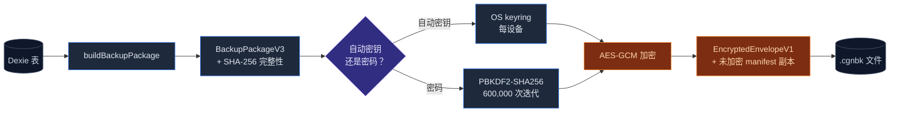
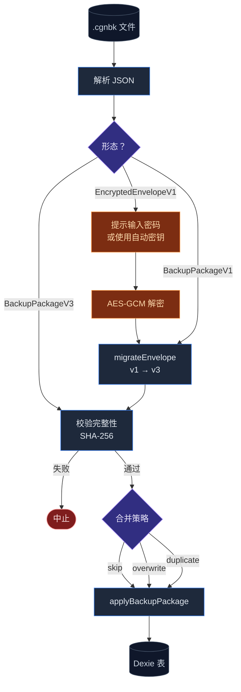

# 备份 & 数据传输

<Status variant="stable">schema v3</Status>

<TLDR>
  AES-GCM 加密、含完整性校验的备份，包格式为 **v3**。每设备自动密钥（无需密码）
  或用户密码（可移植）。六种按域传输（技能、MCP、预设、角色、团队、主题） 只搬一个切片。ChatGPT /
  Claude / Gemini 导入器把外部导出映射到 Cognia 的聊天形态。
</TLDR>

<StatGrid>
  <Stat label="Schema" value="v3" hint="v1 导入时迁移" />
  <Stat label="KDF 迭代" value="60 万" hint="PBKDF2-SHA256" />
  <Stat label="域传输" value="6" hint="按域导出/导入" />
  <Stat label="第三方导入" value="3" hint="ChatGPT · Claude · Gemini" />
</StatGrid>

Cognia 在 `lib/data/` 下提供完整的备份 / 还原 / 传输系统。当前包格式是 **v3**（`BackupPackageV3`）；v1 文件经由 `migrateEnvelope` 边界导入，老用户依然可用。

完整设计原由参见 [ADR-0001](../adr/0001-backup-schema-v3)。

## 代码位置

```
lib/data/
  types.ts                   # BackupPackageV3、EncryptedEnvelopeV1 等类型
  build-package.ts           # 从 Dexie 构建 BackupPackageV3 快照
  apply-package.ts           # 把 BackupPackageV3 应用到 Dexie
  crypto.ts                  # AES-GCM 加 / 解密
  backup-key.ts              # 自动密钥派生（PBKDF2-SHA256-600000）
  migrate.ts                 # 导入时 v1 → v3 迁移
  export.ts / import.ts      # 顶层编排器
  export-schema.ts           # 域导出 schema
  scheduler.ts               # 定时备份驱动
  domain/                    # 按域传输（技能、MCP、预设……）
  importers/                 # 第三方导入（ChatGPT、Claude、Gemini）
  import-registry.ts         # 第三方导入分发
  sync-projection.ts         # 用于同步的 Dexie 状态投影
  snapshots/                 # 快照测试夹具
  clear.ts                   # 清空 Dexie 表（调试）

components/settings/data/    # 设置 UI（概览 / 备份 / 域传输 / 维护）
lib/db/backup-history.ts     # backupHistory 表（限 50 行）
```

## 备份包（schema v3）

`BackupPackageV3` 是带三个顶层字段的 JSON：

```ts
interface BackupPackageV3 {
  manifest: {
    schemaVersion: 3
    createdAt: string // ISO-8601
    appVersion: string
    integrity: string // payload 的 SHA-256
    flags: {
      includesSessions: boolean
      includesApiKey: boolean
    }
  }
  payload: {
    sessions?: ChatSession[]
    messages?: StoredMessage[]
    characters: Character[]
    skills: Skill[]
    teams: Team[]
    promptPresets: SystemPromptPreset[]
    mcpServers: McpServer[]
    twin?: TwinExport // sources + profile（默认不含 chunk）
    canvas?: CanvasExport
    settings: AppSettings
  }
  // 这一层未加密
}
```

### Manifest 字段

<TypeTable
  type={{
    schemaVersion: {
      description: "当前固定为 `3`。旧文件（`1`）导入时迁移。",
      type: "3",
      required: true,
    },
    createdAt: {
      description: "构建快照时的 ISO-8601 时间戳。",
      type: "string",
      required: true,
    },
    appVersion: {
      description: "产出此备份的 Cognia 版本（来自 `package.json`）。",
      type: "string",
      required: true,
    },
    integrity: {
      description: "规范化 JSON `payload` 的 SHA-256。导入时校验 —— 防篡改。",
      type: "string",
      required: true,
    },
    "flags.includesSessions": {
      description: "payload 中是否包含 `sessions` 与 `messages`。",
      type: "boolean",
      required: true,
    },
    "flags.includesApiKey": {
      description: "是否包含 API key 引用（默认 false）。",
      type: "boolean",
      required: true,
    },
  }}
/>

## 端到端备份流程



## 加密（AES-GCM、PBKDF2-SHA256-600000）

把 `BackupPackageV3` 包进 `EncryptedEnvelopeV1`：

```ts
interface EncryptedEnvelopeV1 {
  schemaVersion: 1
  encryption: "aes-gcm"
  kdf: {
    algorithm: "pbkdf2"
    hash: "sha256"
    iterations: 600_000
    salt: string // base64
  }
  iv: string // base64
  ciphertext: string // base64
  manifest: BackupPackageV3["manifest"] // 未加密的 manifest 副本
}
```

manifest 在密文外保留一份副本，让用户在不输入密码的情况下也能看到文件包含*什么*（时间戳、schema 版本、flags）。

`encryptBackupPackage(pkg, passphrase, manifest)` 以 PBKDF2-SHA256（600,000 次迭代，OWASP 2023 建议）派生密钥，再用 AES-GCM 加密规范化 JSON 的 `pkg`。

## 自动密钥

大多数用户不愿记备份密码。`lib/data/backup-key.ts` 在 OS keyring（仅 Tauri）中存一个每设备的"自动密钥"。自动加密的备份**只能**在同一台设备解密 —— 不可移植。

如果用户显式设置了密码，它优先生效，备份才是可移植的。

## 构建快照

```ts
import { buildBackupPackage } from "@/lib/data/build-package"

const pkg = await buildBackupPackage({
  includeSessions: true,
  includeApiKey: false,
})
// pkg.manifest.integrity 已设
```

内置角色 / 技能 / 团队会从 payload 中过滤掉 —— 导入时自然种子化。只包含用户创建的数据。

## 应用快照

`applyBackupPackage(pkg, opts)` 用三种合并策略之一写入 Dexie：

| 策略        | 行为                      |
| ----------- | ------------------------- |
| `skip`      | 跳过已存在 ID 的行。      |
| `overwrite` | 覆盖已存在的行。          |
| `duplicate` | 把冲突的行重新分配新 ID。 |

内置行始终保留（导入器跳过它们）。

## 还原 / 导入流程



## 导入时迁移

`migrateEnvelope(parsed)` 接受：

- v1 备份 → 内存中迁移到 v3。
- v3 备份 → 原样返回。
- 加密信封 → 抛 `IsEncryptedError`，调用方提示用户输入密码。

迁移**幂等**：对一份 v1 跑两次得到相同的 v3 结果。

## 定时备份

`BackupSchedulerProvider`（挂载在 `app/layout.tsx`）按 `intervalDays` 间隔向用户配置的文件夹写加密的自动密钥备份。

**仅 Tauri**。Web 用户看到的是提醒横幅，因为浏览器无法在无人值守时往固定文件夹写入。

调度器流程：

1. 读取 `settings.backupSchedule` —— `{ enabled, intervalDays, folder }`。
2. 根据 `lastSuccessfulBackup` 计算下次运行。
3. 每 30 分钟唤醒一次：若 `now ≥ nextRun`，则构建快照、用自动密钥加密、写入 `cognia-backup-<ISO>.cgnbk`，并记录到 `backupHistory`。
4. 失败时记录 `status: "failed"` 与错误，下次唤醒重试。

## 备份历史

`lib/db/backup-history.ts` 暴露：

- `recordBackupSuccess(meta)` / `recordBackupFailure(error)` —— 追加记录。
- `getRecentBackups(limit)` —— 分页列表，按 `completedAt` 倒序。
- `pruneBackupHistory()` —— 限 50 行；旧行自动剔除。

设置中的"维护" tab 展示历史。

## 按域传输

`lib/data/domain/index.ts` 导出 `DOMAIN_TRANSFERS` —— 按域注册的传输模块列表：

| 域         | 文件                       | 备注                             |
| ---------- | -------------------------- | -------------------------------- |
| 技能       | `domain/skills.ts`         | 单技能或整个库                   |
| MCP 服务器 | `domain/mcp.ts`            | 适合分享工具配置                 |
| 提示预设   | `domain/prompt-presets.ts` |                                  |
| 角色       | `domain/characters.ts`     | 孪生绑定按 ID 保留               |
| 团队       | `domain/teams.ts`          | 团队成员在导入时按角色名重新解析 |
| 主题       | `domain/theme.ts`          | 自定义主题 JSON                  |

API：

```ts
const blob = await buildDomainExport("skills") // → Blob
await applyDomainImport("skills", file, "overwrite") // 策略
```

每个域传输都有同名 `<key>.test.ts`。

## 第三方导入

`lib/data/import-registry.ts` 把第三方导出文件分发到对应导入器：

| 导入器              | 来源                                     |
| ------------------- | ---------------------------------------- |
| `chatgpt-import.ts` | ChatGPT 导出 ZIP（`conversations.json`） |
| `claude-import.ts`  | Claude.ai 聊天导出                       |
| `gemini-import.ts`  | Google Gemini takeout                    |

每个导入器：

1. 解析来源专属 JSON。
2. 映射到 Cognia 的 `ChatSession` / `StoredMessage` 类型。
3. 用 `applyBackupPackage` + `strategy: "duplicate"`，确保导入永不覆盖已有数据。

新增导入器：写一个新模块并在 `import-registry.ts` 注册即可。

## 设置 UI

`components/settings/data/data-section.tsx` 是带 tab 的容器：

- **概览** —— 备份当前状态、向量后端、孪生计数。
- **备份与还原** —— 手动导入/导出、定时控件、密码设置。
- **域传输** —— 按域导入/导出。
- **维护** —— 清空数据库、查看备份历史、完整性检查。

活动 tab 反映在 URL（`?dataTab=...`），便于深链。

## 同步投影

`lib/data/sync-projection.ts` 产出稳定可排序的 Dexie 状态投影，用于潜在同步场景。当前未接入任何同步产品，但同步产品会从这里消费数据。

## 单会话导出

每个聊天头部的 `SingleExportTrigger`（`components/chat/dialogs/single-export-trigger.tsx`）用于**单会话**导出 —— Markdown / JSON / 纯文本 / 美化 HTML / 动画 HTML。它独立于备份系统，不走 `lib/data/`。

## 在哪里入手

| 目标            | 文件                                                                           |
| --------------- | ------------------------------------------------------------------------------ |
| 加新域传输      | `lib/data/domain/<name>.ts`，在 `index.ts` 注册                                |
| 加第三方导入    | `lib/data/importers/<name>.ts`，在 `import-registry.ts` 注册                   |
| 调整调度间隔    | `lib/data/scheduler.ts`                                                        |
| 升级备份 schema | 新建 `BackupPackageV4` 类型，在 `migrate.ts` 加 v3→v4，更新 `build-package.ts` |

## 测试

- `apply-package.test.ts`、`build-package.test.ts`、`crypto.test.ts`、`migrate.test.ts` —— 备份核心。
- `scheduler.test.ts` —— fake-timers 驱动；覆盖间隔与失败处理。
- 主版本各保留一份快照（`lib/data/snapshots/`）以发现 schema 漂移。

## 下一篇

<Cards>
  <Card title="存储" href="./storage" description="底层 Dexie schema" />
  <Card title="调度器" href="./scheduler" description="备份调度构建在其上的通用调度原语" />
  <Card
    title="ADR-0001"
    href="../adr/0001-backup-schema-v3"
    description="为什么 schema v3 是现在这个形状"
  />
</Cards>
