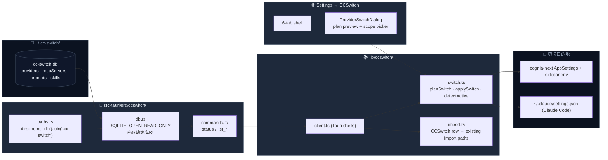

# CCSwitch 互操作

<Status variant="stable">stable</Status>

<TLDR>
  CCSwitch 是社区开源的 Claude 多账号切换器。Cognia 以只读方式打开它的
  `~/.cc-switch/cc-switch.db`，把 50+ 服务商、MCP server、prompt、skill 直接呈现在 Settings
  里，并能在同一动作内同时切换 cognia-next 自己 + 任意一组外部 agent （目前 v1 只写 `claude-code` 的
  `~/.claude/settings.json`）。我们 **从不写** CCSwitch 的数据库。
</TLDR>

<StatGrid>
  <Stat label="只读 IPC" value="5" hint="status / list 4 种" />
  <Stat label="写动作" value="1" hint="write_claude_settings_env" />
  <Stat
    label="Settings tab"
    value="6"
    hint="overview / providers / mcp / prompts / skills / sync"
  />
  <Stat label="可切换的 agent" value="1" hint="claude-code（v1）" />
</StatGrid>

CCSwitch 互操作有两个独立 capability：

1. **只读浏览** —— 把 CCSwitch 数据库里的 4 张表直接展示在 settings 中，提供一键"导入到
   cognia-next" 的捷径。
2. **协同切换** —— 当用户选某个 CCSwitch provider 作为当前 active 时，把它的 API key 和
   base URL 同时写入 (a) cognia-next 自己的 `AppSettings`，(b) 用户勾选的每个外部 agent
   的 settings 文件——这样切完一次，cognia-next 和 Claude Code CLI 用同一套凭据。

## 代码位置

```
src-tauri/src/ccswitch/
  paths.rs      # ~/.cc-switch/cc-switch.db 的跨平台解析
  db.rs         # 只读 SQLite + 容错列映射
  commands.rs   # 5 个 Tauri 命令

lib/ccswitch/
  types.ts      # CcswitchProvider / SwitchPlan / ActiveProviderState …
  client.ts     # 5 个 Tauri 命令的薄壳
  switch.ts     # planSwitch / applySwitch / detectActive
  import.ts     # CCSwitch 行 → 既有导入路径的 adapter
  hooks.ts      # useLiveCcswitchStatus / useLiveCcswitchProviders …

components/settings/ccswitch/
  ccswitch-section.tsx
  provider-switch-dialog.tsx
  tabs/{overview,providers,mcp,prompts,skills,sync}-tab.tsx
```

## 架构



## 数据库探活

`src-tauri/src/ccswitch/paths.rs` 把 DB 路径定义为 `~/.cc-switch/cc-switch.db`——跨 OS
一致。CCSwitch 自身允许通过云同步目录重定向这条路径（Dropbox / iCloud / WebDAV），
v1 不跟随重定向；用户需要把 CCSwitch 切回默认位置。

`ccswitch_status()` 永远成功，返回三态：

- `exists: false, error: undefined` —— 用户未安装 CCSwitch；Settings 直接展示"安装提示" 卡。
- `exists: true, counts: {...}` —— 一切正常；6 个 tab 全部启用。
- `exists: true, error: "..."` —— 文件存在但打不开（损坏、权限）；展示降级条+排错按钮。

## 容错的列映射

CCSwitch 的 schema 不是由我们控制的。`db.rs` 的核心约束：

| 情形        | 行为                                     |
| ----------- | ---------------------------------------- |
| 缺表        | 返回空数组，不报错                       |
| 缺列        | 对应字段为 `None` / 空串                 |
| 多出列      | 忽略                                     |
| 文件损坏    | `status` 返回 `error`，`list_*` 返回 Err |
| schema 改名 | 我们映射一个生成的列名超集，命中谁谁就赢 |

```rust title="src-tauri/src/ccswitch/db.rs"
let conn = Connection::open_with_flags(
    path,
    OpenFlags::SQLITE_OPEN_READ_ONLY | OpenFlags::SQLITE_OPEN_NO_MUTEX,
)?;
```

`SQLITE_OPEN_NO_MUTEX` 是因为 CCSwitch 是单线程写入者；只读连接不需要 sqlite 内置的
连接锁。

## 五个 Tauri 命令

```ts title="lib/ccswitch/client.ts"
ccswitchStatus() // 总是返回，3 态
ccswitchListProviders() // CcswitchProvider[]
ccswitchListMcpServers() // CcswitchMcpServer[]
ccswitchListPrompts() // CcswitchPrompt[]
ccswitchListSkills() // CcswitchSkill[]

// 唯一写命令——不写 CCSwitch DB，写 Claude Code 的 settings.json
writeClaudeSettingsEnv(envUpdates)
```

`writeClaudeSettingsEnv` 的目标是 `~/.claude/settings.json` 的 `env` 块——也就是
Claude Code CLI 读环境变量的地方，**不是** `~/.claude.json`（那是 MCP 配置）。Rust 侧
负责路径解析、原子写入 + 备份。

## 切换流程

切换是三层动作——预览、确认、执行：

<Steps>
  <Step>
    **用户在 Providers tab 点 "切换到 Kimi K2"**——`ProviderSwitchDialog` 打开，渲染
    "会改什么"+"波及哪些 agent" 两个 panel。
  </Step>
  <Step>
    **plan**——`planSwitch(provider, scope, current)` 是纯函数（无 I/O），把"切到这个 provider" 变成
    `SwitchPlan`： - `cogniaChanges`：apiKey/baseUrl/activeProviderId 的 before/after，是否需要重启
    sidecar。 - `agentChanges[]`：每个用户勾选的 agent 一行——target 路径（`~/.claude/settings.json`
    等）、 是否 v1 支持、envUpdates 数组。
  </Step>
  <Step>**确认**——用户看完预览点"应用"；这时才进入 I/O。</Step>
  <Step>
    **applySwitch**——执行顺序刻意： 1. 写 Dexie `settings`（cheap、可回滚）。 2. 调 `setProviderEnv`
    把新 env 推给 sidecar；如 key 或 URL 变了则 `restartSidecar()`。 3. 对每个支持的 agent，调
    `writeClaudeSettingsEnv` 写 env patch。 失败的 agent 不会终止整体——每行单独记录 `ok / error`，UI
    展示 partial-success 结果。
  </Step>
</Steps>

```ts title="lib/ccswitch/switch.ts (env updates)"
function envUpdatesForProvider(provider: CcswitchProvider) {
  return [
    { key: "ANTHROPIC_API_KEY", value: provider.apiKey?.trim() || null },
    { key: "ANTHROPIC_BASE_URL", value: provider.baseUrl?.trim() || null },
  ]
}
```

`value: null` 显式 _删除_ key，避免遗留旧端点把请求路由到错误的代理上。

## detectActive —— 漂移检测

settings 重新获焦时 UI 调用 `detectActive()` 找出每个 surface 当前用的 CCSwitch
provider id：

```ts title="lib/ccswitch/types.ts"
interface ActiveProviderState {
  cognia: string | undefined
  agents: Partial<Record<AgentId, string | undefined>>
  drift: boolean // 任意一个 agent 与 cognia 不一致 → true
}
```

当 `drift: true` 时 Overview tab 顶部渲染漂移横幅，让用户重新选 active provider 或忽略。
"漂移"通常发生在用户用 CCSwitch GUI 直接切了一次而没经过 cognia-next 的 picker。

## 与既有导入路径的衔接

我们 **不为 CCSwitch 单独建表**——MCP server、prompt、skill 都映射到 cognia 自己的
对应 Dexie 表 (`mcpServers` / `promptPresets` / `skills`)。`lib/ccswitch/import.ts`
是 4 个 adapter：

| 源类型              | 转换成           | 目标导入函数           |
| ------------------- | ---------------- | ---------------------- |
| `CcswitchMcpServer` | `McpImportDraft` | `bulkImportMcpServers` |
| `CcswitchPrompt`    | 直接字段映射     | `createPreset`         |
| `CcswitchSkill`     | 直接字段映射     | `createSkill`          |
| `CcswitchProvider`  | 走 `applySwitch` | （不导入，只 ref）     |

provider 不导入——只是被引用为 active：写到 `AppSettings.activeProviderId = "ccswitch:<id>"`
后，sidecar 在 spawn 时直接拿当前 env 用，没有 catalog 条目要维护。

## Settings UI 六个 tab

`Settings → CCSwitch`（`?section=ccswitch&ccswitchTab=…`）：

<Cards>
  <Card title="Overview" description="状态卡 + 漂移横幅 + 计数。">
    overview-tab.tsx
  </Card>
  <Card title="Providers" description="50+ 服务商按 kind 分组；行级 active 徽章 + 一键切换。">
    providers-tab.tsx
  </Card>
  <Card title="MCP" description="CCSwitch 自带的 MCP server；可一键导入到 cognia。">
    mcp-tab.tsx
  </Card>
  <Card title="Prompts" description="prompt 预设浏览 + 导入。">
    prompts-tab.tsx
  </Card>
  <Card title="Skills" description="按 sourcePath 或 inline 内容呈现 + 导入。">
    skills-tab.tsx
  </Card>
  <Card title="Sync" description="检测漂移、批量导入、重检状态。">
    sync-tab.tsx
  </Card>
</Cards>

## 与其他子系统

<Cards>
  <Card
    title="Claude 订阅 OAuth"
    href="./claude-subscription-oauth"
    description="OAuth 与 API key 互斥优先；切到 CCSwitch provider 会清掉 OAuth bearer。"
  />
  <Card
    title="Provider 系统"
    href="./provider-system"
    description="activeProviderId 形如 ccswitch:agentId 是 Provider 字段。"
  />
</Cards>

## 已知限制

- **v1 只写 `claude-code`**——其他 agent（codex / gemini / opencode / openclaw）在切换
  dialog 中以 `unsupported: true` 灰色展示。增加新 agent 的步骤：在 `SUPPORTED_AGENTS`
  Set 中加入、在 `targetPathFor` 中给出路径、并扩展 Rust 写命令以支持新文件格式。
- **两个写入者风险**——CCSwitch 自身也在写 `~/.claude/settings.json`；我们靠 `detectActive`
  在获焦时检测漂移来收敛，但并发写入仍可能产生 race。`writeClaudeSettingsEnv` 写前会先
  备份（返回 `backupPath`）以便回滚。
- **CCSwitch 重定向目录**——用户用 Dropbox / iCloud 把 `.cc-switch` 重定向到其他位置时
  我们看不到。需要用户把 CCSwitch 切回默认位置，或我们后续支持 CCSwitch 的 marker
  文件协议。
- **OAuth 互斥**——CCSwitch provider 的优先级低于 OAuth bearer：如果用户登录了 Claude
  订阅，sidecar 会优先用 OAuth；切换 CCSwitch provider 之前要先在 Subscription tab
  退出登录。
