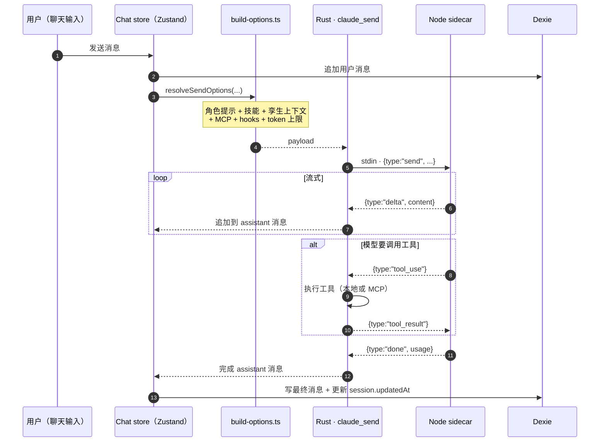

# 聊天、角色、技能 & 团队

聊天工作台是 Cognia 最大的用户面。它由五个可组合的概念构成。

## 概念速览

| 概念 | 内容 | 持久化在 |
| --- | --- | --- |
| **Session（会话）** | 一条对话线（标题、模型、最近更新时间） | `sessions` 表 |
| **Message（消息）** | 一次 user / assistant / tool 轮次 | `messages` 表 |
| **Character（角色）** | 可复用的人格（系统提示、模型预设、语气、可选孪生绑定） | `characters` 表 |
| **Skill（技能）** | 可复用的能力（提示、MCP 服务器、工具白名单、资源） | `skills`、`skillResources` 表 |
| **Team（团队）** | 多角色路由配置（在角色之间委派） | `teams` 表 |
| **MCP 服务器** | 接入 Claude 的工具/资源提供方 | `mcpServers` 表 |

均持久化在 Dexie（IndexedDB）；类型在 `lib/claude/types.ts`。

## 会话与消息流



聊天 store 在 `lib/chat/`；UI 在 `components/chat/`。Store 故意做得很薄 —— 大部分逻辑在 `lib/claude/`，便于在聊天面之外（例如 agent-teams 工作台）复用。

聊天 store 在 `lib/chat/`；UI 在 `components/chat/`。Store 故意做得很薄 —— 大部分逻辑在 `lib/claude/`，便于在聊天面之外（例如 agent-teams 工作台）复用。

## 角色（Characters）

`Character` 定义在 `lib/claude/types.ts`：

<TypeTable
  type={{
    id: { description: "稳定唯一标识。", type: "string", required: true },
    name: { description: "显示名。", type: "string", required: true },
    description: { description: "面向用户的简短描述。", type: "string" },
    systemPrompt: {
      description: "每次发送时附加的系统提示。",
      type: "string",
      required: true,
    },
    modelId: {
      description: "默认 Claude 模型 ID（覆盖应用默认）。",
      type: "string",
    },
    maxTokens: {
      description: "单轮输出上限；与 `lib/ai/model-limits.ts` 的限制取交。",
      type: "number",
    },
    temperature: {
      description: "采样温度（0–1）。",
      type: "number",
    },
    defaultSkillIds: {
      description: "选中该角色时自动启用的技能。",
      type: "string[]",
      required: true,
    },
    twinId: {
      description: "可选孪生绑定 —— 启用孪生 runtime 路径。",
      type: "string",
    },
    twinSettings: {
      description: "每角色孪生调参。见员工数字孪生。",
      type: "TwinSettings",
    },
    isBuiltIn: {
      description: "标记内置角色；备份清空时不丢。",
      type: "boolean",
      default: "false",
    },
    avatar: {
      description: "头像源 —— 渐变种子、图片 URL，或 Rive 场景 id。",
      type: "string",
    },
  }}
/>

内置角色作为种子数据（`lib/db/seed.ts`、`lib/db/preset-built-ins.ts`）。用户角色由用户创建。两者位于同一张 `characters` 表。

角色编辑器在 `components/settings/...` 加上专门的工作台 tab。头像走共享的 `lib/avatar.ts`（渐变、首字母、图片或 `@rive-app/react-webgl2` 提供的 3D Rive 场景）。

### 孪生绑定

设置 `Character.twinId = "<某个孪生 id>"` 让角色启用孪生 runtime。发送时：

- 把用户最近一条消息嵌入。
- 在绑定孪生的 chunk（`twinChunks` 表）上做 RAG。
- 从孪生 profile（`twinProfile`）取 top-K 风格示例。
- 系统提示被增强，加入召回片段 + 风格少样本。

可通过 `Character.twinSettings` 调参 —— `enableRag`、`ragTopK`、`enableStyleFewShot`、`styleSamplesK`。多个角色可共享一个孪生；多个孪生可共存。详见 [员工数字孪生](./employee-twin)。

## 技能（Skills）

`Skill` 是一个打包好的能力，可按角色或会话启用。

<TypeTable
  type={{
    id: { description: "稳定唯一标识。", type: "string", required: true },
    name: { description: "显示名。", type: "string", required: true },
    description: { description: "面向用户的描述。", type: "string", required: true },
    promptFragment: {
      description: "技能激活时追加到系统提示的片段。",
      type: "string",
    },
    mcpServerIds: {
      description: "技能激活时包含的 MCP 服务器。",
      type: "string[]",
    },
    toolAllowList: {
      description: "工具白名单（多技能声明时取交集）。",
      type: "string[]",
    },
    resources: {
      description: "可引用的资源（文件、URL）；发送时物化。",
      type: "SkillResource[]",
    },
    category: {
      description: "工作台侧栏分组标签。",
      type: "string",
      required: true,
    },
    isBuiltIn: {
      description: "标记内置技能；备份清空时不丢。",
      type: "boolean",
      default: "false",
    },
  }}
/>

技能执行器（`lib/skills/executor.ts`）接收一组技能 ID，产出：

- 合并后的提示片段。
- 合并后的 MCP 服务器列表（去重）。
- 合并后的工具白名单（多个技能声明白名单时取交集）。
- 物化的资源路径。

技能管理路径：

- **技能工作台**（`app/skills/`、`components/skills/`）—— 编写、编辑、校验。
- **市场**（`lib/skills/marketplace-*.ts`）—— 安装社区技能并校验签名。
- **校验**（`lib/skills/validate.ts`）—— 保存/导入时一律校验。
- **同步**（`lib/skills/sync.ts`）—— 与 Claude Code 技能格式同步。

内置技能在首次运行时种子化（`lib/db/seed.ts`）。用户技能可通过 `lib/skills/sync.ts` 导出到磁盘外部编辑后再导入。

## 团队（Teams）

`Team` 在一个会话中编排多个角色：

```ts
interface Team {
  id: string
  name: string
  members: TeamMember[]   // characterId + role + 委派规则
  routingStrategy: "round-robin" | "first-best" | "router-character"
  // ...
}
```

`lib/claude/team-router.ts` 根据策略决定下一轮由哪个角色处理。Agent-teams 工作台（`app/agent-teams/`、`components/agent/`）是设计与运行团队的 UI。

## MCP 服务器

`McpServer` 行描述如何连接到工具/资源提供方：

<TypeTable
  type={{
    id: { description: "稳定唯一标识。", type: "string", required: true },
    name: { description: "显示名。", type: "string", required: true },
    command: {
      description: "**stdio** 服务器的可执行文件（与 `url` 互斥）。",
      type: "string",
    },
    args: {
      description: "传给 `command` 的参数。",
      type: "string[]",
    },
    url: {
      description: "**SSE / HTTP** 服务器的 URL（与 `command` 互斥）。",
      type: "string",
    },
    env: {
      description: "传给 stdio 服务器的环境变量。",
      type: "Record<string, string>",
    },
    enabled: {
      description: "false 时发送时不包含此服务器。",
      type: "boolean",
      required: true,
    },
  }}
/>

每次发送都会把内置 MCP 服务器（`lib/claude/builtin-mcp/`）与用户服务器（`mcpServers` 表）合并。`lib/claude/mcp-presets.ts` 提供常用集成（filesystem、GitHub、Slack……）的预设。

A2UI MCP sidecar（`sidecar/a2ui-mcp.mjs`）始终在线，提供交互式 UI 面。详见 [Sidecar & Claude Agent SDK](./sidecar-and-claude-sdk)。

## 系统提示预设

`SystemPromptPreset`（`promptPresets` 表）是可保存的系统提示片段，可插入角色而不必永久修改它。适合：

- A/B 测试提示变体。
- 在多个角色间共享。
- 快速切换"系统指令"。

在设置 → 提示 tab 中编辑。

## 单会话导出

每个聊天头部都有 `SingleExportTrigger`（`components/chat/dialogs/single-export-trigger.tsx`）。对话框支持：

- Markdown
- JSON
- 纯文本
- 美化 HTML（带主题）
- 动画 HTML（带回放控件）

HTML 形式使用 `lib/themes/` 渲染当前主题；用户也可以加载自定义主题 JSON。实现位于 `lib/export/`。

## 消息内的"输出层"

一条 assistant 消息可包含多个"输出层"：

- **Markdown / 流式文本** —— 用 `streamdown`（`@streamdown/code`、`@streamdown/math`、`@streamdown/mermaid`、`@streamdown/cjk`）渲染。
- **工具调用 + 结果** —— 来自 `components/ai-elements/` 的可折叠卡片。
- **A2UI** —— 交互式节点（表单、列表、卡片），由 `A2UIDispatchProvider` 路由。
- **画板文档** —— 长文档物，存放在 `canvasDocuments` 系列表中，由 `CanvasBridgeProvider` 路由。
- **通用 artifact** —— 代码/文本/HTML 块，用户可 fork 到 `components/artifacts/`。
- **图表** —— 通过 `chart.js` / `recharts` 渲染；模型发出 `chart` 块时使用。

每个输出层在 `components/chat/` 中都有对应渲染器，订阅各自的桥事件。

## 在哪里入手

| 目标 | 文件 |
| --- | --- |
| 加新的聊天输入动作 | `components/chat/`、`lib/chat/`、`lib/claude/build-options.ts` |
| 加新的内置角色 | `lib/db/preset-built-ins.ts` |
| 加新的内置技能 | `lib/db/preset-built-ins.ts`、`lib/skills/` |
| 加新的 MCP 预设 | `lib/claude/mcp-presets.ts` |
| 加新的导出格式 | `lib/export/`、`components/chat/dialogs/` |
| 调整孪生行为 | 见 [员工数字孪生](./employee-twin) |

## 相关

<Cards>
  <Card title="Sidecar & Claude SDK" href="./sidecar-and-claude-sdk" description="处理 claude_send 的 Node 主机" />
  <Card title="员工数字孪生" href="./employee-twin" description="最深的角色 / 发送时定制层" />
  <Card title="插件系统" href="./plugin-system" description="插件如何扩展技能 / 角色 / MCP" />
  <Card title="存储" href="./storage" description="支撑聊天 / 角色 / 技能 / 团队的 Dexie 表" />
</Cards>

## 下一篇

- [员工数字孪生](./employee-twin) —— 最深的定制化层。
- [插件系统](./plugin-system) —— 插件如何扩展技能/角色/MCP。
