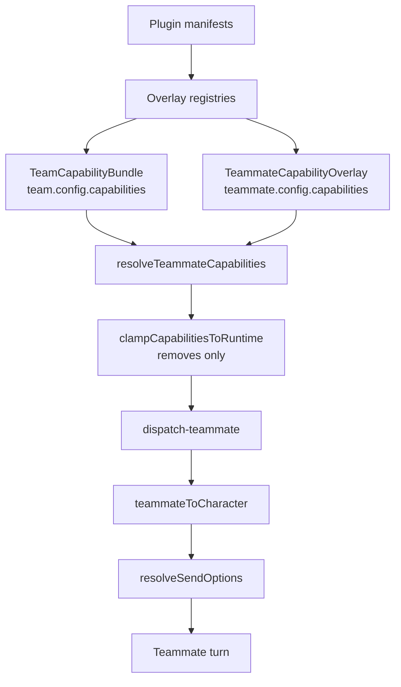

# 能力与插件

小队是插件生态的一等消费者。它携带一个默认能力池，每名队友在其上叠加，解析器把这一对压平，运行时再把结果收紧到执行绑定真正能提供的范围，然后队友就骑上了与直聊*同一条* build-options 流水线。插件通过统一的覆盖层注册表扩展这一切，也通过 `ctx.team` 反向伸进来。

<TLDR>
- **两层加一次收紧。** `TeamCapabilityBundle` 是池，`TeammateCapabilityOverlay` 按成员调整它，`resolveTeammateCapabilities`（`lib/ai/agent/team/capability-resolver.ts:91`）合并两者，`clampCapabilitiesToRuntime`（`:170`）只会做减法。
- **7 个能力键**，只在 `CAPABILITY_KEYS`（`capability-resolver.ts:36-44`）中枚举一次。
- **Character 桥。** `teammateToCharacter`（`lib/ai/agent/team/teammate-character.ts:62`）是纯的、从不持久化、id 稳定为 `__teammate__:{id}`，在 `dispatch-teammate.ts:236` 被消费。
- **20 个覆盖层能力**，位于 `OVERLAY_REGISTRY_CAPABILITIES`（`lib/plugin/contracts/capability-bridge-map.ts:220`），由插件管理器里的一个循环统一派发。
- **审计闸门。** `buildKnownCapabilityIds`（`capability-audit.ts:109`）与 `validateInstanceCapabilitiesWith`（`:155`）喂给一道运行前闸门，其行为取决于本次运行的闸门策略。
- **`ctx.team`** 暴露 30 个方法，由五个权限 id 把守。

</TLDR>

## 两层能力作用域

一支小队的能力分两层声明。小队级的 `TeamCapabilityBundle` 是每名队友都继承的默认池，每名队友可以通过 `TeammateCapabilityOverlay` 选择性地收窄或扩展它。这次合并是一个纯函数，产出一个没有 undefined 字段的扁平 `ResolvedCapabilities` 记录，于是下游消费者无需空值守卫即可遍历。

```typescript
// lib/ai/agent/team/capability-resolver.ts:36-44
const CAPABILITY_KEYS = [
  "mcpServerIds",
  "skillIds",
  "nativeAnthropicToolIds",
  "characterPackIds",
  "externalAgentPresetIds",
  "subagentIds",
  "a2uiTemplateIds",
] as const
```

| 键 | 解析成 | 被谁消费 |
| --- | --- | --- |
| `mcpServerIds` | MCP 服务器预设 | `Character.mcpServerIds` |
| `skillIds` | 插件与原生技能 | `Character.skillIds` 加 `pluginSkillIds` |
| `nativeAnthropicToolIds` | Computer-use 工具 id | `enableComputerUse` 与 `computerUseSettings` |
| `characterPackIds` | ADR-0030 人格包 | 运行期的人格投影 |
| `externalAgentPresetIds` | 外部 CLI 预设 | `lib/ai/agent/external/presets.ts` |
| `subagentIds` | 内置或 `pluginId:id` 形式的子智能体 | `resolveAllSubagents` |
| `a2uiTemplateIds` | A2UI 富内容模板 | A2UI 到 IM 的桥 |

### 叠加语义

每个键的合并只有一条规则。若存在 `replace` 就短路取胜，小队默认值被忽略。否则结果是小队默认值减去 `remove` 再并上 `add`。重复 id 会按首次出现顺序去重，于是运行时总能看到一份稳定且最小的 id 列表。`applyOverlay`（`:65`）是每个键的内核，整个函数是纯的、同步的：没有注册表查询、没有持久化、没有日志。

`resolveTeamCapabilities`（`:135`）只解析小队级的池。它支撑设置里的 Plugins 视图，也在注册时校验团队模板的 `requires` 块。

### 第三个阶段：运行时收紧

`clampCapabilitiesToRuntime(resolved, effective)`（`:170`，ADR-0090 Phase 7）把已解析的束收紧到生效的执行绑定真正支持的范围。它只会**减**。

| 运行时维度 | 收紧 |
| --- | --- |
| `mcp` | `mcpServerIds` |
| `subagents.native` | `subagentIds` |
| `tools.ordinary` | `nativeAnthropicToolIds` 与 `skillIds` |

人格包、A2UI 模板与外部预设原样通过。所以一次队友派发要经过三个阶段，先是小队束、再是队友叠加层、最后是运行时收紧，然后才抵达 `lib/claude/build-options.ts`。



已解析的束按「每名队友每次运行」缓存在 `TeamRunContext` 上，所以合并每次只跑一遍（`dispatch-teammate.ts:598`）。

## 队友到 Character 的桥

队友不是一个被持久化的人格。要跑一名队友，派发器会用队友配置加它已解析的能力，合成一个临时的 `Character`。这次合成是纯的、从不持久化，id 稳定为 `__teammate__:{id}`，于是可以在一次运行内被一致地引用而不与真实角色撞车。

正是这一次投影，让小队白拿到了整条直聊流水线。技能、MCP 服务器、computer-use、权限、钩子、记忆和侧车全都原封不动地来自 `resolveSendOptions`。

## 插件覆盖层注册表

插件贡献能力的方式，和它们贡献角色与技能的方式一样，都是通过统一的覆盖层注册表。`OVERLAY_REGISTRY_CAPABILITIES` 里的每一项把一个 manifest 字段和一对注册 / 反注册处理器配起来。总共有二十项。下面这些是小队会读的。

| 能力键 | 来源 | 能力 id 与 manifest 字段 |
| --- | --- | --- |
| `skillIds` | `lib/plugin/registries/skill-registry.ts:15` | `skills` / `skills` |
| `mcpServerIds` | `lib/plugin/registries/mcp-server-preset-registry.ts:25` | `mcp-server-preset` / `mcpServerPresets` |
| `nativeAnthropicToolIds` | `lib/plugin/registries/native-anthropic-tool-registry.ts:24` | `native-anthropic-tool` / `nativeAnthropicTools` |
| `characterPackIds` | `lib/plugin/registries/character-pack-registry.ts:42` | `character-pack` / `characterPacks` |
| `externalAgentPresetIds` | `lib/ai/agent/external/presets.ts:331` | `external-agent-preset` / `externalAgentPresets` |
| `subagentIds` | `lib/plugin/registries/subagent-registry.ts:25` | `subagent` / `subagents` |
| `a2uiTemplateIds` | Dexie `a2uiTemplates`，不是插件覆盖层注册表 | `a2ui` 能力，经由 A2UI 桥 |

另有两个注册表与小队相邻，但不是能力键。`agent-team-template-registry.ts:62` 从插件 manifest 收取小队蓝图，在注册时校验每份模板的 `requires` 块，并盖上非阻断的警告而不是拒绝，于是一份缺依赖的模板仍然可见但惰性，操作者拿到的是一次可发现性提示而不是一次静默失败。`shared-memory-adapter-registry.ts` 则通过 `config.sharedMemoryAdapterId` 按小队选择性启用。

插件自己的模板由 `projectPluginTemplate` 投影成宿主的 `AgentTeamTemplate` 形状，它铸出运行期 id `pluginId:templateId`，并携带 ADR-0032 的扩展字段（系统提示词、能力、治理提示、标签、图标键）。模板平台注册它用的正是同一个字符串，这也是为什么插件行的定义 id 会被原样返回。

### 派发循环

全部二十个覆盖层能力由插件管理器里的一个循环注册和反注册（注册在 `lib/plugin/core/manager.ts:5280`，反注册在 `:5778`），它遍历 `OVERLAY_REGISTRY_CAPABILITY_KEYS`，每一项各自 try/catch 隔离，于是一条坏的 manifest 条目绝不会中断一个插件的整体注册。

注册或反注册某一个能力可能会解掉或造成另一个能力的警告，所以有几项会向外扇出。注册一个技能、一个 MCP 预设或一个原生工具会刷新 character-pack、team-template 与 workflow-template 的警告。注册一个子智能体会刷新 team-template 与 workflow-template 的警告。依赖一到齐，模板就会清掉自己的缺依赖警告。

## 能力审计与它的闸门

因为能力是以纯 id 列表存放的，一个被禁用的插件可以让一支小队引用着再也解析不出来的 id。审计会检测出这一点，而且从不持久化结果。

`buildKnownCapabilityIds()`（`capability-audit.ts:109`）快照八个桶，即七个能力列表加上 `sharedMemoryAdapterIds`，方式是把 Dexie 的技能、MCP 与 A2UI 表、覆盖层注册表和内置子智能体 id 求并。`validateInstanceCapabilitiesWith(known, team, teammate?)`（`:155`）把一个实例与该快照做差，得到 `CapabilityAuditWarning[]`。`refreshAllInstanceCapabilityWarnings()`（`:250`）维护一张派生的、从不持久化的旁注表，`getInstanceCapabilityWarnings`（`:257`）和 `getTeammateCapabilityWarnings`（`:262`）喂给界面。

运行前闸门在 `lib/ai/agent/agent-team-runtime.ts:495`。它的行为取决于本次运行的闸门策略，也就是无头拆分，而不是一个写死的模态框。

- `capabilityAudit === "block"`（交互式）会发出一条 critical 通知，带上 `openApproval: { scope: "agent-team-capability-audit", id: runId }`，然后在审批总线上等待。approve 之外的任何结果都会取消这次运行。这条通知是关键的：没有它，这道闸门曾经在等待一个没有任何 UI 会产生的 scope，即便在桌面端也会一直挂住。
- 否则这次运行只发出一条「正在带着失效能力继续」的警告，然后继续。

<Callout type="warn" title="清理动作已经没有对应的 store action 了">
  store 上的 `clearStaleCapabilityIds` 随已退役的工作区一起走了。审计仍然会检测并报告失效 id，
  闸门也仍然会拦住一次交互式运行，但没有一键剔除。操作者要去设置里编辑该小队的能力。
</Callout>

## 队友编辑复用 PresetEditor

队友编辑没有分叉出一个编辑器。`teammateToPresetState(teammate, team)`（`lib/ai/agent/team/teammate-preset-adapter.ts:97`）把一名队友映射成 `PresetEditorState`，并把每个能力叠加层相对小队束展平；`presetStateToTeammateConfig(state, previous, team)`（`:180`）是它的逆运算，通过 `diffListToOverlay`（`:149`）重建每个键的叠加层。`TeammateConfigDialog` 用额外区块和一个花名册区块包住 `PresetEditor`。没有预设对应物的字段，例如 specialization、runtime 和 temperature，以 metadata 的形式在往返中随行。

## 生命周期钩子

十三个钩子，声明在 `PluginHooks` 上，由 `lib/plugin/messaging/hooks-system.ts:544-594` 通过一个私有的 `dispatchTeamHook` 助手派发：

`onTeamStart`、`onTeamPlanReady`、`onTeammateClaim`、`onTeammateRelease`、`onTeamBudgetWarn`、`onTeamComplete`、`onConsensusOpened`、`onConsensusVoted`、`onConsensusResolved`、`onSharedMemoryWrite`、`onSharedMemoryDelete`、`onTeamDelegationStart`、`onTeamDelegationComplete`。

它们全部是即发即忘的 `void` 处理器，按钩子执行顺序派发，各自在自己的微任务里、带每插件的 try/catch，并且都经 `recordPluginHookEvent` 记录，于是某个行为不端的插件的报错可被观测，却不会拖垮小队运行时。每个负载都带一个含 `teamId` 与 `runId` 的 `PluginTeamHookContext`。预算警告复用 `BudgetGuard` 已有的发射器，没有新增任何基础设施。

对于只持有 `ctx.team` 的插件，`ctx.team.getRunStatus` 是这一族钩子的拉取式补充。

## `ctx.team` API

宿主模块是 `lib/plugin/api/team-api.ts`，由 `createTeamAPI(pluginId)` 接进每一个插件上下文。它对作者同时从 SDK 根（以类型形式，经 `./context`）和专用子路径 `@cognia/plugin-sdk/api/team` 发布，后者在 ADR-0156 下是那份显式白名单。SDK 侧每一个导出都是**类型**，因为行为归宿主所有。

三十个方法，由五个权限 id 把守。

| 组 | 权限 | 方法 |
| --- | --- | --- |
| 读取 | `team:read` | `listTeams`、`getTeam`、`listTeammates`、`getTeammate`、`listTasks`、`subscribe`、`getRunStatus`、`listEvents`、`getExecutionReport`、`listCheckpoints` |
| 看板与花名册 | `team:write` | `createTask`、`updateTask`、`reorderTask`、`assignTask`、`addComment`、`attachTaskFile`、`moveTask`、`addTeammate`、`updateTeammate`、`removeTeammate`、`updateTeamConfig`、`instantiateTemplate` |
| 生命周期 | `team:write` | `createTeam`、`deleteTeam`、`duplicateTeam` |
| 存为模板 | `team:write` **加** `templates:library:write` | `saveAsTemplate` |
| 运行控制 | `start` 用 `agent:dispatch`，其余用 `agent:control` | `start`、`pause`、`resume`、`stop` |

在对着它写代码之前，有五处细节值得知道。

- **`saveAsTemplate` 的双重把关是刻意的。** 它是两次写入：一份在传统 store 里的小队模板，*以及*一份在用户统一模板库里的草稿。只写 `team:write` 正是它当初成为后门的原因。它还会走 `ctx.templates.createDraft` 用的那同一个库写入确认经纪人，并以「拒绝盖外来章」而不是「覆盖」的方式标记作者身份。
- **`createTeam` 走 `createSquad`**，而不是裸的 store action，这样在工作区支持的场合，插件建出来的小队也落在 durable-v2 上。
- **`instantiateTemplate` 用的是传统实例化器**，所以插件从模板建出来的小队没有 `TemplateInstanceRecord`，因而没有血缘、更新或脱钩。走平台路径的那条路见 [界面](./surfaces)。
- **拒绝是值，不是抛错。** `moveTask`、`removeTeammate` 与 `deleteTeam` 返回一个拒绝结果（`{ ok: false, reason }` 或 `false`），而不是抛异常。
- **`start` 走 `startSquadRun`**，即 ADR-0140 唯一的派发漏斗。`pause`、`resume` 与 `stop` 共用一段映射到 `agentTeamManager` 的实现，遇到未知 id 时回答 `squad_not_found`。

`subscribe` 是唯一带 disposer 的方法，插件必须释放它。其余都是一次性调用。

## 相关

<Cards>
  <Card href="./data-model" title="数据模型与 Store" description="AgentTeam 与 AgentTeammate 的配置形状" />
  <Card href="./consensus-delegation-memory" title="共识、委派与记忆" description="三个薄编排器及其钩子" />
  <Card href="./surfaces" title="界面" description="设置里的画廊、模板血缘路径、组合器芯片" />
  <Card href="../subsystems/plugin-system" title="插件系统" description="覆盖层注册表与 manifest 契约" />
  <Card href="../adr/0032-agent-team-plugin-integration" title="ADR-0032" description="智能体团队插件集成决策记录" />
</Cards>
