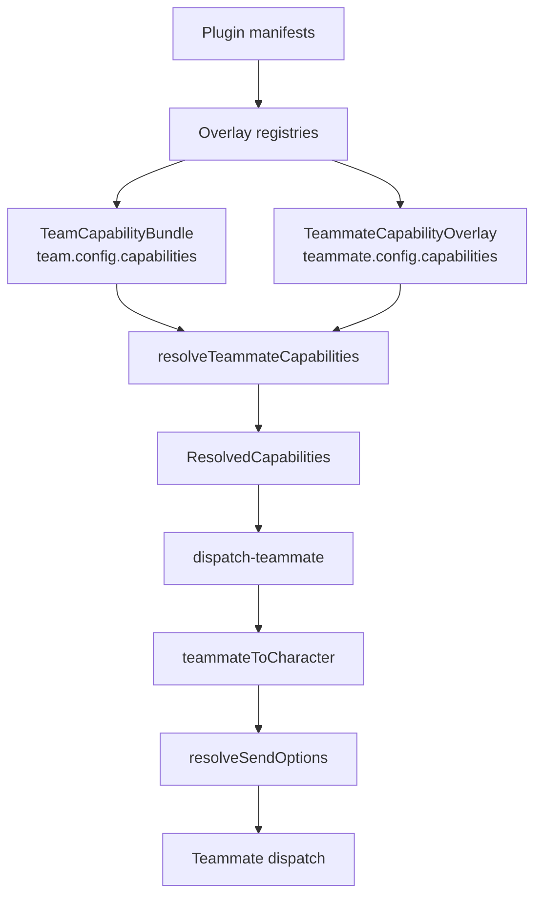

# 能力体系与插件集成

Agent Team 是**一等的插件生态消费者**。一个团队携带一个默认能力池；每个队友在其之上叠加；解析器把这一对扁平化为一份 `ResolvedCapabilities` 快照；该快照被投影到一个合成的 `Character` 上；随后队友便驶入*完整的* build-options 流水线——与直接聊天用于技能、MCP 服务器、computer-use 和权限的那条流水线完全相同。插件通过统一的叠加注册表扩展所有这些内容，正如它们扩展角色与技能一样。本页梳理 ADR-0032 引入的每一处接缝。

<TLDR>
- **两层作用域** —— `TeamCapabilityBundle`（`types/agent/agent-team.ts:193`）是团队默认池；`TeammateCapabilityOverlay`（`:222`）按键进行增/删/替换；`resolveTeammateCapabilities`（`lib/ai/agent/team/capability-resolver.ts:91`）将二者合并为 `ResolvedCapabilities`（`:238`）。
- **7 个能力键** —— `mcpServerIds`、`skillIds`、`nativeAnthropicToolIds`、`characterPackIds`、`externalAgentPresetIds`、`subagentIds`、`a2uiTemplateIds`（`capability-resolver.ts:36-44`）。
- **Character 桥接** —— `teammateToCharacter`（`lib/ai/agent/team/teammate-character.ts:56`）为纯函数，从不持久化，稳定 id 为 `__teammate__:{id}`；在 `lib/ai/agent/team/dispatch-teammate.ts:107-113` 处消费。
- **插件叠加** —— `PluginSubagentDef`（`types/plugin/plugin-subagent.ts:29`）与 `PluginAgentTeamTemplateDef`（`types/plugin/plugin-agent-team-template.ts:110`）；由插件管理器循环（`lib/plugin/core/manager.ts:2482-2495`）基于 `OVERLAY_REGISTRY_CAPABILITIES`（`lib/plugin/contracts/capability-bridge-map.ts:156-303`）分派。
- **审计门** —— `buildKnownCapabilityIds`（`lib/ai/agent/team/capability-audit.ts:110`）+ `validateInstanceCapabilitiesWith`（`:156`）馈入运行前的操作者门（`lib/ai/agent/team/agent-team-runtime.ts:173-199`）。
</TLDR>

## 1. 两层能力作用域

一个团队的能力分两层声明。团队级的 `TeamCapabilityBundle` 是每个队友继承的**默认池**；每个队友可选地通过 `TeammateCapabilityOverlay` 收窄或扩展它。合并是单个纯函数——`resolveTeammateCapabilities`——它产出一份没有 undefined 字段的扁平 `ResolvedCapabilities` 记录，因此下游消费者无需 null 守卫即可迭代。

```typescript
// types/agent/agent-team.ts:193 (TeamCapabilityBundle) + :222 (overlay) + :238 (resolved)
export interface TeamCapabilityBundle {
  mcpServerIds?: string[]
  skillIds?: string[]
  nativeAnthropicToolIds?: string[]
  characterPackIds?: string[]
  externalAgentPresetIds?: string[]
  subagentIds?: string[]
  a2uiTemplateIds?: string[]
}

export interface CapabilityListOverlay {
  add?: string[]      // add these ids to the team default
  remove?: string[]   // subtract these ids from the team default
  replace?: string[]  // replace the team default entirely (wins over add/remove)
}

export interface TeammateCapabilityOverlay {
  mcpServerIds?: CapabilityListOverlay
  // ... one CapabilityListOverlay per capability key
}
```

### 7 个能力键

解析器把恰好七个键枚举为一个模块级元组（`capability-resolver.ts:36-44`）。每个键都独立地被叠加。

| 键 | 解析为 | 由谁消费 |
|-----|-------------|-------------|
| `mcpServerIds` | MCP 服务器预设 | `Character.mcpServerIds` |
| `skillIds` | 插件 / 原生技能 | `Character.skillIds` + `pluginSkillIds` |
| `nativeAnthropicToolIds` | computer-use 工具 id | `enableComputerUse` + `computerUseSettings` |
| `characterPackIds` | ADR-0030 人格包 | 运行时的人格投影 |
| `externalAgentPresetIds` | 外部 CLI 预设 | `lib/ai/agent/external/presets.ts` |
| `subagentIds` | 内置或 `pluginId:id` 子智能体 | `resolveAllSubagents` |
| `a2uiTemplateIds` | A2UI 富内容模板 | IM &#124; A2UI 桥 |

### 叠加语义

对每个键，合并遵循一条规则：如果存在 `replace`，它短路并胜出（团队默认被忽略）；否则结果为 `(team default minus remove) union add`。重复 id 在保持首次出现顺序的前提下去重，因此运行时总是看到一个稳定、最小的 id 列表。该函数刻意保持纯且同步——无注册表查找、无持久化、无日志。

```typescript
// lib/ai/agent/team/capability-resolver.ts:91-127
export function resolveTeammateCapabilities(
  team: Pick<AgentTeam, "config">,
  teammate: Pick<AgentTeammate, "config">
): ResolvedCapabilities {
  const teamBundle: TeamCapabilityBundle = team.config.capabilities ?? {}
  const overlay: TeammateCapabilityOverlay = teammate.config.capabilities ?? {}
  // ... fast path: both empty → fresh empty bundle (never shares the sentinel
  // arrays, because callers commonly push onto the returned lists) ...
  const result: ResolvedCapabilities = {
    mcpServerIds: [], skillIds: [], nativeAnthropicToolIds: [],
    characterPackIds: [], externalAgentPresetIds: [], subagentIds: [], a2uiTemplateIds: [],
  }
  for (const key of CAPABILITY_KEYS) {
    result[key] = applyOverlay(teamBundle[key], overlay[key])
  }
  return result
}
```

`applyOverlay`（`:65-84`）是每键内核：`if (overlay?.replace !== undefined) return dedupe(overlay.replace)`，否则 dedupe `(base minus removeSet) ++ add`。`resolveTeamCapabilities`（`:135`）单独解析团队级池，用于在没有队友上下文时发出团队范围的工件。

### 端到端流程



解析后的能力按队友、按运行缓存，因此合并每次只运行一遍：

```typescript
// lib/ai/agent/team/dispatch-teammate.ts:182-188
if (!teamCtx.resolvedCapabilities.has(teammate.id)) {
  teamCtx.resolvedCapabilities.set(
    teammate.id,
    resolveTeammateCapabilities(teamCtx.team, teammate)
  )
}
```

## 2. teammate → Character 桥接

队友不是一个持久化的人格。要运行它，分派器从队友配置加上其 `ResolvedCapabilities` 合成出一个临时 `Character`。该合成是**纯的且从不持久化**，带有稳定 id `__teammate__:{id}`，因此可在一次运行内被一致地引用，而不会与真实角色冲突。

```typescript
// lib/ai/agent/team/teammate-character.ts:56-103 (trimmed)
export function teammateToCharacter(input: TeammateCharacterInput): Character {
  const { team, teammate, resolvedCaps, cwd, modelHint } = input
  const systemPrompt =
    teammate.config?.systemPrompt?.trim() ||
    team.config?.defaultSystemPrompt?.trim() ||
    DEFAULT_TEAMMATE_SYSTEM_PROMPT
  const enableComputerUse = resolvedCaps.nativeAnthropicToolIds.length > 0
  const character: Character = {
    id: teammateCharacterId(teammate),   // __teammate__:{id}
    name: teammate.name,
    systemPrompt, createdAt: ts, updatedAt: ts,
    ...(mcpServerIds ? { mcpServerIds } : {}),
    ...(skillIds ? { skillIds, pluginSkillIds: skillIds } : {}),
    ...(allowedTools ? { allowedTools } : {}),
    ...(cwd ? { workingDir: cwd } : {}),
    enableComputerUse,
    ...(enableComputerUse
      ? { computerUseSettings: { allowedToolIds: [...resolvedCaps.nativeAnthropicToolIds] } }
      : {}),
  }
  return character
}
```

### 字段映射

| 来源 | Character 字段 | 备注 |
|--------|-----------------|-------|
| `resolvedCaps.mcpServerIds` | `mcpServerIds` | 为空 → 省略 → 继承默认 |
| `resolvedCaps.skillIds` | `skillIds` + `pluginSkillIds` | 两者都设置，用于多态解析 |
| `resolvedCaps.nativeAnthropicToolIds` | `enableComputerUse` + `computerUseSettings.allowedToolIds` | 非空列表会开启 computer-use |
| `teammate.config.tools` | `allowedTools` | 直接的工具允许列表 |
| `cwd` | `workingDir` | 每次分派的工作目录 |
| `teammateCharacterId(teammate)` | `id` | 稳定的 `__teammate__:{id}`（`:23`） |

子智能体在 **session** 层（session kind 为 `team`）启用，而非在 Character 上——参见 §3。合成出的 character 立即被分派器消费，由其穿过完整的 send-options 流水线：

```typescript
// lib/ai/agent/team/dispatch-teammate.ts:107-113
const character = teammateToCharacter({ team, teammate, resolvedCaps, cwd, modelHint })
const sendOptions = await resolveSendOptions({ character, session, /* ... */ })
```

从这里开始，队友驶入与 <LinkCard href="./built-in-agent"
title="Built-in Agent" description="resolveSendOptions assembly" /> 和
<LinkCard href="./characters" title="Characters" description="Character runtime shape" /> 中所记述的相同路径。

## 3. 插件子智能体（叠加注册表 #6）

插件通过 `manifest.subagents` 声明子智能体，镜像 Claude SDK 的 `AgentDefinition` 形状。它们通过一行 `createOverlayRegistry` 实例注册，并以 `pluginId:id` 命名空间化，使分派器名称冲突成为不可能。

```typescript
// types/plugin/plugin-subagent.ts:29
export interface PluginSubagentDef {
  id: string
  name: string
  description: string
  prompt: string
  tools?: string[]
  disallowedTools?: string[]
  model?: string
  maxTurns?: number
  effort?: string
}
```

四个宿主自带的子智能体与该叠加一起出厂（`lib/claude/agents/subagents`）：
<Term>workflow-designer</Term>、<Term>workflow-debugger</Term>、
<Term>workflow-refactorer</Term> 与 <Term>workflow-doc-writer</Term>。
`resolveAllSubagents({ context })`（`lib/claude/agents/subagents/index.ts:118`）将内置项与实时叠加注册表取并集，并把插件条目投影到它们命名空间化的 id 下。团队 session 在构建时启用它们：

```typescript
// lib/claude/build-options.ts:1458-1462 (team context union)
const { resolveAllSubagents } = await import("@/lib/claude/agents/subagents")
opts.agents = { ...(opts.agents ?? {}), ...resolveAllSubagents({ context: "team" }) }
```

## 4. 插件 agent-team 模板（叠加注册表 #7）

插件通过 `manifest.agentTeamTemplates` 声明完整的团队蓝图。每个条目可声明一个 `requires` 块，列出跨能力依赖。

```typescript
// types/plugin/plugin-agent-team-template.ts:110
export interface PluginAgentTeamTemplateDef {
  id: string
  name: string
  description: string
  category: string
  teammates: /* roster */ unknown[]
  taskTemplates?: unknown[]
  config?: unknown
  icon?: string
  requires?: TeamAgentTemplateRequires   // :41 — cross-capability dependency block
}
```

注册时 `validateTemplateRequires(template)`
（`lib/plugin/registries/agent-team-template-registry.ts:88`）针对实时注册表检查每个能力桶，并打上**非阻塞**警告（`missing-subagent` 等）；当同级注册表变更时 `refreshAllTemplateWarnings()`（`:139`）会重新运行。设置 UI 将这些显示为一个破坏性的缺失依赖徽章，并禁用 Use 按钮：

```tsx
// components/settings/agent/agent-team-templates-section.tsx:350-378
{hasMissingDeps && <Badge variant="destructive">{t("missingDependencies")}</Badge>}
<Button disabled={hasMissingDeps} onClick={onUse}>{t("use")}</Button>
```

`projectPluginTemplate(entry)`（`lib/agent-team/project-plugin-template.ts:21`）将一个插件 def 投影为工作区模板选择器消费的宿主 `AgentTeamTemplate`——id 命名空间化为 `pluginId:id`，携带 systemPrompt、capabilities、governanceHints、tags 和 iconKey。

<Status status="info">缺失依赖的模板保持可见但失活——操作者得到的是一个可发现性提示，而非静默失败。</Status>

## 5. 能力审计 + 运行前门

由于能力以纯 id 列表存储，被禁用的插件可能让一个团队仍引用着不再能解析的 id。审计在不持久化任何结果的前提下检测到这一点。

`buildKnownCapabilityIds()`（`lib/ai/agent/team/capability-audit.ts:110`）对 **8 个桶**进行快照——7 个能力列表加上 `sharedMemoryAdapterIds`——做法是把 Dexie 的 skill/MCP/A2UI 表、叠加注册表以及 `BUILT_IN_SUBAGENT_IDS` 取并集。`validateInstanceCapabilitiesWith(known, team, teammate?)`（`:156`）把一个实例与该快照做差，得出 `CapabilityAuditWarning[]`。`refreshAllInstanceCapabilityWarnings()`（`:251`）维护一份派生的、从不持久化的旁挂映射，在插件禁用时刷新；`getInstanceCapabilityWarnings(teamId)`（`:258`）与 `getTeammateCapabilityWarnings(teamId, teammateId)`（`:263`）馈入 UI。

```typescript
// lib/ai/agent/team/agent-team-runtime.ts:173-199 (trimmed) — pre-run gate
const known = await buildKnownCapabilityIds()
const auditWarnings = [
  ...validateInstanceCapabilitiesWith(known, team),
  ...workers.flatMap((w) => validateInstanceCapabilitiesWith(known, team, w)),
]
if (auditWarnings.length > 0) {
  void refreshAllInstanceCapabilityWarnings()
  const decision = await waitForDecision(
    { scope: "agent-team-capability-audit", id: runId }, ac.signal
  ).catch(() => ({ outcome: "reject" as const }))
  if (decision.outcome !== "approve") {
    return { runId: "", status: "cancelled", reason: "Operator declined to run with stale capabilities" }
  }
}
```

存储侧的 `clearStaleCapabilityIds` 动作会在操作者选择清理而非批准时，从一个实例中剥除过期 id。

## 6. 插件管理器分派循环

全部九种统一形状的能力都由一个循环分派。描述符表 `OVERLAY_REGISTRY_CAPABILITIES`（`lib/plugin/contracts/capability-bridge-map.ts:156-303`）把每种能力映射到其 manifest 字段以及注册/注销处理器。

| 能力 | capability-bridge-map.ts 行 |
|------------|--------------------------------|
| skills | 157-177 |
| mcp-server-preset | 178-193 |
| native-anthropic-tool | 194-209 |
| external-agent-preset | 210-227 |
| character-pack | 228-245 |
| subagent | 246-265 |
| agent-team-template | 266-277 |
| shared-memory-adapter | 278-290 |
| workflow-template | 291-302 |

管理器以逐条目 try/catch 隔离遍历描述符键，因此一个坏条目绝不会中止一个插件的注册：

```typescript
// lib/plugin/core/manager.ts:2482-2495 (register loop; :2720 mirrors for unregister)
for (const cap of OVERLAY_REGISTRY_CAPABILITY_KEYS) {
  const descriptor = OVERLAY_REGISTRY_CAPABILITIES[cap]
  const entries = plugin.manifest[descriptor.manifestField] as
    ReadonlyArray<{ id: string }> | undefined
  if (!entries?.length) continue
  for (const entry of entries) {
    try { descriptor.registerEntry(entry, { pluginId }) }
    catch (err) { loggers.manager.warn(`[plugin:${pluginId}] failed to register ${cap} ${entry.id}:`, err) }
  }
}
```

### 跨注册表刷新钩子

注册或注销一种能力可能会解决或使另一种能力的警告变为过期。

| 当此注册表变更时 | 刷新谁的警告 | 行 |
|----------------------------|------------------------|-------|
| skill / mcp / native-tool | char-pack + team-template + workflow-template | 165-208 |
| character-pack | team-template | 237-244 |
| external-preset | team-template | 219-226 |
| subagent | team-template + workflow-template | 255-264 |

模板一旦依赖到位，便清除其缺失依赖警告。

## 7. 队友预设适配器（PresetEditor 复用）

队友编辑复用既有的 `<PresetEditor>` 而非定制编辑器。teammate-preset-adapter 在两种形状之间架桥：

- `teammateToPresetState(teammate, team)`（`lib/ai/agent/team/teammate-preset-adapter.ts:97`）
  把一个队友映射为 `PresetEditorState`：systemPrompt → content，model → model，
  tools → allowed/disallowed 列表，以及每个 `capabilities.*` 叠加经由
  `overlayToFlatList(undefined, overlay.X, teamBundle.X)` 扁平化；`characterPackIds[0]` →
  `characterPackId`，`externalAgentPresetIds[0]` → `externalAgentPresetId`。
- `presetStateToTeammateConfig(state, previous, team)`（`:180`）是其逆操作，经由 `diffListToOverlay`（`:149-171`）重建每键叠加。

`<TeammateConfigDialog>` 用新的 `extraSections` / `requireContent` 属性加一个 roster 区包裹 `<PresetEditor>`。无预设对应项的有损字段（specialization / runtime / temperature）作为元数据在往返过程中被携带。

## 8. 生命周期钩子

`runTeamLifecycle` 与分派执行器触发规范的团队钩子集。预算警告复用 `BudgetGuard` 既有的 `on("warning_crossed")` / `on("critical_crossed")` 发射器——未新增任何发射器基础设施。

规范钩子：`onTeamStart`、`onTeamPlanReady`、`onTeammateClaim`、
`onTeammateRelease`、`onTeamBudgetWarn`、`onTeamComplete`、`onConsensusOpened`、
`onConsensusVoted`、`onConsensusResolved`、`onSharedMemoryWrite`、`onSharedMemoryDelete`、
`onTeamDelegationStart`、`onTeamDelegationComplete`。

```typescript
// lib/ai/agent/team/dispatch-teammate.ts:190-216 (claim/release lifecycle)
dispatchOnTeammateClaim(payload); dispatchOnAgentStart(payload)
// ... teammate runs ...
dispatchOnTeammateRelease(payload)
dispatchOnAgentComplete(payload) // or dispatchOnAgentError on failure
```

共识 / 共享内存 / 委派编排器各自触发其匹配的钩子集——参见 <LinkCard href="./consensus-delegation-memory" title="Consensus, Delegation & Memory"
description="The three thin orchestrators" />。

## 9. ADR-0032 验证

ADR 承诺的每一项机制都已接线并对照源码验证——无漂移。

| # | 机制 | 证据 |
|---|-----------|----------|
| 1 | 两层能力作用域 | capability-resolver.ts:91, :135 |
| 2 | 子智能体插件能力 | plugin-subagent.ts:29 + subagent-registry + subagents/index.ts:118 |
| 3 | agent-team-template 能力 | agent-team-template-registry.ts:88 validates requires |
| 4 | 完整钩子集成 | dispatch-teammate.ts:190-216 |
| 5 | 共识 / 共享内存 / 委派 | three orchestrator modules |
| 6 | PresetEditor 复用 | teammate-preset-adapter.ts:97, :180 |
| 7 | 工作区设置重构 | accordion + Plugins & capabilities section |
| + | 能力审计 | capability-audit.ts:110, :156, :251 + pre-run gate |
| + | 插件管理器分派 | capability-bridge-map.ts:156-303 |
| + | Teammate &#124; Character 桥接 | teammate-character.ts:56 |

## 相关

<Cards>
  <Card href="./data-model" title="Data Model" description="AgentTeam / AgentTeammate 配置形状" />
  <Card href="./consensus-delegation-memory" title="Consensus, Delegation & Memory" description="三个轻量编排器及其钩子" />
  <Card href="./workspace-ui" title="Workspace UI" description="Plugins & capabilities 折叠面板、模板选择器" />
  <Card href="../subsystems/plugin-system" title="Plugin System" description="叠加注册表与 manifest 契约" />
  <Card href="../adr/0032-agent-team-plugin-integration" title="ADR-0032" description="Agent Team 插件集成决策记录" />
</Cards>
