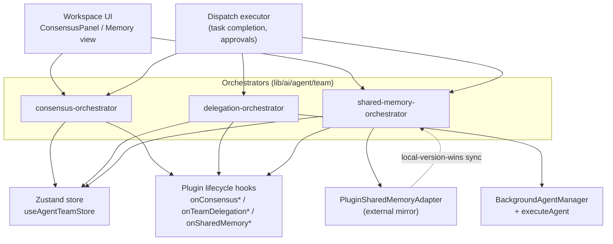

# 共识、委派与共享记忆

`lib/ai/agent/team/` 中的三个小型编排器在 `stores/agent/agent-team-store/` 所暴露的原始 store CRUD 之上叠加行为（ADR-0032 §5）。它们都不拥有状态：每一个负责计算、门控、触发插件钩子，然后把持久化推迟给 Zustand store。它们刻意保持轻薄——store 是唯一真相来源，这些模块是策略层。

<TLDR>
- **共识** — `lib/ai/agent/team/consensus-orchestrator.ts`（283 行）：投票统计、五种法定人数规则、达到阈值时自动解析、lead 覆盖。驱动工作区的 `ConsensusPanel`。
- **委派** — `lib/ai/agent/team/delegation-orchestrator.ts`（271 行）：把团队任务桥接进后台 agent 运行时和外部 agent 运行时；受静默时段门控；完整状态机。
- **共享记忆** — `lib/ai/agent/team/shared-memory-orchestrator.ts`（207 行）：每次写入都做深度 PII 门控、版本计数器写入、即发即忘的插件适配器镜像、本地版本优先的反向同步。
- 它们包装的 store CRUD：`stores/agent/agent-team-store/slices/actions.slice.ts` 中的 `upsertConsensus` / `upsertDelegation` / `writeSharedMemory` 等；`stores/agent/agent-team-store/selectors.ts:234` 中的 ACL 选择器。
</TLDR>



## 共识编排器

在 `ConsensusRequest` 记录（`types/agent/agent-team.ts:750`）之上进行投票收集、法定人数评估，以及自动/手动解析。每个条目通过 store 的 `upsertConsensus` 动作持久化。

| 符号 | 位置 | 用途 |
|---|---|---|
| tallyVotes | consensus-orchestrator.ts:40 | 按选项计票，对"weighted"类型应用权重。返回一个按选项索引的计数数组。 |
| computeWinner | consensus-orchestrator.ts:69 | 选出获胜选项或 null；对多数派类型以 voterCount 作分母。 |
| thresholdMet | consensus-orchestrator.ts:111 | 当 computeWinner 非 null 时为真；由 castVote 用来决定是否自动解析。 |
| createConsensus | consensus-orchestrator.ts:130 | 构建 ConsensusRequest、持久化它、触发 opened 钩子。 |
| castVote | consensus-orchestrator.ts:165 | 追加或替换一票（按 voterId 去重），重新计算获胜者，达到阈值时自动解析。 |
| resolveConsensus | consensus-orchestrator.ts:233 | 手动 lead 覆盖——以提供的获胜选项强制 resolved。 |
| cancelConsensus | consensus-orchestrator.ts:271 | 把 open 转为 cancelled。无钩子。 |

### 法定人数规则

五种规则种类映射到一个 switch（consensus-orchestrator.ts:86）：

```typescript
// lib/ai/agent/team/consensus-orchestrator.ts:86-103
switch (type) {
  case "majority":
    return voterCount > 0 && leaderCount > voterCount / 2 ? leader : null
  case "supermajority":
    return voterCount > 0 && leaderCount > (voterCount * 2) / 3 ? leader : null
  case "unanimous":
    return voterCount > 0 && leaderCount === voterCount ? leader : null
  case "weighted":
    return leaderCount > total / 2 ? leader : null
  case "lead_override":
    return null // Requires explicit resolveConsensus call
  default:
    return null
}
```

<Status status="info">lead_override 总是从 computeWinner 返回 null——它只能由一次显式的 resolveConsensus 调用来解析，永远不会被自动解析。</Status>

投票**按 voterId 去重**：重新投票会替换之前的票，而非叠加。在 `castVote` 时，当重新计算的获胜者非 null，记录翻转为 status "resolved"，带上 winningOption、resolvedAt 以及一行摘要，被 upsert，并在 voted 钩子之外额外触发 resolved 钩子。

### 插件钩子与消费者

`createConsensus`、`castVote` 和 `resolveConsensus` 分别触发 <Term>onConsensusOpened</Term>、<Term>onConsensusVoted</Term> 和 <Term>onConsensusResolved</Term>，让插件能观察其生命周期。渲染端消费者是工作区 Activity 标签页中的 `ConsensusPanel`（参见 <LinkCard href="./workspace-ui" title="工作区 UI" description="ConsensusPanel 在何处渲染" />）。

## 委派编排器

把一个团队任务桥接进后台 agent 运行时或外部 agent 运行时，通过 `upsertDelegation` / `updateDelegationStatus` 持久化一个 `TeamDelegationRecord`（`types/agent/agent-team.ts:828`）。

| 符号 | 位置 | 用途 |
|---|---|---|
| delegateToBackground | delegation-orchestrator.ts:121 | 创建记录、触发 start 钩子、注册一个 abort 信号、运行 executeAgent。返回一个同步记录外加一个异步完成 promise。 |
| delegateToExternal | delegation-orchestrator.ts:194 | 为外部 agent 创建一条记录并持久化它；结算在进程外发生。 |
| completeExternalDelegation | delegation-orchestrator.ts:222 | 一旦外部运行时返回就结算（状态外加结果）；触发 complete 钩子。 |
| approveDelegation | delegation-orchestrator.ts:243 | 把 awaiting_approval 转为 active 并重新派发后台运行。 |
| cancelDelegation | delegation-orchestrator.ts:256 | 中止后台信号、置为 cancelled、触发 complete 钩子。 |

### 静默时段门

委派通过复用连接器出站运行器的谓词来尊重团队治理的静默时段——没有第二套时间窗口实现：

```typescript
// lib/ai/agent/team/delegation-orchestrator.ts:41-46
function isDelegationQuietGated(sourceTeamId: string, nowMs: number = Date.now()): boolean {
  const quietHours =
    useAgentTeamStore.getState().teams[sourceTeamId]?.config.governancePolicy?.delivery?.quietHours
  if (!quietHours) return false
  return isInQuietHours(nowMs, quietHours.from, quietHours.to, quietHours.tz)
}
```

`isInQuietHours` 从 `lib/connectors/outbound-runner` 导入，`quietHours` 位于 `TeamGovernancePolicy.delivery` 上（`types/agent/agent-team.ts:135`）。

### 后台生命周期与状态机

`delegateToBackground`（delegation-orchestrator.ts:121）构建记录、upsert 它、触发 <Term>onTeamDelegationStart</Term>，然后调用 `getBackgroundAgentManager().registerAgent(agentId)`。异步地：如果运行被推迟（等待审批）则返回；否则它调用 `executeAgent(prompt, { systemPrompt, abortSignal: signal })`。最终状态在信号中止时为 "cancelled"，干净返回时为 "completed"，抛出错误时为 "failed"——通过 `updateDelegationStatus` 外加 <Term>onTeamDelegationComplete</Term> 钩子来结算。

完整的 `TeamDelegationRecord.status` 状态机是 **pending → awaiting_approval → active → completed / failed / cancelled / timeout**。

<LinkCard href="./capabilities-and-plugins" title="能力与插件" description="由委派和共识触发的钩子表面" />

## 共享记忆编排器

一个团队知识 store，在写入时带深度 PII 门、一个单调递增的版本计数器、ACL 感知的读取，以及一个可选的双向插件适配器镜像。条目是 `SharedMemoryEntry` 记录（`types/agent/agent-team.ts:678`），在 `writeSharedMemory` / `deleteSharedMemory` 下持久化。

| 符号 | 位置 | 用途 |
|---|---|---|
| publishEntry | shared-memory-orchestrator.ts:70 | 深度 PII 门、版本递增、store 写入、write 钩子，然后适配器镜像。 |
| deleteEntry | shared-memory-orchestrator.ts:125 | 删除外加 delete 钩子外加一次适配器镜像。 |
| autoPublishTaskResult | shared-memory-orchestrator.ts:149 | 任务完成后，以 "task:taskId" 键发布；静默跳过空字符串或被 PII 标记的字符串。 |
| clearTeamMemory | shared-memory-orchestrator.ts:168 | 丢弃该团队的所有条目。 |
| syncSharedMemoryFromAdapter | shared-memory-orchestrator.ts:183 | 拉取自游标以来的远程变更，本地版本优先，返回拉取计数。 |

### 深度 PII 门

每个发布的值在能抵达 store 之前都要通过深度 PII 扫描——与 Twin、Goal 和 Connectors 共享的同一道门：

```typescript
// lib/ai/agent/team/shared-memory-orchestrator.ts:70-79
export function publishEntry(input: PublishEntryInput): SharedMemoryEntry {
  // ...
  // Deep PII gate: scans every string leaf of strings, arrays, and plain objects
  if (!hasNoLeakingPiiDeep(input.value)) {
    throw new SharedMemoryPiiError(input.key)
  }
  // ... version increment + store.writeSharedMemory
}
```

`hasNoLeakingPiiDeep` 遍历字符串、数组和普通对象的每一个字符串叶子；一次拒绝会抛出一个带类型的 `SharedMemoryPiiError`（shared-memory-orchestrator.ts:55），携带违规的键。

<LinkCard href="../adr/0032-agent-team-plugin-integration" title="ADR-0032" description="被 Twin / Goal / Connectors 和 Agent Team 复用的共享 PII 门" />

### 适配器镜像

当团队配置指定了一个 `sharedMemoryAdapterId` 时，写入会以即发即忘的微任务镜像到外部适配器。对于合成的反向同步写入会跳过镜像——那些写入携带一个以 ":sync" 结尾的 writerName——这样一个拉取来的远程条目绝不会被再次推送：

```typescript
// lib/ai/agent/team/shared-memory-orchestrator.ts:108-119
const adapterId = team.config.sharedMemoryAdapterId
if (adapterId && !writerName.endsWith(":sync")) {
  const adapter = getSharedMemoryAdapter(adapterId)
  if (adapter) {
    queueMicrotask(() => {
      adapter.write(teamId, entry).catch((err) => {
        console.warn("[shared-memory] adapter mirror failed", err)
      })
    })
  }
}
```

### 反向同步——本地版本优先

`syncSharedMemoryFromAdapter` 读取持久化的逐 (teamId, adapterId) 游标 `lastAdapterSyncVersion`，向适配器请求自该游标以来的变更，并仅当某个远程条目严格高于本地副本的版本时才应用它。被应用的写入带上 ":sync" writer 后缀，使上面的镜像守卫不会把它弹回去：

```typescript
// lib/ai/agent/team/shared-memory-orchestrator.ts:194-204
for (const remote of entries) {
  const local = useAgentTeamStore.getState().sharedMemory[teamId]?.[remote.key]
  if (local && local.version >= remote.version) continue // local wins
  useAgentTeamStore.getState().writeSharedMemory(teamId, remote.key, {
    ...remote,
    writerName: `${adapterId}:sync`,
  })
  pulled += 1
}
useAgentTeamStore.getState().setAdapterSyncVersion(teamId, adapterId, cursor)
```

游标是共享记忆状态中唯一**确实**被持久化的一块（store persist v3 部分化了 `lastAdapterSyncVersion`）；条目本身是逐运行的纯 RAM。

### 适配器契约

插件通过实现此接口来注册一个镜像：

```typescript
// types/plugin/plugin-shared-memory-adapter.ts:26-47
export interface PluginSharedMemoryAdapterDef {
  id: string
  name: string
  description?: string
  icon?: string
  write(teamId: string, entry: SharedMemoryEntry): Promise<void>
  read(teamId: string, key: string): Promise<SharedMemoryEntry | undefined>
  listChanges(teamId: string, sinceVersion?: number): Promise<SharedMemoryAdapterChangeSet>
  delete(teamId: string, key: string): Promise<void>
  clear?(teamId: string): Promise<void>
}
```

### Store 侧 ACL

读取由每个条目上的一个 `readableBy` 允许列表过滤，由 store 选择器评估。操作员（合成的读取者 id "operator"）总能看到一切：

```typescript
// stores/agent/agent-team-store/selectors.ts:234-239
export function isEntryReadableBy(entry: SharedMemoryEntry, readerId: string): boolean {
  if (readerId === OPERATOR_READER_ID) return true
  if (!entry.readableBy || entry.readableBy.length === 0) return true
  if (entry.writtenBy === readerId) return true
  return entry.readableBy.includes(readerId)
}
```

`OPERATOR_READER_ID` 是 "operator"（selectors.ts:225）。空的或缺失的 `readableBy` 意味着全部可读；写入者总能读取自己的条目；否则读取者必须在允许列表上。`selectSharedMemoryEntriesForReader(teamId, readerId)`（selectors.ts:245）是 UI 所消费的 ACL 感知投影。

## 相关

<Cards>
  <Card href="./data-model" title="数据模型与 Store" description="ConsensusRequest、TeamDelegationRecord、SharedMemoryEntry 类型以及这些编排器包装的 Zustand store CRUD。" />
  <Card href="./capabilities-and-plugins" title="能力与插件" description="插件钩子表面（onConsensus*、onTeamDelegation*、onSharedMemory*）以及共享记忆适配器注册表。" />
  <Card href="./workspace-ui" title="工作区 UI" description="Activity 标签页中的 ConsensusPanel 和共享记忆视图。" />
  <Card href="../adr/0032-agent-team-plugin-integration" title="ADR-0032" description="Agent Team 插件集成——这三个编排器背后的架构决策。" />
</Cards>
