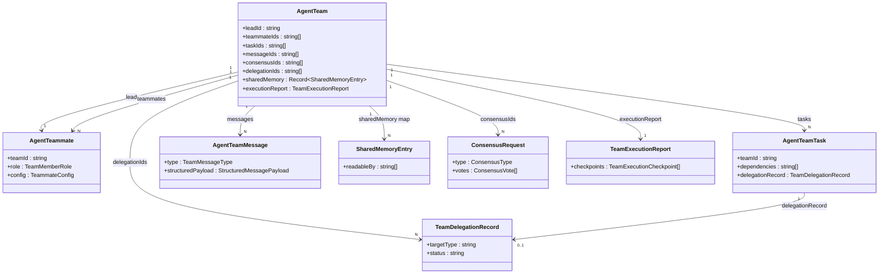

# 数据模型与 Store

智能体团队由一个类型模块 —— `types/agent/agent-team.ts` —— 描述，并在运行时由 `stores/agent/agent-team-store/` 下的一个 Zustand store 持有。该 store 刻意几乎不持久化任何东西：只有模板、默认配置和 UI 偏好能在重新加载后留存。团队实例、队友、任务、消息、共享内存、共识和委派都仅驻留内存并按每次运行重建，而持久的运行历史则存放在 Dexie `workflowRuns` 中，并带有 `triggerKind: "team"`。

<TLDR>
  `types/agent/agent-team.ts` 是权威 schema —— `AgentTeam`（`:882`）、`AgentTeamConfig`
  （`:266`）、`AgentTeammate`（`:486`）、`AgentTeamTask`（`:547`，带 `dependencies`），以及消息 /
  治理 / 能力类型。该 store（`stores/agent/agent-team-store/store.ts:104`）是 `persist`
  v3，其 `partialize` 只保留 `templates`、`defaultConfig`、`displayMode`、`workspaceTab`、
  `lastAdapterSyncVersion`。一切运行态都按设计仅驻留内存（ADR-0022 的非目标）。运行
  历史持久化到 Dexie `workflowRuns`/`workflowRunEvents`。聊天侧的 `teams` Dexie 表是一个
  不同的概念（`lib/claude/types.ts` Team）。
</TLDR>

## 类型清单 —— `types/agent/agent-team.ts`

该子系统中每一个面向用户的实体都在这里声明。行号是精确的。

| 类型 | 行 | 描述 |
| --- | --- | --- |
| `TeamMemberRole` | `:25` | "lead" 或 "teammate" |
| `TeamStatus` | `:30-37` | 7 种状态：idle、planning、executing、paused、completed、failed、cancelled |
| `TeammateStatus` | `:42-51` | 9 种状态：idle、planning、awaiting_approval、executing、paused、completed、failed、cancelled、shutdown |
| `TeamExecutionMode` | `:61-64` | coordinated、autonomous、delegate |
| `TeamExecutionPattern` | `:69-82` | manager_worker、parallel_specialists、background_handoff、external_handoff、single_agent_recommended、ultracode_orchestration |
| `TeamGovernancePolicy` | `:135-166` | approval / budget / escalation / delivery 子策略（见下文） |
| `TeamCapabilityBundle` | `:193-201` | mcpServerIds、skillIds、nativeAnthropicToolIds、characterPackIds、externalAgentPresetIds、subagentIds、a2uiTemplateIds |
| `CapabilityListOverlay` | `:208-215` | 每个键 3 种状态：`add` 求并、`remove` 求差、`replace` 覆盖 |
| `TeammateCapabilityOverlay` | `:222-230` | 每名队友针对各能力种类的叠加层 |
| `ResolvedCapabilities` | `:238-246` | 运行时由团队默认值 + 队友叠加层解析出的扁平化集合 |
| `AgentTeamConfig` | `:266-371` | 团队配置对象（下方逐字给出） |
| `TeammateConfig` | `:445-481` | systemPrompt + provider/model/apiKey/baseURL/temperature 覆盖、tools、requirePlanApproval、specialization、`runtime`、metadata、`capabilities` 叠加层 |
| `AgentTeammate` | `:486-525` | id、teamId、name、role、status、config、spawnPrompt、currentTaskId、proposedPlan、planFeedback、completedTaskIds、tokenUsage、progress、timestamps、error、specialization |
| `TeamTaskStatus` | `:534-542` | pending、blocked、claimed、in_progress、review、completed、failed、cancelled |
| `AgentTeamTask` | `:547-594` | id、teamId、title、status、priority、assignedTo/claimedBy、`dependencies`、tags、result、timings、`delegationRecord`、metadata |
| `TeamMessageType` | `:603-614` | 11 种：direct、broadcast、system、plan_approval、plan_feedback、task_update、result_share、shutdown、idle、task_assignment、consensus |
| `AgentTeamMessage` | `:642-669` | id、teamId、type、senderId、recipientId、content、taskId、read、timestamp、`structuredPayload` |
| `SharedMemoryEntry` | `:678-697` | key、value、writtenBy、writtenAt、expiresAt、version、tags、`readableBy`（ACL 允许列表） |
| `ConsensusRequest` | `:750-779` | id、teamId、initiatorId、question、options、`type`、status、votes、winningOption、timeoutMs、timestamps |
| `TeamDelegationRecord` | `:828-843` | id、sourceTeamId、sourceTaskId、`targetType`、targetId、`status`、reason、manual、timestamps、result、metadata |
| `AgentTeam` | `:882-937` | 团队聚合（下方逐字给出） |
| `TeamExecutionReport` | `:988-1000` | id、teamId、status、routingAssessment、activeExecutionPattern、checkpoints、summary、traceSessionId、timestamps |

`TeammateConfig` 上的 `runtime` 字段为每名队友选择执行后端 —— `claude`、`codex`、`claude-code`、`gemini-cli` 或 `cursor-cli` 之一。`ConsensusRequest.type` 是 `majority`、`supermajority`、`unanimous`、`weighted` 或 `lead_override` 之一。`TeamDelegationRecord.targetType` 是 `sub_agent`、`team` 或 `background`；其 `status` 依次经过 pending、awaiting_approval、active、completed、failed、cancelled 或 timeout。

`types/agent/index.ts:5-14` 通过 `export * from "./agent-team"` 重新导出以上全部内容，同时还有 `SubAgentTokenUsage` / `SubAgentPriority`（来自 `sub-agent.ts`，用于任务）以及独立的 `agent-mode.ts` 关注点。

### `AgentTeamConfig`（逐字）

```typescript
// types/agent/agent-team.ts:266-371
export interface AgentTeamConfig {
  maxTeammates: number
  maxConcurrentTeammates: number
  executionMode: TeamExecutionMode
  preferredExecutionPattern?: TeamExecutionPattern
  displayMode: TeamDisplayMode
  defaultProvider?: ProviderName
  defaultModel?: string
  tokenBudget?: number
  maxRetries?: number
  enableTaskRetry?: boolean
  enableDeadlockRecovery?: boolean
  governancePolicy?: TeamGovernancePolicy
  capabilities?: TeamCapabilityBundle
  sharedMemoryAdapterId?: string
  ultracode?: {
    enabled?: boolean
    autoMode?: "auto" | "always" | "never"
    maxFinderRounds?: number
    skepticsPerFinding?: number
    judgesPerAttempt?: number
    dryRoundsToStop?: number
  }
  workingDir?: string
  /** 在依赖任务开始前，由 Lead 阻塞式评审每个任务（ADR-0071）。 */
  taskReview?: {
    enabled?: boolean
    /** 收到 `changes_requested` 后允许成员修订的次数。默认 2。 */
    maxRevisions?: number
  }
}
```

`taskReview` **默认关闭**；开启后，合成器会为每个任务额外产出一个
`action.team.task.review` 节点，并把该任务的下游依赖改指向它，因此未通过评审的产出无法被继续使用。
它是 `governancePolicy.approval.requireResultReview`（一个**人工**看板闸门）的自动化同胞，两者可以叠加：
当 `requireResultReview` 也开启时，自动通过的任务会交给人工复核，否则直接标记完成。
开关与预算的解析集中在 `lib/ai/agent/team/task-review-policy.ts`，以确保合成器与执行器不会各自解读。

`DEFAULT_TEAM_CONFIG`（`:376`）填充 `maxTeammates: 10`、`maxConcurrentTeammates: 5`、`executionMode: "coordinated"`、`preferredExecutionPattern: "manager_worker"`、`displayMode: "expanded"`。`TeamGovernancePolicy`（`:135-166`）将四个子策略分组：**approval**（`requirePlanApproval`、`requireDelegationApproval`）、**budget**（`tokenBudget`、警告/告急阈值，以及一个 `onCritical` 动作）、**escalation**（`allowOperatorPatternOverride`、`pauseOnHighRisk`），以及 **delivery**（带时区的静默时段窗口）。

### `AgentTeam`（逐字）

```typescript
// types/agent/agent-team.ts:882-937
export interface AgentTeam {
  id: string
  name: string
  description: string
  task: string
  status: TeamStatus
  config: AgentTeamConfig
  routingAssessment?: TeamRoutingAssessment
  selectedExecutionPattern?: TeamExecutionPattern
  leadId: string
  teammateIds: string[]
  taskIds: string[]
  messageIds: string[]
  progress: number
  totalTokenUsage: SubAgentTokenUsage
  finalResult?: string
  executionReport?: TeamExecutionReport
  sharedMemory?: Record<string, SharedMemoryEntry>
  consensusIds?: string[]
  delegationIds?: string[]
}
```

## 实体关系

`AgentTeam` 聚合通过 id 集合引用一切；store 持有它所指向的实体表。



## Zustand Store —— `stores/agent/agent-team-store/`

该 store 拆分为 `store.ts`（持久化层）、`initial-state.ts`、`types.ts`（状态 + 动作签名）、`selectors.ts`，以及 `slices/actions.slice.ts`（实现）。

### 持久化配置（逐字）

```typescript
// stores/agent/agent-team-store/store.ts:104-124
export const useAgentTeamStore = create<AgentTeamState>()(
  persist(
    (set, get) => ({
      ...initialState,
      ...createAgentTeamActionsSlice(set, get),
    }),
    {
      name: "cognia-agent-teams",
      storage: createJSONStorage(() => localStorage),
      version: PERSIST_VERSION,
      partialize: (state) => ({
        templates: state.templates,
        defaultConfig: state.defaultConfig,
        displayMode: state.displayMode,
        workspaceTab: state.workspaceTab,
        lastAdapterSyncVersion: state.lastAdapterSyncVersion,
      }),
      migrate: (persistedState, version) => migrateAgentTeamPersisted(persistedState, version),
    }
  )
)
```

<Status>PERSIST_VERSION 为 3</Status>

**会被持久化的内容**（`partialize` 允许列表）：`templates`、`defaultConfig`、`displayMode`、`workspaceTab` 和 `lastAdapterSyncVersion` —— 最后一项是共享内存适配器的每（teamId, adapterId）反向同步游标。

**不会被持久化的内容**（刻意为之，ADR-0022 的非目标）：`teams`、`teammates`、`tasks`、`messages`、`events`、`consensus`、`sharedMemory`、`delegations` 和 `executionReports`。所有运行态都仅驻留内存并按每次运行重建。store 仍在 `initialState` 中声明这些槽位，使读取永不抛错。

### 迁移

`migrateAgentTeamPersisted`（`store.ts:50-102`）对 v3+ 输入是幂等的：

- **v1 到 v2** —— 在默认配置和每个模板配置上回填 `governancePolicy` 与 `capabilities`。
- **v2 到 v3** —— 回填 `sharedMemoryAdapterId` 并将 `lastAdapterSyncVersion` 初始化为 `{}`。

### 初始状态（逐字）

```typescript
// stores/agent/agent-team-store/initial-state.ts:1-51
export const initialState = {
  teams: {} as Record<string, AgentTeam>,
  teammates: {} as Record<string, AgentTeammate>,
  tasks: {} as Record<string, AgentTeamTask>,
  messages: {} as Record<string, AgentTeamMessage>,
  templates: builtInTemplatesMap, // BUILT_IN_TEAM_TEMPLATES
  events: [] as AgentTeamEvent[],
  consensus: {} as Record<string, ConsensusRequest>,
  sharedMemory: {} as Record<string, Record<string, SharedMemoryEntry>>,
  delegations: {} as Record<string, TeamDelegationRecord>,
  activeTeamId: null,
  selectedTeammateId: null,
  displayMode: "expanded" as TeamDisplayMode,
  isPanelOpen: false,
  workspaceTab: "overview" as const,
  workspaceFocus: { teammateId: null, taskId: null, messageId: null },
  workspaceDetailOpen: true,
  defaultConfig: { ...DEFAULT_TEAM_CONFIG },
  lastAdapterSyncVersion: {} as Record<string, Record<string, number>>,
}
```

### 动作面

签名存放在 `types.ts`；实现在 `slices/actions.slice.ts`（`createAgentTeamActionsSlice`，第 121 行起）。

| 分组 | 动作 | 行 |
| --- | --- | --- |
| Team | createTeam、upsertTeam、updateTeam、updateTeamConfig、updateTeamCapabilities、clearStaleCapabilityIds、deleteTeam、setTeamStatus | `:62-83` |
| Teammate | addTeammate、upsertTeammate、updateTeammate、updateTeammateCapabilities、removeTeammate、setTeammateStatus、setTeammateProgress | `:86-100` |
| Task | createTask、upsertTask、updateTask、deleteTask、setTaskStatus、claimTask、assignTask | `:103-109` |
| Message | addMessage、upsertMessage、removeMessage、markMessageRead、markAllMessagesRead、markTeamMessagesRead | `:112-117` |
| Events | addEvent、clearEvents | `:120-121` |
| Template CRUD | addTemplate、deleteTemplate、saveAsTemplate、updateTemplate、importTemplates、exportTemplates | `:124-133` |
| UI 状态 | setActiveTeam、setSelectedTeammate、setDisplayMode、setIsPanelOpen、setWorkspaceTab、setWorkspaceFocus、setWorkspaceTeamFromRoute、closeAgentTeamWorkspaceDetail | `:136-143` |
| 读取视图 | getTeam、getTeammate、getTeammates、getTeamTasks、getTeamMessages、getUnreadMessages、getActiveTeam | `:146-152` |
| 批量操作 | cancelAllTasks、shutdownAllTeammates、cleanupTeam | `:155-157` |
| Consensus | upsertConsensus、deleteConsensus、clearTeamConsensus | `:160-162` |
| Shared memory | writeSharedMemory、deleteSharedMemory、clearTeamSharedMemory、setAdapterSyncVersion | `:165-169` |
| Delegation | upsertDelegation、updateDelegationStatus、clearTeamDelegations | `:172-178` |
| Execution report | upsertExecutionReport、addExecutionCheckpoint | `:181-182` |
| Protocol / lifecycle | addStructuredMessage、requestTeammateShutdown | `:185-190` |
| Settings | updateDefaultConfig、reset | `:193-196` |

`actions.slice.ts` 中值得注意的实现护栏：`createTeam` 自动孵化首席协调员并运行 `normalizeAgentTeamConfig`；`clearStaleCapabilityIds`（`:217-259`）剥离插件被禁用后不再可解析的 id；`upsertTeammate` / `removeTeammate` 防止首席协调员成为孤儿；`setTeammateProgress` 钳制到 `[0, 100]`；`setTeamStatus` 在进入 "executing" 时盖上 `startedAt`，在终态时盖上 `completedAt` + `totalDuration`。

### 选择器

`selectors.ts`（`:1-305`）暴露基础选择器以及派生族。要点：

- **治理摘要** —— `selectActiveTeamGovernanceSummary`（`:57-77`）将路由评估 + 活跃执行模式 + 执行报告组合成工作区治理视图所渲染的单个对象。
- **共享内存 ACL**（`:212-250`）—— `OPERATOR_READER_ID = "operator"`；`isEntryReadableBy(entry, readerId)` 授予操作员一切权限，将空的 `readableBy` 视为全局可读，始终允许写入者读取自己的条目，否则检查 `readableBy` 允许列表。`selectSharedMemoryEntriesForReader(teamId, readerId)` 按读者应用此规则。
- **已解析能力** —— `selectResolvedCapabilities(teamId, teammateId)`（`:262-279`）通过 `resolveTeammateCapabilities` 将团队默认能力束与队友叠加层合并。
- 其他族：team 派生（`:43-77`）、按状态分的队友（`:83-99`）、按状态/受派人分的任务（`:105-137`）、未读/按类型/结构化消息（`:143-191`）、活跃/待处理共识（`:197-206`）、委派与事件（`:285-304`）。

## 持久化矩阵

按意图分三层。注意运行态层**有意**仅驻留内存 —— ADR-0022 将“团队运行不新增 Dexie 表”定为目标，因此持久历史改而搭乘工作流运行日志。

| 数据 | 是否持久化？ | 位置 |
| --- | --- | --- |
| 模板、defaultConfig、UI 偏好、适配器同步游标 | 是 | localStorage（`partialize`，持久化 v3） |
| 团队实例、队友、任务、消息 | 否 | 仅内存（每次运行临时） |
| 共享内存、共识、委派、执行报告 | 否 | 仅内存（每次运行临时） |
| 团队运行历史 + 步骤事件 | 是 | Dexie `workflowRuns`（`triggerKind: "team"`）+ `workflowRunEvents` |
| 待处理 HITL 关卡 | 否 | 仅内存（按设计以运行为范围） |

Dexie 接线（`lib/db/schema.ts`）：`workflowRuns`（`:194`，按 id、createdAt、status、workflowId、triggerKind 索引）持久化每次团队运行；`workflowRunEvents`（`:195`，按 id、runId、timestamp 索引）是步骤级日志。`lib/ai/agent/agent-team.ts:113` 中的门面注释指引 UI “直接订阅 workflowRuns”。

<Status>聊天侧的 teams Dexie 表是一个不同的概念</Status>

Dexie `teams` 表（`schema.ts:130, 356`，按 id、name、updatedAt、isBuiltIn 索引）存储**聊天侧**的持久团队定义，其类型由 `lib/claude/types.ts` Team 给出。它与智能体团队 store 的仅驻留内存 `teams` record 无关 —— 切勿混为一谈。

## 兼容层 —— `lib/ai/agent/agent-team-compat.ts`

这些规范化器在每次 store 输入时运行；`dispatchAgentTeam` 是工作流节点和远程控制所用的无头派发接缝。

| 导出 | 行 | 用途 |
| --- | --- | --- |
| `dispatchAgentTeam(options)` | `:32-52` | 通过 `agentTeamManager.start(teamId)` 启动一次运行；返回 `{ ok, reason? }` |
| `normalizeAgentTeamConfig(config)` | `:68-124` | 修剪 name/description/task；钳制为负的 `maxTeammates`、`maxConcurrentTeammates`、`tokenBudget` |
| `normalizeAgentTeamTask(task)` | `:131-158` | 修剪字符串；钳制为负的 `order` / `retryCount` |
| `agentTeamCompat` | `:54-56` | 暴露 `dispatch: dispatchAgentTeam` 的门面 |

## 待处理关卡 Store —— `stores/agent/pending-gates-store.ts`

一个独立的、同样仅驻留内存的 store 镜像着已打开的 HITL 审批关卡。`TeamNotifier` 推送携带 `openApproval: { scope, id }` 的告急通知；工作区挂载一个 `GateModalsHost`，为每个待处理条目渲染一个 `ApprovalGateDialog`。`gateTypeFromScope` 将审批总线 scope 映射为 UI 关卡种类：

```typescript
// stores/agent/pending-gates-store.ts:35-44
export function gateTypeFromScope(scope: string): PendingGateType {
  switch (scope) {
    case "agent-team-budget": return "budget"
    case "agent-team-deadlock": return "deadlock"
    case "agent-team-teammate-fix": return "teammate_fix"
    case "agent-team":
    default: return "plan"
  }
}
```

`PendingGate` 携带 `key`（一个由 scope + id 构成的 `ApprovalKey`）、`gateType`、`title`、可选的 `body`、`runId`、`teamId`、可选的 `taskId`，以及 `openedAt`。store API 为 `open(gate)`（按 scope + id 去重）、`close(key)` 和 `clearForRun(runId)`。完整的审批总线故事见 [HITL 关卡](./hitl-gates)。

## 相关

<Cards>
  <Card title="概览" href="./index" description="智能体团队是什么，以及各部件如何组合。" />
  <Card title="生命周期与合成" href="./lifecycle-and-synthesis" description="团队如何被规划、运行并合成为最终结果。" />
  <Card title="能力与插件" href="./capabilities-and-plugins" description="能力束与叠加层如何解析为某名队友的工具集。" />
  <Card title="ADR-0022" href="../adr/0022-agent-team-runtime-hardening" description="运行时加固 —— 仅驻留内存与不新增 Dexie 表决策的来源。" />
</Cards>
