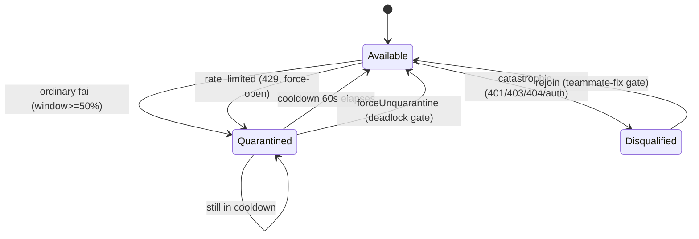

# 队员派发与按运行共享状态

`runTeamLifecycle` 把一个团队合成为一份 `VisualWorkflow`，然后把每个节点交给一个可复用原语：`dispatchTeammate`。该原语认领一名队员、运行一轮（工具启用或纯文本）、校验输出，并喂养按运行的共享状态 —— <Term>队员池</Term>（断路器）、<Term>预算守卫</Term>（token 升级）以及<Term>通知器</Term>（按级别扇出）。重试是编排器的职责，而非派发器的。本页梳理这条派发路径及它触及的每个共享状态模块。

<TLDR>
- 一个派发原语：`dispatchTeammate`（`lib/ai/agent/team/dispatch-teammate.ts:171-344`）—— 由任务执行器与每个 ultracode 模式经由 `dispatchStructured` 共享。
- 通道分流：sidecar（Tauri 工具启用）对 文本（AI-SDK），在 `dispatch-teammate.ts:236-241` 选定；一次性契约在 `executeAgent`（`lib/ai/agent/agent-executor.ts:190-202`）中。
- 按队员断路器 + 5 类错误分类，在 `teammate-pool.ts:81-219`；预算升级（4 种 onCritical 动作）在 `budget-guard.ts:97-158`。
- 通知器把 info/warn/critical 路由到 事件日志/toast/OS/HITL 闸门（`team-notifier.ts:106-159`），经由 ADR-0042 `deliver()`（`agent-team-runtime-deps.ts:133-165`）。
- `defaultTimeout`（600s）与 `minOutputChars` 是生效的；`maxRetries` 在此处**不**被读取。
</TLDR>

## 1. `dispatchTeammate` —— 单一派发原语

<Status status="stable">lib/ai/agent/team/dispatch-teammate.ts:1-345</Status>

`dispatchTeammate(teamCtx, args)` 是 ultracode `agent()` 调用的抽离等价物。`action.team.task.dispatch` 节点执行器**以及**高阶模式节点都经由它路由，因此认领/运行/校验/记录恰好发生在唯一一个地方。

**关键导出：** `dispatchTeammate`（171）、`DispatchTeammateArgs`（41）、`DispatchTeammateResult`（66）、`TeammateChannel` = "sidecar" &#124; "text"（33）、`TokenUsage`（35）。

**流程（`dispatch-teammate.ts:171-344`），按顺序：**

1. **认领**（175-179）—— `teamCtx.pool.claim(taskId)`；当池为空时抛错（可重试）。
2. **能力缓存**（182-188）—— 已解析的能力在每次运行中向 `resolvedCapabilities` 填充一次。
3. **钩子**（191-203）—— `onTeammateClaim` / `onAgentStart` 触发。
4. **超时合并**（218-225）—— `defaultTimeout`（600s 回退）折叠进中止信号。
5. **系统提示词解析**（227-231）—— args → 队员配置 → 团队默认 → 内置默认。
6. **通道选择**（236-241）—— Tauri + `runtime === "claude"` → `"sidecar"`；否则 `"text"`。
7. **追踪 span**（246-255）—— 每次派发一个 `invoke_agent` span；为 eval 透传 `teamCtx.traceId`。
8. **运行**（259-270）—— `runToolEnabled` 或 `runTextOnly`。
9. **失败路径**（271-287）—— `pool.recordFailure` + `setTaskStatus("failed")` + 释放钩子 + 重抛。
10. **输出校验**（299-321）—— 空 / 低于 `minOutputChars` → `EMPTY_OUTPUT` 错误。
11. **成功记账**（323-334）—— `recordSuccess` + `budget.add` + `result_share` 消息 + `setTaskStatus("completed")`。

### 超时合并

按任务超时回退到 `team.config.defaultTimeout`（默认 `DEFAULT_PER_TASK_TIMEOUT_MS`，600s），随后经由 `AbortSignal.any` 与调用方的信号合并：

```typescript
// lib/ai/agent/team/dispatch-teammate.ts:218-225
const timeoutMs =
  args.timeoutMs ??
  (typeof teamCtx.team.config?.defaultTimeout === "number" &&
  teamCtx.team.config.defaultTimeout > 0
    ? teamCtx.team.config.defaultTimeout
    : DEFAULT_PER_TASK_TIMEOUT_MS)
const timeoutSignal = AbortSignal.timeout(timeoutMs)
const combinedSignal = args.signal ? AbortSignal.any([args.signal, timeoutSignal]) : timeoutSignal
```

### 输出校验

两道检查把关结果。空白裁剪后为空始终是失败；`minOutputChars`（来自 args，否则团队配置，否则 0）拒绝过短的输出。两者都会记录一次断路器失败并重抛：

```typescript
// lib/ai/agent/team/dispatch-teammate.ts:299-321
if (args.validateOutput !== false) {
  if (trimmed.length === 0) {
    const empty = new Error("EMPTY_OUTPUT: teammate returned empty response")
    teamCtx.pool.recordFailure(teammate.id, empty)
    if (args.recordToStore) {
      teamCtx.storeWriter.setTaskStatus(args.taskId, "failed", undefined, empty.message)
    }
    release("failure", empty)
    throw empty
  }
  const minChars = args.minOutputChars ?? teamCtx.team.config?.minOutputChars ?? 0
  if (minChars > 0 && trimmed.length < minChars) {
    const short = new Error(
      `EMPTY_OUTPUT: output below minOutputChars=${minChars} (got ${trimmed.length})`
    )
    teamCtx.pool.recordFailure(teammate.id, short)
    if (args.recordToStore) {
      teamCtx.storeWriter.setTaskStatus(args.taskId, "failed", undefined, short.message)
    }
    release("failure", short)
    throw short
  }
}
```

### 成功记账

成功时池、预算与 store 全部更新；共享的 `result_share` 消息被截断到 1200 字符：

```typescript
// lib/ai/agent/team/dispatch-teammate.ts:323-334
teamCtx.pool.recordSuccess(teammate.id)
if (turn.usage) teamCtx.budget.add(turn.usage)
if (args.recordToStore) {
  teamCtx.storeWriter.addMessage({
    teamId: teamCtx.teamId,
    senderId: teammate.id,
    type: "result_share",
    content: text.length > 1200 ? `${text.slice(0, 1199)}…` : text,
    taskId: args.taskId,
  })
  teamCtx.storeWriter.setTaskStatus(args.taskId, "completed", text)
}
```

<Status status="info">重试备注：`maxRetries` / `enableTaskRetry` 配置在此处**不**被读取 —— 重试被委派给工作流编排器的 `runStep`，每次重试都会重新认领并轮换队员。在此原语中只有 `defaultTimeout` 和 `minOutputChars` 是生效的（按 ADR-0022 两者此前都是失效的）。</Status>

## 2. `executeAgent` —— 一次性 agent 契约

<Status status="stable">lib/ai/agent/agent-executor.ts:1-250</Status>

`executeAgent(prompt, config)` 是插件安全的一次性入口。当 `toolsEnabled` 且 Tauri 存在时，它经由 sidecar 运行（全套工具，通道 `"sidecar"`）；否则它会落到 AI-SDK 纯文本通道：

```typescript
// lib/ai/agent/agent-executor.ts:194-202
if (config.toolsEnabled) {
  const { isTauri } = await import("@/lib/tauri")
  if (isTauri()) {
    const { text } = await runToolEnabledStandalone(prompt, config)
    return { text, finishReason: "stop", channel: "sidecar", toolsAvailable: true }
  }
  // Requested tools but no sidecar — fall through to the text-only channel.
}
```

**消费者：** `dispatchTeammate` 文本回退（`dispatch-teammate.ts:157`）、委派/后台编排器、经由公开 agent-executor API 的插件，以及 lead 计划（`agent-team-runtime-deps.ts` 中的 `runLeadPlanning`）。

## 3. `teammate-pool` —— 轮询 + 按队员断路器

<Status status="stable">lib/ai/agent/team/teammate-pool.ts:1-260</Status>

池在 `available` 队员（`!disqualified && breaker.canPass()`）上做轮询选择，并把每个条目包进各自的 `CircuitBreaker`：滑动窗口，`minEvents=2`、`failureThresholdPct=50`、`cooldownMs=60s`。

### 错误分类

`classifyError` 把一个抛出的错误映射为五种类别之一，由其决定失败动作：

```typescript
// lib/ai/agent/team/teammate-pool.ts:81-90
export function classifyError(err: unknown): TeammateFailureKind {
  const msg = err instanceof Error ? err.message : String(err)
  if (/EMPTY_OUTPUT/.test(msg)) return "empty_output"
  if (/REFUSAL_DETECTED/.test(msg)) return "refusal"
  if (/\b429\b|rate.?limit/i.test(msg)) return "rate_limited"
  if (/\b40[134]\b|unauthor(ized|ised)|invalid.{0,5}key|forbidden/i.test(msg)) {
    return "catastrophic"
  }
  return "ordinary"
}
```

### `recordFailure` 分支

`catastrophic`（401/403/404/认证）永久取消资格并通知取消资格监听器。`rate_limited`（429）通过记录 100 次失败来强制打开断路器。其余一切走普通的滑动窗口路径：

```typescript
// lib/ai/agent/team/teammate-pool.ts:191-219
recordFailure: (teammateId, error) => {
  const e = entries.get(teammateId)
  if (!e) return
  const kind = classifyError(error)
  switch (kind) {
    case "catastrophic":
      if (!e.disqualified) {
        e.disqualified = true
        for (const fn of disqualListeners) {
          try { fn(teammateId, "catastrophic") }
          catch (err) { console.warn("TeammatePool onTeammateDisqualified listener threw:", err) }
        }
      }
      break
    case "rate_limited":
      for (let i = 0; i < 100; i += 1) e.breaker.recordFailure()
      break
    default:
      e.breaker.recordFailure()
  }
  dispatchRelease(teammateId, "failure", ...)
  checkAllUnavailableEdge()
},
```

### 健康状态

| 状态 | 成因 | 恢复 |
|---|---|---|
| Available | `!disqualified` 且断路器闭合 | 正常选择 |
| Quarantined | 断路器打开（滑动窗口或 429 强制打开） | 60s 冷却后自动恢复，或经由 HITL 的 `forceUnquarantine` |
| Disqualified | 灾难性失败（认证/4xx） | 操作员经由队员修复闸门 `rejoin` |

**API 面：** `claim(taskId)`（161-182，触发 `onTeammateClaim`，无可用时返回 `null`）、`recordSuccess`（184-189）、`allUnavailable()`（229）、`onAllUnavailable(cb)`（230-235，在 false→true 时边沿触发一次）、`onTeammateDisqualified(cb)`（236-240）、`forceUnquarantine(input)`（242-249）、`rejoin(teammateId)`（251-256，清除 disqualified **并**重置断路器）。



当每名队员都变为取消资格或隔离时，边沿触发的 `onAllUnavailable` 触发一次 —— 合成器把它接到死锁 HITL 闸门。构造于 `agent-team-runtime.ts:255`；由 `dispatchTeammate` 与死锁解析器消费。

## 4. `budget-guard` —— token 预算升级

<Status status="stable">lib/ai/agent/team/budget-guard.ts:1-172</Status>

`createBudgetGuard(opts)` 累计 token 用量并触发一次性阈值事件：在 `warnAt`（默认 0.80）触发 `warning_crossed`，在 `critAt`（默认 0.95）触发 `critical_crossed`。`add(usage)` 独立检查这两个阈值，因此从 0 一跃到 96% 会同时触发两者。

### `handleCritical` —— 四种 onCritical 动作

在跨越严重阈值时，恰好运行一个 `onCritical` 动作：

```typescript
// lib/ai/agent/team/budget-guard.ts:97-131
const handleCritical = (): void => {
  opts.notifier.notify({
    level: "critical",
    title: "Token budget critical",
    body: `Used ${used} of ${limit} tokens (${((used / limit) * 100).toFixed(1)}%)`,
    runId: opts.runId,
    teamId: "",
    dedupeKey: `budget-critical:${opts.runId}`,
  })
  emit("critical_crossed")
  switch (opts.onCritical) {
    case "notify":
      // notification already sent above
      break
    case "pause_for_review":
      emit("pause_for_review")
      break
    case "reduce_concurrency":
      opts.concurrencyCtrl?.reduceTo(1)
      opts.notifier.notify({
        level: "warn",
        title: "Concurrency reduced to 1",
        body: "Budget critical; further tasks will serialize.",
        runId: opts.runId,
        teamId: "",
        dedupeKey: `budget-reduce:${opts.runId}`,
      })
      break
    case "handoff_to_background":
      opts.concurrencyCtrl?.reduceTo(1)
      opts.modelCtrl?.downshift()
      opts.notifier.suspend()
      emit("entered_background_mode")
      break
  }
}
```

- **notify** —— 仅发严重通知；运行继续。
- **pause_for_review** —— 发出 `pause_for_review`；合成器打开预算 HITL 闸门。
- **reduce_concurrency** —— 把并发上限定为 1，警告任务将串行化。
- **handoff_to_background** —— 限定并发上限、降档模型（`modelCtrl.downshift()`）、挂起通知器，并发出 `entered_background_mode`。

**`extendLimit(extraTokens)`**（160-163）抬高上限**并**重置 `warned`/`critical`，因此预算闸门的批准路径允许同一次运行在用量再次跃升时重新触发阈值。`status()`（159）返回 `{ used, limit, level }`，其中 level 为 "ok" / "warning" / "critical"。`budget.add(turn.usage)` 在每次成功后从 `dispatch-teammate.ts:324` 调用。

## 5. `team-notifier` —— 按级别路由扇出

<Status status="stable">lib/ai/agent/team/team-notifier.ts:1-169</Status>

`createTeamNotifier(runCtx, deps)` 按级别路由。事件日志通道始终触发（即使在挂起期间）；toast 与 OS 通知随严重度升级；HITL 闸门仅为携带 `openApproval` 键的严重事件打开。

| 级别 | 事件日志 | Toast | OS 通知 | HITL 闸门 |
|---|---|---|---|---|
| info | 是 | 否 | 否 | 否 |
| warn | 是 | 是 | 否 | 否 |
| critical | 是 | 是 | 是 | 是（若有 openApproval） |

### ADR-0042 `deliver()` 对 旧版回退

当 `deps.deliver` 存在时，单次 `deliver(p)` 调用把事件路由经过统一通知中心；否则按通道的 `toast()` / `osNotify()` 调用是旧版测试回退。`suspend()`（handoff_to_background）静音 toast/OS，但事件日志保持完整；按 `dedupeKey` 应用 5 分钟去重窗口：

```typescript
// lib/ai/agent/team/team-notifier.ts:130-143 (within notify)
if (suspended) return
// Unified delivery (ADR-0042): one emit per event
if (deps.deliver) {
  callSafely(() => deps.deliver!(p), "deliver")
} else {
  // Legacy fallback: per-channel
  if (p.level === "warn" || p.level === "critical") {
    if (deps.toast) {
      callSafely(() => deps.toast!(p.title, p.body ? { description: p.body } : undefined), "toast")
    }
  }
  if (p.level === "critical" && deps.osNotify) {
    callSafely(() => deps.osNotify!({ title: p.title, body: p.body }), "osNotify")
  }
}
```

**生产依赖接线**（`agent-team-runtime-deps.ts:133-165`）：`deliver` → `lib/notifications/runtime.notify`，source 为 `"agent-team"`、`groupKey` 为 runId、`sourceRef { kind: "team-run" }`，严重时 `directed`；`log` → console；`openGate` → `usePendingGatesStore.getState().open({...})`，以 `gateTypeFromScope(scope)` 为键。

## 6. `structured-dispatch` —— StructuredOutput 镜像

<Status status="stable">lib/ai/agent/team/structured-dispatch.ts:1-83</Status>

sidecar 上没有强制 JSON 工具，因此 `dispatchStructured<T>` 镜像了 Claude Code 的 StructuredOutput：它附加一段围栏式 JSON 指令、用 `parseProposedPlan` 解析、用 Zod 校验，并把校验错误反馈回去后**重试一次**。两次尝试均失败后抛错。

```typescript
// lib/ai/agent/team/structured-dispatch.ts:50-81
for (let attempt = 0; attempt < 2; attempt += 1) {
  const retryNote =
    attempt === 0
      ? ""
      : `\n\nYour previous response was invalid: ${lastError}\nReturn corrected JSON only — no other text.`
  const prompt = `${args.prompt}${JSON_INSTRUCTION}${schemaHint}${retryNote}`

  const result = await dispatchTeammate(teamCtx, {
    ...args,
    prompt,
    validateOutput: true,
    recordToStore: false,
  })

  const parsed = parseProposedPlan(result.text)
  if (!parsed.ok) {
    lastError = `response was not valid JSON (${parsed.reason})`
    continue
  }

  const validated = schema.safeParse(parsed.plan)
  if (!validated.success) {
    lastError = validated.error.issues
      .map((i) => `${i.path.join(".") || "(root)"}: ${i.message}`)
      .join("; ")
    continue
  }

  return { value: validated.data, teammateId: result.teammateId, raw: result.text }
}
```

此处 `recordToStore` 被强制为 `false`（重试不应刷屏 `result_share`）。所有 ultracode 模式节点与 ultracode 计划器都消费 `dispatchStructured`。

## 7. 后台管理器与示例团队

<Status status="info">lib/ai/agent/background-agent-manager.ts:1-83 · lib/ai/agent/sample-team.ts:1-91</Status>

- **`background-agent-manager`** —— 为插件与委派提供的一个极简“即发即忘”生命周期。`getBackgroundAgentManager()` 是单例（74）；`registerAgent(id, { pluginId?, label? })` 返回一个 `AbortSignal`（25）；`finishAgent` / `cancelAgent` / `cancelByPlugin` / `list` 补全其余部分。无持久化 —— 它只跟踪中止信号。
- **`sample-team`** —— 一键式“Demo Research Squad”工厂：一名 Lead Strategist 外加 Researcher / Risk Analyst / Writer 以及三个有序任务（EU AI Act 调研 → 风险 → 一页简报）。纯 store 函数，无 LLM 耦合；配置预设 `maxTeammates 5`、`maxConcurrentTeammates 2`、`executionMode "autonomous"`、`requirePlanApproval false`。返回 `{ teamId }`。

## 8. 集成汇总

| 模块 | 配置入 | 状态出 | 下游 |
|---|---|---|---|
| dispatch-teammate | defaultTimeout、minOutputChars、队员运行时 | TokenUsage、result_share 写入、追踪 span | dispatchStructured、模式节点 |
| agent-executor | toolsEnabled、systemPrompt、model、timeoutMs | text + 通道标志 | 派发文本回退、委派、插件 |
| teammate-pool | 队员列表 | claim / quarantine / disqualified | 派发、死锁解析器 |
| budget-guard | limit、warnAt、critAt、onCritical | 跨越事件、升级 | 通知器、并发、模型降档 |
| team-notifier | deliver / toast / osNotify / openGate 依赖 | notify() 副作用、suspend / resume | 所有模块、统一通知中心 |
| structured-dispatch | zod schema | 已校验的类型化结果 | 模式（judge / verify / synthesize） |

## 相关

<Cards>
  <Card title="团队生命周期与合成" href="./lifecycle-and-synthesis" />
  <Card title="HITL 审批闸门" href="./hitl-gates" />
  <Card title="Ultracode 模式" href="./ultracode-and-patterns" />
  <Card title="ADR-0022 运行时加固" href="../adr/0022-agent-team-runtime-hardening" />
</Cards>
