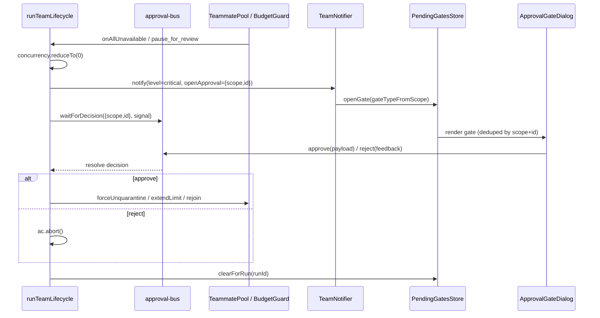

# 人工审批

一次小队运行在需要人之前都是自治的。自 ADR-0169 起，每一个这样的时刻都是同一件事：一条带 `reviewKind` 的持久化 `ExecutionRunInterrupt`，由 Action Review 契约投影，经唯一控制入口（带类型化 `reviewDecision` 的 `RunControlCommand`）回答，并以回执结算。小队路径上不再有内存总线、按标签页的闸门 store、模态框宿主。桌面上提出的审批可以在手机、IM 卡片、CLI 或驾驶舱里回答，而且跨重启存活。

<TLDR>
  运行时调用 `openSquadReview({ runId, teamId, kind, instance, subject })`
  （`lib/ai/agent/team/squad-review-gate.ts`）。它先写一个运行级检查点，再把一份
  `ActionReviewRequest` 以确定性 id（`action-review:squad-review:<runId>:<kind>:<instance>`）投影成
  该运行的 `ExecutionRunInterrupt`，然后通过 Dexie live query 加轮询兜底等待这一行。任何界面用
  `executeRunControlCommand({ action: "approve" | "deny", interruptId, reviewDecision })` 回答它。
  控制门按中断的种类校验决策（`lib/execution/squad-review-decision.ts`），team 处理器把脱敏后的决策
  存在行旁并写回执（`settleSquadReviewFromControl`），等待者在状态翻转时醒来。重启后重新武装的
  生命周期找到的是同一行，并且恰好恢复一次。过期即拒绝。
</TLDR>

## 不变量

1. **唯一待决记录。** 小队等待中的问题只存在于 `executionRunInterrupts`。`usePendingSquadReviews` 为舰队徽章、编辑器芯片和上下文面板读取它。
2. **唯一协议。** `ActionReviewRequest` / `ActionReviewDecision` / `ActionReviewReceipt`（`packages/agent-config-types/src/action-review.ts`），通道为 `agent-team-plan`、`agent-team-gate`、`agent-team-budget`、`agent-team-deadlock`、`agent-team-teammate-repair`、`agent-team-replan`、`agent-team-recovery`。
3. **类型化决策。** `SquadReviewDecision` 是可辨识联合。载荷错误或缺失的 `approve` 在任何处理器运行前就是 `invalid_command`。
4. **日志里没有自由文本。** 计划反馈随命令传递，由 `sanitizeDecision` 脱敏，只存在中断行上。
5. **重启安全。** 打开前先写检查点。确定性 id。`recoverPendingRunInterrupts` 让超期的过期（持久化人工交接除外）。`armPendingTeamRecoveries` 在引导时为每个停驻的运行重新提出恢复审批。

## 审批种类

| 种类 | 中断类型 | 决策载荷 | 由谁提出 |
| --- | --- | --- | --- |
| `plan` | `plan_approval` | `{ kind: "plan", feedback? }` | 计划审批循环，每个修订一个实例 |
| `capability_audit` | `squad_capability_audit` | `{ kind: "capability_audit" }` | 能力 id 过期时的运行前核查 |
| `budget_extension` | `squad_budget` | `{ kind: "budget_extension", extraTokens }` | 预算守卫，每次触及临界值 |
| `deadlock` | `squad_deadlock` | `{ kind: "deadlock", teammateIds?, resetAll? }` | 队员池，所有队员都不可用时 |
| `teammate_repair` | `squad_teammate_repair` | `{ kind: "teammate_repair", action: "rejoin" | "skip" }` | 队员池，某个队员被取消资格时 |
| `replan` | `squad_replan` | `{ kind: "replan", edited? }` | 队长在运行中提出重新规划时 |
| `team_recovery` | `team_recovery` | `{ kind: "team_recovery", choice, hostRef? }` | 控制状态机，运行无法安全重放时 |

任何种类的 `deny` 都不需要载荷。只有 `plan` 与 `capability_audit` 的 `approve` 不需要载荷。

## 恢复

无法证明可以安全重放的 resume（某个子运行没有检查点、检查点为 `needs_input`、存在未知或不安全的待定副作用）会把运行停在 `needs_input` 并带上原因码，同时提出 `team_recovery`（`lib/ai/agent/team/team-recovery.ts`）。subject 带 `reason`、`uncertainChildIds`、公共的 `hostRef`（若有）以及 `choices`：

- `retry_same_host` 把不确定的子运行在原主机重新排队并恢复。
- `retry_host` 把它们排到指定主机。协调器拒绝没有安全检查点的跨主机迁移，运行保持停驻。
- `restart_run` 先经 `startSquadRun` 启动一个关联的替代运行，再停止停驻的运行。
- `terminate` 停止它。

回填的旧运行（`legacy_run_not_resumable`）只提供 `restart_run` 与 `terminate`。校验器对照 `subject.choices` 拒绝其他选项。

## 各界面在哪里回答

- **驾驶舱**（`/agent-runs`，以及同一个面板的 `/squads` 运行页签）：`SquadReviewForm` 按待决中断的种类渲染决策表单，经 `useRunControlActions` 派发。类型化表单接管期间，裸的批准 / 拒绝按钮隐藏。
- **伴侣壳**向桌面宿主提交 `execution_run_control`。同一条命令，同一道门。
- **IM 卡片**通过 `openSquadReview` 的 delegate 接缝与中断赛跑。谁先回答谁结算。
- **CLI** 提交同样的 `RunControlCommand`。

## 历史：approval-bus 时代

下面的内容描述的是 ADR-0022 交付、ADR-0169 退役的机制。保留它是因为每道门存在的*理由*没有变，也因为旧日志与回执仍引用这些名字。其中没有任何东西还在小队路径上：`lib/runtime/approval-bus.ts` 与 `stores/agent/pending-gates-store.ts` 已没有小队读者，`GateModalsHost` 不再渲染任何小队闸门。

## 审批原语

`lib/runtime/approval-bus.ts` 是一个以 scope+id 为键的内存发布/订阅，用于"等待某人决定 approve/reject"。它从原本专属于 agent-team 的总线中抽取而来，使同一个原语既驱动团队门，也驱动 GitHub Delivery 的 HITL 守卫。一个键是 `{ scope, id }`；一个决策是 `{ outcome: "approve" | "reject", feedback?, plan? }`。任何审批的持久化一侧（Dexie 行、草稿状态）位于调用方的领域中——总线本身是纯 RAM。

```ts
// lib/runtime/approval-bus.ts:41-66
export function waitForDecision(key: ApprovalKey, signal?: AbortSignal): Promise<ApprovalDecision> {
  return new Promise((resolve, reject) => {
    if (signal?.aborted) {
      reject(signal.reason ?? new Error("Aborted"))
      return
    }
    const k = keyStr(key)
    const set = pending.get(k) ?? new Set<Resolver>()
    pending.set(k, set)

    const resolver: Resolver = (decision) => {
      set.delete(resolver)
      if (set.size === 0) pending.delete(k)
      if (signal) signal.removeEventListener("abort", onAbort)
      resolve(decision)
    }

    const onAbort = () => {
      set.delete(resolver)
      if (set.size === 0) pending.delete(k)
      reject(signal?.reason ?? new Error("Aborted"))
    }

    set.add(resolver)
    if (signal) signal.addEventListener("abort", onAbort, { once: true })
  })
}
```

生产者是 `approve(key, plan?)` 与 `reject(key, feedback?)`，它们以给定 outcome 解析某个键的每一个等待者，并返回 fanout 计数。`lib/ai/agent/plan-approval-bus.ts` 是一个薄薄的向后兼容包装层，硬编码了 `scope = "agent-team"`，使遗留的以 `teamId` 为键的调用点继续可编译：

```ts
// lib/ai/agent/plan-approval-bus.ts:42-52
export function waitForDecision(
  teamId: string,
  signal?: AbortSignal
): Promise<PlanApprovalDecision> {
  return genericWaitForDecision({ scope: SCOPE, id: teamId }, signal)
}

export function approve(teamId: string, plan?: unknown): number {
  return genericApprove({ scope: SCOPE, id: teamId }, plan)
}
```

## 五道门

每道门是一个不同的 `scope`；`id` 要么是 `teamId`（仅计划门——在 `runId` 存在之前就已键入），要么是逐运行的 `runId`（对于逐队友门则是 `runId:teammateId`）。approve 决策的 `plan` 字段携带门特定的 payload。

| 门 | scope | id | 何时打开 | 批准 payload |
| --- | --- | --- | --- | --- |
| 计划 | `agent-team` | `teamId` | Lead 提出计划且 `config.requirePlanApproval` | 无 |
| 预算 | `agent-team-budget` | `runId` | 预算守卫在临界值触发 `pause_for_review` | `{ extraTokens }` |
| 死锁 | `agent-team-deadlock` | `runId` | 所有队友被取消资格或被隔离 | `{ teammateIds }` 或 `{ resetAll }` |
| 队友修复 | `agent-team-teammate-fix` | `runId:teammateId` | 某个队友被取消资格（灾难性） | `{ action }` rejoin / skip&#95;permanently |
| 能力审计 | `agent-team-capability-audit` | `runId` | 运行前检测到过期的能力 id | 无 |

<Status type="note">
计划、死锁、预算和能力审计是**阻塞型**：合成器在继续之前 `await` 该决策
（死锁和预算还会把并发降到 0）。队友修复是**非阻塞型**——运行在剩余的
worker 上继续推进，由操作员决定。
</Status>

## `runTeamLifecycle` 中的门接线

合成器在构建逐运行共享状态之后立即把门订阅接到其上（`agent-team-runtime.ts:265-391`）。每个订阅把它的清理器（disposer）推入 `subs[]`，以便 `finally` 块能把它们全部拆除。

### 死锁门（阻塞型）

当 `TeammatePool.onAllUnavailable` 触发时，运行无法取得进展。处理器以一个 `openApproval` 通知 critical 级别，通过 `concurrency.reduceTo(0)` 冻结调度，然后等待决策：批准会调用 `pool.forceUnquarantine`（默认 `{ resetAll: true }`），拒绝则中止运行。一个 `deadlockResolverActive` 闩锁防止在决策待定期间重入。

```ts
// lib/ai/agent/agent-team-runtime.ts:269-302
subs.push(
  pool.onAllUnavailable(() => {
    if (ac.signal.aborted || deadlockResolverActive) return
    deadlockResolverActive = true
    notifier.notify({
      level: "critical",
      title: "All teammates unavailable",
      body: "Run paused awaiting operator decision.",
      runId,
      teamId,
      openApproval: { scope: "agent-team-deadlock", id: runId },
      dedupeKey: `deadlock:${runId}`,
    })
    concurrency.reduceTo(0)
    void waitForDecision({ scope: "agent-team-deadlock", id: runId }, ac.signal)
      .then((decision) => {
        if (decision.outcome === "approve") {
          pool.forceUnquarantine(
            (decision.plan as { teammateIds?: string[]; resetAll?: boolean }) ?? {
              resetAll: true,
            }
          )
        } else {
          ac.abort(new Error("Operator aborted on deadlock"))
        }
      })
      .catch(() => {
        // signal aborted while waiting — no-op
      })
      .finally(() => {
        deadlockResolverActive = false
      })
  })
)
```

### 队友修复门（非阻塞型）

当单个队友被取消资格时（一次灾难性失败——auth / 404 / 持续拒绝），运行**不会**暂停：它在剩余的 worker 上继续。该门让操作员修复该队友的配置并让它重新加入，或永久跳过它。键是 `runId:teammateId`，因此并发的取消资格会打开各自独立的模态框。这里没有 `reduceTo(0)`，也没有拒绝即中止。

```ts
// lib/ai/agent/agent-team-runtime.ts:307-338
subs.push(
  pool.onTeammateDisqualified((teammateId, reason) => {
    if (ac.signal.aborted) return
    const tm = workers.find((w) => w.id === teammateId)
    notifier.notify({
      level: "critical",
      title: `Teammate disqualified: ${tm?.name ?? teammateId}`,
      body: `Reason: ${reason}. Fix configuration and rejoin, or skip.`,
      runId,
      teamId,
      openApproval: {
        scope: "agent-team-teammate-fix",
        id: `${runId}:${teammateId}`,
      },
      dedupeKey: `teammate-fix:${runId}:${teammateId}`,
    })
    void waitForDecision(
      { scope: "agent-team-teammate-fix", id: `${runId}:${teammateId}` },
      ac.signal
    )
      .then((decision) => {
        if (decision.outcome === "approve") {
          const action = (decision.plan as { action?: "rejoin" | "skip_permanently" })?.action
          if (action === "rejoin") pool.rejoin(teammateId)
        }
        // reject: leave disqualified; run keeps going on the rest.
      })
      .catch(() => {
        // signal aborted while waiting — no-op
      })
  })
)
```

### 预算门（阻塞型）

`BudgetGuard` 配置了 `onCritical: governancePolicy.budget.onCritical`（`agent-team-runtime.ts:259`）。当该动作为 `pause_for_review` 时，守卫发出一个 `pause_for_review` 事件；合成器的监听器冻结调度并等待决策。以 `{ extraTokens }` 批准会调用 `budget.extendLimit(extra)`，使运行能在提高的上限下继续；拒绝则中止。`warning_crossed` 与 `critical_crossed` 事件被转发到插件钩子流水线（`dispatchOnTeamBudgetWarn`），但从不阻塞。

```ts
// lib/ai/agent/agent-team-runtime.ts:370-391
subs.push(
  budget.on("pause_for_review", () => {
    if (ac.signal.aborted || budgetResolverActive) return
    budgetResolverActive = true
    concurrency.reduceTo(0)
    void waitForDecision({ scope: "agent-team-budget", id: runId }, ac.signal)
      .then((decision) => {
        if (decision.outcome === "approve") {
          const extra = (decision.plan as { extraTokens?: number })?.extraTokens ?? 0
          if (extra > 0) budget.extendLimit(extra)
        } else {
          ac.abort(new Error("Operator declined budget extension"))
        }
      })
      .catch(() => {
        // signal aborted — no-op
      })
      .finally(() => {
        budgetResolverActive = false
      })
  })
)
```

### 计划审批循环（阻塞型）

如果设置了 `team.config.requirePlanApproval`，合成器会在任何逐运行状态存在**之前**运行一个修订循环——这就是为什么计划门以 `teamId` 而非 `runId` 为键。最多 `maxPlanRevisions` 轮：每一轮调用 `deps.runLeadPlanning`（把上一轮的 `feedback` 穿线传入），然后等待决策。批准会跳出循环并触发 `dispatchOnTeamPlanReady`；拒绝则把 `decision.feedback` 喂入下一轮。如果没有任何一轮获批，运行以 `failed` 结束（如果信号中止则为 `cancelled`）。

```ts
// lib/ai/agent/agent-team-runtime.ts:217-239
for (let i = 0; i < maxRev; i++) {
  if (ac.signal.aborted) break
  const planResult = await deps.runLeadPlanning({
    team,
    lead,
    feedback,
    signal: ac.signal,
  })
  const decision = await waitForDecision(
    { scope: "agent-team", id: teamId },
    ac.signal
  ).catch(() => ({ outcome: "reject" as const, feedback: "aborted" }))
  if (decision.outcome === "approve") {
    approved = true
    hooks.dispatchOnTeamPlanReady({
      teamId,
      runId,
      plan: planResult.planText,
    })
    break
  }
  feedback = decision.feedback
}
```

Lead 的原始计划文本由 `parseProposedPlan`（`agent-team-runtime.ts:106-120`）解析，它是一个严格的 JSON 围栏块读取器：它取出第一个 ` ```json ` 围栏（或回退到去掉首尾空白的整个字符串）并对其 `JSON.parse`，在空输入或无效输入时返回 `{ ok: false, reason }` 而非抛出异常。

### 能力审计运行前门（阻塞型）

在花费一个 token 之前，合成器会验证团队及其队友引用的每一个能力 id 仍然能解析。如果某个贡献插件被禁用，那些 id 就过期了；该门把它们暴露出来，并询问操作员是否确认一次降级运行。拒绝（或中止的等待）会以 `cancelled` 结束运行。关于 bundle 如何被解析，参见 [能力与插件](./capabilities-and-plugins)。

```ts
// lib/ai/agent/agent-team-runtime.ts:178-198
const known = await buildKnownCapabilityIds()
const auditWarnings = [
  ...validateInstanceCapabilitiesWith(known, team),
  ...workers.flatMap((w) => validateInstanceCapabilitiesWith(known, team, w)),
]
if (auditWarnings.length > 0) {
  void refreshAllInstanceCapabilityWarnings()
  const decision = await waitForDecision(
    { scope: "agent-team-capability-audit", id: runId },
    ac.signal
  ).catch(() => ({ outcome: "reject" as const }))
  if (decision.outcome !== "approve") {
    return {
      runId: "",
      status: "cancelled",
      reason: "Operator declined to run with stale capabilities",
    }
  }
}
```

## 从运行时到模态框再返回

运行时从不触碰 React。它以 `openApproval` 调用 `notifier.notify(...)`；生产环境的 `TeamNotifier` 依赖把携带 `openApproval` 的 critical 通知路由进 `notifierDeps.openGate`，后者把 scope 翻译成一个 `gateType` 并把一个 `PendingGate` 推入 store。

### PendingGatesStore

`stores/agent/pending-gates-store.ts` 是一个刻意极简的 Zustand store——**没有 persist 中间件**，因为待定的门是逐运行作用域的，不应在刷新后存活（审批总线等待者在刷新时也会丢弃）。`open` 按 scope+id 去重；`close` 移除一道门；`clearForRun` 丢弃某次运行的所有门。

```ts
// stores/agent/pending-gates-store.ts:18-29
export type PendingGateType = "budget" | "deadlock" | "plan" | "teammate_fix"

export interface PendingGate {
  key: ApprovalKey
  gateType: PendingGateType
  title: string
  body?: string
  runId: string
  teamId: string
  taskId?: string
  openedAt: number
}
```

scope 到变体的映射被集中化，使通知器和模态框宿主达成一致：

```ts
// stores/agent/pending-gates-store.ts:59-70
export function gateTypeFromScope(scope: string): PendingGateType {
  switch (scope) {
    case "agent-team-budget":
      return "budget"
    case "agent-team-deadlock":
      return "deadlock"
    case "agent-team-teammate-fix":
      return "teammate_fix"
    case "agent-team":
    default:
      return "plan"
  }
}
```

### ApprovalGateDialog

`GateModalsHost` 为每道待定的门渲染一个 `ApprovalGateDialog`（`components/agent/team/approval-gate-dialog.tsx:42`）。该组件只负责展示——它从不直接调用审批总线。它按 `gateType` 分支成四种 payload 形态，并通过 `onApprove` / `onReject` props 转发组装好的 payload：

```tsx
// components/agent/team/approval-gate-dialog.tsx:50-65
const handleApprove = (): void => {
  switch (props.gateType) {
    case "budget":
      props.onApprove({ extraTokens: Number.parseInt(extraTokens || "0", 10) })
      return
    case "deadlock":
      props.onApprove(resetAll ? { resetAll: true } : { teammateIds: [...selected] })
      return
    case "teammate_fix":
      props.onApprove({ action: "rejoin" })
      return
    case "plan":
      props.onApprove()
      return
  }
}
```

**budget** 变体渲染一个数字 `extraTokens` 输入框；**deadlock** 变体渲染一个"reset all"复选框外加一个逐队友的 `quarantinedTeammates` 清单（仅在 reset-all 关闭时使用）；**teammate-fix** 变体是一个普通的 rejoin/skip 确认；**plan** 变体仅有批准/拒绝（带反馈的更丰富的计划编辑器位于下方的内联面板中）。

### 绑回总线

对话框的处理器来自 `useApprovalGate(scope, id)`（`use-approval-gate.ts:13`），一个闭合于总线生产者的薄钩子：

```ts
// components/agent/team/use-approval-gate.ts:13-31
export function useApprovalGate(
  scope: string,
  id: string
): {
  approve: (plan?: unknown) => void
  reject: (feedback?: string) => void
} {
  return useMemo(
    () => ({
      approve: (plan?: unknown) => {
        approve({ scope, id }, plan)
      },
      reject: (feedback?: string) => {
        reject({ scope, id }, feedback)
      },
    }),
    [scope, id]
  )
}
```

调用 `approve`/`reject` 会解析运行时待定的 `waitForDecision` promise，从而解阻塞（或中止）相应的门处理器——闭合这个循环。

### 内联计划面板

计划门在工作区 Overview 标签页中还有一个内联表面：`PlanApprovalPanel`（`components/agent/team/plan-approval-panel.tsx:26`）。它读取 `lead.proposedPlan`，提供一个反馈文本域，并从 `lib/ai/agent/plan-approval-bus`（`scope = "agent-team"` 包装层）调用 `approve` / `reject`——与模态框将解析的是同一个等待者，只是在 `requirePlanApproval && lead.status === "awaiting_approval"` 时内联渲染。

## 时序：打开 → 决定 → 恢复



## 释放等待者

当运行结束时——无论成功、失败还是中止——合成器的 `finally` 块拆除订阅并**解析任何仍然待定的等待者**，使得遗留的门 promise 绝不会泄漏到运行之后：

```ts
// lib/ai/agent/agent-team-runtime.ts:507-522
for (const u of subs) {
  try {
    u()
  } catch {
    /* listener already gone */
  }
}
unregisterTeamRunContext(runId)
// Release any pending approval-bus waiters keyed to this run.
approveBus({ scope: "agent-team-deadlock", id: runId })
approveBus({ scope: "agent-team-budget", id: runId })
rejectBus({ scope: "agent-team-deadlock", id: runId })
rejectBus({ scope: "agent-team-budget", id: runId })
for (const w of workers) {
  rejectBus({ scope: "agent-team-teammate-fix", id: `${runId}:${w.id}` })
}
```

结合 `waitForDecision` 中的逐等待者 abort 监听器，这保证了运行打开的每一个门 promise 在 `runTeamLifecycle` 返回时都已被结清。

## 相关

<Cards>
  <Card title="生命周期与合成" href="./lifecycle-and-synthesis" description="runTeamLifecycle 如何解析、设门并合成一个 VisualWorkflow。" />
  <Card title="调度与共享状态" href="./dispatch-and-shared-state" description="TeammatePool、BudgetGuard 以及这些门所作用的逐运行上下文。" />
  <Card title="能力与插件" href="./capabilities-and-plugins" description="能力审计门在运行前验证的内容。" />
  <Card title="界面" href="./surfaces" description="设置、/squads 与 /agent-runs 的小队标签页。" />
  <Card title="ADR-0022 运行时加固" href="../adr/0022-agent-team-runtime-hardening" description="定义这五道门的决策记录。" />
</Cards>
