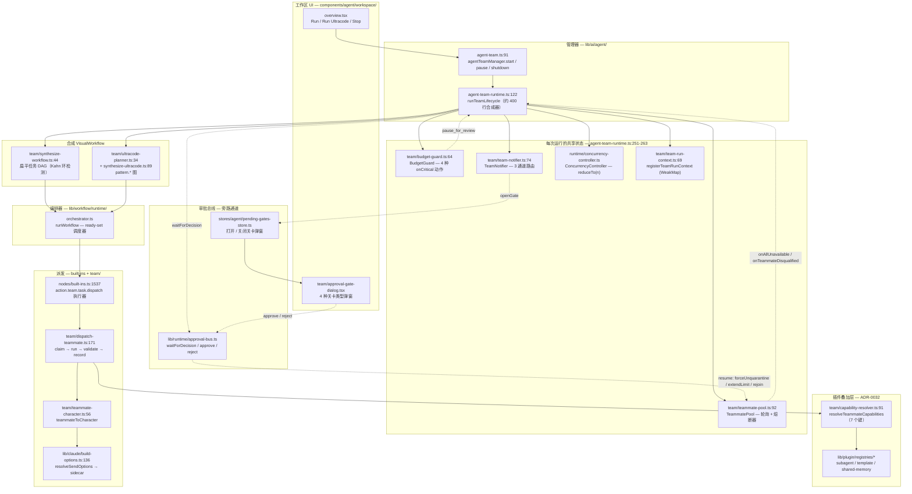

# 智能体团队

一个**智能体团队**由一名首席协调员、一组队友和一组任务构成。每个队友都可以由不同的运行时支撑 —— 应用内置的 Claude 智能体，或外部 CLI（Codex / Claude Code / Gemini CLI / Cursor CLI）。[内置智能体](./built-in-agent) 是一个长期存活的会话，而团队则是一种 *扇出（fan-out）*：首席协调员负责规划，队友在并发上限约束下并行执行任务，整体作为一次运行向上汇报。

自 [ADR-0022](../adr/0022-agent-team-runtime-hardening) 起，团队**不再**拥有自己的编排器。`runTeamLifecycle`（`lib/ai/agent/agent-team-runtime.ts:122-527`）是一个约 400 行的*合成器*：它把团队 + 任务转化为一个 `VisualWorkflow`，再把它交给其他所有功能早已在用的那个唯一的工作流编排器。没有第二个引擎需要保持同步，团队运行的持久化方式与任何其他工作流运行完全一致 —— 作为 `triggerKind: "team"` 的 `workflowRuns` 行。

<TLDR>
  点击 Run 会调用 `agentTeamManager.start`（`lib/ai/agent/agent-team.ts:91`），后者再调用
  `runTeamLifecycle`（`agent-team-runtime.ts:122`）。该合成器从 Zustand store 解析出团队/队友/任务，
  运行能力审计与计划审批关卡，构建每次运行的共享状态
  （TeammatePool + BudgetGuard + TeamNotifier + ConcurrencyController，第 251-263 行），注册一个
  `TeamRunContext`（第 397 行），随后合成一个 `VisualWorkflow` —— 通过
  `synthesizeTeamWorkflow`（`team/synthesize-workflow.ts:44`）生成扁平任务 DAG，或通过
  `planUltracodeWorkflow` + `synthesizeUltracodeWorkflow` 生成模式图。它委派给 `runWorkflow`
  （`lib/workflow/runtime/orchestrator.ts`），其 `action.team.task.dispatch` 执行器
  （`lib/workflow/nodes/built-ins.ts:1537`）调用 `dispatchTeammate`（`team/dispatch-teammate.ts:171`），
  后者通过 `teammateToCharacter` 合成一个 Character，并搭乘与内置智能体**相同**的 `resolveSendOptions`
  + sidecar。HITL 关卡通过把并发降到 0 并在审批总线上等待
  `waitForDecision` 来暂停运行。
</TLDR>

<StatGrid>
  <Stat label="HITL 关卡" value="5" hint="计划 / 预算 / 死锁 / 队友修复 / 能力审计，位于审批总线上" />
  <Stat label="Ultracode 模式节点" value="6" hint="multi-modal-sweep · loop-until-dry · adversarial-verify · judge-panel · completeness-critic · synthesize" />
  <Stat label="能力键" value="7" hint="mcpServerIds · skillIds · nativeAnthropicToolIds · characterPackIds · externalAgentPresetIds · subagentIds · a2uiTemplateIds" />
  <Stat label="工作区标签页" value="6" hint="overview · tasks · chat · activity · members · settings" />
  <Stat label="队友运行时" value="5" hint="claude · codex · claude-code · gemini-cli · cursor-cli" />
  <Stat label="Store 持久化版本" value="3" hint="仅模板 + defaultConfig + UI 偏好；实例仅驻留内存" />
</StatGrid>

## 它是什么

团队是工作流引擎之上一层薄薄的合成层。该架构围绕五项承诺构建：

1. **唯一编排器。** 根据 ADR-0022，重复的团队执行器已被移除。`runWorkflow` 是唯一的步骤调度器；团队运行时只负责*生成*它所运行的工作流。并发调度、重试、崩溃恢复和事件日志都从工作流层免费获得。
2. **临时状态，持久运行。** 团队实例、队友、任务、消息、共享内存、共识和委派都作为仅驻留内存的状态存活在 Zustand store 中。只有模板、默认配置和少数 UI 偏好会持久化（`stores/agent/agent-team-store/store.ts:104-124`，持久化版本 3）。运行*历史*则作为 `workflowRuns` + `workflowRunEvents` 行持久化 —— 没有团队专属的 Dexie 表。
3. **派发时一切皆为 Character。** 一名队友携带自己的运行时、模型、系统提示词和能力叠加层。派发时，`teammateToCharacter`（`team/teammate-character.ts:56`）将其投射为一个合成的 `Character`，因此每名队友的 Claude 回合都会经过与[内置智能体](./built-in-agent)相同的 build-options 流水线（技能、MCP、computer-use、权限）。
4. **两层能力作用域。** 团队能力束（7 个键）通过 add / remove / replace 语义按队友叠加，运行时由 `resolveTeammateCapabilities`（`team/capability-resolver.ts:91`）解析。插件通过叠加注册表贡献能力（[ADR-0032](../adr/0032-agent-team-plugin-integration)）。
5. **失败可见的 HITL 关卡。** 当运行无法安全推进时 —— 过期的能力引用、等待审批的计划、预算告急、所有队友均不可用、某个被取消资格的队友 —— 运行会暂停、打开关卡弹窗，并在审批总线上等待操作员决策，而非悄无声息地降级。

## 架构速览

每个方框都标注了实际工作发生处的文件与行号。主干自左向右：工作区 UI → 管理器 → 合成器 → 编排器 → 派发。关卡和插件注册表挂接在侧边。

## 设计原则

| 原则 | 含义 | 位置 |
| --- | --- | --- |
| **单一编排器** | 团队运行时合成一个 `VisualWorkflow` 并委派；`runWorkflow` 是唯一的步骤调度器。没有重复引擎。 | `agent-team-runtime.ts:122` → `lib/workflow/runtime/orchestrator.ts` |
| **临时 store，持久运行** | 团队实例是仅驻留内存的 Zustand 状态；运行历史作为 `triggerKind` 设为 "team" 的 `workflowRuns` 行持久化。 | `stores/agent/agent-team-store/store.ts:104-124` · `lib/db/schema.ts:194` |
| **一切皆为 Character** | 队友在派发时被投射为一个合成的 `Character`，因此队友搭乘完整的 `resolveSendOptions` 流水线。 | `team/teammate-character.ts:56` · `team/dispatch-teammate.ts:107-113` |
| **两层能力作用域** | 团队能力束（7 个键）通过 add / remove / replace 按队友叠加并在运行时解析；插件为注册表供给数据。 | `team/capability-resolver.ts:91` · ADR-0032 |
| **失败可见的 HITL 关卡** | 当运行无法安全推进时即暂停、打开关卡，并在审批总线上等待人工决策 —— 绝不静默降级。 | `agent-team-runtime.ts:265-391` · `lib/runtime/approval-bus.ts` |

## 本节的组织方式

下面每个页面都以行级精确的内部细节记录一个切片。先从 **生命周期与合成** 了解主干；其余都挂接在它之上。

- [数据模型](./data-model) —— `AgentTeam` / `AgentTeammate` / `AgentTeamTask` 类型、Zustand store（持久化 v3，仅驻留内存的实例），以及 `workflowRuns` 持久化路径。
- [生命周期与合成](./lifecycle-and-synthesis) —— `agentTeamManager`、逐步剖析的 `runTeamLifecycle` 合成器，以及 `synthesizeTeamWorkflow`（Kahn 环检测、合成工作流 id）。
- [派发与共享状态](./dispatch-and-shared-state) —— `dispatchTeammate`、`TeamRunContext` 注册表、`TeammatePool`（熔断器）、`BudgetGuard`（四种 onCritical 动作）以及 `TeamNotifier`。
- [HITL 关卡](./hitl-gates) —— 五个审批总线关卡（计划 / 预算 / 死锁 / 队友修复 / 能力审计）、它们的载荷模式，以及 pending-gates store。
- [共识、委派与内存](./consensus-delegation-memory) —— 法定人数投票、带静默时段门控的后台 / 外部委派，以及带 PII 门控、通过适配器同步的共享内存 store。
- [Ultracode 与模式](./ultracode-and-patterns) —— 复杂度感知触发器、规划器，以及六个高阶 `pattern.*` 质量节点。
- [能力与插件](./capabilities-and-plugins) —— 两层能力模型、插件子智能体 / 团队模板 / 共享内存适配器，以及能力审计关卡（ADR-0032）。
- [工作区 UI](./workspace-ui) —— 六标签页工作区、团队列表中枢、设置手风琴和报告时间线。
- [工作区聊天](./workspace-chat) —— 基于 @提及 的派发（`@claude`、`@codex`、队友）、复合流式器，以及运行时可用性。

## 与其他子系统的关系

| 子系统 | 如何连接 | 链接 |
| --- | --- | --- |
| **内置智能体** | 每名队友的 Claude 回合都汇入与应用内智能体**相同**的 `resolveSendOptions` 和 sidecar —— 那些页面上的一切都适用于队友。 | [./built-in-agent](./built-in-agent) |
| **外部智能体** | 非 Claude 的队友运行时（Codex / Claude Code / Gemini CLI / Cursor CLI）通过外部智能体运行时派发。 | [./external-agents](./external-agents) |
| **可视化工作流** | 团队运行时合成一个 `VisualWorkflow` 并运行它；反过来，一个 `action.team.run` 节点可让任意工作流调用一个团队。 | [../subsystems/visual-workflows](../subsystems/visual-workflows) |
| **Characters** | `teammateToCharacter` 把一名队友桥接为一个合成的、从不持久化的 `Character`，使其继承 character 的 build-options 路径。 | [./characters](./characters) |
| **插件系统** | 插件通过叠加注册表贡献子智能体、团队模板和共享内存适配器，并以团队能力的形式呈现。 | [../subsystems/plugin-system](../subsystems/plugin-system) |

## 相关 ADR

<Cards>
  <Card title="ADR-0022 — 运行时加固" href="../adr/0022-agent-team-runtime-hardening" description="向工作流编排器收敛：薄合成器、每次运行的共享状态、并发 ready-set 调度，以及 HITL 关卡。" />
  <Card title="ADR-0032 — 插件集成" href="../adr/0032-agent-team-plugin-integration" description="两层能力作用域、插件子智能体 / 团队模板 / 共享内存适配器，以及能力审计关卡。" />
  <Card title="ADR-0011 — 工作流子系统" href="../adr/0011-workflows-subsystem" description="VisualWorkflow 模型，以及团队运行时所委派的那个编排器。" />
</Cards>
