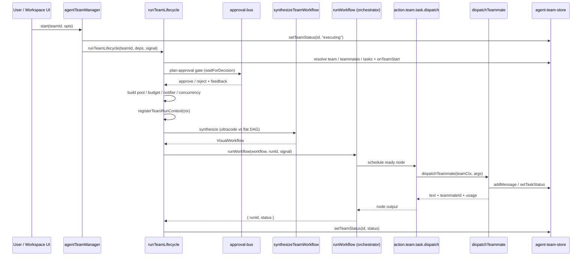

# 生命周期与工作流合成

依据 ADR-0022（“Agent Team 运行时加固”），一次团队运行**不是**第二套编排器 —— 它只是一个轻量的合成器，把 `(team, tasks)` 翻译成一份 `VisualWorkflow`，再交给那唯一的工作流运行时。本页端到端地梳理 F 路径主干：`agentTeamManager` 门面、`runTeamLifecycle` 的十项有序职责、纯函数式工作流合成、按运行注册的 `TeamRunContext` 注册表、编排器的并发就绪集调度，以及把工作流桥接回队员派发的两个节点执行器（`action.team.run`、`action.team.task.dispatch`）。

<TLDR>
  UI 调用 `agentTeamManager.start`（`lib/ai/agent/agent-team.ts:91-115`），它把团队
  状态设为 `executing` 并调用 `runTeamLifecycle`（`agent-team-runtime.ts:122-527`）。该函数
  执行十个有序步骤 —— 在途守卫、store 解析、能力审计闸门、计划审批
  循环、按运行构造模块、HITL 闸门订阅、`registerTeamRunContext`
  （`team-run-context.ts:69`）、合成（`synthesize-workflow.ts:44-154`，Kahn 环检测）以及
  `runWorkflow`。编排器的就绪集循环（`orchestrator.ts:446-475`）执行每个
  `action.team.task.dispatch` 节点（`built-ins.ts:1537-1590`），后者针对已注册的上下文调用
  `dispatchTeammate`。`abortTeam`（`agent-team-runtime.ts:530`）触发持有于
  `inflightControllers`（`:99`）中的按团队 `AbortController`。依赖项由
  有序的小队引导（`lib/agent-team/bootstrap.ts`，由 `SquadBootstrapInitializer` 挂载）在启动时接线。
  自 ADR-0169 起 UI 从不直接调用生命周期：每次启动都经 `startSquadRun`，每道门都经 Action Review 契约。
</TLDR>

## F 路径时序



## 管理器门面 —— `lib/ai/agent/agent-team.ts`

`agentTeamManager` 是一个单例对象（`:78-124`），它把 CRUD 代理到 Zustand 的 `agent-team-store`，并通过 `runTeamLifecycle` + `abortTeam` 驱动运行时。运行时依赖项经由 `configureAgentTeamRuntime` 一次性注入；在配置之前调用 `start` 会抛错。

```typescript
// lib/ai/agent/agent-team.ts:48-52
export function configureAgentTeamRuntime(
  deps: Pick<RunTeamLifecycleDeps, "runLeadPlanning" | "notifierDeps">
): void {
  configuredDeps = deps
}
```

`start` 把可选的 `opts.ultracode` 布尔值映射到运行时的 `ultracodeOverride` 枚举（`force` / `off` / 缺省），并把生命周期结果回写到 store：

```typescript
// lib/ai/agent/agent-team.ts:91-115
start: async (id, opts) => {
  if (!configuredDeps) {
    throw new Error(
      "Agent-team runtime is not configured — call configureAgentTeamRuntime(deps) at app startup."
    )
  }
  useAgentTeamStore.getState().setTeamStatus(id, "executing")
  const result = await runTeamLifecycle(id, {
    storeReader: bindStoreReader(),
    storeWriter: bindStoreWriter(),
    runLeadPlanning: configuredDeps.runLeadPlanning,
    notifierDeps: configuredDeps.notifierDeps,
    ...(opts?.ultracode === true
      ? { ultracodeOverride: "force" as const }
      : opts?.ultracode === false
        ? { ultracodeOverride: "off" as const }
        : {}),
  })
  useAgentTeamStore.getState().setTeamStatus(id, result.status)
},
```

| 方法 | 行号 | 作用 |
| --- | --- | --- |
| `configureAgentTeamRuntime` | `agent-team.ts:48-52` | 在启动时注入 `runLeadPlanning` + `notifierDeps` |
| `start(id, opts?)` | `agent-team.ts:91-115` | 设置状态为 `executing`，运行生命周期，回写结果 |
| `pause(id)` | `agent-team.ts:116-119` | 调用 `abortTeam(id)`，设置状态为 `paused` |
| `shutdown(id)` | `agent-team.ts:120-123` | 调用 `abortTeam(id)`，设置状态为 `cancelled` |

依赖项在应用启动时恰好接线一次，并通过 `useRef` 防范 React 严格模式下的双重挂载：

```tsx
// lib/agent-team/bootstrap.ts（阶段）
hydrate         setAgentTeamBindingCandidateResolver + startAgentTeamDexieBridge + whenHydrated
adapters        configureAgentTeamRuntime(buildAgentTeamRuntimeDeps())
import_history  backfillLegacyTeamRunHistory
recover         recoverPendingRunInterrupts + recoverDurableAgentTeams + armPendingTeamRecoveries
ready           每个 startSquadRun 调用等待的信号
```

## `runTeamLifecycle` —— 十项有序职责

`runTeamLifecycle`（`agent-team-runtime.ts:122-527`）是合成器。它本身不拥有任何执行循环；下面的每一步最终都汇聚到 `runWorkflow`。这个顺序是承重的。

| # | 步骤 | 行号 |
| --- | --- | --- |
| 1 | 重复在途守卫；分配 `runId`；把 `AbortController` 接入 `inflightControllers` | `:127-139` |
| 2 | 从 `storeReader` 解析 team / teammates / tasks；派发 `onTeamStart` 钩子 | `:145-172` |
| 3 | 能力审计闸门 —— 在过期插件引用解析完成前阻塞 | `:173-199` |
| 4 | 计划审批循环 —— 最多 `maxPlanRevisions` 次，先 `runLeadPlanning` 再 `waitForDecision`，收集拒绝反馈 | `:202-249` |
| 5 | 构造按运行模块 —— 并发、模型偏好、通知器、队员池、预算守卫 | `:251-263` |
| 6 | 接线 HITL 闸门订阅 —— 死锁、队员修复、预算暂停、预算警告/严重钩子 | `:265-391` |
| 7 | `registerTeamRunContext(ctx)` | `:397-411` |
| 8 | 合成 —— 启用时用 ultracode 模式，否则用扁平任务 DAG | `:413-437` |
| 9 | `runWorkflow({ workflow, trigger, runId, signal, concurrency })` | `:444-489` |
| 10 | `finally` —— `unregisterTeamRunContext`、释放订阅、结算持久化运行记录（停在 `needs_input` / `paused` 时除外） | `:500-523` |

第 5 步构造经由运行上下文传给执行器的共享状态对象：

```typescript
// lib/ai/agent/agent-team-runtime.ts:251-263 (per-run module construction)
const concurrency = createConcurrencyController(team.config?.maxConcurrentTeammates ?? 5)
const modelPref = createModelPreferenceController()
const notifier = createTeamNotifier({ runId, teamId }, deps.notifierDeps)
const pool = createTeammatePool({ teammates: workers, runId, teamId })
const budget = createBudgetGuard({
  limit: team.config?.tokenBudget ?? 0,
  onCritical: team.config?.onBudgetCritical ?? "notify",
  notifier,
  concurrencyCtrl: concurrency,
  modelCtrl: modelPref,
  runId,
})
```

### 中止语义与状态转换

`inflightControllers`（`agent-team-runtime.ts:99`）是一个模块作用域的 `Map<teamId, AbortController>`。`abortTeam` 按 team 查找并中止；该信号级联进入 `runWorkflow`，从而解开就绪集循环：

```typescript
// lib/ai/agent/agent-team-runtime.ts:530-535
export function abortTeam(teamId: string, reason?: string): boolean {
  const ac = inflightControllers.get(teamId)
  if (!ac) return false
  ac.abort(new Error(reason ?? "Team aborted by operator"))
  return true
}
```

| 状态 | 触发条件 | 动作 |
| --- | --- | --- |
| （空闲） | `start()` | 分配 runId，设置状态为 `executing` |
| executing | 计划审批闸门打开 | 在 `waitForDecision` 处阻塞，等待操作员 |
| executing | 所有队员均不可用 | `concurrency.reduceTo(0)`，打开死锁闸门 |
| executing | 预算 `pause_for_review` | `concurrency.reduceTo(0)`，打开预算闸门 |
| executing | 队员被取消资格 | 非阻塞通知 + 打开队员修复闸门 |
| executing | 步骤失败 / `abortTeam` 触发 | 记录首次失败，中止运行信号 |
| executing -> completed/failed/cancelled | `runWorkflow` 返回 | 注销上下文，回写状态，`onTeamComplete` |

<Status>HITL 闸门订阅会把并发降到零，而不是杀掉运行，因此一个批准决定可以原地恢复。</Status>

## 纯函数式合成 —— `lib/ai/agent/team/synthesize-workflow.ts`

`synthesizeTeamWorkflow`（`:44-154`）是一个纯函数：无 I/O，无副作用。它校验任务列表，用 Kahn 算法检测环，然后为每个任务发出一个 `action.team.task.dispatch` 节点、为每条依赖发出一条边。

- **空列表** -> `SynthesizeError("empty")`（`:45-47`）。
- **未知依赖 id** -> `SynthesizeError("invalid_dep")`（`:52-58`）。
- **环** -> 当拓扑访问计数与任务计数不一致时抛出 `SynthesizeError("cycle")`。

```typescript
// lib/ai/agent/team/synthesize-workflow.ts (Kahn cycle detection, trimmed)
const inDegree = new Map<string, number>()
const adj = new Map<string, string[]>()
for (const t of input.tasks) {
  inDegree.set(t.id, t.dependencies.length)
  for (const dep of t.dependencies) {
    const arr = adj.get(dep) ?? []
    arr.push(t.id)
    adj.set(dep, arr)
  }
}
const queue: string[] = []
for (const [id, d] of inDegree) if (d === 0) queue.push(id)
let visited = 0
while (queue.length > 0) {
  const id = queue.shift()!
  visited += 1
  for (const next of adj.get(id) ?? []) {
    const d = (inDegree.get(next) ?? 0) - 1
    inDegree.set(next, d)
    if (d === 0) queue.push(next)
  }
}
if (visited !== input.tasks.length) {
  throw new SynthesizeError("cycle", `dependency cycle (visited ${visited} of ${input.tasks.length})`)
}
```

节点与边的构造是机械化的 —— 每个任务变成一个 `typeVersion: 1` 的派发节点，携带其 `teamId` / `taskId` 参数，每条依赖变成一条 id 为 `"depId->taskId"` 的边：

```typescript
// lib/ai/agent/team/synthesize-workflow.ts (node + workflow assembly, trimmed)
const nodes = input.tasks.map((t) => ({
  id: t.id,
  type: "action.team.task.dispatch",
  typeVersion: 1,
  position: { x: 0, y: 0 },
  data: {
    label: t.title,
    params: {
      teamId: input.team.id,
      taskId: t.id,
      title: t.title,
      description: t.description,
      ...(t.expectedOutput ? { expectedOutput: t.expectedOutput } : {}),
    },
  },
}))

const workflowId = `__team__:${input.team.id}:${nanoid(8)}`
const workflow: VisualWorkflow = {
  id: workflowId,
  schemaVersion: 1,
  name: input.team.name,
  nodes,
  edges,
  settings: {
    errorPolicy: "stop",
    timeoutMs: input.wallClockTimeoutMs ?? 24 * 60 * 60_000,
    concurrency: 1,
    maxConcurrency: input.initialConcurrency,
    retryDefaults: DEFAULT_RETRY_POLICY,
  },
}
```

| 字段 | 值 | 原因 |
| --- | --- | --- |
| `id` | `__team__:teamId:nanoid8` | 合成前缀；UI 不得为此 id 导航到某个已存储的定义 |
| `settings.errorPolicy` | `stop` | 首次失败即停止 DAG |
| `settings.timeoutMs` | `wallClockTimeoutMs` 或 24 小时哨兵值 | 编排器会跳过 `0` 超时，故使用 24 小时哨兵值 |
| `settings.maxConcurrency` | `initialConcurrency` | 由 `team.config.maxConcurrentTeammates` 播种 |
| 节点 `typeVersion` | `1` | 钉定的执行器契约版本 |

### Lead 阻塞式评审（ADR-0071）

当 `team.config.taskReview.enabled` 开启时，合成器会为每个任务额外产出一个节点 ——
`action.team.task.review`，id 为 `review:<taskId>` —— 并**把该任务所有下游依赖的边改指向它**：

```
  taskA ──▶ review:taskA ──▶ taskB ──▶ review:taskB
```

这一层间接就是全部机制：未通过评审的任务，其下游根本不可运行，因此闸门由就绪集调度器强制执行，
而不是依赖下游节点自觉去检查某个标志位。默认关闭 → DAG 与此前完全一致。

| 细节 | 行为 |
| --- | --- |
| 在本工作流之外已满足的依赖（`satisfiedDependencyIds`） | 不产出评审节点 —— 先前的波次已经运行并评审过它 |
| `params.dependencies` | 仍然携带**任务** id 而非节点 id，黑板读取逻辑不变 |
| `params.maxRevisions` | 在合成时冻结，因此运行中途修改配置不会改变 DAG 已据此成形的预算 |
| 环检测 | 不受影响 —— Kahn 算法跑在任务 id 上，而非节点 id |

执行器会向 Lead 索取结构化的 `{ verdict, feedback }`，并附上成员的产出以及不超过 64 KiB 的确定性
diff 证据（`review-evidence.ts`）。`changes_requested` 会带着反馈把**同一位**成员重新派发到**同一个**
worktree；通过后任务标记为 `completed`（若同时开启人工 `requireResultReview` 则为 `review`）。
评审开启时终态状态由评审节点书写，派发节点不写 —— 否则看板会在任务仍在评审时就宣称其已完成。
预算耗尽、原成员不可用、评审方失败等任何未决情况都会让该任务与整个运行失败。
参见 [ADR-0071](../adr/0071-blocking-lead-task-review)。

## 按运行共享状态 —— `lib/ai/agent/team/team-run-context.ts`

合成器在调用 `runWorkflow` 之前会注册一个以 `runId` 为键的不可变 `TeamRunContext`，使派发执行器能在节点内部恢复出活动的池 / 预算 / 通知器。接口逐字如下：

```typescript
// lib/ai/agent/team/team-run-context.ts:40-65
export interface TeamRunContext {
  readonly runId: string
  readonly teamId: string
  readonly traceId?: string
  readonly team: AgentTeam
  readonly pool: TeammatePool
  readonly budget: BudgetGuard
  readonly notifier: TeamNotifier
  readonly concurrency: ConcurrencyController
  readonly modelPref: ModelPreferenceController
  readonly storeWriter: TeamStoreWriter
  readonly resolvedCapabilities: Map<string, ResolvedCapabilities>
}
```

| 函数 | 行号 | 作用 |
| --- | --- | --- |
| `registerTeamRunContext(ctx)` | `team-run-context.ts:69-71` | 插入模块作用域的注册表 Map |
| `getTeamRunContext(runId)` | `team-run-context.ts:73-75` | 查找；若运行未注册则返回 `undefined` |
| `unregisterTeamRunContext(runId)` | `team-run-context.ts:77-79` | 移除（在生命周期的 `finally` 中调用） |

`TeamStoreWriter`（`:28-38`）是最小写入面 —— `addMessage`、`setTaskStatus`、`updateTeammate` 以及可选的 `setFinalResult` —— 使派发器永远不必导入完整 store。上下文的每个字段都是只读的；只有对象的内部状态（断路器计数器、预算累计、通知器去重缓存）才会经由它们自己的方法发生变更。

## 编排器并发 —— `lib/workflow/runtime/orchestrator.ts`

F 路径为共享工作流编排器增加了并发就绪集调度。默认的 `maxConcurrency` 为 `1`，为每一个既有的工作流消费者保留了旧有的顺序行为。

```typescript
// lib/workflow/runtime/orchestrator.ts:446-475 (ready-set scheduling loop)
while (completed.size + skipped.size < validated.nodes.length) {
  if (firstFailure) break
  if (ac.signal.aborted && inflight.size === 0) break

  let scheduledThisTick = 0
  for (const stepId of order) {
    if (inflight.size >= concurrency.get()) break
    if (!isReady(stepId)) continue
    const promise = scheduleOne(stepId).finally(() => {
      inflight.delete(stepId)
    })
    inflight.set(stepId, promise)
    scheduledThisTick += 1
  }

  if (inflight.size === 0) {
    if (scheduledThisTick === 0) break
    await flushNewSkipLogs()
    continue
  }
  await Promise.race(inflight.values())
  await flushNewSkipLogs()
}
```

该循环在每一轮都重新读取 `concurrency.get()`，因此一个调用 `reduceTo(0)` 的 HITL 闸门会立刻停止新的调度，同时让在途节点排空。两个控制器为它供给输入：

- **并发**（`concurrency-controller.ts:21-53`）：`reduceTo(n)` 是**单调非增**的 —— 它绝不抬高上限 —— 并且 `subscribe(fn)` 在每次缩减时触发。
- **模型偏好**（`model-preference-controller.ts:26-54`）：`downshift()` 把 `preferCheap` 置为 `true`（并可选地给出更便宜的 `modelHint`），让预算守卫的 `handoff_to_background` 动作把后续派发路由到更小的模型。

## 节点执行器 —— `lib/workflow/nodes/built-ins.ts`

### `action.team.run`（`:1444-1525`）

一个面向用户的工作流节点，用于唤起整套团队生命周期。它把任意 IM 的 `trigger.binding` 作为 `triggeredFrom` 透传给下游扇出，绑定 store 读写闭包，并包裹生命周期调用，使任何错误都**不可重试**：

```typescript
// lib/workflow/nodes/built-ins.ts:1444-1525 (trigger threading + non-retryable wrapper, trimmed)
const triggerBinding = ctx.trigger.binding
const triggeredFrom: WorkflowTriggeredFrom | undefined =
  triggerBinding?.adapterId && triggerBinding?.conversationKey
    ? {
        source: "im",
        adapterId: triggerBinding.adapterId,
        conversationKey: triggerBinding.conversationKey,
        ...(triggerBinding.sessionId ? { sessionId: triggerBinding.sessionId } : {}),
      }
    : undefined

const result = await runTeamLifecycle(teamId, deps, ctx.signal).catch((err: unknown) => {
  const message = err instanceof Error ? err.message : String(err)
  const wrapped = new Error(`action.team.run: ${message}`) as Error & { retryable?: boolean }
  wrapped.retryable = false
  throw wrapped
})
return { output: { teamId, teamRunId: result.runId, status: result.status, reason: result.reason } }
```

### `action.team.task.dispatch`（`:1537-1590`）

合成器发出的叶子节点。它是 **`retryable: true`** —— 一次瞬时失败会让编排器的 `runStep` 退避并重新进入，并且由于每次进入都会从池中重新认领，重试天然地轮换到另一名队员：

```typescript
// lib/workflow/nodes/built-ins.ts:1537-1590 (trimmed)
registerNodeExecutor({
  kind: "action.team.task.dispatch",
  typeVersion: 1,
  retryable: true,
  execute: async (ctx) => {
    const params = ctx.params as {
      teamId?: string; taskId?: string; title?: string
      description?: string; expectedOutput?: string
    }
    if (!params.teamId || !params.taskId) {
      throw nonRetryable("action.team.task.dispatch requires 'teamId' and 'taskId'")
    }
    const [{ getTeamRunContext }, { buildTeammatePrompt }, { dispatchTeammate }] =
      await Promise.all([
        import("@/lib/ai/agent/team/team-run-context"),
        import("@/lib/ai/agent/agent-team-runtime-deps"),
        import("@/lib/ai/agent/team/dispatch-teammate"),
      ])
    const teamCtx = getTeamRunContext(ctx.runId)
    if (!teamCtx) {
      throw nonRetryable(
        `action.team.task.dispatch: no TeamRunContext registered for runId=${ctx.runId}`
      )
    }
    const task = {
      id: params.taskId,
      title: params.title ?? params.taskId,
      description: params.description ?? "",
      expectedOutput: params.expectedOutput,
    } as Parameters<typeof buildTeammatePrompt>[2]
    const result = await dispatchTeammate(teamCtx, {
      taskId: params.taskId,
      prompt: (teammate) => buildTeammatePrompt(teamCtx.team, teammate, task),
      signal: ctx.signal,
      validateOutput: true,
      recordToStore: true,
    })
    return {
      output: {
        text: result.text,
        teammateId: result.teammateId,
        teammateName: result.teammateName,
        tokenUsage: result.usage,
        attempt: ctx.attemptNumber ?? 1,
      },
    }
  },
})
```

| 节点 | 行号 | 可重试 | 角色 |
| --- | --- | --- | --- |
| `action.team.run` | `built-ins.ts:1444-1525` | 否 | 工作流 -> 团队桥；绑定 store，透传 IM 来源，返回 `teamRunId` |
| `action.team.task.dispatch` | `built-ins.ts:1537-1590` | 是 | 按任务的叶子节点；恢复上下文、派发，重试时重新认领以轮换队员 |

## 运行时依赖接线 —— `lib/ai/agent/agent-team-runtime-deps.ts`

`buildAgentTeamRuntimeDeps`（`:102-171`）提供两项注入关注点：提示词构造器与生产环境的通知器依赖。`buildTeammatePrompt` 和 `buildLeadPlanningPrompt` 塑造具备人设感知的提示词；`runLeadPlanning` 通过 `executeAgent` 运行 lead：

```typescript
// lib/ai/agent/agent-team-runtime-deps.ts:107-125 (lead planning, trimmed)
const runLeadPlanning = async ({ team, lead, feedback, signal }): Promise<LeadPlanResult> => {
  const workers = useAgentTeamStore
    .getState()
    .getTeammates(team.id)
    .filter((m) => m.role === "teammate")
  const prompt = buildLeadPlanningPrompt(team, workers, feedback)
  const systemPrompt =
    lead.config?.systemPrompt?.trim() ||
    team.config?.defaultSystemPrompt?.trim() ||
    LEAD_SYSTEM_PROMPT
  const result = await executeAgent(prompt, { systemPrompt, abortSignal: signal })
  return { planText: result.text ?? "" }
}
```

`defaultNotifierDeps` 把 `deliver` 路由进 ADR-0042 统一通知中心，把 `openGate` 路由进渲染 HITL 模态框的待处理闸门 store：

```typescript
// lib/ai/agent/agent-team-runtime-deps.ts:133-165 (notifier deps, trimmed)
const defaultNotifierDeps: TeamNotifierDeps = {
  deliver: (p) => {
    void import("@/lib/notifications/runtime").then(({ notify }) =>
      notify({
        source: "agent-team",
        level: p.level === "warn" ? "warning" : p.level === "critical" ? "critical" : "info",
        title: p.title,
        body: p.body,
        dedupeKey: p.dedupeKey,
        groupKey: p.runId,
        sourceRef: { kind: "team-run", id: p.runId },
        directed: p.level === "critical",
      })
    )
  },
  openGate: (gate) => {
    usePendingGatesStore.getState().open({
      key: gate.key,
      gateType: gateTypeFromScope(gate.key.scope),
      title: gate.title,
      body: gate.body,
      runId: gate.runId,
      teamId: gate.teamId,
      taskId: gate.taskId,
    })
  },
}
```

## 崩溃恢复

因为一次团队运行**就是**一次工作流运行（`triggerKind: "team"`），所以并不存在团队专属的恢复代码。`resumeInFlightRuns` 读取共享的 `workflowRuns` 表并通过同一个编排器重放，因此一次团队运行的恢复方式与任何其他被中断的工作流完全一样。派发节点只需在重放轮次中按 `runId` 重新获取其 `TeamRunContext`。

<StatGrid>
  <Stat label="生命周期步骤" value="10" />
  <Stat label="默认 maxConcurrency" value="1" />
  <Stat label="dispatch typeVersion" value="1" />
</StatGrid>

## 相关

<Cards>
  <Card title="数据模型" href="./data-model" description="AgentTeam、队员、任务，以及工作流运行映射。" />
  <Card title="队员派发与共享运行态" href="./dispatch-and-shared-state" description="dispatchTeammate、队员池断路器，以及预算守卫。" />
  <Card title="HITL 闸门" href="./hitl-gates" description="经由审批总线的计划审批、死锁、预算、队员修复与能力审计闸门。" />
  <Card title="Ultracode 与模式" href="./ultracode-and-patterns" description="复杂度感知触发与高阶模式节点。" />
  <Card title="可视化工作流" href="../subsystems/visual-workflows" description="合成器复用的编排器、节点执行器与运行持久化。" />
  <Card title="ADR-0022" href="../adr/0022-agent-team-runtime-hardening" description="F 路径主干背后的运行时加固决策。" />
</Cards>
