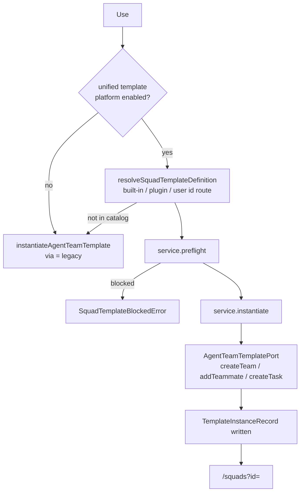

# 界面

ADR-0140 解散了 `/agent-teams/workspace`。小队是一个可以把对话交出去的执行器，而不是一个你导航过去的地方，所以它的六个标签页各自回到了本来就拥有那一部分的界面。

<TLDR>
- **配置面**在设置的 Squads 小节：库导航条、带花名册与溯源与派生动作的详情面板，以及模板画廊。
- **运行面**在 `/squads`：一个带 runs 与 board 两个标签页的舰队控制台，外加启动、暂停、恢复与停止。
- **单次运行的详情**在 `/agent-runs`，当该行是一次小队运行时会多出三个仅限小队的标签页（Coordination、Report、Operations）。
- **组合器芯片**把一段对话绑定到某支小队，存在 `sessions.squadId` 上。
- `/agent-teams` 和 `/agent-teams/workspace` 是指向 `/squads` 的客户端跳转，自身什么都不渲染。
</TLDR>

<StatGrid>
  <Stat label="运行详情标签页" value="6 + 3" hint="overview · activity · changes · tests · artifacts · approvals，小队运行行上再加 coordination · report · operations" />
  <Stat label="舰队控制台标签页" value="2" hint="桌面端是 runs 与 board，手机上再多一个 squads" />
  <Stat label="模板行动作" value="7" hint="Use · Edit · Duplicate · Publish · Export package · Fork · Delete" />
  <Stat label="墓碑路由" value="3" hint="/agent-teams、/agent-teams/workspace 与 /me/agent-teams-settings，全部跳到 /squads" />
</StatGrid>

## 每个标签页去了哪里

| 旧工作区标签页 | 现在在哪 |
| --- | --- |
| Overview、运行控制 | `/squads`，检视面板里的 `TeamRunControls` |
| Tasks（看板） | `/squads` 的 Board 标签页 |
| Chat | 对话本身，通过组合器上的执行器芯片 |
| Activity、operations、consensus | `/agent-runs` 运行详情里的小队标签页 |
| Members，以及九个治理小节 | 设置里 Squads 的详情面板 |
| 模板画廊 | 设置里 Squads 的 Templates 面板 |
| 活跃 worktree、回收的分支 | `/workspace` |

## 设置里的 Squads

作为 `ai` 分组下的 `squads` 小节注册（`components/settings/settings-nav-config.ts:274`），由设置外壳按全高小节懒加载：一条导航条加一个详情窗格，各自拥有自己的滚动。

寻址形式是 `?section=squads&squadTab=…`。`nav-config.ts` 是纯的，装着全部词表：一个静态面板（`templates`）、以 `squad:<id>` 为键的小队面板，以及 `resolveSquadPanel`，它按精确静态项、精确存在的小队、第一支尚存的小队、`templates` 依次降级。完全没有参数时它落在第一支小队上，而不是 Templates。

### 导航条

`squads-nav.tsx` 自上而下渲染：一个只过滤小队列表的搜索框（Templates 刻意永远不会被过滤掉）、一个 **New Squad** 按钮、一个 **Auto-compose** 图标按钮、Templates 那一行、一个「Your Squads」标签，以及每支小队一行，显示头像、名称与成员数。空状态会区分「还没有小队」和「没有匹配项」。

列表按工作区限定：一支小队在没有 `projectId` 或其 `projectId` 与当前工作区一致时显示。**New Squad** 走共享的 `useCreateSquad` hook，这样在工作区支持的场合，新小队一开始就落在 durable-v2 上；同一个小节还消费原生 `File > New Squad` 菜单发来的请求。Auto-compose 原样复用 `AutoComposeDialog`：它以前只能从已退役工作区的一个标签页进入，所以 ADR-0140 拆掉了那扇门，却没有搬走那个房间。

### 详情面板

`squad-detail-panel.tsx` 按顺序渲染：

1. **名称** 与 **描述**，延迟输入，在失焦时经 `updateTeam` 提交。空名称会被拒绝。
2. **成员**，整块挂载 `components/agent/workspace/members` 的 `AgentTeamMembers`。这是真正的花名册编辑器，不是只读列表。
3. 一个位于 `agent.team.panel` 扩展点的**插件槽位**。它声明的宿主以前是工作区 overview，而那个宿主没人渲染，于是注册进来的东西悄无声息地从来没有出现过。
4. **Made from a template**，即下文的溯源区块。
5. **Reuse this squad**，即下文的派生动作。
6. 一个**危险区**，Delete Squad 藏在确认对话框后面。
7. **Advanced governance**，一个折叠组整块挂载 `AgentTeamSettings`，而不是在导航条里再摆九行。

### 溯源：这支小队从哪来

`squad-template-provenance.tsx` 读取 `useSquadTemplateInstance(squadId)`，后者扫描 `repository.listInstances()`，找出 `resources` 里含有 `{ domain: "agentTeam", id: squadId }` 的那条记录。全表扫描是刻意的，因为 `listInstances` 没有按资源的索引，而行数是有界的。

有记录时，区块会挂载 `TemplateInstanceCard`，也就是模板工作室用的同一张卡，只是扩展出标题和摘要，而不是分叉一份。正是这一点让三个生命周期动词从设置里可达。

- **更新**分两步。`service.planUpdate(instanceId, version)` 产出一份计划，`service.applyUpdate(plan, { confirmed: true, resolutions })` 应用它。`planUpdate` 会拒绝未知或已脱钩的实例、缺失或已作废的版本、跨域迁移，并咨询适配器的 `isActive`，对小队而言那意味着「它是不是正在 planning 或 executing」。`applyUpdate` 会拒绝被阻塞的计划、未回答的冲突，以及自制定计划以来发生漂移的 `contentHash`。
- **脱钩（Detach）** 会在实例上盖 `detachedAt`。它切断血缘，并**不会**删除小队。
- **重新绑定（Rebind）** 是回头路。它同时清掉 `detachedAt` 与 `sourceUnavailableAt`，这正是它算重新挂上而不是第二种脱钩的原因。

在这张卡出现之前，五个实例动词里有四个在整个应用中都没有调用方。

没有记录时，区块会明说没有，而不是什么都不渲染。

### 派生动作

`squad-derive-actions.tsx` 提供两个。

- **Duplicate** 通过 `duplicateSquad(squadId, { name, projectId })` 复制小队。对话框带一个工作区选择器，因为 `projectId` 现在是真正的 Dexie 边界，所以复制到另一个工作区是真的把副本挪过去。
- **Save as template** 调用 store 的 `saveAsTemplate`，然后 await `publishSquadTemplateToPlatform`，好让草稿在任何人读取之前就已存在。一个默认勾选的复选框还会额外提供**发布为一个版本**，它会先跑 `service.getPublishSuggestion` 并确认版本跃迁，再调用 `service.publish`。

### 模板画廊

`agent-team-templates-section.tsx` 填充 Templates 面板。行的顺序是内置在前（按八个分类分组），然后是用户模板，最后是插件贡献的条目。每一行都带有来源、平台状态、缺失依赖以及分叉血缘的徽章。

| 动作 | 做什么 |
| --- | --- |
| **Use** | 下文的血缘路径 |
| Edit | `updateTemplate`，然后把草稿重新镜像到平台 |
| Duplicate | 复制成一个新 id、镜像它，并打开编辑器 |
| **Publish** | `getPublishSuggestion`，然后用建议的跃迁调用 `service.publish` |
| **Export package** | 列出未作废的发行版本，然后 `service.exportPackage` 并下载一个 `.cognia-template` |
| **Fork** | `service.fork` 成一份新草稿 |
| Delete | 删除本地模板 |

Publish、Export 和 Fork 只对用户自己拥有的模板提供，并且在模板状态不合适时是渲染并禁用而不是隐藏，这样控件才能说出原因。头部还提供 **Import package**，它会先检视归档并显示信任等级（built-in、marketplace、signed-unknown 或 unsigned，后两者会被标红）再导入。

### Use 背后的血缘路径

点击 Use 会运行 `applySquadTemplate`（`lib/agent-team/apply-squad-template.ts:90`）。

一份模板通过三条路线之一解析出定义 id。内置的是 `builtin.agentTeam.<id>`，版本 `1.0.0`；插件的是 `<pluginId>:<defId>`，版本 `0.0.0-compat`；用户模板是 `legacy.agentTeam.<id>`，在发布之前一直是草稿。已作废与墓碑行会被过滤掉，最新的发行版本胜出，草稿是兜底。

写入全部由适配器的 port 拥有。它的 `instantiate` 做了四件传统路径从来没做过的事：解析小队级的孪生槽位、写入每名队友的能力叠加层、按拓扑序重映射任务依赖 id，并在任何一步抛错时删掉那支半成品小队完成回滚。

只有两种情况仍会走传统路径，而且两者都会说出来。要么是平台特性开关被关掉了，要么是定义确实不在目录里，后者出现在开关关闭期间镜像过的用户模板、在渲染与点击之间被卸载的插件，或尚未被投影出来的内置覆盖层上。

<Callout type="warn" title="一处值得知道的不对称">
  `ctx.team.instantiateTemplate` 仍然用传统的 `instantiateAgentTeamTemplate`，所以插件实例化出来的
  小队**没有** `TemplateInstanceRecord`，因而没有血缘、没有更新、也没有脱钩。只有设置里的画廊
  走平台路径。
</Callout>

## `/squads`

`app/squads/page.tsx` 在宽布局下渲染 `SquadFleetConsole`，在紧凑布局下渲染 `SquadsMobileBody`。它刻意只管运行面，因为一切关于*配置*小队的事情都住在设置里。

深链接以 `?id=` 到达，从来不是 `[id]`。本应用以静态导出发布，由 Tauri 和 Capacitor 消费，那里运行期根本不存在动态段。`use-squad-route-state.ts` 拥有五个参数：`?id=`、`?run=`（运行页签里打开的执行运行，与 `/agent-runs?run=` 同一个 id 空间）、`?tab=`（`squads`、`runs`、`board` 之一）、`?q=` 和 `?filter=`（`all`、`waiting`、`live` 之一）。取默认值时参数会从 URL 中消失，每一次写入都是带 `scroll: false` 的 `router.replace`。

桌面控制台由一个列表窗格、一个带两个标签页的中栏和一个检视面板构成。

- **Runs** 内嵌渲染规范的 `AgentRunsPanel`，钉住 `kind = team` 与选中的小队（ADR-0169）。与 `/agent-runs` 同样的行、同样的详情窗格、同样的 `allowedActions` 和同样的审批表单。退役的指挥中心与逐小队运行列表，连同各自的历史查询，已经不在。
- **Board** 为选中的小队渲染 `AgentTeamTasks`，未选中时给出明确的空状态。
- **检视面板**显示名称和描述，然后是 `TeamRunControls`（启动、以 ultracode 启动、暂停、恢复、停止，启动按钮被第一个就绪阻塞项禁用），再往下是列出每个阻塞项及其清除动作的 `SquadReadinessCard`，最后是回到设置的「Configure this Squad」链接。中止已删除：可见的破坏性动作只有停止，而且是终态。

头部提供 **Manage Squads**（就是设置深链接）以及在存在舰队快照时通向 `/fleet` 的 **Live host activity**。手机端在三个标签页下渲染同样这些部件，检视面板放在一个 sheet 里。

## `/agent-runs`

运行驾驶舱列出每一次执行运行，并在详情窗格中打开其中一次。六个标签页恒定存在：Overview、Activity、Changes、Tests、Artifacts 和 Approvals。另外三个只在该行是一次小队运行时出现，由 `isSquadRun` 依据 `row.kind === "team"` 判定。把它们提供给一次直聊或工作流运行，得到的是一个永远为空的小节，而不是一项能力。

| 小队标签页 | 渲染什么 | 复用什么 |
| --- | --- | --- |
| **Coordination** | 该小队进行中的共识轮次与委派 | `ConsensusPanel` 与 `DelegationsPanel`，两者都显式传入 `teamId` |
| **Report** | KPI 卡片、token 消耗、任务时间线与一个插件槽位 | `activity-report` 下的四个组件 |
| **Operations** | 持久运行时的操作，并链接到编辑器、终端与浏览器 | `DurableOperations`，显式传入 `runId` |

三者都通过 `row.sourceId` 而不是 `runId` 解析小队运行。团队运行还活着的时候，那一行可能是从 broker 来的，既没有 `runId` 也没有任何允许的动作。三者也都带有一个独立的「不在这台设备上」空状态，因为手机只同步 `executionRuns`，别的都不同步。

Report 标签页会明说它展示的报告是该小队的最新一份，而不是钉在这次运行上的那一份，因为运行时目前还不会为单次运行盖出报告。

上面点到的两个面板正是为此才接受 `teamId` prop。省略它时它们会退回 `activeTeamId`，而那个字段只有 `createTeam` 会写、又没有任何东西持久化它，于是驾驶舱会渲染出本次会话中恰好最后创建的那支小队。参见 [数据模型与 Store](./data-model) 里的 selector 说明。

## 组合器上的执行器芯片

一段对话在组合器底部工具栏的组合芯片里挑选自己的执行器（`components/agent/composition/composition-chip.tsx`，执行器行在 `executor-choice.tsx`）。

- 芯片的标签是所绑定小队的名称，或者当绑定指向一支已不存在的小队时是一个「Squad missing」状态。
- 每一行小队显示头像、成员数，以及一个带三种状态（waiting、live、idle）的状态点。
- 小队达到六支或更多时，popover 形态会多出一个搜索框。下拉形态永远不会，因为 Radix 的 typeahead 会吞掉按键。
- 空状态提示会区分「这段对话开始之后才可选」与「还没有小队，去设置里建一支」。
- 绑定小队期间，模型选择器与思考强度芯片会被替换成一个只读芯片，说明模型和思考强度来自小队成员。

即便是在外部运行时上，只要**绑定了小队**，芯片也会挂载。在那里把它藏起来，等于藏掉了唯一能撤销这次绑定的控件，让一段对话被永久路由到某支小队，而屏幕上什么都不说。

### 绑定存在哪，一个回合又如何路由

绑定是 `sessions.squadId`，一个带索引的 Dexie 列，在 v177 引入，如今属于合并后的单一 schema。它与 `sessions.teamId` 是刻意分开的：后者是这段对话的*形态*（一个角色团队房间），而不是它的执行器。

路由发生在 `resolveSendOptions` 之上，绝不在它内部。那个函数回答的是「我怎么跑一次模型回合」，而一次小队运行不是一次模型回合。

1. `resolveTurnSquad(sources)` 挑出目标。来自组合轴的单回合覆盖优先于会话绑定。一个指向任何非 `team` 策略的覆盖会解析成「没有小队」，这样一段已绑定的对话仍然可以发一次普通回合；而一个没有 `orchestrationRef` 的 `team` 覆盖同样解析成「没有小队」，因为一个只做了一半的选择绝不能悄悄跑起用户并没有挑中的东西。
2. `startSquadRun(input)` 是唯一的派发漏斗。聊天控制器在任何直聊记账之前就分支到它，只留下一个携带身份信息的 `squad-run` 消息片段，并在失败时把 `squadNotFound` 或 `squadDispatchFailed` 报成诊断。

同一个漏斗也服务 IM 通道、`/squad` 斜杠命令和 `ctx.team.start`。

## 墓碑

`/agent-teams`、`/agent-teams/workspace` 和 `/me/agent-teams-settings` 是指向 `/squads` 的客户端跳转，自身什么都不渲染。它们保持可路由而不是 404，因为一个书签、或一条旧消息里的链接，点的是一个 team id，而 `/squads?id=` 仍然回答得了它。在静态导出里，客户端跳转是唯一可用的那一种。

它们都不在导航里。导航条上的条目是 `squads`，默认固定；而保存下来的布局里若还留着旧的 `agent-teams` id，会在读取时被改写。没有这条别名，一个陈旧的固定项会悄悄变成一个躺在 More 里的未固定条目。

<Callout title="@提及 派发链已经没有了">
  工作区的 Chat 标签页曾经在 `lib/agent-team/` 下有自己的一条流水线：一个提及解析器、一个复合
  流式器、一个对话上下文构建器和一个运行时可用性 hook。四者随那个标签页一起被删除。
  `runtime-targets.ts` 作为聊天组合器与提及选择器共用的 @提及 目标词表幸存了下来，而不是作为一条
  派发链。
</Callout>

## 相关

<Cards>
  <Card href="./index" title="小队" description="小队是什么，一次运行如何被合成出来" />
  <Card href="./data-model" title="数据模型与 Store" description="类型、persist-v8 的 store 与 Dexie 表" />
  <Card href="./hitl-gates" title="HITL 闸门" description="GateModalsHost 与计划面板在何处渲染" />
  <Card href="./capabilities-and-plugins" title="能力与插件" description="能力作用域、插件覆盖层与 ctx.team" />
</Cards>
