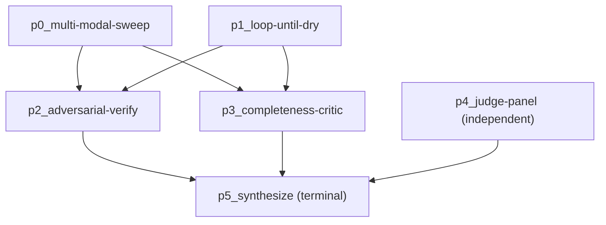

# Ultracode 与质量模式

普通的团队运行会合成一张扁平的任务 DAG：每个 `AgentTeamTask` 对应一个工作流节点，由 `dependencies` 连线。**Ultracode 模式**取代了这种做法。它不再镜像任务，而是由一名主规划者队友组合出一条由更高阶 `pattern.*` 工作流节点构成的流水线——每个节点都在运行的并发上限内向内部扇出大量启用了工具的 `dispatchTeammate` 调用。这是把 Claude Code 的 "ultracode" 质量编排模型移植到 Agent Team 子系统之上：并行的盲查找者、对抗式反驳、评审团、完备性批评者，以及把所有内容折叠成一份带引用报告的终端综合者。

这六个 pattern 节点位于 `lib/ai/agent/team/patterns/`。规划者（`ultracode-planner.ts`）决定组合哪些 pattern 以及扇出多宽；综合者（`synthesize-ultracode.ts`）把它们连成一张只向前推进的 DAG；触发器（`ultracode-trigger.ts`）决定一次运行是否启用 ultracode；类型与 Zod 面则位于 `types/agent/ultracode.ts`。

<TLDR>
  `isUltracodeActive`（`lib/ai/agent/team/ultracode-trigger.ts:15-31`）对运行进行门控：覆盖项 `force`/`off`
  &gt; `config.ultracode.enabled` &gt; `autoMode` always/never/auto（auto = `taskComplexity === "complex"`）。
  `planUltracodeWorkflow`（`ultracode-planner.ts:34-62`）以 `preferToolEnabled: false`
  分派一份结构化规划。`synthesizeUltracodeWorkflow`（`synthesize-ultracode.ts:89-172`）以只向前推进的方式连接
  `pattern.*` 节点：sweep/loop 累积 findingSources，adversarial-verify 消费所有这些来源并由幸存者将其 REPLACE，
  completeness-critic 只读取而不消费，judge-panel 独立运行，
  synthesize 从此前的每一个节点扇入且为终端节点。工作流 id 为 `__team__:<teamId>:<nonce>`；
  终端报告成为 `team.finalResult`（`agent-team-runtime.ts:413-487`）。
</TLDR>

## ultracode 何时激活 —— `ultracode-trigger.ts`

`isUltracodeActive` 镜像了 Claude Code 的强度开关。显式的操作者覆盖项总是优先；否则团队必须启用了 ultracode，再由 `autoMode` 决定。`auto` 默认值仅在路由评估判定任务为复杂时才进行编排。

```typescript
// lib/ai/agent/team/ultracode-trigger.ts:15-31
export function isUltracodeActive(
  team: Pick<AgentTeam, "config" | "routingAssessment">,
  override?: UltracodeOverride
): boolean {
  if (override === "force") return true
  if (override === "off") return false

  const uc = team.config.ultracode
  if (!uc?.enabled) return false

  const mode = uc.autoMode ?? "auto"
  if (mode === "never") return false
  if (mode === "always") return true

  // "auto": only for complex tasks, per the routing assessment.
  return team.routingAssessment?.factors.taskComplexity === "complex"
}
```

`UltracodeOverride` 为 `"force" | "off" | undefined`，从工作区运行控制中穿透传入（**Run Ultracode** 按钮会将其强制开启）。

## 主规划 —— `ultracode-planner.ts`

在一次运行扇出之前，先由一名规划者队友决定组合哪些 pattern 以及每个 pattern 扇出多宽。`planUltracodeWorkflow` 以 `taskId: "ultracode-plan"` 和 `preferToolEnabled: false` 分派一次结构化调用——规划是针对目标的纯推理，不需要任何仓库工具。团队旋钮（`skepticsPerFinding`、`judgesPerAttempt`、`maxFinderRounds`）作为默认值追加到提示中。结果由 `ultracodePlanSchema` 校验。

```typescript
// lib/ai/agent/team/ultracode-planner.ts:34-62
export async function planUltracodeWorkflow(
  teamCtx: TeamRunContext,
  opts: PlanUltracodeOptions = {}
): Promise<UltracodePlan> {
  const objective =
    teamCtx.team.task?.trim() || teamCtx.team.description?.trim() || teamCtx.team.name
  const uc = teamCtx.team.config.ultracode ?? {}
  // knobs = skepticsPerFinding / judgesPerAttempt / maxFinderRounds, joined and appended
  const { value } = await dispatchStructured(
    teamCtx,
    {
      taskId: "ultracode-plan",
      prompt: `${PLANNER_GUIDANCE}\n\nObjective:\n${objective}${knobs ? `\n\nTeam knobs — ${knobs}.` : ""}`,
      signal: opts.signal,
      // Planning is pure reasoning — no repo tools needed.
      preferToolEnabled: false,
    },
    ultracodePlanSchema,
    { schemaHint: PLAN_HINT }
  )
  return value
}
```

`PLANNER_GUIDANCE`（`ultracode-planner.ts:17-27`）描述了这六个 pattern，并固化了组合启发式规则：

- **audit / bug-hunt / research** → 一个查找者（`multi-modal-sweep` 或 `loop-until-dry`）→ `adversarial-verify` → `completeness-critic` → `synthesize`。
- **design / solution** → `judge-panel` → `synthesize`。
- 计数与重要性成比例；绝不超过 **16**（由 `ultracodeStageSchema.count.max(16)` 强制）。

## 合成 DAG —— `synthesize-ultracode.ts`

`synthesizeUltracodeWorkflow` 把规划的阶段列表转化为一张由 `pattern.*` 节点构成的 `VisualWorkflow`。连线是**只向前推进**的，且由阶段类型驱动。每个阶段成为一个 id 为 `p${i}_${stage.pattern}`、类型为 `pattern.${stage.pattern}` 的节点；如果规划未以 `synthesize` 阶段结尾，则会追加一个终端 `synthesize` 阶段。

```typescript
// lib/ai/agent/team/synthesize-ultracode.ts:122-145
    switch (stage.pattern) {
      case "multi-modal-sweep":
      case "loop-until-dry":
        findingSources.push(nodeId)
        break
      case "adversarial-verify":
        for (const src of findingSources) addEdge(src, nodeId)
        findingSources = [nodeId] // survivors replace raw findings
        break
      case "completeness-critic":
        for (const src of findingSources) addEdge(src, nodeId)
        break
      case "judge-panel":
        // Independent of findings — produces a winner from the objective.
        break
      case "synthesize":
        // Fan in from everything emitted so far.
        for (const prior of nodes) {
          if (prior.id !== nodeId) addEdge(prior.id, nodeId)
        }
        terminalNodeId = nodeId
        break
    }
```

连线规则的散文描述：

| 阶段类型 | 入边 | 对 `findingSources` 的影响 |
| --- | --- | --- |
| `multi-modal-sweep` / `loop-until-dry` | 无 | 追加其节点 id |
| `adversarial-verify` | 来自当前每一个 findingSource | 幸存者将其 **REPLACE**（成为唯一来源） |
| `completeness-critic` | 来自当前每一个 findingSource | 无 —— 只读取而不消费 |
| `judge-panel` | 无 | 无 —— 独立运行，从目标产出一个优胜者 |
| `synthesize` | 来自**每一个**先前节点 | 终端节点；设置 `terminalNodeId` |

工作流 id 为 `__team__:<teamId>:<nonce>`（`nanoid(8)`）；设置使用 `errorPolicy: "stop"`、来自挂钟超时的 `timeoutMs`、`concurrency: 1`、`maxConcurrency: max(1, initialConcurrency)`，以及 `retryDefaults: DEFAULT_RETRY_POLICY`。该函数返回 `{ workflow, terminalNodeId }`；终端 `synthesize` 节点的 `report` 输出成为 `team.finalResult`。

### 合成 DAG 示例

一次 bug-hunt 运行，规划者组合了一个 sweep 加一个 loop 查找者、一个 verify、一个 critic，以及一个独立的 design judge-panel：



`adversarial-verify` 运行后，`findingSources` 仅为 `[p2_adversarial-verify]`——但 `synthesize` 无论如何都会从所有先前节点扇入，所以 critic 揭示的缺口与 judge 优胜者仍会到达报告。

## 六个 pattern 节点 —— `lib/ai/agent/team/patterns/`

每个模块在导入时通过 `registerNodeExecutor` 注册其执行器。所有节点均为 `retryable: false`、`typeVersion: 1`。每个 pattern 都解析出每次运行的 `TeamRunContext`（`getTeamCtxOrThrow`），向外扇出受 `fanoutLimit(teamCtx)` 限制的、启用了工具的 `dispatchStructured` 调用，并通过上游输出映射交换数据。

### pattern.multi-modal-sweep

并行查找者，彼此互不知情，每个运行**不同的**搜索模态（by-container、by-content、by-entity、…）。返回去重后的并集。参数：`MultiModalSweepParams`（`objective`、`modalities: string[]`）。输出：`{ findings, finderCount }`。

```typescript
// lib/ai/agent/team/patterns/multi-modal-sweep.ts:41-65
  const results = await mapSettled(
    modalities,
    fanoutLimit(teamCtx),
    async (modality, i) => {
      const r = await dispatchStructured(
        teamCtx,
        {
          taskId: `${ctx.stepId}:sweep:${i}`,
          prompt:
            `Objective: ${objective}\n\nSearch approach: ${modality}\n\n` +
            "Find concrete, specific findings using ONLY this approach. ...",
          signal: ctx.signal,
        },
        findingsResultSchema,
        { schemaHint: FINDINGS_HINT }
      )
      return r.value.findings
    },
    (err, _modality, i) => ctx.log("warn", `sweep finder ${i} failed: ${String(err)}`)
  )
  const findings = dedupeFindings(assignFindingIds(flat))
```

### pattern.loop-until-dry

用于规模未知的发现：持续生成查找者轮次，直到连续 `dryRoundsToStop`（默认 **2**）轮没有新增任何内容，受 `maxRounds`（默认 **4**）约束。每一轮的提示都嵌入一份 "Already found (do NOT repeat these)" 的已知列表；去重通过一个由 `findingKey` 组成的 `seen` Set 完成。输出：`{ findings, rounds, converged }`。`converged` 标志即收敛信号；当先触及 `maxRounds` 时，它会记录覆盖率可能不完整（不静默截断）。

```typescript
// lib/ai/agent/team/patterns/loop-until-dry.ts:47-92
  while (round < maxRounds && dryStreak < dryRoundsToStop) {
    round += 1
    const knownSummary =
      all.length === 0
        ? "Nothing found yet."
        : `Already found (do NOT repeat these):\n${all.map((f) => `- ${f.title}`).join("\n")}`
    // ... fan out findersPerRound finders, dedupe by findingKey into `fresh` ...
    if (fresh.length === 0) dryStreak += 1
    else dryStreak = 0
  }
```

### pattern.adversarial-verify

为**每个 finding 生成 N 个怀疑者**，每个都被提示去 REFUTE（反驳）它（不确定时默认 `real=false`）。当设置了 `lenses` 时，每个怀疑者获得一个独特的视角——`correctness`/`security`/`perf`/`repro`——以进行视角多样的验证（`repro` 以启用工具的方式运行，以实际复现）。`skepticsPerFinding` 默认 **3**（或每个 lens 一个）。输出：`{ findings (survivors), killed, verified }`。平票即否的规则是保守的——一个 finding 只有在确认数**严格**多于反驳数时才幸存：

```typescript
// lib/ai/agent/team/patterns/adversarial-verify.ts:116-124
  const verified: VerifiedFinding[] = findings.map((finding, fi) => {
    const verdicts = byFinding.get(fi) ?? []
    const realVotes = verdicts.filter((v) => v.real).length
    const refuteVotes = verdicts.length - realVotes
    // Survives only with strictly more confirmations than refutals; a tie
    // (or a finding whose skeptics all errored out) is killed — conservative.
    const survives = verdicts.length > 0 && realVotes > refuteVotes
    return { finding, verdicts, realVotes, refuteVotes, survives }
  })
```

### pattern.judge-panel

独立于 findings。**阶段 1**：每个角度一次尝试，并行进行。**阶段 2**：每个评委在一个并发上限内对每次尝试打 0–10 分；尝试按平均分排名。`judgesPerAttempt` 默认 **3**。参数：`JudgePanelParams`（`angles`、`judgesPerAttempt`）。输出：`{ winner, ranked, attempts }`。

```typescript
// lib/ai/agent/team/patterns/judge-panel.ts:74-119
  // Phase 2 — every judge scores every attempt, all under one concurrency bound.
  const jobs = attempts.flatMap((attempt, ai) =>
    Array.from({ length: judgesPerAttempt }, (_, ji) => ({ attempt, ai, ji }))
  )
  // ... dispatch judge scores, tally scoresByAttempt ...
  const ranked: RankedAttempt[] = attempts
    .map((attempt, ai) => ({ attempt, scores: scoresByAttempt.get(ai) ?? [], avgScore: average(...) }))
    .sort((a, b) => b.avgScore - a.avgScore)
  const winner = ranked[0]
```

### pattern.completeness-critic

针对上游 findings 的单个批评者，追问还**遗漏**了什么——从未运行过的搜索角度、尚未验证的声明、尚未检查的区域或来源。它揭示的缺口向前传递（综合者会将其作为局限性指出）。输出：`{ gaps: CritiqueGap[] }`。

```typescript
// lib/ai/agent/team/patterns/completeness-critic.ts:42-53
      prompt:
        `Objective: ${objective}\n\n` +
        `The work so far produced these findings:\n${findingsBlock}\n\n` +
        "Acting as a completeness critic, identify what is MISSING — a search angle never run, " +
        "a claim left unverified, a region or source not yet examined. For each gap, optionally " +
        "suggest the concrete next search that would close it. ...",
      signal: ctx.signal,
    },
    critiqueResultSchema,
    { schemaHint: GAPS_HINT }
```

### pattern.synthesize

终端节点。把已验证的 `findings`、judge-panel 的 `winner` 以及任何未解决的 `gaps` 折叠成一份带引用的报告，作为 `result_share` 消息发布到团队聊天（截断到 4000 字符），并将其返回，以便运行将其写入 `team.finalResult`。输出：`{ report, citations, findingCount }`。

```typescript
// lib/ai/agent/team/patterns/synthesize.ts:74-92
  // Surface the report in the team chat.
  teamCtx.storeWriter.addMessage({
    teamId: teamCtx.teamId,
    senderId: r.teammateId,
    type: "result_share",
    content: r.value.report.length > 4000 ? `${r.value.report.slice(0, 3999)}…` : r.value.report,
  })
  return { output: { report: r.value.report, citations: r.value.citations ?? [], findingCount: findings.length } }
```

## 共享辅助函数 —— `patterns/_shared.ts`

每个 pattern 节点都借助这个工具箱，以使并发、错误处理与 finding 标识保持统一。

| 辅助函数 | 行号 | 用途 |
| --- | --- | --- |
| `nonRetryable` | `:13` | 将 Error 包装为 `retryable=false`，使编排器永不重试它 |
| `getTeamCtxOrThrow` | `:20` | 按 `runId` 解析每次运行的 `TeamRunContext`，缺失时抛出不可重试错误 |
| `fanoutLimit` | `:31` | 有效扇出宽度 = 运行的实时并发上限，绝不低于 1 |
| `mapSettled` | `:40` | 有界并发 map；逐项拒绝变为 `null` 并经由 `onError` 记录 |
| `collectFindings` | `:86` | 汇集上游 `findings`、分配 id、按 `findingKey` 去重 |
| `dedupeFindings` | `:96` | 按 `findingKey` 去重，保持首次出现顺序 |
| `renderFinding` | `:109` | 单行渲染 `[severity] title (location): detail`，用于嵌入提示 |

## 类型与 schema 面 —— `types/agent/ultracode.ts`

每次结构化交换都由一个 `structured-dispatch.ts` 消费的 Zod schema 校验（它指示队友发出一个围栏 JSON 块，进行解析、校验，并重试一次）。

```typescript
// types/agent/ultracode.ts (selected)
export interface Finding { id?: string; title: string; detail: string; location?: string; severity?: FindingSeverity }   // findingSchema :41-49
export interface Verdict { real: boolean; reasoning: string; lens?: VerifierLens }                                       // verdictSchema :73-78
export interface Attempt { angle: string; content: string }                                                              // attemptSchema :85-88
export interface CritiqueGap { description: string; suggestedSearch?: string }                                           // critiqueGapSchema :112-116
export interface SynthesisReport { report: string; citations?: string[] }                                                // synthesisReportSchema :128-131
export interface UltracodeStage { pattern: UltracodePatternKind; instruction: string; count?: number; variants?: string[] } // ultracodeStageSchema :201-209
export interface UltracodePlan { summary: string; stages: UltracodeStage[] }                                             // ultracodePlanSchema :212-216
```

配套的 Zod schema——`findingsResultSchema`、`verdictSchema`、`attemptSchema`、`judgeScoreSchema`、`critiqueResultSchema`、`synthesisReportSchema`、`ultracodePlanSchema`——支撑着每个 pattern 节点的 `dispatchStructured` 调用。`findingKey`（`:63-67`）是标准的去重键（location，否则为归一化后的 title），由 `loop-until-dry` 的全量已见集合与 verify 聚合器共享。

## 生命周期集成 —— `agent-team-runtime.ts`

运行时根据 `ultracodeActive` 分支：副作用导入注册 `pattern.*` 执行器，规划者产出一份规划，综合者连接 DAG，`runWorkflow` 执行它。成功时终端报告经由 `storeWriter.setFinalResult` 持久化。

```typescript
// lib/ai/agent/agent-team-runtime.ts:413-429
    // ── Synthesize the VisualWorkflow (ultracode patterns vs. flat task DAG) ──
    let workflow: VisualWorkflow
    if (ultracodeActive) {
      // Side-effect import registers the pattern.* node executors.
      await import("./team/patterns")
      const [{ planUltracodeWorkflow }, { synthesizeUltracodeWorkflow }] = await Promise.all([
        import("./team/ultracode-planner"),
        import("./team/synthesize-ultracode"),
      ])
      const teamCtx = getTeamRunContext(runId)!
      const plan = await planUltracodeWorkflow(teamCtx, { signal: ac.signal })
      ;({ workflow } = synthesizeUltracodeWorkflow({
        team,
        plan,
        initialConcurrency: concurrency.get(),
        wallClockTimeoutMs: team.config.defaultTimeout,
      }))
    } else { /* flat task DAG via synthesizeTeamWorkflow */ }
```

```typescript
// lib/ai/agent/agent-team-runtime.ts:485-487 (ultracode only, on completion)
        const report = (result.output as { report?: string } | undefined)?.report
        if (report && deps.storeWriter.setFinalResult) {
          deps.storeWriter.setFinalResult(teamId, report)
```

## UI 旋钮

Ultracode 在设置详情面板的 **Advanced governance** 折叠组里按小队配置（`enabled`、`autoMode`、`skepticsPerFinding`、`judgesPerAttempt`、`maxFinderRounds`）—— 参见 [界面](./surfaces)。`/squads` 检视面板中的 **Run Ultracode** 控件会强制开启一次运行（`override: "force"`），无视 `autoMode`。

## 相关

<Cards>
  <Card title="Lifecycle & Synthesis" href="./lifecycle-and-synthesis" description="扁平任务 DAG 如何被合成，以及 runWorkflow 如何驱动团队运行。" />
  <Card title="Dispatch & Shared State" href="./dispatch-and-shared-state" description="dispatchTeammate、dispatchStructured 以及每次运行的 TeamRunContext。" />
  <Card title="ADR-0022 — Agent Team Runtime Hardening" href="../adr/0022-agent-team-runtime-hardening" description="Agent Team 子系统及其 ultracode 补遗的权威决策记录。" />
</Cards>
