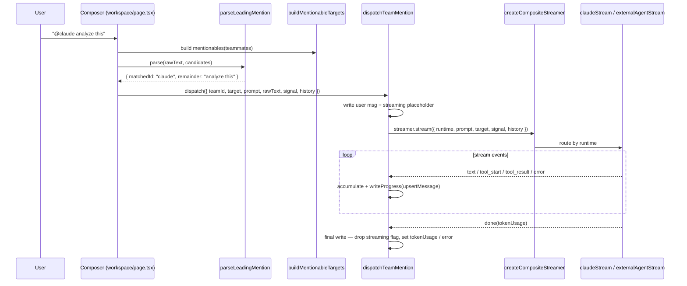

# 工作台聊天与 @ 派发

团队工作台的 Chat 标签页是**交互式直接聊天**，而非团队 RUN 引擎。键入 `@claude analyze this` 会解析开头的 mention，将其解析为一个运行时目标，打开一个运行时流（经 Vercel AI SDK 的 Anthropic，或一个外部 CLI 智能体），并把流事件归约为团队日志中的单条消息。整条链都位于 `lib/agent-team/` 之下，并与 React 完全解耦，因此可以用纯异步生成器做单元测试。

<TLDR>
  `handleSendMention`（workspace/page.tsx:185）针对来自 `buildMentionableTargets`（runtime-targets.ts:64）
  的候选项运行 `parseLeadingMention`（mention-parser.ts:48），然后用一个 `createCompositeStreamer`
  （runtime-streamers.ts:221）调用 `dispatchTeamMention`（team-runtime-dispatcher.ts:121）。streamer
  把 `runtime: "claude"` 路由到 `claudeStream`（AI SDK `streamText`，runtime-streamers.ts:49），其余一切
  路由到 `externalAgentStream`（runtime-streamers.ts:111）。dispatcher 写入一条用户消息、一个流式
  占位符，然后把流事件归约为最终消息 —— 且永不抛出。
</TLDR>

<StatGrid>
  <Stat label="Mentionable runtimes" value="5" hint="claude · codex · claude-code · gemini-cli · cursor-cli" />
  <Stat label="Virtual targets" value="2" hint="@claude · @codex, always listed first" />
  <Stat label="Availability statuses" value="4" hint="ready · missing-key · no-agent · disconnected" />
  <Stat label="History turn cap" value="20" hint="buildConversationHistory DEFAULT_MAX_TURNS" />
</StatGrid>

## 派发链

该链由四个纯阶段加上一个 React 拥有的 streamer 工厂组成：



### 1. 解析 mention —— `mention-parser.ts:48`

`parseLeadingMention` 是一个纯函数。只考虑**第一个**非空白 token；它必须以 `@` 开头，名称延伸到下一个空白处。名称匹配不区分大小写。命中时，余下部分（去掉前导空白）成为 prompt；未命中时，它会标记 `unknownMention`，以便调用方提示用户提供有效的智能体。

```ts
// lib/agent-team/mention-parser.ts:48-58 (shape)
export function parseLeadingMention(
  text: string,
  candidates: readonly MentionCandidate[]
): ParsedMention {
  // returns { matchedName, matchedId, remainder, unknownMention, rawToken }
```

### 2. 构建可 mention 的目标 —— `runtime-targets.ts:64`

`buildMentionableTargets` 把两个虚拟目标放在**最前**面 —— `@claude`（运行时 `"claude"`）与 `@codex`（运行时 `"codex"`）—— 这样即使尚无任何队友存在，演示路径也能工作，随后再追加每个真实队友。名称（不区分大小写）与保留名冲突的队友保留其自身 id，但被标记为 `nameCollision: true`；因为虚拟目标先被追加，解析器仍会把保留名解析到虚拟目标。

```ts
// lib/agent-team/runtime-targets.ts:64-78
export function buildMentionableTargets(teammates: readonly AgentTeammate[]): MentionTarget[] {
  const reserved = new Set<string>(RESERVED_MENTION_NAMES)
  const out: MentionTarget[] = [...VIRTUAL_TARGETS]
  for (const tm of teammates) {
    out.push({
      kind: "teammate",
      id: tm.id,
      name: tm.name,
      runtime: tm.config.runtime ?? DEFAULT_TEAMMATE_RUNTIME,
      teammate: tm,
      description: tm.description,
      nameCollision: reserved.has(tm.name.toLowerCase()),
    })
  }
  return out
}
```

五种受支持的运行时是 `claude`、`codex`、`claude-code`、`gemini-cli` 与 `cursor-cli`（最后一个是配置中未指定运行时的真实队友的 `DEFAULT_TEAMMATE_RUNTIME`）。

### 3. 按运行时流式处理 —— `runtime-streamers.ts:221`

`createCompositeStreamer` 返回单个 `RuntimeStreamer`，其 `.stream(...)` 根据 `runtime` 进行分支：`"claude"` 路由到 `claudeStream`，其余一切路由到 `externalAgentStream`。

**Claude 路径**（`runtime-streamers.ts:49`）针对用户的 Anthropic key 运行 Vercel AI SDK 的 `streamText` —— 不依赖 Tauri sidecar，因此在 web 模式下也能工作。先前的轮次以角色合并的 `messages` 传入，其中 assistant 轮次携带 `[SpeakerName]:` 前缀：

```ts
// lib/agent-team/runtime-streamers.ts:49-67
export async function* claudeStream(
  prompt: string,
  options: ClaudeStreamerOptions,
  signal: AbortSignal,
  history?: readonly ConversationTurn[]
): AsyncIterable<RuntimeStreamEvent> {
  const priorMessages = historyAsClaudeMessages(history ?? [])
  const messages = [...priorMessages, { role: "user" as const, content: prompt }]
  const result = streamText({
    model: options.model,
    system: options.systemPrompt ?? DEFAULT_SYSTEM_PROMPT,
    messages,
    abortSignal: signal,
  })
  // yields text deltas, then a done event with token usage
```

**外部路径**（`runtime-streamers.ts:111`）解析出该运行时所配置的外部智能体，将其置为 active，然后通过 `translateExternalEvent` 把每个 `ExternalAgentEvent` 翻译为 dispatcher 的 `RuntimeStreamEvent`。ACP 风格的运行时没有结构化的 `messages` 参数，因此历史被扁平化为一段文本前言：

```ts
// lib/agent-team/runtime-streamers.ts:111-135
export async function* externalAgentStream(
  prompt: string,
  runtime: TeammateRuntime,
  hooks: ExternalAgentStreamerHooks,
  history?: readonly ConversationTurn[]
): AsyncIterable<RuntimeStreamEvent> {
  const agentId = hooks.resolveAgentId(runtime)
  if (!agentId) {
    yield { kind: "error", message: "No external agent configured ..." }
    yield { kind: "done" }
    return
  }
  hooks.setActiveAgent(agentId)
  const fullPrompt =
    history && history.length > 0
      ? `${historyAsTextPreamble(history)}\n[New request]\n${prompt}`
      : prompt
  for await (const event of hooks.executeStreaming(fullPrompt)) {
    const translated = translateExternalEvent(event)
    if (translated) yield translated
  }
}
```

当没有智能体匹配该运行时时，流会发出一张错误卡片，把用户指向 Settings → External Agents —— 参见 [外部智能体运行时](./external-agents) 文档。

## Dispatcher 的消息生命周期

`dispatchTeamMention`（`team-runtime-dispatcher.ts:121`）拥有四步写入生命周期。每个依赖项 —— streamer 与 store 写入器 —— 都被注入，因此测试可用异步生成器对其进行 mock。

1. **用户消息** —— 持久化一条 `AgentTeamMessage`，其 `senderId = TEAM_USER_SENDER_ID`，内容 = 逐字的 `rawText`，`recipientId/Name` = 目标。
2. **流式占位符** —— 持久化一条空的智能体消息，带 `metadata.streaming = true`，外加 `runtime`、`dispatchTargetId` 与 `dispatchPrompt`，让 UI 知道正在运行什么，且 Retry 可以重放它。
3. **流循环** —— 对每个事件，`writeProgress` 重新 upsert 占位符：`text` 累积内容；`tool_start` / `tool_result` 镜像进 `metadata.toolCalls`；`error` 换入一个错误指示器；`done` 记录 `tokenUsage`。
4. **最终写入** —— 去掉流式标志，并设置错误或最终的 `tokenUsage`。

该函数**永不抛出** —— 每个失败（包括抛错的 streamer）都以一条错误指示器消息浮现，因此演示路径保持确定性。被持久化的 metadata 键是一个统一的再导出块：

```ts
// lib/agent-team/team-runtime-dispatcher.ts:304-312
export const TEAM_MESSAGE_METADATA_KEYS = {
  STREAMING: STREAMING_METADATA_KEY,
  ERROR: ERROR_METADATA_KEY,
  RUNTIME: RUNTIME_METADATA_KEY,
  TOOL_CALLS: TOOL_CALLS_METADATA_KEY,
  TOKEN_USAGE: TOKEN_USAGE_METADATA_KEY,
  DISPATCH_TARGET_ID: DISPATCH_TARGET_ID_KEY,
  DISPATCH_PROMPT: DISPATCH_PROMPT_KEY,
} as const
```

## 对话历史 —— `conversation-context.ts:40`

`buildConversationHistory` 把原始的 `AgentTeamMessage[]` 日志转成运行时就绪的轮次。它会过滤掉流式占位符、报错卡片、结构化负载消息、空内容，以及任何非对话类型（只有 `direct` 与 `broadcast` 留存），按时间顺序排序，并截断到最近的 20 轮（`DEFAULT_MAX_TURNS`）。

```ts
// lib/agent-team/conversation-context.ts:54-72 (loop)
for (const m of sorted) {
  if (excluded?.has(m.id)) continue
  if (!CONVERSATIONAL_TYPES.has(m.type)) continue
  if (m.structuredPayload) continue
  if (!m.content || !m.content.trim()) continue
  if (m.metadata?.[TEAM_MESSAGE_METADATA_KEYS.STREAMING] === true) continue
  if (m.metadata?.[TEAM_MESSAGE_METADATA_KEYS.ERROR] === true) continue
  turns.push({ role: m.senderId === TEAM_USER_SENDER_ID ? "user" : "assistant", ... })
}
```

两个投影供给两种 streamer 形态：`historyAsClaudeMessages` 把连续的同角色轮次合并为一个 AI SDK `messages` 数组（assistant 轮次以 `[SpeakerName]:` 为前缀），而 `historyAsTextPreamble` 把一切扁平化为一个文本块，供 ACP 运行时使用。

## 运行时可用性 —— `use-runtime-availability.ts:38`

`useRuntimeAvailability` 为每个运行时报告一个状态，以便 mention 芯片可以变暗、聊天横幅可以在发送前发出警告。共有四种状态 —— `"ready"`、`"missing-key"`、`"no-agent"`、`"disconnected"` —— 各运行时规则如下：

- **claude** —— 当 `AppSettings.apiKey` 非空（Settings → Providers）时为 `"ready"`；否则为 `"missing-key"`。
- **external**（`codex`、`claude-code`、`gemini-cli`、`cursor-cli`）—— 查找一个 `enabled` 且 `metadata.preset === runtime` 的 `ExternalAgentConfig`。无匹配 → `"no-agent"`；匹配但在 `connectionStatus` 中并非 `"connected"` → `"disconnected"`；已连接 → `"ready"`。

```ts
// lib/agent-team/use-runtime-availability.ts:43-61
map.claude = apiKey && apiKey.length > 0 ? "ready" : "missing-key"
const externals: TeammateRuntime[] = ["codex", "claude-code", "gemini-cli", "cursor-cli"]
for (const runtime of externals) {
  const match = Object.values(agents).find((a) => {
    if (!a.enabled) return false
    const preset = (a.metadata as Record<string, unknown> | undefined)?.preset
    return typeof preset === "string" && preset === runtime
  })
  if (!match) { map[runtime] = "no-agent"; continue }
  const status = connectionStatus[match.id]
  map[runtime] = status === "connected" ? "ready" : "disconnected"
}
```

任何运行时不为 `"ready"` 的芯片都会以变暗并带状态提示的方式渲染，因此用户在按下发送之前就能看到哪些 `@<name>` 会成功。

## React 接线 —— `workspace/page.tsx`

详情页把整条链黏合起来。关键行：

| 行 | 接线内容 |
| --- | --- |
| 112 | `mentionables = buildMentionableTargets(teammates)`（已 memo 化） |
| 137 | `streamer = createCompositeStreamer({ claude: { model }, external: {...} })` |
| 146 | `history = buildConversationHistory(messagesRef.current)` |
| 154 | `dispatchTeamMention({ teamId, target, prompt, rawText, signal, history }, { writer, streamer })` |
| 189 | `handleSendMention` 内的 `parseLeadingMention(rawText, candidates)` |
| 210 | 解析成功后的 `dispatchPair({ targetId, prompt, rawText })` |

`dispatchPair` 用来自 `getProviderModel` 的 Anthropic 模型以及一个按 preset 解析智能体 id 的 `external` 块来构建 streamer，通过一个 `AbortController` ref 中止任何进行中的派发，切换 `isSending`，并在失败时浮现一个 toast（dispatcher 自身永不抛出，因此该 toast 只覆盖 setup 错误）。

## 端到端示例：`@claude analyze this`

1. 用户键入 `@claude analyze this` 并提交；`handleSendMention`（page.tsx:185）运行。
2. `parseLeadingMention` 匹配第一个 token `@claude` → `{ matchedId: "claude", remainder: "analyze this" }`。
3. `findTargetById(mentionables, "claude")` 解析出**虚拟**的 `@claude` 目标（运行时 `"claude"`）。
4. `dispatchPair` 构建一个复合 streamer 并调用 `dispatchTeamMention`，后者写入用户消息与一个流式占位符。
5. `createCompositeStreamer` 把 `"claude"` 路由到 `claudeStream`，后者用作为角色合并消息的 20 轮历史加上 `"analyze this"` 用户轮次来调用 AI SDK 的 `streamText`。
6. 每个 `text` delta 被累积，且 `writeProgress` 重新 upsert 占位符，因此消息在日志中实时增长。
7. 在 `done` 时，dispatcher 去掉流式标志并记录 token 用量；最终消息连同其运行时徽章、任何工具调用卡片以及一条 token 用量行一起渲染。

这是一次性的交互式聊天 —— 与团队**运行**不同，后者会合成一个工作流并执行任务（参见 [生命周期与合成](./lifecycle-and-synthesis)）。

## 相关

<Cards>
  <Card title="Workspace UI" href="./workspace-ui" />
  <Card title="Lifecycle & Synthesis" href="./lifecycle-and-synthesis" />
  <Card title="External Agents" href="./external-agents" />
</Cards>
