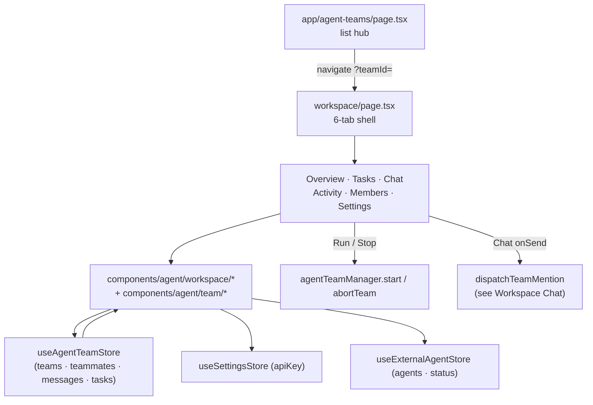

# 工作台 UI

智能体团队 UI 由两条路由构成：**列表中枢**（`/agent-teams`），在这里创建、搜索、克隆、删除团队或从模板实例化；以及**工作台**（`/agent-teams/workspace?teamId=…`），在六标签页外壳中打开单个团队。两者绑定同一个 `useAgentTeamStore`，并把交互向下交给 `agentTeamManager` 以及 [工作台聊天与 @ 派发](./workspace-chat) 中记录的派发链。

<TLDR>
  中枢 `app/agent-teams/page.tsx`（1–854）在 `useAgentTeamStore` 之上渲染 My Teams / Templates 标签页；
  模板通过 `useMergedTemplates`（page.tsx:86–99）合并本地条目与插件投影条目。工作台
  `app/agent-teams/workspace/page.tsx` 以 `?teamId=` 查询参数为键（静态导出安全），并渲染
  六个 `ALL_TABS`（workspace/page.tsx:64）。Overview 把 Run / Run Ultracode / Stop 接入 `agentTeamManager`；
  Chat 接入派发链；其余则是由 `components/agent/workspace/*`
  以及 `components/agent/team/*` 中的 HITL 界面支撑的 CRUD / 配置界面。
</TLDR>

<StatGrid>
  <Stat label="Workspace tabs" value="6" hint="overview · tasks · chat · activity · members · settings" />
  <Stat label="HITL gate variants" value="4" hint="budget · deadlock · plan · teammate_fix" />
  <Stat label="Settings sections" value="5" hint="overview · plugins · governance · ultracode · memory" />
  <Stat label="Template categories" value="9" hint="all + review · research · development · debugging · analysis · general · documentation · security" />
</StatGrid>

## 路由

| 路由 | 文件 | 作用 |
| --- | --- | --- |
| `/agent-teams` | app/agent-teams/page.tsx:1 | 列表中枢 —— My Teams / Templates 标签页、搜索、CRUD、示例团队 |
| `/agent-teams/workspace` | app/agent-teams/workspace/page.tsx:67 | 单团队工作台，以 `?teamId=` 为键 |
| `/agent-teams/[teamId]` | app/agent-teams/[teamId]/page.tsx | 旧版重定向垫片 → `workspace?teamId=…` |

工作台刻意使用**搜索参数，而非动态路由段**。本应用以 Next 静态导出形式发布（`output: "export"`，Tauri 构建所必需），因此运行时创建的团队 id 无法在构建期枚举 —— 而 `[teamId]` 路由需要枚举它们。详情页改为从 URL 读取 id：

```tsx
// app/agent-teams/workspace/page.tsx:67-69
function AgentTeamWorkspaceInner() {
  const searchParams = useSearchParams()
  const teamId = searchParams.get("teamId")
```

旧版 `[teamId]/page.tsx` 是一个薄薄的客户端垫片，会重定向到规范的 `workspace?teamId=…` URL，因此旧书签仍能工作，而无需强制静态导出去预渲染任意 id。

中枢默认被固定在侧边栏中：

```ts
// types/shell/sidebar.ts:41
{ id: "agent-teams", route: "/agent-teams", i18nKey: "agentTeams", group: "feature" }
```

并在 `lib/shell/sidebar-nav.ts:44` 中映射 `Users2Icon` 字形。在移动端，同一条路由以响应式布局在 Capacitor 外壳中渲染；工作台标签页会折叠，但 `?teamId=` 约定完全一致。

## 团队列表中枢

`app/agent-teams/page.tsx` 绑定 `useAgentTeamStore` 来获取 `teams`、`teammates`、`templates`，以及写入器 `createTeam`、`deleteTeam`、`updateTeam`、`addTeammate`。该页面拆分为两个标签页：

- **My Teams** —— 每个团队一张富信息卡片（通过 `TEAM_STATUS_CONFIG` 显示状态徽章、成员数、相对 `timeAgo`）、一个搜索 `Input`、每张卡片一个 `DropdownMenu`（重命名 / 克隆 / 删除），以及一个 `AlertDialog` 删除确认框。空状态会提供由 `createSampleTeam`（`lib/ai/agent/sample-team.ts`）构建的**示例团队**。
- **Templates** —— 一个分类过滤器加上一个可实例化模板的网格。从模板创建会打开一个 `Dialog`（名称 / 描述），成功后导航到 `workspace?teamId=…`。

### 合并后的模板

模板是本地定义模板与插件投影模板的并集。`useMergedTemplates` 执行合并并收集每个条目的告警：

```tsx
// app/agent-teams/page.tsx:86-99
function useMergedTemplates(localTemplates: AgentTeamTemplate[]): {
  merged: AgentTeamTemplate[]
  warningsById: Map<string, readonly PluginAgentTeamTemplateWarning[]>
} {
  return useMemo(() => {
    const warningsById = new Map<string, readonly PluginAgentTeamTemplateWarning[]>()
    const pluginProjected = listAgentTeamTemplateEntries().map((entry) => {
      const projected = projectPluginTemplate(entry)
      const warnings = getTemplateWarnings(entry.id)
      if (warnings.length > 0) warningsById.set(projected.id, warnings)
      return projected
    })
    return { merged: [...localTemplates, ...pluginProjected], warningsById }
  }, [localTemplates])
}
```

`projectPluginTemplate`（`lib/agent-team/project-plugin-template.ts:21`）将一个 `PluginAgentTeamTemplateDef` 映射到宿主的 `AgentTeamTemplate`，把它的 id 命名空间化为 `<pluginId>:<id>`，并携带 `systemPrompt`、`capabilities`、`governanceHints`、`tags` 与 `iconKey`（ADR-0032）。分类过滤器列表（`TEMPLATE_CATEGORIES`，page.tsx:102）为：

```ts
// app/agent-teams/page.tsx:102-112
const TEMPLATE_CATEGORIES = [
  "all", "review", "research", "development", "debugging",
  "analysis", "general", "documentation", "security",
] as const
```

## 工作台标签页

工作台外壳从 store 的 `workspaceTab` 驱动一个 `Tabs`，标签页集合有序排列：

```ts
// app/agent-teams/workspace/page.tsx:64
const ALL_TABS = ["overview", "tasks", "chat", "activity", "members", "settings"] as const
```

选择器在每次 store 变更时都会物化出全新的数组，因此每个选择器都用 `useShallow` 包裹，以保持 `useSyncExternalStore` 的快照缓存稳定（workspace/page.tsx:80–89）。

### Overview —— `workspace/overview.tsx:22`

身份卡片、配置摘要（模式 / 模式范式 / 并发度 / 预算 / 计划审批）、运行时信息（lead、teammates、时长、token 用量）、最终结果，以及内嵌的计划审批面板。Props：`team`、`teammates`、`onStart`、`onStartUltracode`、`onAbort`、`onUpdateTeam`。三个运行按钮直接映射到 manager：

- **Run** → `agentTeamManager.start()`（标准合成）。
- **Run Ultracode** → `onStartUltracode` → 以 ultracode 范式调用 `agentTeamManager.start()`。
- **Stop** → `abortTeam(...)`（`lib/ai/agent/agent-team-runtime.ts`）。

当设置了 `requirePlanApproval` 且 `lead.status === "awaiting_approval"` 时，Overview 渲染 `plan-approval-panel.tsx:26`，它读取 `lead.proposedPlan` 并暴露 approve / reject。

### Tasks —— `workspace/tasks.tsx:57`

一个创建表单（标题 / 描述 / 优先级 / 受派人）加上任务列表，含状态与优先级徽章以及逐行删除确认。写入 `createTask` / `deleteTask`。

### Chat —— `workspace/chat.tsx:154`

交互式 `@mention` 界面 —— 含发送者头像的消息列表、运行时 + 类型徽章、工具调用卡片、token 用量行、错误指示器、结构化负载渲染、带 Stop 的流式横幅，以及 mention 芯片。Props：`teamId`、`messages`、`mentionables`、`onSend`、`onStop`、`isSending`、`availability`、`onRetry`、`onDelete`。`onSend` 背后的派发机制记录于 [工作台聊天与 @ 派发](./workspace-chat)。

### Activity —— `workspace/activity.tsx:72`

执行报告时间线（检查点）加上富报告小组件与共识界面：

- `ReportKpiCards` —— 头条运行 KPI。
- `ReportTaskline` —— 每个任务的进度行。
- `ReportTokenBurn` —— 随时间变化的 token 消耗。
- `ReportPluginSlot` —— 插件贡献的报告面板。
- `ConsensusPanel`（`consensus-panel.tsx`）—— 共识决策 UI。

### Members —— `workspace/members.tsx:95`

名册卡片（lead 高亮）、状态徽章、每个成员的运行时选择器，以及添加 / 移除 / 配置操作。Configure 会打开 `teammate-config-dialog.tsx`，它是围绕 `PresetEditor`（ADR-0032）的包装器，用于配置系统提示词、能力与治理提示 —— 参见 [能力与插件](./capabilities-and-plugins)。

### Settings —— `workspace/settings.tsx:47`

一个覆盖五个分区的折叠面板加上一个危险区删除：

| 分区 | 文件 | 配置字段 |
| --- | --- | --- |
| Overview | section-overview.tsx | name、description、executionMode、preferredExecutionPattern、maxConcurrentTeammates、tokenBudget |
| Plugins | section-plugins.tsx | 团队能力捆绑包选择器 + 插件模板 |
| Governance | section-governance.tsx | governancePolicy：审批标志、预算阈值（warning / critical）、升级动作、拒答检测 |
| Ultracode | section-ultracode.tsx | ultracode.enabled、autoMode（auto / always / never）、skepticsPerFinding、judgesPerAttempt、maxFinderRounds、workingDir |
| Memory | section-memory.tsx | 共享内存适配器配置、条目 CRUD、导入 / 导出、过滤工具栏 |

Section Memory 由 `memory-composer.tsx` 与 `memory-filter-toolbar.tsx` 组合而成；各行使用 `editable-setting-row.tsx`（标签 + 编辑 + 防抖保存），并通过 `settings-save-indicator.tsx` 展示进度。危险区删除经由 `confirm-action-dialog.tsx`（键入以确认）。

## 组件清单 —— `components/agent/workspace/`

| 文件 | 用途 |
| --- | --- |
| chat.tsx | 消息列表 + composer 外壳；按类型设置左边框颜色（见下文） |
| overview.tsx | 身份 + 配置 + 把 Run / Run Ultracode / Stop 接入 `agentTeamManager.start` |
| tasks.tsx | 任务 CRUD 看板 |
| activity.tsx | 执行报告 + 事件时间线 |
| members.tsx | 名册 + 队友配置对话框 |
| settings.tsx | 折叠面板 + 危险区 |
| team-composer.tsx | 聊天输入包装器（mentionables、onSend、onStop、isStreaming） |
| team-mention-chips.tsx | 快速智能体选择行 |
| agent-mention-picker.tsx | 单个智能体行 |
| runtime-badge.tsx | 运行时标签徽章 |
| message-actions-menu.tsx | 每条消息的重试 / 删除 |
| tool-call-card.tsx | 工具调用详情卡片 |
| token-usage-line.tsx | token 用量显示行 |
| consensus-panel.tsx | 共识决策 UI |
| editable-field.tsx | 内联名称 / 描述编辑 |
| activity-report/* | KPI / taskline / token-burn / plugin-slot 小组件 |
| teammate-config-dialog.tsx | `PresetEditor` 包装器（ADR-0032） |

### 消息边框颜色编码

`chat.tsx` 将每条消息的 `type` 映射到一个左边框颜色，使日志一目了然：

```tsx
// components/agent/workspace/chat.tsx:36-55
function typeBorderColor(type: string): string {
  switch (type) {
    case "broadcast":
      return "border-l-blue-500"
    case "direct":
      return "border-l-green-500"
    case "plan_approval":
    case "plan_feedback":
      return "border-l-amber-500"
    case "task_update":
      return "border-l-purple-500"
    case "result_share":
      return "border-l-emerald-500"
    case "shutdown":
      return "border-l-red-500"
    case "consensus":
      return "border-l-cyan-500"
    default:
      return "border-l-muted-foreground/30"
  }
}
```

## HITL 界面 —— `components/agent/team/`

| 文件 | 用途 |
| --- | --- |
| approval-gate-dialog.tsx:1 | 共享 HITL 模态框 —— 四种闸门变体（见下文） |
| plan-approval-panel.tsx:26 | 计划文本 + approve / reject；读取 `lead.proposedPlan` |
| runs-list.tsx | 来自 `workflowRuns`（triggerKind "team"）的团队运行历史 |
| use-approval-gate.ts:13 | 把审批总线 scope + id 绑定到 `{ approve(payload?), reject(feedback?) }` 的 Hook |

`approval-gate-dialog.tsx`（1–132）按 `gateType` 渲染四种闸门变体，每种解析出一个独立的负载：

- **budget** —— 额外 token 输入框，解析为 `{ extraTokens }`。
- **deadlock** —— 重置全部或选择队友，解析为 `{ resetAll }` 或 `{ teammateIds }`。
- **plan** —— 对所提议计划的 approve / reject。
- **teammate_fix** —— 重新加入一个队友，解析为 `{ action: "rejoin" }`。

完整的闸门语义见 [HITL 闸门](./hitl-gates)。相邻的辅助件：`components/agent/plan/`（`plan-approval-card.tsx` 用于内联 `AgentPlan` 的 approve / reject / refine，`plan-tracker-panel.tsx`）与 `components/agent/mode/`（`mode-selector.tsx` 用于内置 + 自定义智能体模式，外加 `custom-mode-editor/`）。

## Store 绑定

主要绑定是 `useAgentTeamStore`，UI 从中读取 `teams` / `teammates` / `messages` / `tasks` / `events` / `templates` / `workspaceTab`，并通过 `createTeam`、`addTeammate`、`updateTeam`、`updateTeamConfig`、`createTask`、`deleteTask`、`upsertMessage`、`removeMessage`、`setWorkspaceTab` 写入。两个次级 store 供给运行时可用性：`useSettingsStore`（Anthropic 的 `apiKey`）与 `useExternalAgentStore`（`agents` + `connectionStatus`）。



## 相关

<Cards>
  <Card title="Agent Teams" href="./index" />
  <Card title="Workspace Chat & Mention Dispatch" href="./workspace-chat" />
  <Card title="HITL Gates" href="./hitl-gates" />
  <Card title="Capabilities & Plugins" href="./capabilities-and-plugins" />
</Cards>
