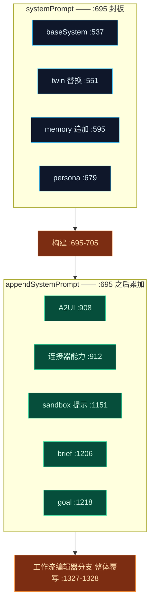

# Build-options 管线

`lib/claude/build-options.ts` 之所以存在，是为了让**每一个**能力——角色、技能、Twin、记忆、目标、A2UI、computer-use、sandbox、插件、路由——都通过恰好一个函数影响一次对话。`resolveSendOptions`（`:336`）在约 41 个有序段落里修改单个 `opts: SendOptions` 对象并返回它（`:1380`）。代码库中别处都不构造 `SendOptions`。

<TLDR>
  `resolveSendOptions(ctx)`（`build-options.ts:336`）构建一个 `opts` 对象。贡献者按固定顺序运行并遵循
  **优先级链**——通常是 `session > activeProject > memberOverride > agentMode > character > appSettings`。
  系统提示词在 `:695` 处由一个六元素数组用 `\n\n---\n\n` 拼接一次而成；之后一切只追加到
  `appendSystemPrompt`。Twin（`:551`）*替换*基础提示词；记忆（`:595`）*追加*。工具汇入一个在 `:864`
  提交的 `allowed` 集合。工作流编辑器分支（`:1285`）整体覆写提示词与工具。每个可选注入都包在 try/catch
  里静默降级。
</TLDR>

## 入口点

| 导出 | 行号 | 角色 |
| --- | --- | --- |
| **`resolveSendOptions(ctx)`** | `:336-1380` | 管线。异步；返回完整 `SendOptions`。 |
| `resolveMemberConfig(team, member, character)` | `:307-323` | 纯函数，按 teammate 解析覆盖（`systemPrompt`/`model`/`allowedTools`/`mcpServerIds`）。UI 预览复用。 |
| `listTeamMembers(ids)` | `:1387-1389` | 预解析 teammate 角色行。 |
| `BRIEF_OUTPUT_SNIPPET` | `:52` | brief 模式附录（ACP 路径也复用）。 |

输入是 `BuildOptionsContext`（`:105-221`）：`session`、`character`、`appSettings`、`activeProject`（cwd 链）、`memberOverride`、`referencedPaths`、`agentMode`、`twinDeps`/`twinUserMessage`、`memoryDeps`/`memoryUserMessage`、`activeGoal`、`conversationKey`、`platformBinding`、`inboxPolicy`。输出 `SendOptions` 声明在 `lib/claude/types.ts:73`。

## 装配流程

函数是一条直线式累加。下图把 41 个段落归为若干阶段；每个节点标注行号。

```mermaid
flowchart TB
  subgraph IDENT["身份与路由"]
    C["character 解析 :340"]
    SK["技能解析 :350"]
    MODE["agent mode :377"]
    IM["IM 通道覆盖 :396"]
    MDL["model 优先级 :422"]
    PRV["provider + 路由 :431-535"]
  end
  subgraph PROMPT["系统提示词（:695 封板）"]
    BASE["baseSystem :537"]
    TWIN["twin 替换基础 :551"]
    MEM["memory 追加 :595"]
    PERSONA["v2 persona :679"]
    JOIN["数组拼接 :695"]
  end
  subgraph DIRS["工作目录与权限"]
    CWD["cwd :707"]
    ADD["additionalDirectories :719"]
    PM["permissionMode :741"]
    RULE["permissionRuleset（A 层） :752"]
  end
  subgraph TOOLS["工具（:864 提交）"]
    ALLOW["allowed 并集 :763"]
    A2UI["A2UI 能力 :777"]
    BIS["内置技能 :822"]
    COMMIT["allowedTools/disallowedTools :864"]
    FILTER["toolFilter 叠加 :867"]
    MCP["mcpServers 子集 :922"]
    PT["pluginTools → sidecar :995"]
    CU["computer-use 裁定 :975 / 原生 :1042"]
    SBX["sandbox 替换 :1112"]
  end
  subgraph APPEND["后置追加 + 分支"]
    ENV["账号/代理 env :1159"]
    CONV["bare/debug/brief :1179"]
    GOAL["活跃目标 :1211"]
    INBOX["收件箱抑制 :1224"]
    THINK["思考预算 :1253"]
    WF["工作流编辑器 覆写 :1285"]
    TEAM["团队子代理 :1348"]
    RESUME["resume/fork :1364"]
  end

  IDENT --> PROMPT --> DIRS --> TOOLS --> APPEND --> RET["return opts :1380"]

  classDef a fill:#1e293b,stroke:#a78bfa,color:#ede9fe
  classDef b fill:#0f172a,stroke:#38bdf8,color:#e0f2fe
  classDef c fill:#7c2d12,stroke:#fb923c,color:#fed7aa
  classDef d fill:#064e3b,stroke:#34d399,color:#d1fae5
  class C,SK,MODE,IM,MDL,PRV a
  class BASE,TWIN,MEM,PERSONA,JOIN b
  class CWD,ADD,PM,RULE c
  class ALLOW,A2UI,BIS,COMMIT,FILTER,MCP,PT,CU,SBX,ENV,CONV,GOAL,INBOX,THINK,WF,TEAM,RESUME d
```

## 贡献者顺序

详尽清单。“优先级”从左到右、最高在前。

### 身份与路由

| # | 贡献者 | 注入 | 行号 |
| --- | --- | --- | --- |
| 1 | character 解析 | `character`（ADR-0030 插件覆盖兜底） | `:340` |
| 2 | 技能解析 | `skillIds ∪ ephemeral − disabled`，去重；`recordSkillUsage` | `:350` |
| 3 | agent mode | `activeMode` + `buildAgentModeSessionUpdate` | `:377` |
| 4 | IM 通道覆盖 | 一次性 `readForResolution(conversationKey)` → `imOverrideRow`（`:991` 复用） | `:396` |
| 5 | model | IM > session > member > mode > character > appDefault | `:422` |
| 6 | provider | IM > session > character > appDefault > `"anthropic"` | `:431` |
| 7 | 别名/路由 | `ProviderRoutingEngine.selectProvider`；盖上 `aliasResolution`/`routingDecision` | `:444` |
| 8 | 凭据提交 | `opts.model` / `opts.provider` / `opts.providerCredentials` | `:490` |

### 系统提示词

| # | 贡献者 | 注入 | 行号 |
| --- | --- | --- | --- |
| 9 | 基础系统 | session > member > character > appDefault | `:537` |
| 10 | **Twin**（可选） | 用 4 段提示词**替换** `baseSystem`；`twinReplacedBase=true` | `:551` |
| 11 | **记忆**（可选） | `memorySection` —— **追加，从不替换**（见[记忆](./memory)） | `:595` |
| 12 | 技能 + 模式段 | `renderSkillsSection` + `activeMode.systemPrompt` | `:635` |
| 13 | 插件技能（M4） | `pluginSkillSection`、`pluginAllowedTools`、`containerSkillIds` | `:638` |
| 14 | v2 persona | tone/personality —— **当 `twinReplacedBase` 时抑制** | `:679` |
| 15 | **系统提示词拼接** | `[base, persona, memory, mode, skill, pluginSkill].filter().join("\n\n---\n\n")` | `:695` |

### 工作目录与权限

| # | 贡献者 | 注入 | 行号 |
| --- | --- | --- | --- |
| 16 | cwd | session.workingDir > activeProject.rootDir > character > appDefault | `:707` |
| 17 | additionalDirectories | activeProject.additionalDirs + referencedPaths 并集 | `:719` |
| 18 | permissionMode | session > mode > character > appDefault | `:741` |
| 19 | **permissionRuleset** | `{ Bash: appSettings.agentPermissions.commandRules }` → [A 层](./permissions)。**绝不序列化默认规则集。** | `:752` |

### 工具、MCP 与原生能力

| # | 贡献者 | 注入 | 行号 |
| --- | --- | --- | --- |
| 20 | 工具白名单并集 | base（member 替换 character）∪ 技能 ∪ 插件 ∪ 模式 | `:763` |
| 21 | A2UI 每通道能力 | `buildCapabilityPromptSection`；把 A2UI 工具名折入 `allowed` | `:777` |
| 22 | 内置技能清单 | 由 IM 绑定或 `enableBuiltInSkills` 门控 | `:822` |
| 23 | 提交 allow/disallow | `opts.allowedTools` / `opts.disallowedTools` | `:864` |
| 24 | toolFilter 叠加 | allow→求交，deny→并入 | `:867` |
| 25 | tool-search 策略 | `toolSearchEnabled` / `alwaysLoadServers` / `alwaysLoadTools` | `:893` |
| 26–27 | A2UI + 连接器提示追加 | 到 `appendSystemPrompt` | `:908` / `:912` |
| 28 | MCP 服务器子集 | member > character > team > 全部启用；`buildMcpServerMap` | `:922` |
| 29 | 内置工具开关 | `opts.builtinTools`（sidecar `cognia-tools` MCP） | `:965` |
| 30 | **computer-use 裁定** | `enableComputerUse && (!imSession ‖ allowImComputerUse)` —— **IM 黑名单默认拒绝** | `:975` |
| 31 | 插件工具 → sidecar | `buildPluginToolsManifest`；合并内置技能清单 | `:995` |
| 32 | Anthropic 原生工具 | `applyComputerUseTools` → `anthropicTools` + beta 头（ADR-0020） | `:1042` |
| 33 | sandbox 替换 | 禁用 `Bash/Edit/Write`、剥离原生 editor（ADR-0028） | `:1112` |

### 后置追加与分支

| # | 贡献者 | 注入 | 行号 |
| --- | --- | --- | --- |
| 34 | 账号 / 代理 env | `resolveAccountEnv` + `resolveProxyEnv` → `opts.env` | `:1159` |
| 35 | 便捷模式 | bare（`settingSources:[]`）/ debug（env）/ brief（`BRIEF_OUTPUT_SNIPPET`） | `:1179` |
| 36 | 活跃 `/goal` | `appendGoalContext`（ADR-0013/0019） | `:1211` |
| 37 | 收件箱抑制 | manual > muted > quietHours → `opts.suppressedReason` | `:1224` |
| 38 | 思考预算 | session > character > appDefault | `:1253` |
| 39 | **工作流编辑器分支** | **覆写** `systemPrompt`/`appendSystemPrompt`/`allowedTools`/`additionalDirectories`；删 `mcpServers` | `:1285` |
| 40 | 团队分支 | 把 `resolveAllSubagents({context:"team"})` 并入 `opts.agents` | `:1348` |
| 41 | resume / fork | `forkFromSessionId` 或 `resumeSessionId` | `:1364` |

## 优先级链

多数标量选项遵循同一阶梯。整条链很少全部出现；每个贡献者取首个有定义的值：

IM 通道覆盖（`imOverrideRow`，在 `:413` 一次性取得）仅在 **model**、**provider** 与 **computer-use** 门上位于 session *之上*——这样一个每通道绑定可以钉住更便宜的模型而不触碰会话。

## systemPrompt 与 appendSystemPrompt

这是任何要新增贡献者的人最重要的一条规则。

- 任何必须**替换**基础提示词的（如 Twin）在 `:695` 处或之前运行。
- 任何**追加**的在其后运行，用拼接习语追加到 `opts.appendSystemPrompt`（保留已有值，新段落用空行分隔）。
- **工作流编辑器分支**（`:1285`）整体覆写 `systemPrompt`（`:1327`）与 `appendSystemPrompt`（`:1328`），所以新追加者必须在它*之前*运行才能在该会话类型里存活。

## 新增一个贡献者

1. 沿优先级链解析一个值（`session > activeProject > memberOverride > agentMode > character > appSettings`）。
2. 提示词文本追加到 `opts.appendSystemPrompt`（用拼接习语保留已有）。要替换基础提示词则在 `:695` 之前做。
3. 工具在 `:864` 提交**之前**加入 `allowed` 集合；`toolFilter` 叠加（`:867`）与 computer-use 过滤随后收窄已提交集合。
4. 在 `lib/claude/types.ts` 给 `SendOptions` 加字段；**仅当 sidecar 需反序列化它时**才同步加到 Rust `SendOptions` 结构（`commands.rs:17`）——像 `permissionRuleset` 这类仅 renderer/sidecar-JS 使用的字段刻意*不*镜像到 Rust 结构。
5. 任何 I/O（Dexie、IPC）包 try/catch——每个可选注入都是 **fail-open**（twin `:590`、memory `:629`、插件技能 `:669`、MCP `:960`、插件工具 `:1036`、computer-use `:1106`）。

<Callout type="warn" title="别重复读 IM 覆盖">
  `imOverrideRow` 在 `:413` 取一次，并在 `:991` 的 computer-use 门复用。注释里明确反对为同一行重复读 Dexie
  （`:986-989`）。
</Callout>

## 已知限制

- **路由引擎依赖是骨架**——`getHealthMetrics`/`getPricing` 返回 `undefined`，`getCircuitBreakerState` 返回 `"closed"`，直到 P6 接入真实采样（`:455-467`）。
- **`opts.anthropicTools` 当前被 Agent SDK 忽略**（仅 MCP）；保留原生工具调用只为发出 `anthropic-beta` 头以及 External-Bridge 自省（`:1048-1053`）。
- **`resolveActiveAgentMode` 仅客户端**（`useCustomModeStore.getState()`，`:294`）——仅因从 React hook 调用才安全。

## 下一步

<Cards>
  <Card title="权限与 Auto-mode" href="./permissions" description="opts.permissionRuleset 喂给 A 层的是什么。" />
  <Card title="长期记忆" href="./memory" description="在 :595 处的 applyMemoryContext 调用。" />
  <Card title="工具、MCP 与技能" href="./tools-mcp" description="工具/MCP/技能字段在 sidecar 里如何被消费。" />
  <Card title="运行时主链" href="./runtime-loop" description="装配好的 SendOptions 如何跨过 IPC 接缝被携带。" />
</Cards>
