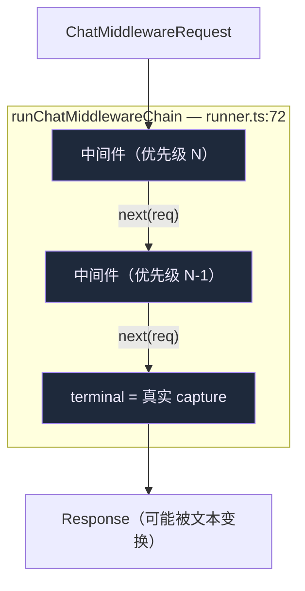
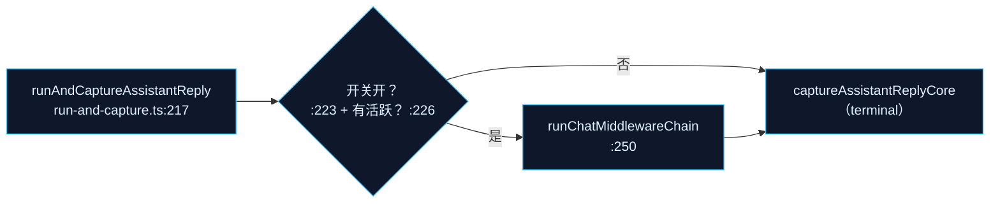

# Chat middleware

Chat middleware 让插件以 Koa 风格**包裹** Agent 的**完整回复**——检视或变换请求与响应——而不触碰流式 UI 路径。它是唯一一个挂在*非流式* `run-and-capture` 路径上、而非 `resolveSendOptions` 内部的能力模块。

<TLDR>
  一个中间件是 `(req, next) => Promise<Response>`（`plugin-chat-middleware.ts:115`）。插件经 `ctx.chat.use`
  → `registerChatMiddleware`（`registry.ts:79`）注册。runner 按优先级**从后向前**构建链，并以每中间件超时
  调用各个（`runner.ts:72`）；超时或出错会**跳过**该中间件（原样 `next`），并在 3 次失败后触发**熔断**。
  执行**默认关闭**（`feature-flag.ts:15`），且只包裹 `run-and-capture.ts` 的完整回复路径——绝不包裹流式
  聊天，因为那里文本已在屏上。
</TLDR>

<StatGrid>
  <Stat label="默认状态" value="关闭" hint="chatMiddlewareExecutionEnabled = false" />
  <Stat label="默认超时" value="5s" hint="上限 60s，每中间件" />
  <Stat label="熔断阈值" value="3" hint="连续失败 → disabled" />
  <Stat label="运行于" value="完整回复" hint="run-and-capture.ts，非流式聊天" />
</StatGrid>

## 链

runner 实时读取活跃链（`listActiveChatMiddlewares()`，`runner.ts:77`），并**从后向前**构建（`for i = chain.length-1 → 0`，`:90`），使最高优先级的中间件在最外层、最先看到原始请求。最内层的 `next` 是 **terminal**（`:87`）——真实的发送/capture。

## 注册表

`registry.ts` 是一个以 `<pluginId>:<middlewareId>` 为键的模块级 `Map`：

| 函数 | 行号 | 角色 |
| --- | --- | --- |
| `registerChatMiddleware(args)` | `:79` | 重复抛错；返回反注册 disposer |
| `unregisterChatMiddleware` / `clearChatMiddlewaresForPlugin` | `:101` / `:113` | 拆卸 |
| `listActiveChatMiddlewares()` | `:126` | 过滤 `!disabled`，按**优先级降**再 id 排序（确定性） |
| `recordMiddlewareFailure` / `recordMiddlewareSuccess` | `:151` / `:164` | 熔断 |
| `resetChatMiddlewareBreaker` | `:177` | 手动复位 |
| `subscribeChatMiddlewareRegistry` | `:187` | UI 事件（`registered`/`unregistered`/`breaker-tripped`/`breaker-reset`） |

### 熔断

`recordMiddlewareFailure`（`:151`）递增每中间件计数；达到 `CIRCUIT_BREAKER_THRESHOLD = 3`（`:26`）时置 `disabled = true` 并发出 `breaker-tripped`。`recordMiddlewareSuccess` 复位计数。被熔断的中间件在复位前被 `listActiveChatMiddlewares` 跳过——所以一个不稳定的插件无法持续拖累每条回复。

## runner 语义

`runChatMiddlewareChain(request, terminal, options)`（`runner.ts:72`）。对每个中间件（`:93`）：

- **超时**——`Promise.race` 对抗 `entry.timeoutMs`（`raceWithTimeout`，`:136`）。默认 5s（`registry.ts:24`），上限 60s（`:25`）。
- **超时时**（`:98`）—— 推入 `timedOut[]`、`recordMiddlewareFailure`、**跳过 → 原样 `next(req)`**。
- **出错时**（`:107`）—— 同样跳过。
- **成功时**（`:116`）—— 推入 `succeeded[]`、`recordMiddlewareSuccess`、返回其值。

`AbortSignal` 贯穿其中（`:122`）。失败即跳过的设计意味着损坏的中间件降级为透传，绝不导致失败回复——与运行时其余部分相同的 fail-open 哲学。

## 它挂在哪

Chat middleware **不**在 `build-options.ts` 或 `use-claude-chat.ts`。它挂在完整回复 capture 路径 `lib/claude/run-and-capture.ts`：

`runAndCaptureAssistantReply`（`:217`）在开关关闭（`:223`）**或**无活跃中间件（`:226`）时直接短路到核心 capture。开启时构建 `ChatMiddlewareRequest`（`:231`），以真实 capture 为 `terminal` 运行链（`:250`），并应用返回的文本变换（`:266`）。流式聊天被刻意排除——其文本已渲染，事后变换会是可见的闪烁（理由注释，`:208`）。

## 插件接线

| 界面 | 文件 |
| --- | --- |
| `ctx.chat.use(middleware)` | `lib/plugin/api/chat-api.ts:53` → `registerChatMiddleware` |
| 桥 | `lib/plugin/bridge/chat-middleware-bridge.ts:30` |
| 契约 | `lib/plugin/contracts/plugin-points.ts:752`（`"chat.middleware"`） |
| 类型 | `types/plugin/plugin-chat-middleware.ts`（`ChatMiddlewareRequest:71`，签名 `:115`） |

注册总在插件启用时发生；只有 **runner 调用点**查阅默认关闭的开关（`feature-flag.ts:18`），因此一次部署可让中间件以休眠态发布、再集中开启。

## 下一步

<Cards>
  <Card title="运行时主链" href="./runtime-loop" description="Chat middleware 刻意不包裹的流式路径。" />
  <Card title="插件系统" href="../subsystems/plugin-system" description="ctx.chat.use 如何暴露与门控。" />
  <Card title="Build-options 管线" href="./build-options" description="插件影响一轮的另一处（流式）—— onUserPromptSubmit。" />
</Cards>
