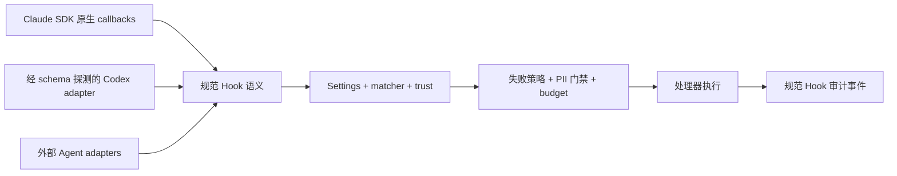

# Hooks

Cognia 从 `settings.json` 加载兼容 Claude Code 的生命周期 Hooks。内置 Claude Agent SDK 使用 SDK 原生 callback；Codex 与外部 Agent 使用 provider adapter。所有路径共享事件、决策、信任和审计语义，并保证同一事件不会重复执行。

<TLDR>
  运行时能力必须有证据。固定版本 Claude Agent SDK 暴露 **31 个事件**和五种处理器。
  Codex 安装会先探测本机 schema，再注册审计过的 **11 事件**上限。用户 Hook 失败时
  fail-open 并产生诊断；受管 Hook fail-closed。所有出站或模型驱动处理器都经过脱敏与
  残余 PII 门禁，每个匹配处理器都会发出结构化规范审计事件。
</TLDR>

<StatGrid>
  <Stat label="Claude 事件" value="31" hint="固定 SDK 0.3.220 surface" />
  <Stat label="Codex 上限" value="11" hint="与本机 runtime schema 求交集" />
  <Stat label="处理器类型" value="5" hint="command、http、mcp_tool、prompt、agent" />
  <Stat label="嵌套深度" value="1" hint="模型驱动 Hook 不允许递归" />
</StatGrid>

## 架构



产品/插件 Hook API 仍是独立的进程内扩展面。它可以观察同一 Agent 活动，但不会成为第二个生命周期执行器。

## 运行时能力

Provider manifest 只是审计过的安全上限。Cognia 只启用 manifest、已安装运行时探测结果和所选 adapter 实现三者的交集。

### Claude Agent SDK

固定版本 SDK 的事件目录为：

`PreToolUse`、`PostToolUse`、`PostToolUseFailure`、`PostToolBatch`、`Notification`、`UserPromptSubmit`、`UserPromptExpansion`、`SessionStart`、`SessionEnd`、`Stop`、`StopFailure`、`SubagentStart`、`SubagentStop`、`PreCompact`、`PostCompact`、`PermissionRequest`、`PermissionDenied`、`Setup`、`TeammateIdle`、`TaskCreated`、`TaskCompleted`、`Elicitation`、`ElicitationResult`、`ConfigChange`、`WorktreeCreate`、`WorktreeRemove`、`InstructionsLoaded`、`CwdChanged`、`FileChanged`、`DirectoryAdded`、`MessageDisplay`。

SDK callback 是内置执行的唯一 owner。Cognia 不会先在 Rust 预执行 `UserPromptSubmit` 或 `PreToolUse`，再在 SDK 中重复注册。

### Worktree 生命周期事件

`WorktreeCreate` 与 `WorktreeRemove` 由 Cognia 自身产生，而不是 SDK（ADR-0111 决策 9）：受管 worktree 注册表在 worktree 变为 Active 时、以及被丢弃或清理时触发它们；共享的 git 命令层则为 Agent Team 分配器和源代码管理面板触发。载荷包含 `worktree_path`、`workspace_root`、`branch`、`owner_type`、`owner_ref`、`source`，移除时另有 `reason`。它们是观察型事件 —— 钩子无法阻止 worktree 的创建或移除。

### Codex

安装前，Cognia 会运行：

```text
codex app-server generate-json-schema --out <temporary-directory>
```

然后递归提取 `HookEventName.enum`，并与审计过的上限求交集：

`PreToolUse`、`PermissionRequest`、`PostToolUse`、`PreCompact`、`PostCompact`、`SessionStart`、`SessionEnd`、`UserPromptSubmit`、`SubagentStart`、`SubagentStop`、`Stop`。

探测失败会产生 degraded 能力报告，并且不注册未经证明的事件。脚本和 `hooks.json` 写入是事务性的：配置合并/写入失败时恢复旧脚本字节，外部 handlers 保持不变。

## 处理器类型

| 类型 | 行为 | 出站 PII 门禁 | 说明 |
| --- | --- | --- | --- |
| `command` | 本地运行命令，从 stdin 读取事件 JSON | 无网络边界 | 退出码/JSON 输出遵循 Hook 决策契约。 |
| `http` | POST 脱敏后的事件 JSON | 是 | 新设置使用的规范名称。 |
| `webhook` | 与 `http` 相同 | 是 | 旧配置读取兼容别名。 |
| `mcp_tool` | 只调用一个声明的 MCP 工具 | 是 | 工具 allowlist 收窄到该工具。 |
| `prompt` | 运行一次模型判断 | 是 | 不允许工具，最多一个 turn。 |
| `agent` | 运行有边界的 Agent 任务 | 是 | 最多三个 turns。 |

设置页按有效运行时能力过滤事件和处理器选项。“不支持”和“无法探测”都是显式状态，不会成为静默 no-op。

## 失败策略

- **用户 Hook：** 超时、崩溃、非 2xx 响应或 adapter 不可用时产生 warning 并 fail-open。
- **受管 Hook：** 相同故障会转换为阻断结果（`policyClass: "managed"`）。
- **显式 deny：** 无论策略类别如何，阻断决策始终保持阻断。
- **确定性合并：** 匹配的 handlers 并行执行，但按配置顺序合并；该顺序中的第一个 block 生效。

## 出站数据安全

对 `http`/`webhook`、`mcp_tool`、`prompt` 和 `agent`，Cognia 会：

1. 序列化规范事件 payload；
2. 脱敏敏感文本；
3. 对脱敏结果执行深层残余 PII 检查；
4. 若仍包含敏感数据则阻止发送。

该门禁发生在 `fetch`、MCP 或模型执行之前，不是尽力而为的日志过滤。

## 模型驱动 Hooks

嵌套 Hook 工作与父 turn 隔离：

- prompt 以 `<hook-origin depth="1" />` 开头；
- 嵌套 SDK query 使用 `settingSources: []` 且不注册 Hooks；
- turn 上限：`prompt` 为 1、`mcp_tool` 为 2、`agent` 为 3；
- 共享 budget governor，每个执行上下文默认 USD 0.25；
- 深度 ≥ 1 时拒绝执行，预算耗尽时在下一次模型调用前阻断。

## 信任与项目设置

只有工作区出现在 Cognia 的可信工作区账本中，才加载项目/本地设置。renderer 将账本同步到 Rust，Rust 执行最终路径检查。未同步或不受信任时只加载用户范围设置。

## 规范审计

每个匹配处理器都会发出结构化记录，包含 Hook id、事件、provider、处理器类型、策略类别、结果、延迟、脱敏状态以及阻断/错误详情。SDK mapper 将它存为 `kind: "hook"`、`phase: "completed"` 的规范事件。UI 提示和日志只是派生诊断。

## 外部 Agent

外部 Agent adapter 会先归一化原生生命周期与权限事件，再调用共享 Hook 语义。只有 provider 协议或运行时探测证明支持时，控制能力才会开放。不会回退到终端按键注入，也不会只凭 provider 名称推断能力。

## 相关内容

<Cards>
  <Card title="权限与自动模式" href="./permissions" description="与生命周期 Hooks 并行生效的策略门禁。" />
  <Card title="运行时循环" href="./runtime-loop" description="内置 Agent SDK 会话如何执行与流式传输。" />
  <Card title="插件系统" href="../subsystems/plugin-system" description="独立的进程内产品/插件 Hook API。" />
</Cards>
