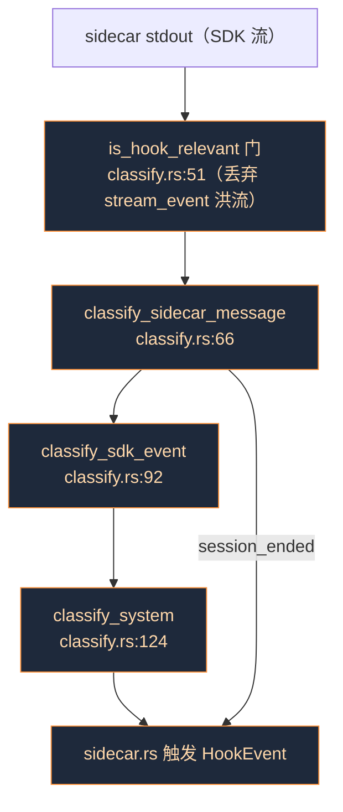
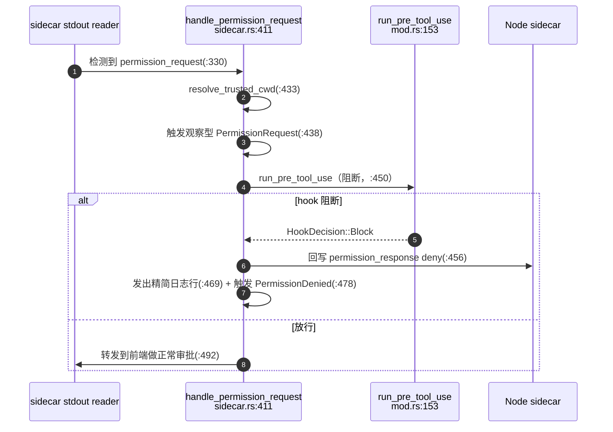
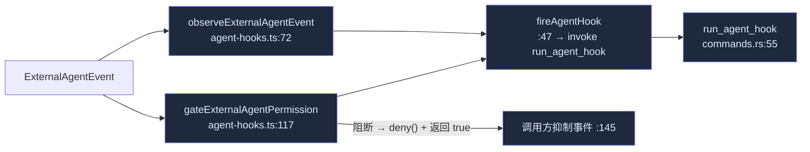

# Hooks

Cognia 自带一套兼容 Claude Code 的 **Hooks 运行时**：在 `settings.json` 里声明、于 Agent 生命周期事件上触发的 shell 命令与 Webhook。ADR-0040 完成了该机制——完整 27 事件生命周期、`PreToolUse` 阻断、Rust 强制的信任门、Webhook，以及外部 Agent 接线。

<TLDR>
  两套系统并存。**System A** 是进程内插件 hook（`lib/plugin/messaging/hooks-system.ts`，74+ 种）。
  **System B** 是 Rust 里的 Claude-Code 风格 `settings.json` 运行时（`src-tauri/src/hooks/`）。对内置 Agent，
  Rust sidecar reader *本就*在看 SDK 流，所以 hook 注入发生在 **Rust**：`classify.rs` 把每条 SDK 消息
  映射成 `HookEvent`（27 种），`sidecar.rs` 触发它们，而 `PreToolUse` 能通过向 sidecar 回写一个
  `permission_response` deny 来拒绝工具，无需 UI 回传。外部 Agent 在 TS 注入（只有 TS 解析 ACP/opencode），
  并经 `run_agent_hook` 命令抵达同一个 Rust 运行时。一切都 **fail-open**。
</TLDR>

<StatGrid>
  <Stat label="生命周期事件" value="27" hint="HookEvent 枚举，types.rs:14" />
  <Stat label="阻断事件" value="1" hint="仅 PreToolUse 能在回传上拒绝" />
  <Stat label="处理器种类" value="2" hint="command + webhook（其它作为 Unsupported 回环）" />
  <Stat label="无触发事件" value="11" hint="可在设置里往返，但从不触发" />
</StatGrid>

## 两套 Hook 系统

| | System A —— 插件 hook | System B —— settings.json 运行时 |
| --- | --- | --- |
| 位置 | `lib/plugin/messaging/hooks-system.ts`（TS，进程内） | `src-tauri/src/hooks/`（Rust） |
| 声明方 | 插件清单 / `ctx` 监听器（74+ 种） | 用户 `settings.json`（Claude-Code 格式） |
| 运行 | JS 回调 | shell `command` / HTTP `webhook` |
| 内置 Agent 路径 | 从 TS 分发（`adapter-hooks.ts`） | 从 **Rust** sidecar reader 触发 |

本页讲内置 Agent 的 **System B**。两者互通：外部 Agent 事件两者都触及（System A 给插件观察者，System B 给 settings.json hook）。

## SDK 流 → 生命周期

对内置 Agent，Rust sidecar reader 本就看到每条 SDK 消息。`classify.rs` 是把 sidecar 消息转成零或多个 `HookEvent` 的**纯**分类器。

规范枚举是 `HookEvent`（`types.rs:14`，serde PascalCase，27 种），在 TS 端 `lib/claude/hooks.ts:7` 镜像。映射要点：

| 事件 | 触发自 | 行号 |
| --- | --- | --- |
| `UserPromptSubmit` | `claude_send`（SDK 前） | `commands.rs:209` |
| `PreToolUse` | sidecar `permission_request`（**阻断**） | `sidecar.rs:450` |
| `PermissionRequest` / `PermissionDenied` | sidecar（观察 / deny 之后） | `sidecar.rs:438` / `:478` |
| `PostToolUse` / `PostToolUseFailure` | tool_result 关联 | `sidecar.rs:555` |
| `SessionStart` / `SessionEnd` | `system/init` / `session_ended` | `classify.rs:126` / `:70` |
| `Stop` / `StopFailure` | `result/success` / `result/error` | `classify.rs:107` / `:109` |
| `PostCompact` / `Notification` | `system/compact_boundary` / `system/notification` | `classify.rs:133` / `:141` |
| `TaskCreated` / `TaskCompleted` + `SubagentStop` | `system/task_*` | `classify.rs:149` / `:166` |

**无触发事件**（11 个）能在设置里往返但从不触发——在 `components/settings/hooks/hooks-section.tsx:84` 标为 `NO_TRIGGER_EVENTS` 并带徽标（`:314`）：`PreCompact, WorktreeCreate/Remove, FileChanged, CwdChanged, InstructionsLoaded, ConfigChange, Elicitation/Result, UserPromptExpansion, TeammateIdle`。

## PreToolUse 阻断

`PreToolUse` 是唯一能在回传上阻断工具的事件。整条路径在 Rust——无 UI。

这是内置 Agent 上 `respondToPermission` 的对等物。所有其它生命周期 hook 都是**观察型**——能贡献 `additionalContext`，但只作为前端日志行（`sidecar.rs:500`）；不能在流中途重新注入。

## Rust 运行时

全在 `src-tauri/src/hooks/` 下：

| 模块 | 职责 | 关键函数 |
| --- | --- | --- |
| `mod.rs` | matcher + 顺序 runner | `groups_for_event:32`、`matcher_matches:53`、`run_event:82`（**首个阻断胜出**，`:109`）、`run_handler:118`、包装器 `run_user_prompt_submit:137` / `run_pre_tool_use:153` / `run_session_scoped:187` / `run_tool_scoped:205` |
| `classify.rs` | 纯 SDK→生命周期分类器 | `classify_sidecar_message:66`、`is_hook_relevant:51`、`extract_tool_uses:177` |
| `trust.rs` | 项目/本地范围门 | `resolve_trusted_cwd:61`（唯一咽喉点）、`set_trusted_paths:35`、`is_trusted:47` |
| `command.rs` | shell 处理器 | `run_command_handler:28`（退出 2 = Block，0 = 解析输出，`extract_decision:142`） |
| `webhook.rs` | HTTP 处理器 | `run_webhook_handler:25`（默认 5s / 上限 30s；复用同一决策解析器） |
| `commands.rs` | Tauri 桥 | **`run_agent_hook:55`**（外部 Agent 接缝）、`set_trusted_workspaces:102` |
| `types.rs` | 线缆类型 | `HookEvent:14`、`HookHandler:59`、`HookDecision:99`（`merge:111` 首个阻断胜出、`is_blocked:139`） |

### 信任门

每次项目/本地 hook 加载都必须过 `trust::resolve_trusted_cwd`（`trust.rs:61`）——仅当路径受信才返回 `Some(cwd)`，否则 `None`（→ 仅用户范围 hook）。受信集合**只**经 `set_trusted_workspaces`（`commands.rs:102`）播种，由 `hook-trust-sync.ts:21`（`syncTrustedWorkspacesToRust`）在启动时及每次信任变更后调用。于是被攻陷的 renderer 无法加载非受信项目 hook——门在 Rust 强制。若 sync 从未运行，项目 hook 静默停留在用户范围（fail-safe，而非 fail-open）。

## TS 侧

- `lib/claude/hooks.ts`（52 行）—— 纯表层类型：`HookEvent:7`、`HookHandler:36`、`HookGroup:45`、`HooksConfig:52`。
- `lib/claude/adapter-hooks.ts` —— 对两个插件-hook 单例的薄包装（无监听者时 no-op）：`dispatchUserPromptSubmit:66`（proceed/modify/block）、`dispatchPreToolUse:92`（allow/deny/modify）、`dispatchPostToolUse:115`、`dispatchOnAssistantMessage:135`、流/错误/用量分发器。它们实现了 ADR 的 onSend/onResponse/onError 意图。
- `lib/claude/hook-trust-sync.ts` —— `syncTrustedWorkspacesToRust:17` 读 Dexie 信任账本并把路径推入 Rust（web/移动端 no-op）。

## 外部 Agent 接线

外部 Agent（Codex / OpenCode / Claude Code CLI）在 **TS** 注入——只有 TS 解析它们的 ACP/opencode 流——并经 `run_agent_hook` 抵达同一个 Rust 运行时。

`gateExternalAgentPermission`（`agent-hooks.ts:117`）触发 System-A 插件 hook、观察型 `PermissionRequest`，再触发阻断型 `PreToolUse`；阻断时调用 `deny(...)` 并返回 `true` 使 manager 抑制该事件。manager 接缝是 `manager.ts:1638`（交互式，真抑制）与 `:1804`（无头，deny 仍强制）。`run_agent_hook`（`commands.rs:55`）在路由到 `run_tool_scoped` / `run_session_scoped` 前应用同一 `resolve_trusted_cwd` 门（`:65`）。

这也接通了两个此前孤立的 System-A hook 种类：`dispatchExternalAgentPermissionRequest`（`hooks-system.ts:2095`）与 `dispatchExternalAgentToolCall`（`:2115`）。

## 注入的不对称

关键设计决策（ADR §28-34）：刻意**不**在 Node sidecar 内使用 SDK 原生 `hooks` 选项——那会绕过或重复 Rust 运行时。

- **内置 Agent** 在 **Rust** 注入——sidecar reader 本就看到 SDK 流。
- **外部 Agent** 在 **TS** 注入——只有 TS 解析 ACP/opencode——再经 `run_agent_hook` 转发到 Rust。

两者汇聚到同一个 `mod.rs` runner 与同一个信任门。

## 扩展点与坑点

- **新增一个 `HookEvent` 变体需改三处**：`types.rs:14`（Rust 枚举）、`hooks.ts:7`（TS 联合），以及——若无触发——`hooks-section.tsx:84`（`NO_TRIGGER_EVENTS`）。serde PascalCase 线缆名是派生的（`hook_event_name`，`mod.rs:175`），不会漂移。
- **新增 SDK→生命周期映射**改纯 `classify.rs`，*且*必须被 `is_hook_relevant`（`:51`）接受，否则随流洪流被丢弃。
- **处处 fail-open**：超时/崩溃/非 2xx 都软放行（`types.rs:129`、`command.rs:97`、`webhook.rs:72`）；缺设置 → 空（`mod.rs:224`）。
- **首个阻断胜出**：`run_event` 在首个阻断返回（`mod.rs:109`）；`HookDecision::merge` 保留最早的原因（`types.rs:125`）。
- **`HookHandler::Unsupported`**（`types.rs:76`）吸收 MCP-tool/prompt/agent 处理器类型以便 settings.json 往返，但只有 `command` + `webhook` 真正执行。
- **每会话 cwd** 在发送时记录（`commands.rs:202`），使后续生命周期事件解析项目范围设置；`session_ended` 时清除（`sidecar.rs:586`）。

## 下一步

<Cards>
  <Card title="权限与 Auto-mode" href="./permissions" description="工具调用上的另一道门——A/B 层与 PreToolUse 并行。" />
  <Card title="运行时主链" href="./runtime-loop" description="分类并触发 hook 事件的 sidecar reader。" />
  <Card title="插件系统" href="../subsystems/plugin-system" description="System A —— 进程内插件 hook。" />
</Cards>
