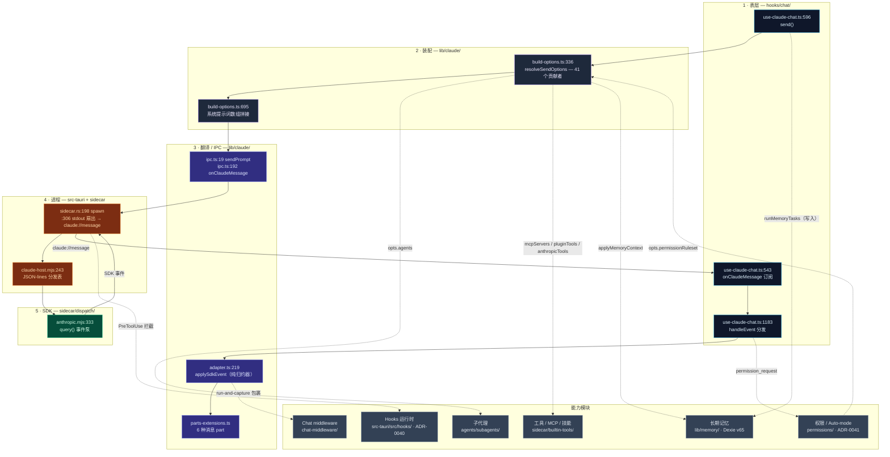

# 内置 Agent

**内置 Agent** 是运行在 Cognia *内部* 的那个 Claude——也就是你在聊天面板里对话的那个。它不同于 [Agent Teams](./agent-teams)（多角色小队）或外部 CLI Agent（Codex / Cursor / Claude Code，以子进程方式拉起）：内置 Agent 是一个长驻的单会话，由打包在 Node **sidecar** 中的官方 [`@anthropic-ai/claude-agent-sdk`](https://www.npmjs.com/package/@anthropic-ai/claude-agent-sdk) 驱动。

<TLDR>
  一次对话就是一条管线：输入框调用 `hooks/chat/use-claude-chat.ts:596` 的 `send`，它调用
  `resolveSendOptions`（`lib/claude/build-options.ts:336`）把**所有** UI 状态——角色提示词、技能、
  Twin、长期记忆、目标、A2UI 能力、工具、MCP、权限——坍缩成单个 `SendOptions`。该负载跨过 Tauri IPC
  边界（`lib/claude/ipc.ts:19`）进入 Rust（`src-tauri/src/claude/sidecar.rs`），由后者拉起 Node host
  （`sidecar/claude-host.mjs`）并运行 SDK 的 `query()` 循环（`sidecar/dispatch/anthropic.mjs:333`）。
  SDK 事件经单一 Tauri 通道（`claude://message`）回流，被**纯函数** `applySdkEvent`
  （`lib/claude/adapter.ts:219`）归约成 `UIMessage` 并渲染。权限、Hooks、子代理、工具与记忆都是横切模块，
  挂接在这条主链上定义清晰的接缝处。
</TLDR>

<StatGrid>
  <Stat label="装配贡献者" value="41" hint="resolveSendOptions 中的有序段落，build-options.ts:336-1380" />
  <Stat label="Sidecar 协议消息" value="5 / 6" hint="入站 send/interrupt/permission_response/plugin_tool_response/close · 出站 event/permission_request/…" />
  <Stat label="权限层数" value="2" hint="sidecar canUseTool（A 层）+ use-claude-chat Auto-mode（B 层）" />
  <Stat label="Hook 生命周期事件" value="27" hint="HookEvent 枚举，src-tauri/src/hooks/types.rs:14" />
  <Stat label="内置子代理" value="4" hint="workflow designer/debugger/refactorer/doc-writer" />
  <Stat label="记忆类型" value="3" hint="semantic · episodic · procedural —— Dexie v65" />
</StatGrid>

## 它是什么

内置 Agent 不是单个文件，而是一条**主链**（chat → 装配 → IPC → 进程 → SDK），外加挂在固定接缝上的**能力模块**。这套架构同时满足三条约束：

1. **Agent SDK 只能跑在 Node。** 它的文件系统 / `child_process` / 原生依赖无法在 webview 内运行，所以它独立成一个进程。为何用 sidecar 见 [Sidecar 与 Claude Agent SDK](../core/sidecar-and-claude-sdk)。
2. **静态导出没有服务端。** `next.config.ts` 强制 `output: "export"`，运行时没有 `app/api/`。任何需要长驻进程的东西（sidecar、Hooks、权限拦截）都活在 Rust，而非 Next.js 路由。
3. **每个能力都必须可组合。** 技能、Twin、记忆、computer-use、A2UI、插件和目标都要在互不知情的前提下影响同一次对话。它们汇聚在唯一一个函数——`resolveSendOptions`——别无他处。

## 架构总览

每个方框都标注了工作发生的文件与行号。五段主链自上而下；右侧的能力模块挂接进来。



## 模块地图

每张卡片是一篇文档，记录该模块带行号的内部实现。

<Cards>
  <Card title="运行时主链" href="./runtime-loop" description="send → 流式 → 渲染 的主链：use-claude-chat、adapter、JSON-lines sidecar 协议、Rust 生命周期与 SDK query() 泵。" />
  <Card title="Build-options 管线" href="./build-options" description="resolveSendOptions —— 唯一汇聚点。全部 41 个有序贡献者、优先级链与系统提示词装配。" />
  <Card title="权限与 Auto-mode" href="./permissions" description="ADR-0041 双层安全门：sidecar canUseTool 短路 + 聊天 hook 里的小模型命令裁决。" />
  <Card title="Hooks" href="./hooks" description="ADR-0040 settings.json 生命周期运行时（Rust）：27 个事件、PreToolUse 阻断、信任门、Webhook、外部 Agent 接线。" />
  <Card title="子代理" href="./subagents" description="4 个内置工作流子代理、如何进入 opts.agents、运行时→UI 桥，以及外部子代理导入管线。" />
  <Card title="长期记忆" href="./memory" description="自主的对话派生记忆：抽取 → 整合 → 检索 → 注入。三种记忆类型、BM25+向量融合、处处 fail-open。" />
  <Card title="工具、MCP 与技能" href="./tools-mcp" description="进程内 cognia-tools MCP 服务器、内置 MCP 解析、技能→SDK 桥、computer-use 工具与预设市场。" />
  <Card title="Chat middleware" href="./chat-middleware" description="挂在完整回复路径上的插件 around 式中间件链，带熔断与默认关闭开关。" />
</Cards>

## 请求生命周期

一次完整对话，端到端。图中数字是真实的调用点。

```mermaid
sequenceDiagram
  autonumber
  participant U as 用户
  participant H as use-claude-chat.ts
  participant B as build-options.ts
  participant I as ipc.ts / Rust sidecar.rs
  participant N as claude-host.mjs
  participant Q as anthropic.mjs query()
  participant A as adapter.ts

  U->>H: 提交输入框
  H->>H: onUserPromptSubmit 插件 hook (674)
  H->>B: buildSendOptions → resolveSendOptions (634→336)
  Note over B: 41 个贡献者修改同一个 opts 对象;<br/>系统提示词在 695 拼接
  B-->>H: SendOptions
  H->>I: sendPrompt(sessionId, content, opts) (867)
  Note over I: Rust 运行 UserPromptSubmit hooks (commands.rs:209)<br/>再向 sidecar stdin 写入 {type:"send"}
  I->>N: stdin · JSON 行
  N->>Q: query({ prompt, options }) (333)
  loop 流式
    Q-->>N: SDK 事件
    N-->>I: stdout · {type:"event"}
    I-->>H: claude://message (SIDECAR_EVENT)
    H->>A: applySdkEvent(current, evt) (1383→219)
    A-->>H: {messages, turnComplete, result?}
    H->>H: 写入 mirror / store (1466)
  end
  alt 模型要调用工具
    Q->>Q: canUseTool — A 层静态规则集 (anthropic.mjs:263)
    Q-->>I: permission_request（若未解析）
    Note over I: Rust PreToolUse hook 可拒绝 (sidecar.rs:450)
    I-->>H: permission_request 事件
    H->>H: Auto-mode — B 层裁决 (1324) 或提示用户
    H->>I: claude_approve(decision)
  end
  Q-->>N: result（用量）
  N-->>H: turnComplete → 合并 twin+memory 来源 (1445)，封板 (1475)
```

## 关键不变量

这些是让主链可组合的承重规则。破坏其一，对话就会悄悄损坏。

| 不变量 | 位置 | 原因 |
| --- | --- | --- |
| **唯一汇聚点。** 所有上下文注入都在 `resolveSendOptions` 内发生；别处不构造 `SendOptions`。 | `build-options.ts:336-1380` | 新增能力只需改一个文件。[build-options 页](./build-options)就是契约。 |
| **`systemPrompt` 早早封板；`appendSystemPrompt` 后续累加。** 要替换基础提示词必须在 `:695` 处或之前运行；其后只能追加。 | `build-options.ts:695` 对比 A2UI `:908`、goal `:1218`、sandbox `:1151` | 工作流编辑器分支（`:1285`）会整体覆写两者，所以新追加者必须在它之前运行。 |
| **adapter 是纯的。** `applySdkEvent` 零 `invoke`/`listen`；Tauri 接缝只有 `ipc.ts`。 | `adapter.ts`（无 IPC）· `ipc.ts:192` | 归约器无需 Tauri 即可单测；事件经单一通道以 push 方式抵达。 |
| **`SendOptions` 跳过 `null`。** 对 `systemPrompt` 等传显式 `null`（而非缺省）会崩掉 SDK 选项解析器。 | `commands.rs:11-14`、`anthropic.mjs:327` | serde `skip_serializing_if` + 一遍 strip-undefined 在两侧共同保证。 |
| **每个注入都 fail-open。** Twin、记忆、插件技能、连接器能力、MCP、computer-use 各自包在 try/catch 里，静默降级。 | `build-options.ts:590,629,669,…` | 损坏的能力绝不能阻断发送。记忆尤其如此：见[其 fail-open 表](./memory)。 |
| **两层强制，仅显式。** A 层（sidecar）永不认 `*:allow` 通配；B 层（聊天 hook）跑确定性 + 小模型裁决。 | `anthropic.mjs:263`、`use-claude-chat.ts:1324` | 被攻陷的 renderer 也无法自动放行危险工具。见[权限](./permissions)。 |

## 与 Agent Teams 的区别

| 方面 | 内置 Agent | [Agent Teams](./agent-teams) |
| --- | --- | --- |
| 运行时 | sidecar 中单个长驻 SDK 会话 | Lead + N 名 teammate，各自 Claude / Codex / 外部 CLI |
| 入口 | `use-claude-chat.ts:send` → `resolveSendOptions` | `runTeamLifecycle` → 每个 teammate 各自 `resolveSendOptions` |
| 并发 | 每会话一次一轮 | `maxConcurrentTeammates` 滑动窗口 |
| 权限 | 双层门（本章） | 每 teammate `allowedTools` 并集 + 计划审批 |
| 状态存放 | Dexie sessions + messages | 主要在 Zustand `agent-team-store` |

团队路径仍把每个 teammate 的 Claude 轮次汇入**同一个** `resolveSendOptions` 和**同一个** sidecar——所以 [build-options](./build-options) 与 [runtime-loop](./runtime-loop) 上的一切对 teammate 同样适用。

## 下一步

<Cards>
  <Card title="Sidecar 与 Claude Agent SDK" href="../core/sidecar-and-claude-sdk" description="进程边界、JSON-lines 协议与凭据发现的深入说明。" />
  <Card title="聊天、角色、技能与团队" href="./chat-and-skills" description="调用 send 的用户侧界面，以及 Character 如何被解析。" />
  <Card title="技能子系统" href="../../subsystems/skills" description="一个技能如何物化为提示词与工具白名单。" />
  <Card title="运行时与 Tauri" href="../core/runtime-and-tauri" description="拥有 sidecar 生命周期与事件通道的 Rust 侧。" />
</Cards>
