# 长期记忆

记忆子系统让内置 Agent **跨会话持久、自我维护地回忆**关于用户的事实——无需用户整理任何东西。它读对话、决定什么值得保留、与已知去重，并把最相关的记忆注入下一轮的系统提示词。

<Status variant="experimental" />

<TLDR>
  单个 Dexie 表（`memories`，schema **v65**）保存三种记忆类型——`semantic`（持久事实）、`episodic`
  （蒸馏事件）、`procedural`（演进的工作指令，≈ 自我生长的 CLAUDE.md）。两条路径：**写路径**（每轮
  fire-and-forget）跑 salience → LLM 抽取 → PII 门 → 整合（ADD/UPDATE/DELETE/NOOP）；**读路径**（发送时）
  跑 `applyMemoryContext` → BM25 + 向量检索 → RRF 融合 → Generative-Agents 评分 → 一段系统提示词。它复用
  Twin 的向量库与共享 RAG 工具箱。每个阶段都 **fail-open**——记忆绝不能打断一轮——且除非用户选择上云，
  embedding 始终留在本地。
</TLDR>

<StatGrid>
  <Stat label="记忆类型" value="3" hint="semantic · episodic · procedural" />
  <Stat label="Dexie 版本" value="v65" hint="memories 表，schema.ts:1692" />
  <Stat label="默认 top-K" value="8" hint="DEFAULT_MEMORY_CONFIG, memory.ts:120" />
  <Stat label="召回衰减半衰期" value="30天" hint="decayHalfLifeDays 默认" />
  <Stat label="失败模式" value="open" hint="每阶段静默降级" />
</StatGrid>

## 数据模型

`types/memory/memory.ts` —— `Memory` 实体（`:51-87`）：

| 字段组 | 字段 | 说明 |
| --- | --- | --- |
| 身份 | `id`、`scope`（global/character）、`characterId?`、`type` | 冲突时 character 覆盖 global |
| 内容 | `text`（已脱敏、自洽）、`key?`（procedural 去重）、`tags` | |
| 排序 | `importance`（LLM 1..10，仅设一次）、`lastAccessedAt`、`accessCount` | 驱动 recency + 评分 |
| 生命周期 | `status`（active/invalidated）、`version`、`supersededById?`、`pinned` | 软删除，从不丢弃 |
| 来源 | `provenance`（user/explicit/inbound/system）、`sourceSessionId?` | **信任模型** |

`MemoryConfig`（`:93`）持久在 `AppSettings`（JSON，无迁移）：`enabled`、`autoExtract`、`hybridEnabled`、`allowCloudEmbedding`（默认 **false**）、`retrievalTopK`（8）、`relevanceFloor`（0.35）、`maxActivePerScope`（500）、`decayHalfLifeDays`（30）、`temporary`（隐身）。**来源信任规则**：只有 `user`/`explicit` 能产出 `procedural` 记忆；`inbound`（来自 IM 连接器）永远不能是 global 或 procedural——所以第三方无法污染你的工作指令。

## 两条路径

```mermaid
flowchart TB
  subgraph WRITE["写 —— 每轮 fire-and-forget（use-claude-chat.ts:269 runMemoryTasks）"]
    SAL["assessSalience<br/>salience.ts:49"]
    EXT["extractMemories（LLM）<br/>extractor.ts:74"]
    PII["hasNoLeakingPii 门<br/>run-memory-extraction.ts:87"]
    CON["consolidate ADD/UPDATE/DELETE/NOOP<br/>consolidator.ts:110"]
    DB["createMemory + 向量 upsert<br/>memories.ts:48"]
  end
  subgraph READ["读 —— 发送时（build-options.ts:595）"]
    APPLY["applyMemoryContext<br/>apply-memory-context.ts:76"]
    RET["retrieveMemories<br/>retriever.ts:51"]
    BM["BM25 leg :72"]
    VEC["向量 leg（best-effort） :77"]
    RRF["reciprocalRankFusion :96"]
    SCORE["scoreMemories :69"]
    PROC["assembleProceduralBlock<br/>procedural.ts:33"]
    SEC["memorySection → 系统提示词 :695"]
  end

  SAL --> EXT --> PII --> CON --> DB
  APPLY --> RET
  RET --> BM & VEC --> RRF --> SCORE
  APPLY --> PROC
  SCORE & PROC --> SEC

  classDef w fill:#7c2d12,stroke:#fb923c,color:#fed7aa
  classDef r fill:#064e3b,stroke:#34d399,color:#d1fae5
  class SAL,EXT,PII,CON,DB w
  class APPLY,RET,BM,VEC,RRF,SCORE,PROC,SEC r
```

## 写路径

`runMemoryTasks(sessionId, messages)`（`use-claude-chat.ts:269`）在一轮完成后触发，从不 await。纯编排器是 `runMemoryExtraction(input, deps)`（`run-memory-extraction.ts:62`），从左到右短路门控：

1. `enabled && autoExtract && !temporary`（`:69`）
2. `provenance !== "inbound"`（`:71`）
3. **`assessSalience`**（`:73`）—— 这一轮值得抽取吗？
4. **`deps.extract`**（`:79`）—— LLM 拉出候选
5. **PII 门** `isPiiSafe`（默认 `hasNoLeakingPii`，`:87`）
6. **`deps.consolidate`**（`:91`）—— 与已有去重

### Salience —— 廉价的召回优先过滤

`assessSalience`（`salience.ts:49`）纯且双语（EN + 中文）。它偏向召回：一轮若有显式捕获（“记住…/remember…”）、自述事实、所有格、偏好动词或 ≥2 个命名实体，即为 salient。无 LLM——它是决定是否*花费* LLM 调用的门。

### 抽取 → 整合

`extractMemories`（`extractor.ts:74`）调用工具 LLM（temp 0，512 token）、解析 JSON、过滤到允许类型、钳制 importance——并 `catch → []`（fail-open）。`consolidate`（`consolidator.ts:110`）经 `findSimilar` 逐候选决断：**无邻居 → 无 LLM 直接 ADD**（`:121`）；否则 LLM 选 `ADD / UPDATE / DELETE / NOOP`，任何解析/LLM 错误**回退到 ADD**（`:135`）——绝不破坏性臆测。UPDATE 合并文本；DELETE 软失效旧行并链 `supersededById`（Zep“更新而非丢弃”）。

## 读路径

build-options 在 `:595-633` 调用 `applyMemoryContext`（受守卫，`catch` 非致命）。结果 `memorySection` 成为系统提示词数组（`[base, persona, memory, mode, skill, pluginSkill]`，`:695`）的第 3 个元素——它**追加，从不替换**基础提示词。

`applyMemoryContext`（`apply-memory-context.ts:76`）并行跑检索与 procedural 装配，再与本轮 Twin 块去重（`overlapsTwin`，`:59`）使记忆与 Twin 不重复消耗 token 预算，并 `catch → {degraded:true}`。

### 检索 + 融合 + 评分

`retrieveMemories`（`retriever.ts:51`）：

- **关键词 leg 总是跑**——`BM25Index` + `search`（`:72`）。
- **向量 leg best-effort**——仅当 embedder + 向量搜索接好；`catch → []`（`:77`）。
- **融合**——两腿都命中则 `reciprocalRankFusion`，否则仅关键词（`:96`）；归一化；应用 `relevanceFloor`（`:103`）。
- **评分**——`scoreMemories(...).slice(0, topK)`（`:111`）；best-effort `touch` 抬升 recency（`:119`）。

`scoreMemories`（`scoring.ts:69`）是 Generative-Agents 三因子公式——`score = recency + importance + relevance`，各自 min-max 归一化，权重皆 1。recency 为 `decay^daysSinceLastAccess`（`:64`）。纯（仅注入的 `now`）。

整个记忆子系统**复用共享 RAG 工具箱**：`BM25Index` / `normalizeScores` / `reciprocalRankFusion` 来自 `@cognia/rag/hybrid-search`，context manager 来自 `@cognia/rag/context-manager`，LLM 契约来自 `@/lib/twin/distill/llm`。

## Procedural 记忆

`assembleProceduralBlock(memories, options)`（`procedural.ts:33`）把活跃 procedural 记忆折成一段有上限的指令块（默认 600 token，标题“Working preferences you've learned”），排序为 **pinned → importance 降 → lastAccessedAt 降**，贪心适配 token 预算。因为 procedural 行从不从 inbound 内容自动抽取，该块无法被第三方污染。

## 持久化

`lib/db/memories.ts` 纯机械（无 LLM、无门控——门在调用方）。检索器的候选池是 `listActiveForReader(characterId?)`（`:155`）——经 `[scope+status]` 索引取 global base ∪ character 覆盖。`touchMemories`（`:112`）命中时抬升 recency。只有管理面板调用 `hardDeleteMemory` / `clearMemories`——整合只软失效。

Schema：`version(65).stores({ memories })` 于 `schema.ts:1692`；索引串含 `[scope+type]`、`[scope+status]`、`[type+status]`（`:1694`）。增量、无 upgrade hook。

## 隐私与后端

`resolveMemoryBackend(config)`（`build-deps.ts:36`）一次性门控 embedding：仅当向量库存在*且*（`allowCloudEmbedding` 或 provider 是本地 `transformersjs`）时才跑。否则系统仅 BM25，个人事实绝不离机。记忆经 `tryBuildTwinDeps`（`:37`）借用 Twin 的向量库 + embedder，所以已配置 Twin 的用户白得记忆召回。

## 处处 Fail-open

记忆绝不能打断一轮。每个阶段都降级：

| 阶段 | 失败行为 | 行号 |
| --- | --- | --- |
| 抽取 | `catch → []` | `extractor.ts:100` |
| 整合 | 解析/LLM 错误 → ADD（非破坏性） | `consolidator.ts:135` |
| 写编排 | 外层 `catch → empty` | `run-memory-extraction.ts:98` |
| 应用（读） | `catch → {degraded:true}` | `apply-memory-context.ts:127` |
| build-options 注入 | `catch` 非致命 | `build-options.ts:629` |
| 检索器向量 leg / touch | 吞掉 | `retriever.ts:88` / `:119` |

`opts.memoryContext`（`types.ts:381`）**仅供透明**——SDK 调用前剥离，用于渲染一个“Memory” `SourcesPart`，让用户看到召回了什么。

## 下一步

<Cards>
  <Card title="Build-options 管线" href="./build-options" description=":595 的 applyMemoryContext 调用与 :695 的系统提示词数组。" />
  <Card title="运行时主链" href="./runtime-loop" description="runMemoryTasks（写）与 turnComplete 上的记忆来源合并。" />
  <Card title="员工数字分身" href="../subsystems/employee-twin" description="记忆复用其向量库与 embedder 的 persona 层。" />
</Cards>
