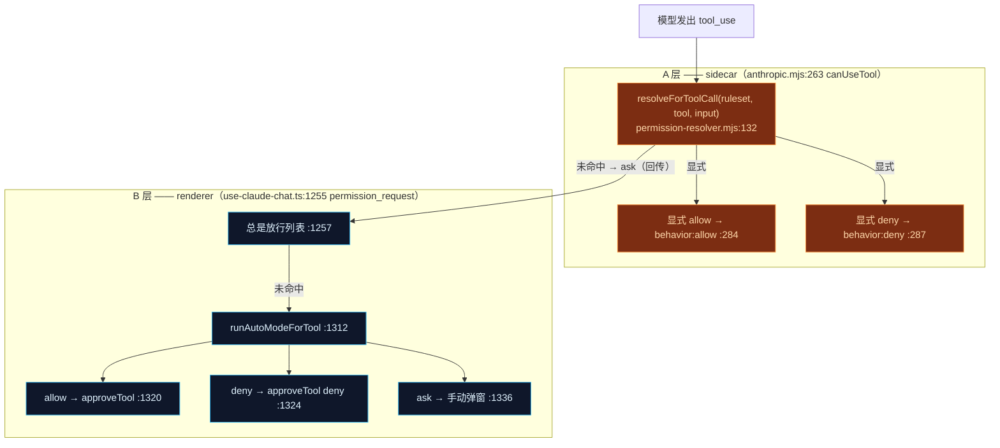
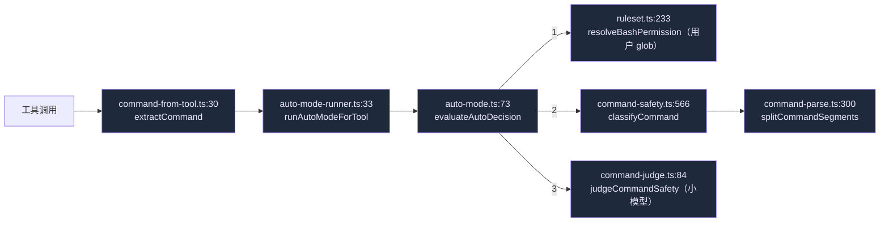
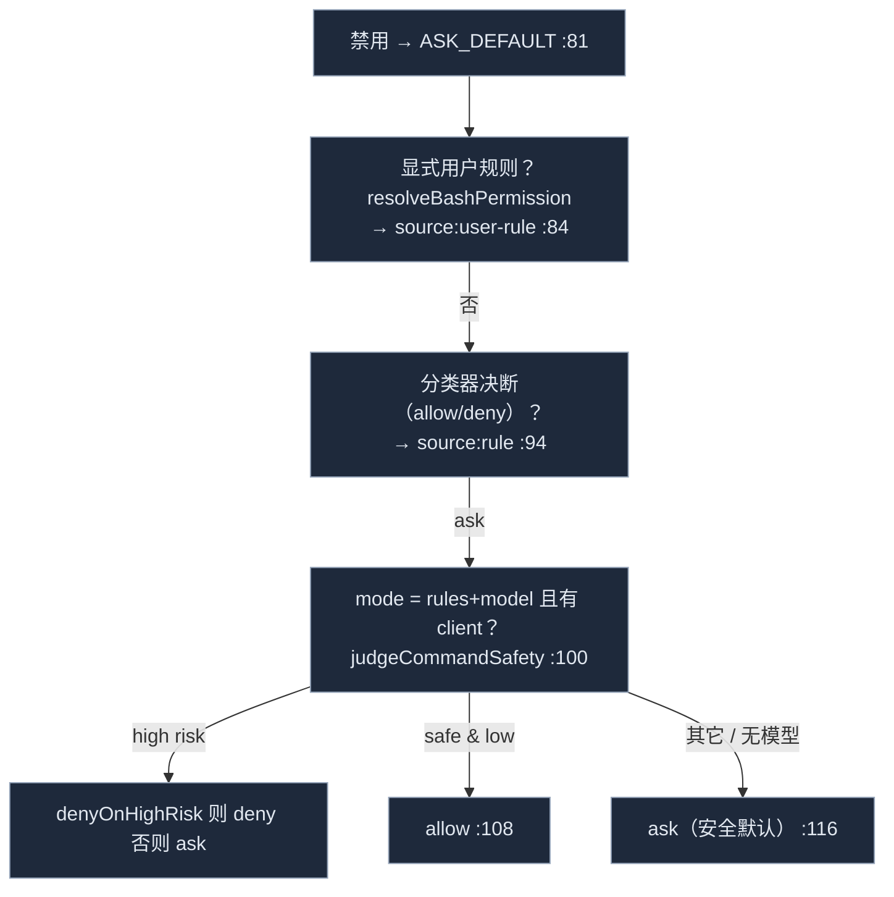

# 权限与 Auto-mode

当模型要运行工具——尤其是 shell 命令——时，Cognia 通过两个独立的层决定 **allow / ask / deny**。两层都 **fail-open**（出 bug 降级为“总是提示”，绝不“静默运行”），ADR-0041 的核心不变量是**没有 `*: allow` 通配**能绕过一切审批。

<TLDR>
  **A 层**在 sidecar 里：SDK 的 `canUseTool` 回调（`anthropic.mjs:263`）查阅 build-options 序列化出的静态
  `permissionRuleset`，*仅*在显式 allow/deny 时短路——未命中的调用回传到 renderer。**B 层**在聊天 hook 里：
  `permission_request` 处理器（`use-claude-chat.ts:1300`）运行 Auto-mode，一条**用户 glob 规则 → 确定性
  分类器 → 可选小模型裁决**的优先级阶梯，自动放行/拒绝，或落到手动弹窗。纯核心是
  `lib/claude/permissions/` 里的 `command-parse → command-safety → command-judge → auto-mode`。
</TLDR>

<StatGrid>
  <Stat label="强制层数" value="2" hint="sidecar canUseTool + renderer Auto-mode" />
  <Stat label="Auto-mode 层级" value="4" hint="user-rule · rule · model · default" />
  <Stat label="安全命令头" value="~120" hint="command-safety SAFE_HEADS 自动放行" />
  <Stat label="默认裁决模型" value="关闭" hint="仅当 mode = rules+model 才启用模型层" />
</StatGrid>

## 两层



### A 层 —— sidecar 静态规则集

桥是 build-options：只有**非空**的 `appSettings.agentPermissions.commandRules` 才被序列化为 `opts.permissionRuleset = { Bash: commandRules }`（`build-options.ts:752-761`）。绝不写默认规则集，所以空配置意味着 A 层是透传。

sidecar 里，`canUseTool`（`anthropic.mjs:263`）读 `sendOptions.permissionRuleset`（`:280`）并调用 `resolveForToolCall`（`permission-resolver.mjs:132`）：

- 显式 **allow** → `{behavior:"allow"}`，无回传（`:284`）
- 显式 **deny** → `{behavior:"deny", message:"denied by permission ruleset"}`（`:287`）
- 其它 → 落到 `permission_request` 发出（`:297`）

该解析器是 `ruleset.ts` 故意**更弱**的 JS 镜像：`splitBash`（`permission-resolver.mjs:99`）是忽略引号的朴素顶层切分，且**没有**内置 `"*": "allow"`。任一段 deny 即胜出；仅当*每*段都显式 allow 才返回 allow（`:143/:153`）。完整的复合命令解析器在 B 层，未命中调用会回传到那里——所以削弱 A 层是安全的。

### B 层 —— renderer Auto-mode

`permission_request` 分支（`use-claude-chat.ts:1255-1350`）：

1. **总是放行列表**（`:1257`）——已有的每会话授权。
2. **非活跃/远程会话**（`:1265`）——带兜底 deny 的远程控制路由；非 Auto-mode。
3. **Auto-mode**（`:1300`）：构建裁决客户端（`buildUtilityLlmClient`，featureId `command-safety`，`:1306`），用 `pluginRules: getPluginCommandRulesets()` 调用 `runAutoModeForTool`（`:1312`）。`allow` → `approveTool(..., "allow")`（`:1320`）；`deny` → `approveTool(..., "deny", reason)`（`:1324`）；`try/catch` fail-open（`:1333`）。
4. `ask`/`null` → 手动弹窗 `pushApproval`（`:1336`）。

## 纯核心管线

全在 `lib/claude/permissions/` 下，无依赖、有单测。renderer 胶水（`auto-mode-runner.ts`）把工具调用映射成命令并运行裁决。



### command-parse.ts —— 分词器

`splitCommandSegments(command)`（`:300`）感知引号/括号深度（`splitTopLevel`，`:46`），并**递归进入替换**——`extractSubstitutions`（`:162`）把 `$(...)`、反引号和 `(...)` 抽成内层段，于是 `echo $(rm -rf /)` 会浮现埋藏的 `rm`。递归上限 `MAX_DEPTH = 20`（`:30`）。

### command-safety.ts —— 确定性层

`classifyCommand(command)`（`:566`）切分、逐段分类，取**最差**裁定（`RANK` 循环，`:574`）；整命令灾难扫描可覆写为 `deny`（`:579`）。裁定为 `allow | ask | deny`。

| 集合 | 含义 | 行号 |
| --- | --- | --- |
| `SAFE_HEADS` | 自动放行：查看、文本、系统信息、解释器、构建/测试/lint、VCS、包管理 runner | `:45-195` |
| `ASK_HEADS` | 总是确认：mv/chmod/kill/mount/网络/全局 PM/云/容器/磁盘 | `:198-300` |
| `DELETE_HEADS` | rm/rmdir/del/erase/unlink | `:303` |
| `GIT_ASK_SUBS` / `PM_ASK_SUBS` | 危险的 git / 包管理子命令 | `:305` / `:317` |
| `WRAPPERS` | sudo/doas/env/timeout/xargs（拆包后，绝不*降低*裁定） | `:330` |

专用分类器：`matchCatastrophic`（管道到 shell 的 RCE、fork 炸弹 → 整命令 **deny**，`:372`）、`classifyRm`（`-rf` + 关键目标 → deny，`:400`）、`classifyCurl`（写方法 → ask，`:456`）、`classifyDd`（`of=/dev/…` → deny，`:485`）。`sudo` 把 allow→ask 升级但绝不降低（`:548`）；未识别的命令头默认 **ask**（`:509`）。

### command-judge.ts —— 可选小模型层

`judgeCommandSafety(client, command, opts)`（`:84`）返回 `{safe, risk, reason} | null`。它**仅在 `mode === "rules+model"` 时开启**。任何 LLM 调用前先跑共享 **PII 门** `hasNoLeakingPii`，若命令可能泄露则返回 `null`（`:96`）——模型从不见 PII。结果 LRU 缓存 5 分钟（`:42`）。每条失败路径都返回 `null`（fail-open）。

### auto-mode.ts —— 编排器

`evaluateAutoDecision(args)`（`:73`）是优先级阶梯，最高权威在前：



完整阶梯（最高 → 最低）：**用户 `commandRules` glob → 插件规则 → 确定性分类器 → 模型裁决 → ask**。`auto-mode-runner.ts:54` 用数组顺序编码——插件规则在前，用户 `{Bash: commandRules}` 最后 push，使用户总是压过插件。

## command-from-tool —— 哪些工具是命令

`COMMAND_TOOLS = {Bash, shell_execute_advanced, start_process}`（`command-from-tool.ts:12`）。`extractCommand(toolName, input)`（`:30`）把各自映射成 shell 串（`Bash`→`command`，其它→`program/command` + 拼接 `args`）；非 shell 工具返回 `null` 并跳过整个管线。该集合在 sidecar 侧由 `permission-resolver.mjs:135` + `extractTarget`（`:108`）镜像——保持同步。

## 设置与 UI

`AppSettings.agentPermissions`（`lib/claude/types.ts:907-932`）：

```ts
agentPermissions?: {
  autoApprove?: {
    enabled?: boolean              // 默认关闭                 (:911)
    mode?: "rules" | "rules+model" // 默认 "rules"            (:917)
    denyOnHighRisk?: boolean       // 默认 true               (:922)
    judgeModel?: UtilityModelConfig                          // (:924)
  }
  commandRules?: ToolRules         // glob→裁定，最高权威        (:931)
}
```

卡片是 `CommandAutoModeCard`（`components/settings/agent-runtime/command-auto-mode-card.tsx:32`），挂在 **Agent Runtime → Permissions & Tools**（`tabs/permissions-tools-tab.tsx:75`）。经 `save({ agentPermissions })` 持久化。

## terminal:safety —— 插件贡献的规则

插件通过 `ctx.terminal` 用自己的命令规则扩展 B 层：

| 界面 | 位置 | 权限 |
| --- | --- | --- |
| `registerCommandSafetyRule(rules)` | `lib/plugin/api/terminal-api.ts:287` | `terminal:safety` |
| `classifyCommand(command)` | `:304` | `terminal:safety`（consent-exempt——纯/同步） |
| 注册表合并 | `registries/command-safety-registry.ts:30` | — |
| `getPluginCommandRulesets()` → `Ruleset[]` | `:48`（low→high；在用户规则之下） | — |

`terminal:safety` **不是**危险权限（它只分类，不能执行）。它在标准五处接线——类型联合（`types/plugin/plugin.ts:292`）、校验白名单（`core/validation.ts:88`）、守卫目录 + 描述（`security/permission-guard.ts:102/152`）、禁用时反注册（`core/manager.ts:2789`）——外加 `cmd_lint` 的 **Rust 对等**（`crates/cognia-cli/src/cmd_lint.rs:51`，在 `VALID_PERMISSIONS` 里），使用它的清单能通过 CLI linter。

## 不变量与坑点

- **两层都 fail-open**（ADR §56）：A 层 catch（`anthropic.mjs:293`）、B 层 catch（`use-claude-chat.ts:1333`）、裁决器每条失败路径返回 `null`、`evaluateAutoDecision` 绝不抛（`auto-mode.ts:70`）。
- **A 层无 `*: allow` 通配**——sidecar 解析器刻意省略 `DEFAULT_RULESET` 的 `"*":"allow"`；只有显式序列化规则生效（`permission-resolver.mjs:6-11`）。完整默认（含 `*.env`→ask）只在 renderer/SDK 侧（`ruleset.ts:49`）。
- **隐私**——模型层从不见 PII（`command-judge.ts:96`），且非显式启用不开（`auto-mode.ts:100`）。
- **隐藏替换防御**——解析器递归进入 `$(...)`/反引号（`command-parse.ts:162`），于是埋藏的 `rm -rf /` 经最差裁定胜出（`command-safety.ts:574`）拒绝整条链。
- **两份并行的命令工具定义**必须同步：`command-from-tool.ts:12`（renderer）与 `permission-resolver.mjs:135`（sidecar）。`ruleset.ts`（TS）与 `permission-resolver.mjs`（JS）是有意镜像，带上述差异（无 `*` 默认、朴素切分）。

## 下一步

<Cards>
  <Card title="Hooks" href="./hooks" description="PreToolUse hook 也能拒绝工具，发生在权限回传之前。" />
  <Card title="Build-options 管线" href="./build-options" description="opts.permissionRuleset 在哪里为 A 层序列化。" />
  <Card title="运行时主链" href="./runtime-loop" description="permission_request 事件路径与兜底 deny 时序。" />
</Cards>
